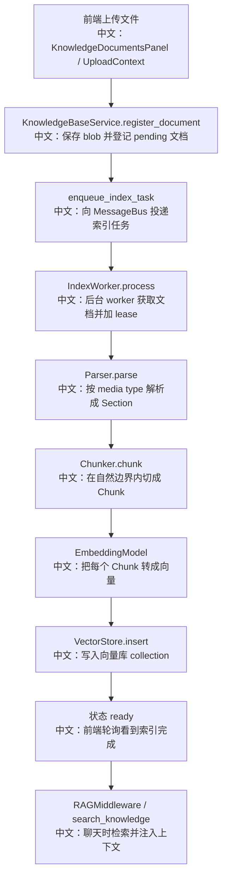

# RAG 文档解析清洗分块与检索

> 结论：AgentScope 的 RAG 不是“上传文件后同步塞进向量库”。它分成 HTTP 侧文档登记、后台索引 worker、运行时检索 middleware 三层。解析、分块、嵌入、向量库写入在后台 worker 完成；聊天时再由 RAGMiddleware 以 agentic 或 static 模式把检索结果带入 Agent Runtime。

---

## 1. 总体链路



---

## 2. 源码证据

关键源码：

```text
src/agentscope/app/_service/_knowledge_base.py
中文：HTTP service，负责创建知识库、上传登记文档、写 blob、入队索引任务、查询状态、删除文档。

src/agentscope/app/_service/_index_worker.py
中文：后台索引流水线，负责 lease、parse、chunk、index、状态流转和错误处理。

src/agentscope/rag/_document.py
中文：Section 和 Chunk 数据结构。

src/agentscope/rag/_chunker/_approx_token_chunker.py
中文：近似 token 分块器。

src/agentscope/rag/_knowledge.py
中文：KnowledgeBase runtime handle，绑定 embedding model 和 vector store。

src/agentscope/rag/_vdb/_vector_store.py
中文：向量库抽象接口。

src/agentscope/middleware/_rag.py
中文：聊天运行时的 RAG middleware，支持 agentic 和 static 两种模式。

examples/web_ui/frontend/src/context/UploadContext.tsx
中文：前端上传队列和本地上传状态。

examples/web_ui/frontend/src/hooks/useDocumentStatusPolling.ts
中文：前端轮询文档索引状态。

examples/web_ui/frontend/src/components/drawer/KnowledgeSearchDrawer.tsx
中文：知识库检索测试抽屉。

examples/web_ui/frontend/src/components/panel/KnowledgeBasePanel.tsx
中文：聊天页选择知识库并写入 SessionKnowledgeConfig。
```

---

## 3. 文档上传阶段：只登记，不同步索引

HTTP 上传做的事情：

```text
1. 检查用户是否有编辑知识库的权限。
2. 把上传流写入 BlobStore。
3. 在 Storage 里创建 KnowledgeDocumentRecord，初始状态 pending。
4. 通过 MessageBus 投递 index task。
5. 返回文档记录，让前端开始轮询状态。
```

中文重点：

```text
上传接口不直接 parse/chunk/embed。
这样可以避免大文件解析和 embedding 调用阻塞 HTTP 请求。
```

面试亮点：

```text
这是典型的异步索引设计：
API 只做轻量登记和入队，重 CPU / 重 IO 的解析与向量写入放到 worker。
前端用状态轮询承接最终一致性。
```

---

## 4. 解析：按 media type 路由到 Parser

IndexWorker 会根据文档的 IANA media type 或文件名推断 media type：

```text
record.data.content_type
中文：上传时带来的 content type
  ↓
mimetypes.guess_type(filename)
中文：如果 content_type 没有，则通过文件名猜测
  ↓
_parsers_by_media_type[media_type]
中文：找到对应 Parser
```

Parser 输出的是 `Section`：

```text
Section
中文：文档的自然边界单位，例如 PDF 页、PPT 幻灯片、Markdown 标题段、Excel sheet。

Section.content
中文：TextBlock 或 DataBlock。

Section.source
中文：原始文件名，用于引用和展示。

Section.metadata
中文：页码、幻灯片编号、sheet 名等格式相关元数据。
```

这里的“清洗”不要讲成一个独立大型 ETL 模块。源码更准确的说法是：

```text
解析器负责把不同格式的原始文件规范化成统一 Section 结构；
metadata 被保留下来；
后续 chunker 不跨 Section 合并，避免格式结构被破坏。
```

---

## 5. 分块：Section 是硬边界，Chunk 是索引单位

`ApproxTokenChunker` 的关键设计：

```text
chunk_size 默认 512
中文：每个分块最多约 512 token。

overlap 默认 50
中文：相邻文本块保留约 50 token 重叠，降低边界截断损失。

token 估算方式 len(text.encode("utf-8")) // 4
中文：不用依赖具体 tokenizer，降低依赖和成本，但只是近似。

DataBlock 直接透传
中文：图片、视频等多模态块不切碎。

Chunk 不跨 Section
中文：不会把 PDF 两页或 PPT 两页硬拼进同一个 chunk。
```

为什么“不跨 Section”很重要：

```text
如果跨页或跨幻灯片切块，检索出来的上下文可能混合两个自然语义单元。
不跨 Section 能保留源文档结构，也方便引用 page / slide / sheet。
```

---

## 6. 嵌入模型与向量库

`KnowledgeBase` runtime 绑定：

```text
embedding_model
中文：用于把 query 和 chunk 都转成向量，索引和检索必须使用可比较的 embedding。

vector_store
中文：向量库连接，具体实现可替换。

collection
中文：知识库对应的物理 collection。

metadata_filter
中文：多租户或共享场景下的防御性过滤。
```

向量库接口：

```text
VectorStoreBase.create_collection(name, dimensions)
中文：创建 collection，维度来自 embedding model。

VectorStoreBase.insert(collection, records)
中文：写入 VectorRecord，每条记录包含 vector、document_id、chunk。

VectorStoreBase.search(collection, query_vector, top_k, metadata_filter)
中文：相似度检索。

VectorStoreBase.delete(collection, document_id)
中文：按文档删除全部 chunk。

VectorStoreBase.list_documents(collection, metadata_filter)
中文：按 document_id 聚合文档摘要。
```

面试注意：

```text
不要直接说“项目固定使用某一个向量库”。
源码抽象是 VectorStoreBase，具体后端可以是不同实现，例如 Milvus Lite、Qdrant、MongoDB 等，取决于应用配置。
```

---

## 7. 检索：直接测试检索 vs 聊天时 RAG

### 7.1 直接知识库检索

```text
KnowledgeBaseService.search
中文：HTTP 侧的知识库测试检索。
  ↓
KnowledgeBase.search
中文：query embedding + vector store search + 去重 + top_k。
```

适合：

```text
前端 KnowledgeSearchDrawer 做检索效果测试。
```

### 7.2 聊天时 RAGMiddleware

RAGMiddleware 有两种模式：

| 模式 | 行为 | 适合场景 |
|---|---|---|
| agentic | 暴露 `search_knowledge` 工具，由模型决定何时检索 | 开放式 Agent，让模型按需查 |
| static | 每次 reply 第一轮 reasoning 前自动检索并注入 HintBlock | 固定问答场景，希望每轮都带知识库上下文 |

`search_knowledge` 工具描述会告诉模型：

```text
1. 当用户问题可能由知识库回答时使用。
2. query 要自包含，不要用“它/这个/昨天”等上下文依赖词。
3. 不确定时可以搜索，空结果也是信息。
4. 可以指定 knowledge_bases，也可以搜索全部。
```

面试亮点：

```text
RAG 不是固定塞上下文一种模式。
AgentScope 同时支持 agentic 检索和 static 自动注入，可以按产品场景选择。
```

---

## 8. 并发与一致性

IndexWorker 的关键一致性设计：

```text
acquire_knowledge_document_lease
中文：用 storage CAS 获取处理 lease，避免多个 worker 重复索引同一文档。

heartbeat / renew lease
中文：长时间 parse 或 embedding 时持续续约。

lost lease cancel pipeline
中文：如果 lease 丢失，取消当前 pipeline，避免双写向量库。

status: pending -> parsing -> chunking -> indexing -> ready
中文：前端可以看到明确状态。

error status
中文：异常时记录清洗后的错误信息，不把堆栈和路径暴露给用户。
```

前端一致性：

```text
UploadContext
中文：本地上传队列，记录 queued / uploading / server status。

useDocumentStatusPolling
中文：合并本地待轮询文档和服务端非终态文档，定期查询状态。

KnowledgeDocumentsPanel
中文：展示 local task 与 server document 的合并视图。
```

---

## 9. 面试沉淀

### 一句话回答

AgentScope 的 RAG 分成上传登记、后台索引和运行时检索三段：上传只写 blob 和文档记录，IndexWorker 用 lease 串起 parse、chunk、embedding、vector insert，聊天时再通过 RAGMiddleware 以 agentic 或 static 模式检索注入。

### 3 分钟讲解版

```text
用户上传知识库文档后，HTTP service 不会同步解析和写向量库。
它先把文件写入 BlobStore，在 Storage 里登记 pending 文档，然后通过 MessageBus 入队索引任务。
IndexWorker 获取任务后先拿 document lease，防止多个 worker 重复处理同一文档。
worker 根据 media type 选择 parser，把文件解析成 Section。
Section 是自然边界，例如 PDF 页、PPT slide、Excel sheet。
然后 chunker 在 Section 内做近似 token 分块，默认 512 token、50 overlap，不跨 Section。
每个 Chunk 经过 embedding model 转向量，再写入 VectorStore collection。
运行时，RAGMiddleware 可以以 agentic 模式暴露 search_knowledge 工具，也可以 static 模式每轮自动检索并注入 HintBlock。
```

### 高频追问

| 问题 | 回答方向 |
|---|---|
| 文档上传后是不是立即可搜？ | 不是，上传和索引解耦，前端轮询状态。 |
| 怎么解析不同文件？ | 按 media type 路由到 Parser，输出统一 Section。 |
| 怎么分块？ | Section 内近似 token 分块，默认 512/50 overlap，不跨自然边界。 |
| 用什么 embedding 模型？ | 知识库创建时配置并绑定，索引和检索必须使用可比较的 embedding。 |
| 用什么向量库？ | 通过 VectorStoreBase 抽象，具体实现由配置决定。 |
| 怎么避免重复索引？ | worker 通过 storage lease + heartbeat + lost lease cancel。 |
| RAG 是自动检索还是模型决定？ | 两种都支持：static 自动注入，agentic 暴露工具由模型决定。 |

### 项目表达

```text
我会把 RAG 讲成“异步索引 + 可插拔向量库 + Agentic 检索”的工程系统。
它不是把文档读出来拼 prompt，而是有上传、状态、worker lease、分块策略、embedding、向量库和运行时 middleware 的完整链路。
```

