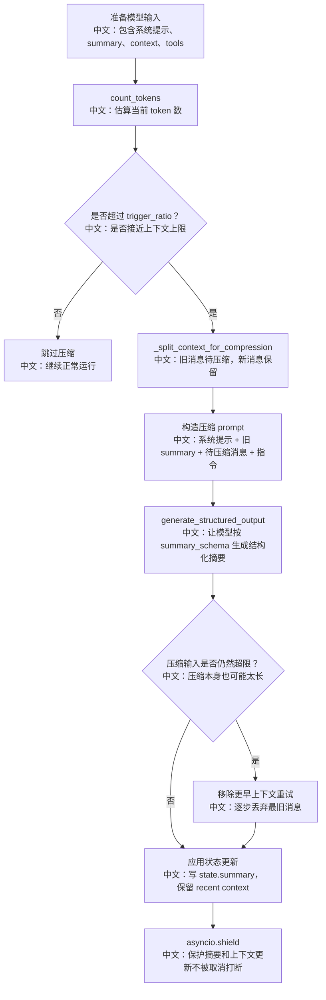

# 上下文压缩与长期任务连续性

> 结论：AgentScope 通过 `compress_context` 在上下文接近模型窗口上限时进行结构化摘要，保留最近消息，把旧上下文压缩为 summary，并用 `asyncio.shield` 保护状态更新。这是长任务连续性和取消一致性的高价值面试点。

---

## 1. 为什么需要上下文压缩

长任务会持续产生：

```text
用户需求
模型 reasoning
工具调用
工具结果
错误和重试
计划更新
团队消息
RAG 片段
```

如果只把所有历史消息塞给模型，会遇到：

```text
1. 超过模型 context_size。
2. prompt 成本越来越高。
3. 早期重要决策可能被截断。
4. 工具结果太长，影响后续推理。
```

所以需要把“旧上下文”压成结构化摘要，同时保留“最新上下文”。

---

## 2. 源码证据

关键源码：

```text
src/agentscope/agent/_agent.py
中文：compress_context、_compress_context_impl、_split_context_for_compression。

src/agentscope/agent/_config.py
中文：ContextConfig、trigger_ratio、reserve_ratio、summary_schema、tool_result_limit。
```

关键参数：

```text
trigger_ratio 默认 0.8
中文：当前 token 数超过模型上下文窗口的 80% 时触发压缩。

reserve_ratio 默认 0.1
中文：保留最近约 10% context window 的消息不压缩。

summary_schema
中文：结构化摘要 schema，包含任务概览、当前状态、重要发现、下一步、需要保留的上下文。

tool_result_limit 默认 50000
中文：限制工具结果文本，避免单个工具结果撑爆压缩输入。
```

---

## 3. 压缩流程



---

## 4. 关键设计点

### 4.1 不是简单截断，而是结构化摘要

简单截断的问题：

```text
旧决策直接消失。
用户要求、约束、错误原因、已完成步骤可能丢失。
```

AgentScope 的方式：

```text
summary_schema
中文：用结构化字段保存任务概览、当前状态、重要发现、下一步和必须保留的信息。
```

面试亮点：

```text
压缩不是“少一点 token”，而是把历史执行轨迹转成可恢复的结构化状态。
```

### 4.2 保留最近消息

压缩时会把上下文拆成：

```text
msgs_to_compress
中文：较旧消息，参与摘要。

msgs_to_reserve
中文：较新消息，原样保留。
```

为什么要保留最近消息：

```text
最近工具结果和用户最新要求通常对下一步最重要。
如果全部压缩，模型可能丢失刚刚发生的细节。
```

### 4.3 reserve_ratio 过大时会降级

如果 reserve_ratio 太大，导致没有旧消息可压缩，源码会 fallback：

```text
reserve_ratio 太大
  ↓
msgs_to_compress 为空
  ↓
降低 reserve 到 0
  ↓
尽量压缩更多上下文
```

中文解释：

```text
这是一种兜底策略，避免明明超限却因为保留窗口太大而无法压缩。
```

### 4.4 压缩本身也可能超限

压缩请求也要进入模型，所以它也可能超过 context_size。

处理方式：

```text
如果 compression prompt 也超限
  ↓
逐步移除最旧的待压缩消息
  ↓
直到压缩请求小于 trigger_ratio * context_size
  ↓
再生成结构化摘要
```

### 4.5 用 shield 保护状态一致性

状态更新包括：

```text
state.summary = 新摘要
state.context = 保留消息
可能还要 offload 旧上下文
```

如果这里被取消打断，可能出现：

```text
summary 已更新但 context 未更新
context 清了但 summary 没写
offload 不完整
```

所以源码用：

```text
asyncio.shield(apply_task)
中文：即使外层取消，也先让状态变更原子地完成，再重新抛出取消。
```

面试亮点：

```text
这是 asyncio 取消语义和状态一致性结合的好例子。
```

---

## 5. 和 Plan / 多 Agent / RAG 的关系

| 能力 | 为什么和上下文压缩有关 |
|---|---|
| Plan | 任务状态结构化保存，压缩后仍可通过 tasks_context 看到进度 |
| 多 Agent | 每个 worker 有独立 session，天然分摊上下文压力 |
| RAG | static 检索可能注入较多 hint，需要控制是否持久化 |
| HITL | 等待确认时上下文不能乱压丢工具调用状态 |

面试表达：

```text
长期任务不是只靠大 context window。
它要结合 Plan 的结构化任务状态、Session 独立上下文、RAG 的按需检索和 compression 的摘要机制。
```

---

## 6. 面试沉淀

### 一句话回答

AgentScope 的长上下文处理不是简单截断，而是在 token 超过阈值后保留近期消息、把旧上下文压缩成结构化 summary，并用 shield 保护状态更新，保证长任务能继续运行。

### 3 分钟讲解版

```text
Agent 每次可以通过 count_tokens 估算当前输入大小。
当 token 数超过 trigger_ratio，比如默认 80% context window 时，会触发 compress_context。
它会按 reserve_ratio 保留最近一部分消息，把更旧的消息拿去压缩。
压缩不是普通文本摘要，而是通过 summary_schema 生成结构化摘要，记录任务概览、当前状态、重要发现、下一步和必须保留的上下文。
如果压缩请求本身超限，会移除更早的消息重试。
最后更新 state.summary 和 state.context 时用 asyncio.shield，避免取消导致状态半更新。
```

### 高频追问

| 问题 | 回答方向 |
|---|---|
| 为什么不直接截断历史？ | 会丢用户约束、已完成步骤、错误原因和关键决策。 |
| 为什么用结构化 summary？ | 让后续模型更稳定地恢复任务状态，而不是读一段散文摘要。 |
| 为什么保留最近消息？ | 最新工具结果和用户追加需求通常最关键。 |
| 压缩请求也超限怎么办？ | 逐步丢弃最旧待压缩上下文，直到可压缩。 |
| 为什么用 shield？ | 防止取消打断 state.summary 和 state.context 的一致更新。 |

### 项目表达

```text
我会把它讲成“长期任务连续性机制”：
大模型窗口有限，所以系统用结构化摘要保留历史语义，用最近消息保留短期细节，用 shield 保证取消时状态不被写坏。
这比简单截断更适合 Agent 连续执行。
```

