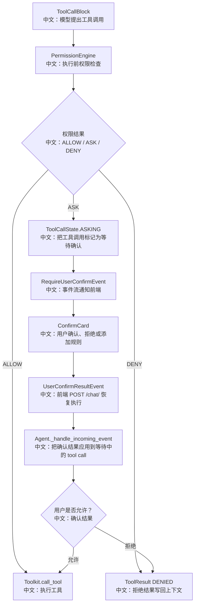

# 权限控制与 HITL 人类确认

> 结论：AgentScope 的工具调用不是模型生成后直接执行。每个 tool call 会先经过 PermissionEngine，可能得到 ALLOW、DENY 或 ASK。ASK 会让 Agent 暂停，发出 `RequireUserConfirmEvent`，前端展示确认卡；用户确认后再通过 `UserConfirmResultEvent` 恢复执行。多智能体场景下，worker 的确认请求还能投影到 leader UI。

---

## 1. 工具调用的安全边界

核心流程：

```text
模型生成 ToolCallBlock
  ↓
解析工具输入
  ↓
PermissionEngine.check_permission
  ↓
ALLOW / ASK / DENY
  ↓
执行、等待确认或拒绝
```

中文解释：

```text
LLM 只能“提出工具调用”，不能绕过权限系统直接执行工具。
```

---

## 2. 源码证据

关键源码：

```text
src/agentscope/permission/_engine.py
中文：权限决策核心，按 PermissionMode、allow/deny/ask rules、工具自身安全检查得出决策。

src/agentscope/agent/_agent.py
中文：_execute_tool_call 中解析输入、检查权限、发出 RequireUserConfirmEvent、执行工具、写 ToolResult。

src/agentscope/app/_router_schema/_chat.py
中文：ChatRequest 支持传入 UserConfirmResultEvent / ExternalExecutionResultEvent。

src/agentscope/app/_router/_chat.py
中文：确认事件通过 POST /chat/ 恢复一次 parked run。

examples/web_ui/frontend/src/hooks/useMessages.ts
中文：onUserConfirm 构造 UserConfirmResultEvent 并 POST /chat/。

examples/web_ui/frontend/src/components/chat/ConfirmCard.tsx
中文：前端确认卡。

examples/web_ui/frontend/src/components/chat/SubagentHitlCard.tsx
中文：子智能体确认卡。

src/agentscope/app/_service/_projectors/_subagent_hitl.py
中文：worker HITL 投影到 leader session。
```

---

## 3. PermissionEngine 决策模型

权限模式：

| 模式 | 行为 |
|---|---|
| DEFAULT | 默认严格，很多操作需要 ASK，allow rule 或工具只读检查可放行 |
| EXPLORE | 只读模式，修改类操作拒绝 |
| ACCEPT_EDITS | 工作区内编辑更宽松，读操作快速放行 |
| BYPASS | 受信任模式，尽量放行，但仍尊重 deny / ask rules 和工具 DENY |
| DONT_ASK | 无人值守模式，所有本该 ASK 的情况转成 DENY |

`DEFAULT` 的大致优先级：

```text
deny rules
中文：显式拒绝优先级最高
  ↓
ask rules
中文：显式要求询问
  ↓
tool.check_permissions
中文：工具自己的安全判断
  ↓
safety ASK
中文：危险操作即使有 allow rule 也要问
  ↓
allow rules
中文：匹配放行
  ↓
default ASK
中文：默认询问用户
```

面试亮点：

```text
权限不是单层开关，而是用户规则、工具自检、模式策略共同决定。
```

---

## 4. HITL 暂停与恢复



---

## 5. 为什么需要把 ToolCall 标成 ASKING

源码里在发出 `RequireUserConfirmEvent` 前，会先更新 tool call 状态：

```text
ToolCallState.ASKING
中文：当前工具调用正在等待用户确认。
```

这个状态很重要：

```text
1. 防止同一个工具调用被重复执行。
2. 前端刷新后可以从消息内容恢复确认卡。
3. 后端收到 UserConfirmResultEvent 时能校验它是否对应等待中的工具调用。
4. 中断时能把等待中的工具调用关闭成 interrupted result。
```

面试亮点：

```text
HITL 不是前端弹窗这么简单，关键是后端状态机要知道自己停在哪个 tool call。
```

---

## 6. 外部执行和人工确认的区别

AgentScope 里还有 `RequireExternalExecutionEvent`。

对比：

| 机制 | 含义 | 恢复事件 |
|---|---|---|
| RequireUserConfirmEvent | 工具需要用户授权后由后端继续执行 | UserConfirmResultEvent |
| RequireExternalExecutionEvent | 工具需要外部系统执行并把结果送回 | ExternalExecutionResultEvent |

中文解释：

```text
一个是“用户批准后系统执行”，一个是“系统外部执行后回填结果”。
二者都让 Agent 进入 parked 状态，等待外部事件恢复。
```

---

## 7. 多智能体下的 HITL 投影

worker 也会执行工具，也可能 ASK。

问题：

```text
如果 worker 的确认卡只出现在 worker session，
leader 不一定知道后台成员正在等确认。
```

解决：

```text
SubagentHitlProjector
中文：把 worker 的 RequireUserConfirmEvent 投影到 leader session。

useMessages.subagentHitl
中文：leader 前端维护待处理子智能体确认列表。

SubagentHitlCard
中文：leader 在当前聊天界面确认 worker 的工具调用。

onSubagentConfirm
中文：把 UserConfirmResultEvent 路由回 worker session。
```

面试亮点：

```text
这体现了多智能体产品化的完整性：
不仅能创建 worker，还能把 worker 的人工确认、恢复和 UI 体验串起来。
```

---

## 8. DONT_ASK 和后台任务

`DONT_ASK` 模式很适合问面试：

```text
无人值守任务不能弹出确认框。
如果某个工具调用需要 ASK，DONT_ASK 会把 ASK 转成 DENY。
```

为什么这样设计：

```text
后台任务、定时任务没有用户实时在线。
如果返回 ASK，任务会永久卡住。
转成 DENY 能让任务失败得明确，并保留 suggested_rules 给用户后续配置。
```

---

## 9. 面试沉淀

### 一句话回答

AgentScope 的工具调用先过 PermissionEngine，ASK 会把 tool call 标成 ASKING 并通过事件流让前端展示确认卡，用户确认后再用 UserConfirmResultEvent 恢复执行，多智能体 worker 的 HITL 还能投影到 leader UI。

### 3 分钟讲解版

```text
模型在 ReAct 循环中生成 ToolCallBlock 后，Agent 不会立刻执行。
它先解析工具参数，然后调用 PermissionEngine。
PermissionEngine 会结合当前 PermissionMode、allow/deny/ask rules 和工具自己的 check_permissions 得出 ALLOW、ASK 或 DENY。
ALLOW 才会进入 Toolkit.call_tool。
DENY 会生成一个 denied 的 ToolResult 写回上下文。
ASK 会先把 tool call 状态改成 ASKING，再发出 RequireUserConfirmEvent，前端收到后渲染 ConfirmCard。
用户确认或拒绝后，前端通过 POST /chat/ 发送 UserConfirmResultEvent，后端校验它对应等待中的 tool call，然后继续执行或写入拒绝结果。
多智能体场景下，worker 的确认请求还会通过 SubagentHitlProjector 投影给 leader，避免后台成员卡住无人处理。
```

### 高频追问

| 问题 | 回答方向 |
|---|---|
| LLM 能不能绕过权限直接执行？ | 不能，LLM 只生成 ToolCallBlock，执行前要过 PermissionEngine。 |
| ASK 为什么要写入状态？ | 用于恢复、校验、防重复执行和刷新后重建 UI。 |
| DONT_ASK 为什么转 DENY？ | 无人值守场景不能等待用户，明确失败比永久卡住好。 |
| worker 需要确认怎么办？ | SubagentHitlProjector 投影到 leader UI，再路由确认结果回 worker。 |
| allow rule 能不能覆盖危险操作？ | DEFAULT / ACCEPT_EDITS 下 safety ASK 具有更高优先级。 |

### 项目表达

```text
我会把这块讲成“Agent 工具执行的安全状态机”：
模型只负责提出动作，PermissionEngine 决定能不能做；
HITL 把不确定动作停在可恢复状态；
前端不是临时弹窗，而是消费后端事件和 tool call 状态；
多智能体场景下还要把 worker 的确认投影到 leader，保证产品流程闭环。
```

