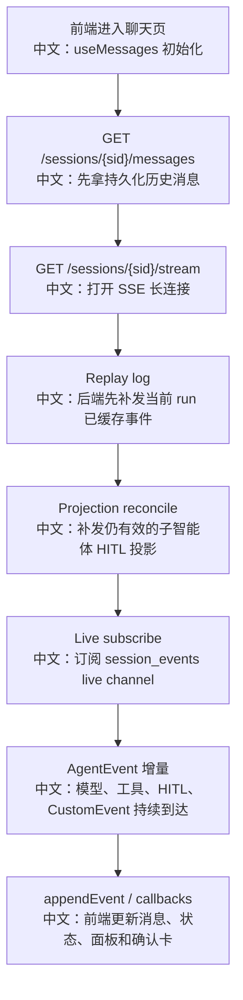

# 事件流与产品可观测性

> 结论：AgentScope 的前端不是靠“等 POST /chat 返回完整答案”来更新 UI，而是用 `POST /chat/` 触发运行、`GET /sessions/{sid}/stream` 接收 SSE 事件。后端用 MessageBus 同时写 replay log 和 live pub/sub，既支持实时流式渲染，也支持刷新/重连后补事件。

---

## 1. 为什么事件流是面试亮点

一次 Agent 运行会产生很多中间状态：

```text
模型开始 / 结束
文本 token 增量
工具调用开始 / 参数增量 / 结束
工具结果
RAG Hint
HITL 确认请求
任务状态更新
团队更新
子智能体确认投影
中断结束
```

如果后端只返回一个最终文本，前端无法展示这些过程，也无法处理“停在工具确认”“子智能体后台等待”“刷新后继续看结果”等真实产品问题。

---

## 2. 源码证据

```text
src/agentscope/app/_bus_ops.py
中文：publish_session_event 先写 replay log，再 publish live 事件。

src/agentscope/app/message_bus/_base.py
中文：MessageBus 抽象了 queue、replay log、pub/sub、distributed lock。

src/agentscope/app/_router/_session.py
中文：GET /sessions/{sid}/stream 先 replay，再订阅 live，并发送 heartbeat。

src/agentscope/event/_event.py
中文：AgentEvent 和 CustomEvent 定义。

examples/web_ui/frontend/src/hooks/useMessages.ts
中文：前端获取历史消息、打开 SSE、按事件更新 Msg、phase、Team、Plan、HITL。
```

---

## 3. MessageBus 三种语义

| 模式 | API | 语义 | 用途 |
|---|---|---|---|
| Drain Queue | `queue_push` / `queue_drain` | 单消费者，读后删除 | session inbox、wakeup queue、index task queue |
| Replay Log | `log_append` / `log_read` | 多消费者，可按 cursor 重放 | session 事件流重连恢复 |
| Pub/Sub | `publish` / `subscribe` | 只发给当前在线订阅者，不保留历史 | live SSE、wakeup signal、index task signal |

面试亮点：

```text
同一个 MessageBus 没有把所有通信都做成一种队列。
它按消费语义分层：需要补偿的用 replay log，需要唤醒的用 pub/sub，需要任务交付的用 drain queue。
```

---

## 4. SSE 连接流程



后端 SSE 还有 heartbeat：

```text
每 30 秒发送注释帧
中文：避免反向代理或浏览器把空闲长连接断开。
```

---

## 5. `publish_session_event` 的关键设计

```text
log_append(session_events)
中文：先写 replay log，保证重连能补。
  ↓
publish(session_events)
中文：再发 live pub/sub，保证在线用户实时看到。
```

为什么顺序重要：

```text
如果先 publish 后 log_append，前端在线时可能看到事件，但刷新后 replay 缺一段。
先写 replay 再 publish，实时和恢复的来源更一致。
```

---

## 6. CustomEvent 的产品价值

`CustomEvent` 不是普通模型消息，而是服务层通知：

```text
state_updated
中文：任务状态或权限状态变化，前端刷新 Plan / Permission 面板。

team_updated
中文：团队结构变化，前端刷新 session/team 列表。

subagent_require_user_confirm
中文：worker 的 HITL 请求投影到 leader UI。

subagent_user_confirm_result
中文：worker HITL 已处理，leader UI 清理卡片。
```

前端 `useMessages.ts` 遇到 `CUSTOM` 事件不会走 `appendEvent`，而是路由到回调或本地状态。

面试表达：

```text
AgentEvent 负责构建聊天消息，CustomEvent 负责驱动产品状态。
这让“聊天流”和“控制面板状态”共用同一条 SSE 通道，但语义仍然分开。
```

---

## 7. 前端 phase 状态

`useMessages` 里有 `ReplyPhase`：

| phase | 含义 |
|---|---|
| idle | 没有运行，输入可用 |
| streaming | 正在生成，或者停在 HITL |
| interrupting | 用户点了停止，等待后端 ReplyEnd |

细节亮点：

```text
1. 页面加载时如果历史消息尾部有 asking/submitted tool call，会把 phase 恢复为 streaming。
2. interrupting 有 10 秒安全 timeout，避免丢失 ReplyEnd 后 UI 永久卡住。
3. 用户发送和 HITL 确认都是 POST /chat/，结果仍通过 SSE 返回。
```

---

## 8. 面试沉淀

### 一句话回答

AgentScope 用 `POST /chat/` 触发异步运行，用 SSE 传输 AgentEvent；后端每个事件先写 replay log 再 live publish，所以既能实时渲染，也能刷新重连后恢复。

### 3 分钟讲解版

```text
前端进入聊天页后，先拉历史消息，再打开 /sessions/{sid}/stream。
这个 SSE endpoint 会先从 MessageBus 的 replay log 补发当前 run 已经产生的事件，然后订阅 live channel。
后端每产生一个 AgentEvent，会通过 publish_session_event 先 log_append，再 publish。
这样在线用户能实时看到 token、工具调用、HITL，刷新或短线重连后也能补到 replay log 中的事件。
前端 useMessages 根据事件更新当前 Msg；遇到 CustomEvent 则更新团队、计划、权限或子智能体 HITL 卡片。
```

### 高频追问

| 问题 | 回答方向 |
|---|---|
| 为什么不直接返回完整回答？ | 需要展示工具、HITL、状态变化和流式输出。 |
| SSE 断了怎么办？ | 重连时先读 replay log，再接 live subscribe。 |
| replay log 和 pub/sub 为什么都要？ | replay 负责恢复，pub/sub 负责实时。 |
| CustomEvent 是什么？ | 服务层产品通知，不直接拼进聊天消息。 |
| 前端怎么避免卡在 interrupting？ | 10 秒安全 timeout，ReplyEnd 到达则正常回 idle。 |

### 项目表达

```text
我会把这块讲成“Agent 产品的事件可观测层”：
不是只关心最终答案，而是把运行过程、工具调用、状态变化、HITL 和团队投影都事件化，再通过 replay + live 的组合保证实时性和恢复性。
```

