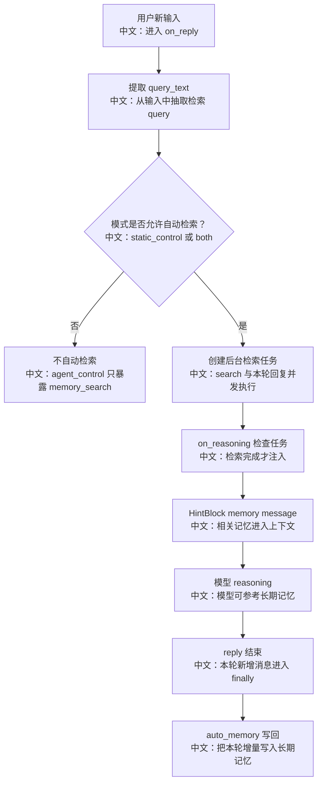

# 长期记忆与检索型记忆

> 结论：AgentScope 的长期记忆不是把所有历史聊天无限塞进上下文，而是通过 middleware 在回复前检索相关记忆、在回复后写回新记忆。不同实现有不同策略，其中 ReMe 支持自动写回、自动检索注入和 `memory_search` 工具三种组合。

---

## 1. 长期记忆解决什么问题

上下文压缩解决的是：

```text
当前长任务怎么不爆上下文窗口
```

长期记忆解决的是：

```text
跨会话、跨时间的用户偏好、决策、背景事实怎么被重新找回来
```

典型例子：

```text
用户之前说过喜欢中文文档
用户之前选定了某个框架方案
某个项目路径、命名规范、架构约定需要长期记住
```

---

## 2. 源码证据

```text
src/agentscope/middleware/_longterm_memory/
中文：长期记忆中间件目录。

src/agentscope/middleware/_longterm_memory/_reme/_middleware.py
中文：ReMe 长期记忆 middleware，自动写回，支持 static_control / agent_control / both。

src/agentscope/middleware/_longterm_memory/_reme/_tools.py
中文：ReMe 的 memory_search 工具。

src/agentscope/middleware/_longterm_memory/_mem0/_middleware.py
中文：Mem0 长期记忆 middleware。

src/agentscope/middleware/_longterm_memory/_agentic_memory/_middleware.py
中文：AgenticMemory middleware。

tests/reme_middleware_test.py
中文：覆盖 ReMe 的检索注入、写回、工具暴露和隔离。

tests/mem0_middleware_test.py
中文：覆盖 Mem0 相关中间件行为。
```

---

## 3. ReMe 的核心机制

ReMe middleware 的注释里讲得很清楚：

```text
on_reply
中文：监听一次回复，回复结束后把本轮新增 exchange 写回 ReMe auto_memory。

on_reasoning
中文：如果后台检索已经完成，把相关记忆作为 HintBlock 注入 context。

on_system_prompt
中文：在 agent_control / both 模式下，向系统提示追加 memory_search 使用说明。

list_tools
中文：在 agent_control / both 模式下暴露 memory_search 工具。
```

ReMe 的三种模式：

| 模式 | 行为 |
|---|---|
| static_control | 每次 reply 开始时后台检索，完成后注入上下文；不暴露工具 |
| agent_control | 不自动注入，只暴露 `memory_search`，由模型决定何时查 |
| both | 自动检索注入 + 暴露 `memory_search` |

---

## 4. 记忆检索流程



关键 trade-off：

```text
自动检索是 best-effort。
如果单轮回复太快，检索任务可能来不及注入本轮，但不会阻塞主回复。
```

---

## 5. 写回为什么只写“本轮增量”

ReMe middleware 会在 `on_reply` 开始时记录已有 context 的 message id，回复结束后只取新增消息：

```text
pre_ids = 当前 context 中已有消息
  ↓
reply 执行
  ↓
increment = 执行后新增消息 - memory hint
  ↓
auto_memory(increment)
```

中文解释：

```text
不能每轮都把完整历史写回，否则会重复提取旧记忆，造成污染和成本浪费。
也不能把刚注入的 memory hint 再写回，否则会把检索结果当成新事实重复保存。
```

---

## 6. 和 RAG 的区别

| 维度 | RAG 知识库 | 长期记忆 |
|---|---|---|
| 来源 | 用户上传文档 | 对话中提取的偏好、事实、决策 |
| 写入方式 | 上传后后台索引 | 回复后自动写回或工具写入 |
| 检索时机 | agentic 工具或 static 注入 | static / agent tool / both |
| 粒度 | document chunk | memory card / memory text |
| 目标 | 查外部知识 | 记住用户和项目历史 |

面试表达：

```text
RAG 是“查资料”，长期记忆是“记关系和历史”。
二者都可以用检索，但数据来源、生命周期和可信度不同。
```

---

## 7. 面试沉淀

### 一句话回答

长期记忆通过 middleware 接入 Agent Runtime：回复前按需检索相关记忆并注入 HintBlock，回复后把本轮新增 exchange 写回记忆系统，避免无限塞历史上下文。

### 3 分钟讲解版

```text
AgentScope 把长期记忆做成 middleware，而不是写死在 Agent 主循环里。
以 ReMe 为例，on_reply 开始时会根据用户输入启动后台检索任务。
如果模式是 static_control 或 both，on_reasoning 会在检索完成后把相关记忆作为 HintBlock 插入上下文。
如果模式是 agent_control 或 both，middleware 还会暴露 memory_search 工具，让模型自己决定何时查记忆。
回复结束后，middleware 只把本轮新增消息写给 ReMe 的 auto_memory，不会重复写完整历史，也会排除本轮注入的 memory hint。
```

### 高频追问

| 问题 | 回答方向 |
|---|---|
| 长期记忆和上下文压缩有什么区别？ | 压缩服务当前长任务，长期记忆服务跨会话历史。 |
| 长期记忆和 RAG 有什么区别？ | RAG 查文档，长期记忆记用户偏好和历史决策。 |
| 自动检索会不会阻塞回复？ | ReMe 是后台检索，注入 best-effort，不强制阻塞主回复。 |
| 为什么只写本轮增量？ | 避免重复提取旧历史，也避免把检索 hint 再写回。 |
| 模型怎么主动查记忆？ | agent_control / both 模式暴露 memory_search 工具。 |

### 项目表达

```text
我会把长期记忆讲成“跨会话的检索型用户画像和项目历史”：
它不是把所有聊天历史塞回 prompt，而是把有价值的信息提取成记忆，再在需要时检索注入或由模型主动查询。
```

