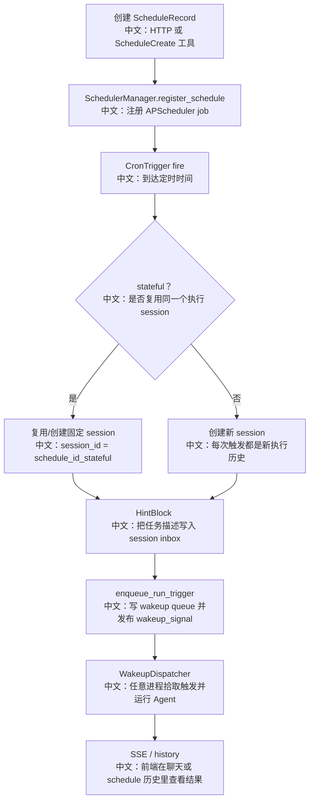

# 定时任务与无人值守执行

> 结论：AgentScope 的 Schedule 不是简单 cron 回调里直接调用 ChatService。它把定时触发转换成 session inbox 的 `HintBlock`，再通过 MessageBus wakeup 交给 WakeupDispatcher 执行；默认权限模式是 `dont_ask`，避免无人值守任务卡在 HITL。

---

## 1. 为什么定时任务是面试点

定时任务把 Agent 从“用户在线聊天”扩展到：

```text
每天自动生成报告
定期检查项目状态
固定时间检索信息
无人值守执行后台任务
```

这里会马上遇到几个工程问题：

```text
1. 触发时用户不在线，不能弹确认框。
2. 多次触发要不要共享上下文。
3. 服务重启后 schedule 要恢复。
4. 触发逻辑不能和 ChatService 强耦合。
5. 前端要能看到执行历史 session。
```

---

## 2. 源码证据

```text
src/agentscope/app/_manager/_scheduler/_scheduler_manager.py
中文：APScheduler 生命周期、restore、trigger 构造、inbox+wakeup 触发。

src/agentscope/app/_manager/_scheduler/_tools/_schedule_create.py
中文：Agent 内部 ScheduleCreate 工具，默认 permission_mode=dont_ask。

src/agentscope/app/_service/_toolkit.py
中文：session 有 chat_model_config 时装配 schedule tool group。

src/agentscope/app/_bus_ops.py
中文：enqueue_run_trigger 把 wake/resume 触发写入 wakeup queue 并 publish signal。

examples/web_ui/frontend/src/pages/schedule/create-schedule-dialog.tsx
中文：前端创建 schedule，默认 permissionMode 是 dont_ask。

examples/web_ui/frontend/src/hooks/useSchedules.ts
中文：前端 schedule CRUD hook。

tests/service_scheduler_test.py
中文：覆盖定时触发写 inbox + wakeup。
```

---

## 3. 定时触发流程



---

## 4. 为什么不直接调用 ChatService

源码注释里强调：

```text
Triggers do not call ChatService directly.
中文：定时触发不直接调用 ChatService。
```

而是：

```text
push HintBlock to inbox
  ↓
enqueue wakeup
  ↓
WakeupDispatcher 统一处理
```

好处：

| 好处 | 说明 |
|---|---|
| 解耦 | Scheduler 不需要知道 ChatService 细节 |
| 跨进程 | 任意进程的 WakeupDispatcher 可以拾取 |
| 统一路径 | TeamSay、后台工具结果、Schedule 都走 inbox + wakeup |
| 可恢复 | session 和 inbox 是明确状态，不依赖当前调用栈 |

---

## 5. stateful vs non-stateful

| 模式 | 行为 | 适合场景 |
|---|---|---|
| stateful=true | 多次触发复用固定 session | 连续跟踪、需要上下文积累 |
| stateful=false | 每次触发创建新 session | 每次独立报告、避免历史污染 |

源码细节：

```text
stateful session_id = f"{schedule.id}_stateful"
中文：同一个 schedule 的多次触发复用同一个 session id。

non-stateful
中文：每次 storage.upsert_session 不指定固定 id，生成新 session。
```

---

## 6. 为什么默认 `dont_ask`

前端创建定时任务默认：

```text
permissionMode: 'dont_ask'
中文：无人值守默认不等待用户确认。
```

ScheduleCreate 工具也默认：

```text
permission_mode = PermissionMode.DONT_ASK
中文：Agent 自己创建 schedule 时也是无人值守安全模式。
```

和权限文档衔接：

```text
DONT_ASK 会把本来需要 ASK 的操作转成 DENY。
中文：定时任务宁可明确失败，也不能半夜卡在确认框上。
```

---

## 7. 面试沉淀

### 一句话回答

AgentScope 的定时任务用 APScheduler 管理 cron，但触发时不直接调用 ChatService，而是把 `<scheduled-task>` HintBlock 写入 session inbox，再通过 wakeup queue 交给统一 dispatcher 执行，默认使用 `dont_ask` 权限模式。

### 3 分钟讲解版

```text
用户可以通过前端或 ScheduleCreate 工具创建定时任务，记录里保存 cron、timezone、描述、权限模式、是否 stateful 和模型配置。
SchedulerManager 启动时会从 storage 恢复 enabled schedules。
定时时间到达后，它根据 stateful 决定复用固定 session 还是新建 session。
然后把 schedule description 包在 <scheduled-task> HintBlock 中写入 session inbox。
接着调用 enqueue_run_trigger，把 wake 任务放入 wakeup queue 并发布 wakeup signal。
真正的 Agent 运行由 WakeupDispatcher 接手，这样定时、团队消息、后台工具结果都走统一唤醒链路。
因为触发时用户可能不在线，所以默认 permission_mode 是 dont_ask，需要确认的操作会被拒绝而不是卡住。
```

### 高频追问

| 问题 | 回答方向 |
|---|---|
| 定时任务怎么触发 Agent？ | APScheduler fire 后写 inbox + enqueue wakeup，由 WakeupDispatcher 执行。 |
| 为什么不直接调用 ChatService？ | 解耦、跨进程、统一唤醒路径、可恢复。 |
| stateful 有什么用？ | 多次执行共享上下文，适合长期跟踪。 |
| 为什么默认 dont_ask？ | 无人值守时不能等待确认，ASK 转 DENY 更可控。 |
| 服务重启后 schedule 会丢吗？ | SchedulerManager enter 时从 storage list_all_schedules restore。 |

### 项目表达

```text
我会把 Schedule 讲成“无人值守 Agent 执行系统”：
cron 只负责触发时间，真正执行仍走 session、inbox、wakeup、事件流和权限模式，这样产品行为和普通聊天保持一致。
```

