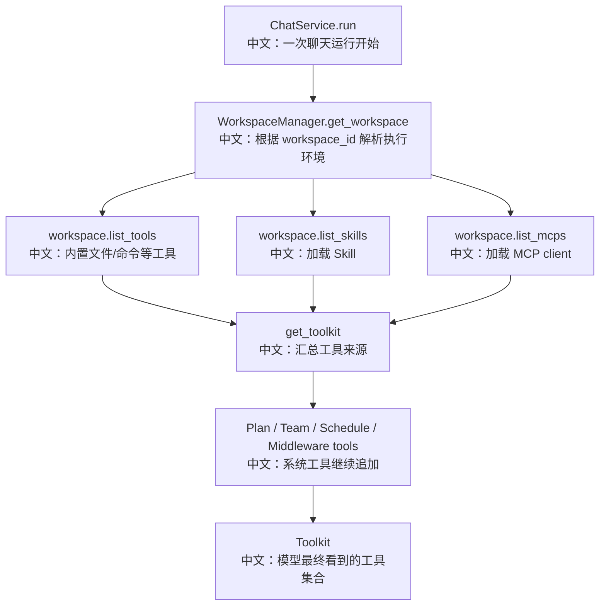

# Workspace、MCP 与 Skill 工具生态

> 结论：Workspace 是 AgentScope 的执行环境和工具生态边界。Workspace 提供内置工具、MCP、Skill、上下文 offload；ChatService 每次运行前通过 WorkspaceManager 解析 workspace，再在 `get_toolkit` 中把 workspace tools、skills、mcps 和 Plan/Team/RAG 等能力装配到同一个 Toolkit。

---

## 1. Workspace 解决什么问题

Agent 要做真实任务，不能只有 LLM：

```text
需要读写文件
需要运行命令
需要接浏览器、数据库、外部服务
需要安装或加载技能
需要保存压缩上下文和大工具结果
需要隔离不同用户/Agent/Session 的工作目录
```

Workspace 就是这些能力的运行边界。

---

## 2. 源码证据

```text
src/agentscope/workspace/_base.py
中文：WorkspaceBase，定义 tools、MCP、Skill、offload、目录布局。

src/agentscope/app/workspace_manager/_base.py
中文：WorkspaceManagerBase，定义 workspace isolation policy 和 get_workspace。

src/agentscope/app/_service/_toolkit.py
中文：get_toolkit 把 workspace.list_tools/list_skills/list_mcps 汇总进 Toolkit。

examples/web_ui/frontend/src/pages/chat/ChatViewport.tsx
中文：聊天页包含 McpPanel 和 SkillPanel。

examples/web_ui/frontend/src/components/panel/McpPanel.tsx
中文：前端 MCP 配置面板。

examples/web_ui/frontend/src/components/panel/SkillPanel.tsx
中文：前端 Skill 配置面板。

tests/service_toolkit_test.py
中文：覆盖 Toolkit 装配 workspace tools / skills / mcps。

tests/skill_loader_test.py
中文：覆盖本地 skill loader。

tests/mcp_sse_client_test.py、tests/mcp_streamable_http_client_test.py
中文：覆盖 MCP 客户端。
```

---

## 3. Workspace 目录布局

WorkspaceBase 文档里定义的布局：

```text
{workdir}/
  .mcp
  中文：持久化 MCP client 配置。

  data/
  中文：offload 的多模态 payload。

  skills/
  中文：skill 子目录。

  sessions/
  中文：每个 session 的上下文和工具结果 offload 文件。
```

面试亮点：

```text
Workspace 不只是文件目录，也是 Agent 工具、技能、MCP 和大数据 offload 的统一承载层。
```

---

## 4. isolation policy

`WorkspaceManagerBase.assign_workspace_id` 支持三种隔离粒度：

| 策略 | workspace_id 生成 | 含义 |
|---|---|---|
| PER_SESSION | 新 UUID | 每个 session 独立 workspace |
| PER_AGENT | user + agent 的 hash | 同一用户同一 agent 共享 workspace |
| PER_USER | user 的 hash | 同一用户下多个 agent 共享 workspace |

trade-off：

```text
PER_SESSION 隔离最强，但复用最弱。
PER_AGENT 适合一个 agent 长期维护自己的项目空间。
PER_USER 复用最高，但不同 agent 之间更容易互相影响。
```

---

## 5. Toolkit 装配流程



关键点：

```text
Workspace tools 不是独立于 Agent Runtime 的旁路。
它们和 Plan、Team、RAG、Schedule 一起进入 Toolkit，由同一个 ReAct + Permission + Acting 流程执行。
```

---

## 6. MCP 和 Skill 的区别

| 能力 | MCP | Skill |
|---|---|---|
| 形态 | 外部工具协议 / client | 本地技能目录 / loader |
| 典型用途 | 接浏览器、数据库、远程服务、外部工具 | 复用一组说明、脚本、资源或工作流 |
| 装配位置 | `workspace.list_mcps()` | `workspace.list_skills()` |
| 最终进入 | Toolkit 的 MCP 列表 | Toolkit 的 skills_or_loaders |

中文表达：

```text
MCP 更像外部工具连接器；
Skill 更像 Agent 可加载的专业知识和工作流包。
二者都挂在 Workspace 上，因为它们属于当前执行环境。
```

---

## 7. Offload 的价值

WorkspaceBase 还提供：

```text
offload_context
中文：把压缩前的上下文或大段历史存到 workspace sessions 目录。

offload_tool_result
中文：把大工具结果 offload，避免把超大内容一直塞在 AgentState 里。
```

这和前面的上下文压缩连接起来：

```text
上下文压缩负责摘要；
Workspace offload 负责把原始大内容落到执行环境中，供后续需要时引用。
```

---

## 8. 面试沉淀

### 一句话回答

Workspace 是 AgentScope 的执行环境边界，承载内置工具、MCP、Skill 和 offload；每次聊天运行都会解析 workspace，并把这些能力和系统工具一起装配进 Toolkit。

### 3 分钟讲解版

```text
AgentScope 不是让模型凭空回答，而是通过 Workspace 提供真实执行环境。
WorkspaceBase 定义了 list_tools、list_mcps、list_skills，以及 context/tool result offload。
WorkspaceManager 负责按 per-session、per-agent 或 per-user 策略分配 workspace_id，并返回已初始化的 workspace。
一次 ChatService.run 前，get_toolkit 会拿 workspace 的 tools、skills、mcps，再追加 Plan、后台任务、Schedule、Team 和 middleware 工具。
所以文件操作、MCP、Skill、Plan、RAG、Team 都进入同一个 Toolkit，并经过同一套 ReAct、权限和事件流。
```

### 高频追问

| 问题 | 回答方向 |
|---|---|
| Workspace 是不是只是目录？ | 不只是，还是工具/MCP/Skill/offload 的承载层。 |
| MCP 和 Skill 区别？ | MCP 连接外部工具服务，Skill 提供本地技能/工作流资源。 |
| workspace 隔离怎么做？ | WorkspaceManager 支持 per-session/per-agent/per-user。 |
| Workspace 工具怎么进入模型？ | get_toolkit 调 workspace.list_tools/list_skills/list_mcps。 |
| 大工具结果怎么处理？ | 可以通过 workspace offload，避免撑爆上下文。 |

### 项目表达

```text
我会把 Workspace 讲成“Agent 的运行沙箱和工具生态入口”：
模型的能力边界不是写死的，而是由当前 workspace 加载的工具、MCP、Skill 和系统工具共同决定。
```

