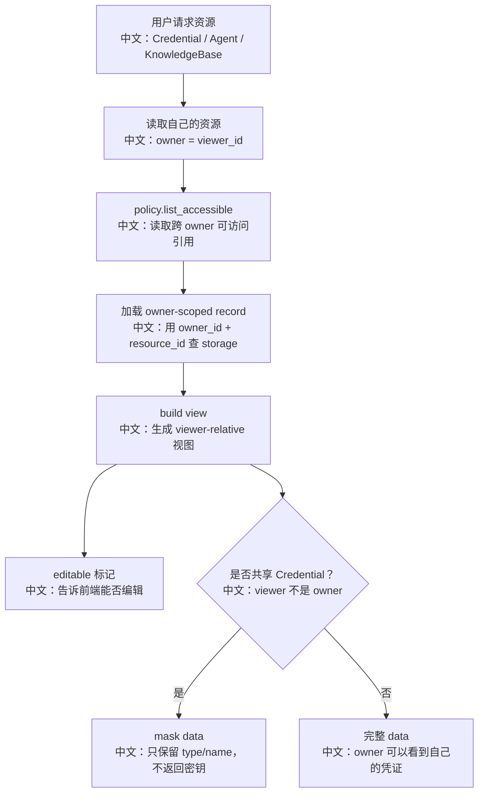

# 资源隔离与共享访问控制

> 结论：AgentScope 默认是 owner-isolated：用户只能访问自己的 Credential、Agent、KnowledgeBase。跨用户共享通过 `ResourceAccessPolicyBase` 扩展，Service 层统一走 `ResourceAccessService` 解析可见资源，并在视图里暴露 `editable`，共享 Credential 在 API 返回时会脱敏。

---

## 1. 为什么资源隔离重要

Agent 产品里资源不只是普通数据：

```text
Credential
中文：可能包含 API key 等敏感信息。

Agent
中文：包含系统提示、模型配置、权限、邀请配置。

KnowledgeBase
中文：包含文档、embedding 配置、向量库 collection。
```

如果共享和隔离没做好，会出现：

```text
1. 用户看到别人的密钥。
2. 共享 agent 被错误修改。
3. RAG 读到不该读的知识库。
4. AgentInvite 邀请到不可见或不可邀请 agent。
```

---

## 2. 源码证据

```text
src/agentscope/app/access/_policy.py
中文：ResourceAccessPolicyBase、ResourceRef、ResourcePermission、DenyAllResourceAccessPolicy。

src/agentscope/app/_service/_access.py
中文：ResourceAccessService，统一 list/get/resolve/edit 检查。

src/agentscope/app/_app.py
中文：create_app 可注入 resource_access_policy，默认 DenyAll。

src/agentscope/app/_router/_credential.py
中文：Credential 列表、更新、删除走 ResourceAccessService。

src/agentscope/app/_router/_agent.py
中文：Agent 列表、更新、删除走 ResourceAccessService，并过滤 team agent。

src/agentscope/app/_service/_knowledge_base.py
中文：知识库读写通过 require_edit / resolve_knowledge。

examples/web_ui/frontend/src/api/types.ts
中文：CredentialView / AgentView / KnowledgeBaseView 带 editable。

examples/web_ui/frontend/src/components/select/AgentSelect.tsx
中文：前端区分 yours / shared agent。

tests/resource_access_policy_test.py
中文：资源访问策略测试。
```

---

## 3. 核心模型

```text
ResourceKind
中文：credential / agent / knowledge_base。

ResourcePermission.READ
中文：可读/可用，但不能修改。

ResourcePermission.EDIT
中文：可读/可用，也能修改，相当于该资源的协作者。

ResourceRef
中文：指向某个 owner_id 下的 resource_id，并带 permission。
```

默认策略：

```text
DenyAllResourceAccessPolicy
中文：不返回任何跨 owner 资源，保持历史 owner-isolated 行为。
```

---

## 4. ResourceAccessService 做什么



面试亮点：

```text
同一个 storage 仍然是 owner-scoped。
共享不是把数据复制到 viewer 名下，而是通过 ResourceRef 指回 owner 资源。
```

---

## 5. API 视图和 Runtime 解析分开

共享 Credential 有一个细节：

```text
API get/list 返回 CredentialView
中文：如果是共享凭证，data 会被脱敏，只留 type/name。

runtime resolve_credential
中文：可信运行路径需要真实密钥时，返回 raw CredentialRecord。
```

为什么这样设计：

```text
前端不应该看到共享密钥明文；
但后端运行模型、embedding、TTS 时需要用真实凭证。
所以 UI 视图和 runtime 解析分开。
```

---

## 6. 读权限和编辑权限

`resolve_for_edit` 的语义：

```text
如果是 owner
  允许编辑

如果是 shared ref 且 permission=EDIT
  返回 owner_id + raw record，让调用方写回 owner 的 storage key

如果是 shared ref 但只有 READ
  403 forbidden

如果不可见
  404 not found
```

面试亮点：

```text
404 和 403 区分得很有产品安全含义：
不可见时不给资源存在性信号；
可见但只读时明确告诉前端不能修改。
```

---

## 7. 和 AgentInvite 的关系

多智能体里 `AgentInvite` 会读取 visible agents：

```text
resource_access_service.list_resource(user_id, ResourceKind.AGENT)
中文：leader 可见的 own + shared agent。

invite_config.invitable == true
中文：只允许被标记为可邀请的 agent。

invite_description 非空
中文：必须有足够描述，让 LLM 知道什么时候邀请。
```

中文解释：

```text
共享访问决定“你能不能看见这个 agent”；
invite_config 决定“这个 agent 能不能被借入团队”。
两层约束共同决定 AgentInvite 的候选池。
```

---

## 8. 面试沉淀

### 一句话回答

AgentScope 默认 owner-isolated，跨用户共享通过 ResourceAccessPolicy 返回 ResourceRef；Service 层用 ResourceAccessService 合并 own/shared 资源、计算 editable，并对共享凭证 API 视图脱敏。

### 3 分钟讲解版

```text
资源访问不是散落在每个 router 里判断 user_id。
应用启动时可以注入 ResourceAccessPolicyBase，默认是 DenyAll，也就是不允许跨用户访问。
ResourceAccessService 会先读取 viewer 自己的资源，再读取 policy 返回的跨 owner ResourceRef。
每个返回给前端的视图都带 editable，表示当前 viewer 是否能修改。
对于 Credential，shared view 会脱敏，只保留 type 和 name，避免把 API key 泄露给前端。
但 runtime 路径例如模型构造、embedding 或 TTS，需要真实凭证时，会用 resolve_credential 返回 raw record。
编辑时走 resolve_for_edit：不可见返回 404，只读共享返回 403，可编辑共享则写回 owner 的 storage key。
```

### 高频追问

| 问题 | 回答方向 |
|---|---|
| 默认能跨用户共享吗？ | 默认 DenyAll，不共享；需要应用注入策略。 |
| shared credential 会泄露密钥吗？ | API 视图会脱敏，runtime 可信路径才取 raw record。 |
| read 和 edit 怎么区分？ | ResourcePermission.READ / EDIT，前端通过 editable 展示。 |
| 为什么共享不复制资源？ | ResourceRef 指向 owner 资源，避免副本一致性问题。 |
| AgentInvite 候选池怎么来？ | visible agents + invitable + invite_description。 |

### 项目表达

```text
我会把它讲成“owner-scoped storage + policy-based sharing”：
底层存储保持按 owner 隔离，共享只是策略层返回引用；前端拿 viewer-relative view，后端 runtime 走可信解析路径。
```

