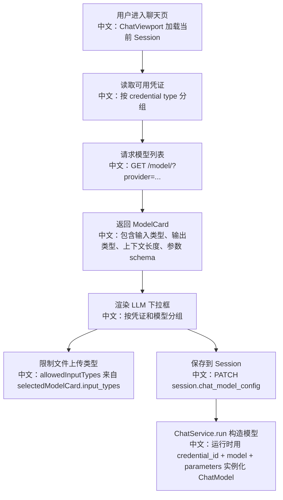

# 模型能力发现与多模态边界

> 面试定位：这不是一个简单的“模型列表接口”，而是 Agent 产品能否正确支持文本、图片、音频、视频、PDF、thinking、voice 等能力的入口。它决定了前端允许用户上传什么、后端如何构造模型、参数面板展示什么，以及系统如何避免把不支持的输入交给模型。

---

## 1. 结论先行

AgentScope 的模型能力不是写死在前端，而是由后端 `CredentialFactory` 找到凭证类型，再由对应模型类的 `list_models()` 返回 `ModelCard`。`ModelCard` 里包含 `input_types`、`output_types`、`context_size`、`output_size`、`parameter_schema` 等字段，前端据此渲染模型选择、参数面板和允许上传的文件类型。

最值得讲的点：

```text
模型能力发现 = Credential 类型 -> Model 类 -> ModelCard -> Web UI 输入约束 -> Session 运行态模型配置
```

中文说明：用户看到的“这个模型能不能传图片/音频/视频、有没有 thinking 参数、有没有 voice 参数”，不是 UI 猜出来的，而是模型卡片声明出来的能力边界。

---

## 2. 产品流程



---

## 3. 源码入口

| 层级 | 文件 | 关键点 |
|---|---|---|
| 后端 Router | `src/agentscope/app/_router/_model.py` | `GET /model/` 根据 provider 返回候选聊天模型 |
| 后端构造 | `src/agentscope/app/_service/_model.py` | `get_model()` 通过 `ResourceAccessService.resolve_credential()` 取原始凭证，再实例化模型 |
| 模型卡片 | `src/agentscope/model/_model_card.py` | `ModelCard` 定义 `input_types`、`output_types`、`context_size`、`output_size`、参数 schema |
| 前端 API | `examples/web_ui/frontend/src/api/model.ts` | `modelApi.list(provider)` 调 `/model/` |
| 前端选择 | `examples/web_ui/frontend/src/components/select/LlmSelect.tsx` | 按 provider / credential / model 分组选择 |
| 聊天页 | `examples/web_ui/frontend/src/pages/chat/ChatViewport.tsx` | 自动选择默认模型、保存模型配置、根据 `input_types` 限制上传 |
| 能力图标 | `examples/web_ui/frontend/src/components/badge/InputTypeBadges.tsx` | 用 text/image/audio/video 图标展示模型输入能力 |

---

## 4. ModelCard 为什么重要

`ModelCard` 是“模型能力协议”。它不是只给 UI 展示名字，而是把模型能力结构化：

```text
name
中文：模型调用名称，例如 gpt-4.1、qwen-plus。

label
中文：前端展示名称。

input_types
中文：支持的输入 MIME 类型，例如 text/plain、image/*、audio/*。

output_types
中文：支持的输出类型，例如 text/plain、application/x-thinking、audio/wav。

context_size
中文：上下文窗口大小，影响压缩和预算判断。

output_size
中文：最大输出 token，前端会注入到参数 schema 的 max_tokens maximum。

parameter_schema
中文：模型参数表单 schema，用于动态渲染参数面板。
```

源码亮点在 `ModelCard.from_yaml()`：

```text
如果 output_types 不包含 application/x-thinking
  -> 移除 thinking_enable / thinking_budget 参数

如果 output_types 不包含 audio/*
  -> 移除 voice 参数

如果存在 output_size
  -> 自动设置 max_tokens 的最大值
```

中文说明：这是一种“能力驱动 UI”的设计。模型不支持 thinking，就不要让用户看到 thinking 参数；模型不输出音频，就不要暴露 voice 参数。

---

## 5. 多模态边界

前端在 `ChatViewport.tsx` 中把 `selectedModelCard.input_types` 传给 `ChatContent`：

```text
selectedModelCard.input_types
  -> 过滤 image/video/audio/text/pdf/office 等 MIME 类型
  -> allowedInputTypes
  -> 文件选择与消息构造
```

文件处理逻辑：

```text
本地路径存在
  -> 转成 file:// URL DataBlock

text/plain
  -> 直接读文本，转成 TextBlock

其他二进制文件
  -> 读 ArrayBuffer
  -> base64 编码
  -> 转成 DataBlock
```

中文说明：前端并不假设所有模型都能处理所有文件。它先看模型卡片声明的 `input_types`，再决定允许上传哪些输入。

---

## 6. 后端运行态构造

`GET /model/` 只是能力发现；真正运行时走 `ChatService.run` 装配模型，最终调用 `get_model()`：

```text
Session.chat_model_config
  -> credential_id
  -> model
  -> parameters
  -> ResourceAccessService.resolve_credential
  -> CredentialFactory.from_dict
  -> credential.get_chat_model_class()
  -> model_cls(...)
```

中文说明：模型选择不是全局配置，而是 Session 运行态配置。这样同一个 Agent 可以在不同 Session 中使用不同模型、不同凭证、不同参数。

---

## 7. 面试亮点

### 一句话回答

AgentScope 用 `ModelCard` 做模型能力发现，把模型支持的输入输出类型、上下文窗口和参数 schema 从后端透传给前端，前端据此限制上传和渲染参数，后端运行时再用 Session 中的模型配置实例化真实模型。

### 3 分钟讲解版

```text
我不会把“哪些模型支持图片/音频/thinking”写死在前端。AgentScope 的做法是：先通过 credential type 找到对应模型类，然后让模型类返回一组 ModelCard。ModelCard 里声明 input_types、output_types、context_size、output_size 和 parameter_schema。前端聊天页拿到这些模型卡后，一方面渲染模型下拉框和参数面板，另一方面把 input_types 传给 ChatContent 限制用户可上传的文件类型。真正执行聊天时，Session 保存的是 chat_model_config，后端通过 credential_id 解析凭证，再实例化对应模型。这样模型能力、前端体验和运行态装配是统一的。
```

### 高频追问

| 追问 | 回答方向 |
|---|---|
| 为什么不在前端写死模型能力？ | 模型能力变化快，写死会导致 UI 和后端不一致；ModelCard 让能力由后端模型实现声明。 |
| 如何避免用户给不支持音频的模型上传音频？ | 前端用 `selectedModelCard.input_types` 作为 `allowedInputTypes`，从入口限制。 |
| thinking 参数为什么有些模型没有？ | `ModelCard.from_yaml()` 会根据 `output_types` 自动过滤 thinking 参数。 |
| voice 参数为什么不是所有模型都有？ | 只有 `output_types` 包含 `audio/*` 的模型才保留 voice 参数。 |
| Session 为什么保存模型配置？ | Agent 是配置态，Session 是运行态；不同 Session 可以选择不同模型和参数。 |

### 对比题

| 对比 | AgentScope 设计 |
|---|---|
| 前端硬编码能力 vs 后端能力发现 | 后端能力发现更可靠，适合多 provider、多模型快速变化。 |
| 全局模型配置 vs Session 模型配置 | Session 配置更灵活，支持同一 Agent 在不同会话中使用不同模型。 |
| 静态参数表单 vs schema 驱动表单 | schema 驱动能跟随模型参数变化，减少前后端重复维护。 |

---

## 8. 测试证据

相关测试覆盖在模型、formatter、多模态输入和上下文能力上：

```text
tests/model_openai_chat_test.py
tests/model_dashscope_test.py
tests/model_gemini_test.py
tests/model_moonshot_test.py
tests/model_deepseek_test.py
tests/model_ollama_test.py
tests/formatter_openai_chat_test.py
tests/formatter_dashscope_test.py
tests/formatter_gemini_test.py
tests/model_count_tokens_test.py
```

建议后续补充：

```text
1. GET /model/ 对未知 provider 返回 404 的接口级测试。
2. ModelCard output_types 控制 thinking / voice 参数过滤的单元测试。
3. Web UI allowedInputTypes 根据 selectedModelCard.input_types 变化的组件测试。
```

