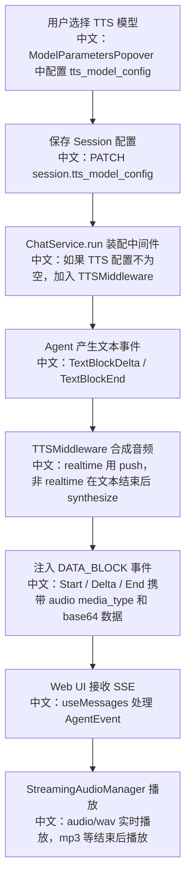

# 语音合成与流式音频事件

> 面试定位：TTS 不是“文本转音频”这么简单。在 AgentScope 里，它被设计成一条事件流链路：模型输出文本事件，TTS 中间件把文本合成音频，再以 `DATA_BLOCK_*` 事件注入同一条回复流，前端按 block_id 做流式播放和最终回放。

---

## 1. 结论先行

AgentScope 的 TTS 是 Session 级可选能力。当前 Session 配置了 `tts_model_config` 时，`ChatService.run` 会把 `TTSMiddleware` 加入 Agent middleware。该中间件监听文本块事件，把 assistant 的文本增量或文本结束事件转成语音，再发出 `DataBlockStartEvent`、`DataBlockDeltaEvent`、`DataBlockEndEvent`。Web UI 的 `useMessages` 会把音频 DataBlock 路由给 `StreamingAudioManager`，实现 WAV 实时播放和非 WAV 结束后播放。

---

## 2. 产品流程



---

## 3. 源码入口

| 层级 | 文件 | 关键点 |
|---|---|---|
| TTS 模型列表 | `src/agentscope/app/_router/_tts_model.py` | `GET /tts-model/` 根据 provider 返回 TTS 候选模型 |
| TTS 模型卡 | `src/agentscope/tts/_tts_model_card.py` | 声明 `input_types`、`output_types`、`realtime`、`parameter_schema` |
| Chat 装配 | `src/agentscope/app/_service/_chat.py` | Session 有 `tts_model_config` 时加入 `TTSMiddleware` |
| 中间件 | `src/agentscope/middleware/_tts_middleware.py` | 把文本事件转换为音频 DataBlock 事件 |
| TTS 实现 | `src/agentscope/tts/_openai.py`、`src/agentscope/tts/_dashscope/_model.py`、`src/agentscope/tts/_dashscope/_cosyvoice_model.py` | 非流式与流式 TTS 实现 |
| 前端接收 | `examples/web_ui/frontend/src/hooks/useMessages.ts` | 识别 `DATA_BLOCK_*` 且 `media_type` 以 `audio/` 开头的事件 |
| 前端播放 | `examples/web_ui/frontend/src/utils/streamingAudio.ts` | WAV 实时播放，其他格式缓冲成 Blob URL |

---

## 4. TTS 事件链路

`TTSMiddleware` 有两种模式。

### 4.1 非实时 TTS

```text
TextBlockDeltaEvent
  -> 累积 text_buffer

TextBlockEndEvent
  -> tts.synthesize(text)
  -> DataBlockStartEvent
  -> DataBlockDeltaEvent
  -> DataBlockEndEvent
```

中文说明：普通 TTS 要等一个文本块结束后再合成，适合非实时模型。

### 4.2 实时 TTS

```text
TextBlockDeltaEvent
  -> tts.push(delta)
  -> 如果已有音频，立刻发 DataBlockDeltaEvent

TextBlockEndEvent
  -> tts.synthesize()
  -> drain 剩余音频
  -> DataBlockEndEvent
```

中文说明：实时 TTS 不需要等完整文本结束，文本边流出边推给语音模型，前端能更早听到声音。

---

## 5. 事件结构

```text
DataBlockStartEvent
中文：声明一个新的二进制块，包含 block_id 和 media_type。

DataBlockDeltaEvent
中文：携带一段 base64 音频数据。多个 delta 通过同一个 block_id 拼接。

DataBlockEndEvent
中文：声明该音频块结束，前端可以生成最终可回放资源。
```

关键设计点：

```text
block_id
中文：把一个音频块的所有增量事件绑定在一起。

media_type
中文：区分 audio/wav、audio/mpeg 等，不同格式走不同播放策略。

base64 incremental chunk
中文：每个 delta 是增量音频片段，不是完整音频。
```

---

## 6. 前端播放设计

`useMessages.ts` 中音频 DataBlock 仍然会走 `appendEvent` 写入消息结构，同时额外路由给 `audioManager`：

```text
DATA_BLOCK_START + audio/*
  -> audioManager.start(block_id, media_type)

DATA_BLOCK_DELTA + audio/*
  -> audioManager.append(block_id, data)

DATA_BLOCK_END
  -> audioManager.end(block_id)
```

`StreamingAudioManager` 有两条播放路径：

```text
audio/wav
  -> 解析 RIFF/WAVE header
  -> 把 PCM chunk 转成 AudioBuffer
  -> 用 Web Audio timeline 实时排程播放

mp3 / opus / 其他格式
  -> 累积字节
  -> DATA_BLOCK_END 后生成 Blob URL
  -> 用 HTMLAudioElement 播放和回放
```

中文说明：WAV 可以边收边播；很多压缩格式不适合随便切块解码，所以先缓冲，结束后播放。

---

## 7. 面试亮点

### 一句话回答

AgentScope 把 TTS 设计成 Agent 事件流的一个增强中间件：文本块事件进入 `TTSMiddleware`，输出音频 DataBlock 事件，前端用同一套 SSE 机制接收并按音频格式选择实时播放或结束后播放。

### 3 分钟讲解版

```text
TTS 在 AgentScope 里不是单独再开一个音频接口，而是复用 AgentEvent 流。Session 配置了 tts_model_config 后，ChatService.run 会把 TTSMiddleware 加入 middleware 链。Agent 生成文本时，中间件监听 TextBlockDeltaEvent 和 TextBlockEndEvent。非实时模型在文本块结束后 synthesize；实时模型在每个 delta 到来时 push 给 TTS 模型。合成结果统一转换成 DATA_BLOCK_START、DATA_BLOCK_DELTA、DATA_BLOCK_END 事件。前端 useMessages 接收 SSE 时，如果发现 media_type 是 audio/*，就交给 StreamingAudioManager。WAV 走 Web Audio 实时播放，其他格式生成 Blob URL 后播放。这样文本、音频、历史消息和回放都在同一套事件协议里。
```

### 高频追问

| 追问 | 回答方向 |
|---|---|
| 为什么不用单独的音频 WebSocket？ | 复用 AgentEvent/SSE，可以和文本、工具调用、HITL、历史消息统一处理。 |
| 实时 TTS 和非实时 TTS 差异？ | 实时模式在 TextBlockDelta 时 push，非实时模式在 TextBlockEnd 后 synthesize。 |
| 为什么要有 DataBlockStart/Delta/End？ | 二进制内容可能很大或流式产生，三段事件能表达开始、增量和结束。 |
| 前端为什么 WAV 可以实时播？ | WAV header 可解析 PCM 参数，后续 PCM chunk 可排到 AudioContext 时间线上。 |
| 为什么新回复开始要 stopAllPlayback？ | 避免旧回复音频和新回复音频重叠，保证聊天体验一致。 |

---

## 8. 测试证据

相关测试：

```text
tests/tts_middleware_test.py
tests/tts_openai_test.py
tests/tts_dashscope_test.py
tests/agui_protocol_test.py
```

测试覆盖重点：

```text
1. TTSMiddleware 是否按文本事件产生 DataBlockStart / Delta / End。
2. OpenAI TTS 非流式聚合和流式 chunk。
3. DashScope TTS 对流式音频和 WAV 包装的处理。
4. AGUI 协议对 DataBlockDeltaEvent 的转换。
```

建议补测：

```text
1. 前端 StreamingAudioManager 的 wav header 解析和 chunk 排程测试。
2. Session 切换时 disposeAll 是否释放 Blob URL 和 AudioContext。
3. TTS 模型配置被清空后 ChatService.run 不再装配 TTSMiddleware。
```

