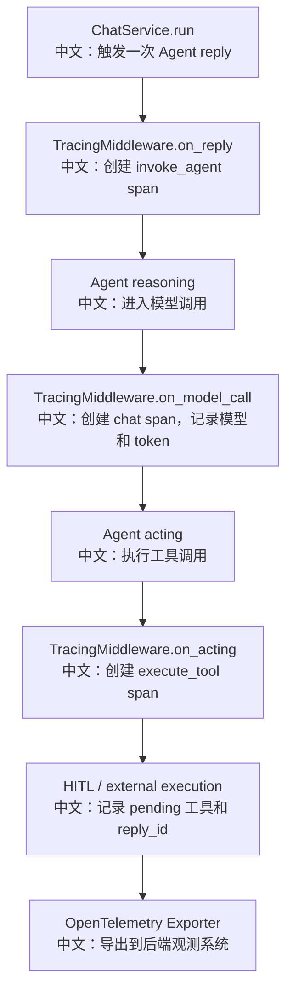

# Tracing 与 OpenTelemetry 观测

> 面试定位：Tracing 是把“Agent 黑盒”变成“可诊断系统”的关键。AgentScope 的亮点是用 OpenTelemetry 把一次 Agent reply 拆成 agent、LLM、tool 三类 span，并把 HITL、外部执行、reply_id、conversation_id 等 Agent 特有状态写入 span 属性。

---

## 1. 结论先行

AgentScope 通过 `TracingMiddleware` 在三个生命周期点打点：

```text
on_reply
中文：一次 Agent 调用，一个 invoke_agent span。

on_model_call
中文：一次 LLM 调用，一个 chat span。

on_acting
中文：一次工具执行，一个 execute_tool span。
```

当没有配置真实 OpenTelemetry SDK provider 时，中间件会短路，避免引入明显开销。配置后，它会把 Session 作为 `conversation_id`，把 reply_id、输入输出消息、模型名、provider、token usage、工具名、工具参数、工具结果、HITL pending 工具等写入 span。

---

## 2. 观测流程



---

## 3. 源码入口

| 层级 | 文件 | 关键点 |
|---|---|---|
| 中间件主逻辑 | `src/agentscope/middleware/_tracing/_trace.py` | `TracingMiddleware` 在 reply/model/tool 生命周期创建 span |
| 属性提取 | `src/agentscope/middleware/_tracing/_extractor.py` | 提取 provider、model、input/output messages、tool args、usage |
| 属性常量 | `src/agentscope/middleware/_tracing/_attributes.py` | OpenTelemetry GenAI 属性和 AgentScope 扩展属性 |
| 内容转换 | `src/agentscope/middleware/_tracing/_converter.py` | 把 TextBlock/DataBlock/ToolCall 等转换为 GenAI parts |
| tracer 获取 | `src/agentscope/middleware/_tracing/_setup.py` | 使用 tracer name `agentscope` 和版本 |
| 测试 | `tests/tracing_test.py` | 覆盖 span 属性、HITL、外部执行、token usage |

---

## 4. 三类 Span

### 4.1 invoke_agent span

```text
span name
  -> invoke_agent {agent_name}

关键属性
  -> gen_ai.operation.name = invoke_agent
  -> gen_ai.agent.name
  -> gen_ai.input.messages
  -> gen_ai.output.messages
  -> gen_ai.conversation.id = session_id
  -> agentscope.agent.reply_id
  -> agentscope.agent.hitl_pending_tools
  -> agentscope.agent.external_execution_pending_tools
```

中文说明：这个 span 描述“一次 Agent 回复整体做了什么”。

### 4.2 chat span

```text
span name
  -> chat {model}

关键属性
  -> gen_ai.operation.name = chat
  -> gen_ai.provider.name
  -> gen_ai.request.model
  -> gen_ai.request.temperature / top_p / max_tokens
  -> gen_ai.tool.definitions
  -> gen_ai.usage.input_tokens
  -> gen_ai.usage.output_tokens
  -> gen_ai.output.messages
```

中文说明：这个 span 描述“一次 LLM 调用消耗了什么、输入输出了什么、使用哪个模型”。

### 4.3 execute_tool span

```text
span name
  -> execute_tool {tool_name}

关键属性
  -> gen_ai.operation.name = execute_tool
  -> gen_ai.tool.name
  -> gen_ai.tool.call.id
  -> gen_ai.tool.call.arguments
  -> gen_ai.tool.call.result
```

中文说明：这个 span 描述“一次工具调用的参数、结果和状态”。

---

## 5. HITL 和外部执行为什么值得讲

普通 tracing 只能记录函数耗时，但 Agent 系统经常会暂停：

```text
RequireUserConfirmEvent
中文：等待用户确认工具调用。

RequireExternalExecutionEvent
中文：等待外部系统执行工具。

UserConfirmResultEvent / ExternalExecutionResultEvent
中文：下一次调用带着结果恢复执行。
```

AgentScope 的做法：

```text
第一次 span
  -> 记录 pending tools
  -> 记录 reply_id

第二次恢复调用
  -> 通过 incoming_event_type 标记这是确认/外部结果恢复
  -> HITL / external execution 的两段 span 可用同一个 reply_id 关联

外部执行结果
  -> 生成 synthetic execute_tool span
  -> 中文：即使工具不是本进程执行，也能在 trace 里看到一次工具执行结果
```

面试表达：这不是普通 Web API tracing，而是 Agent workflow tracing，必须处理“暂停-恢复”的业务语义。

---

## 6. 面试亮点

### 一句话回答

AgentScope 用 `TracingMiddleware` 把一次 Agent 回复拆成 `invoke_agent`、`chat`、`execute_tool` 三类 OpenTelemetry span，并额外记录 reply_id、conversation_id、HITL pending 工具和外部执行结果，让 Agent 的推理、模型调用和工具调用可观测。

### 3 分钟讲解版

```text
Agent 系统很容易变成黑盒，因为一次用户请求里可能包含多轮模型调用、多个工具调用、HITL 暂停和恢复。AgentScope 的 TracingMiddleware 在 reply、model_call、acting 三个生命周期点打 OpenTelemetry span。on_reply 记录一次 Agent 回复整体，on_model_call 记录模型名、provider、参数、token usage 和输出，on_acting 记录工具名、参数和结果。它还把 session_id 作为 conversation_id，把 reply_id 写进 span，所以跨暂停恢复可以串起来。对于 external execution，第二次恢复时还会生成 synthetic execute_tool span，让外部执行也出现在 trace 中。
```

### 高频追问

| 追问 | 回答方向 |
|---|---|
| tracing 没配置时会不会有开销？ | `_check_tracing_enabled()` 检查是否是真实 SDK provider；未配置则短路。 |
| 怎么关联同一轮对话？ | 使用 session_id 作为 `gen_ai.conversation.id`。 |
| 怎么关联 HITL 前后两段调用？ | 使用 `agentscope.agent.reply_id` 和 pending tools 属性。 |
| 工具在外部执行怎么办？ | 恢复时为外部结果生成 synthetic `execute_tool` span。 |
| token usage 从哪里来？ | 从 `ChatResponse.usage` 提取 input/output/cache token。 |

### 对比题

| 对比 | AgentScope 设计 |
|---|---|
| 日志 vs Trace | 日志记录离散事件，trace 能串起一次 Agent workflow 的调用树和耗时。 |
| HTTP tracing vs Agent tracing | Agent tracing 要覆盖 LLM、工具、HITL 暂停恢复和外部执行。 |
| 只记录模型调用 vs 全链路记录 | 全链路记录才能定位是模型慢、工具慢、权限等待还是外部执行卡住。 |

---

## 7. 测试证据

`tests/tracing_test.py` 覆盖了大量关键场景：

```text
1. 同一次 reply 的 span 共享 conversation_id。
2. invoke_agent span 记录输入输出消息。
3. chat span 记录模型、operation、输出消息和 token usage。
4. execute_tool span 记录工具名。
5. 普通 reply 记录 reply_id。
6. HITL 第一段记录 pending tools，第二段 span 共享 reply_id。
7. external execution 恢复时生成 synthetic execute_tool span。
8. 恢复调用记录 incoming_event_type。
```

建议后续补测：

```text
1. 异常路径 span status=ERROR 的端到端测试。
2. 流式模型最后一个 chunk 提取 response attributes 的测试。
3. DataBlock 多模态内容转换到 GenAI parts 的覆盖。
```

