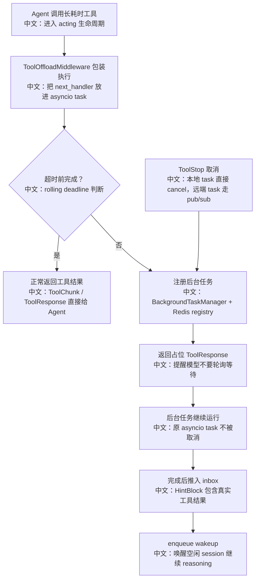

# 后台工具 Offload 与 ToolStop

> 面试定位：这是长耗时工具调用的工程化方案。重点不是“开一个后台 task”，而是超时后不中断工具、让 Agent 继续推理、完成后通过 inbox+wakeup 回灌结果，并支持跨进程取消。

---

## 1. 结论先行

AgentScope 的 `ToolOffloadMiddleware` 会给工具执行设置超时时间。工具在超时前完成，就正常返回；如果超时，它不会取消底层 asyncio task，而是把 task 注册进 `BackgroundTaskManager`，立刻给 Agent 返回一个 synthetic `ToolResponse`，告诉模型该工具已在后台运行。后台工具完成后，结果会以 `HintBlock` 形式推入 session inbox，并通过 wakeup 触发下一轮运行。`ToolStop` 则允许模型取消后台任务，支持本地取消和跨 worker 广播取消。

---

## 2. 产品流程



---

## 3. 源码入口

| 层级 | 文件 | 关键点 |
|---|---|---|
| Offload 中间件 | `src/agentscope/app/middleware/_tool_offload_middleware.py` | 工具超时后后台运行，返回 synthetic ToolResponse，完成后 inbox+wakeup |
| 后台任务管理 | `src/agentscope/app/_manager/_background_task_manager.py` | 本地 task 缓存、Redis registry、ToolStop、关闭时清理 |
| 取消分发 | `src/agentscope/app/_manager/_cancel_dispatcher.py` | 监听 session cancel 和 task cancel channel |
| 消息总线 | `src/agentscope/app/message_bus/_base.py`、`src/agentscope/app/message_bus/_keys.py` | `registry_*`、`task_cancel_channel`、`bg_tasks` |
| Inbox | `src/agentscope/app/middleware/_inbox_middleware.py` | 下一轮 reasoning 前把 inbox 事件注入上下文 |
| Wakeup | `src/agentscope/app/_bus_ops.py`、`src/agentscope/app/_manager/_wakeup_dispatcher.py` | 后台结果完成后触发 session run |
| 测试 | `tests/tool_offload_middleware_test.py`、`tests/service_cancel_dispatcher_test.py` | 覆盖 offload、结果回灌、取消 |

---

## 4. Offload 关键步骤

```text
1. 包装工具执行
中文：创建 drain_task，把 next_handler 的输出放进 asyncio.Queue。

2. 超时前消费 queue
中文：如果在 timeout_secs 内看到 ToolResponse，就正常返回。

3. 超时后不取消 drain_task
中文：这是核心。工具继续执行，Agent 不被卡住。

4. 注册后台任务
中文：BackgroundTaskManager 写入本地 tasks 和全局 registry。

5. 返回 synthetic ToolResponse
中文：告诉模型工具正在后台跑，不要 sleep、poll、等待。

6. watcher 等待完成
中文：完成后取真实 ToolResponse，包装成 HintBlock。

7. inbox + wakeup
中文：把 HintBlock 推入 session inbox，再 enqueue_run_trigger 唤醒运行。
```

---

## 5. 为什么要返回 synthetic ToolResponse

如果工具超时后什么都不返回，Agent 会一直等；如果直接取消工具，长任务的工作会丢失。AgentScope 选择：

```text
对 Agent
  -> 立刻返回一个成功的占位工具结果，让 reasoning 继续或结束。

对工具
  -> 原任务继续运行。

对后续结果
  -> 完成后通过 HintBlock 注入上下文。
```

占位文本里明确告诉模型：

```text
不要轮询。
不要 sleep。
如果没有其他任务，就直接结束本轮。
完成后系统会自动通知。
```

中文说明：这是对 LLM 行为的工程约束，避免模型为了等后台任务而浪费 token 或反复调用等待工具。

---

## 6. ToolStop 的取消设计

`ToolStop` 是一个普通工具，但权限上总是允许调用。它有三条路径：

```text
Path 1：本地任务存在，且 session_id 匹配
  -> 直接 local_task.asyncio_task.cancel()

Path 2：全局 registry 中存在该 task_id
  -> publish 到 task_cancel_channel
  -> 拥有该任务的 worker 收到后取消

Path 3：找不到任务
  -> 返回 TaskNotFoundError
```

关键安全点：

```text
ToolStop 按 session_id 查询 bg_tasks registry。
中文：即使 task_id 泄漏或被猜到，也不能取消其他 session 的任务。
```

---

## 7. 分布式一致性亮点

后台任务有两个存储面：

```text
本地内存 tasks
中文：保存 asyncio.Task 引用，只有 owning worker 能直接 cancel。

MessageBus registry
中文：跨进程可见的任务目录，记录 task_id、tool_name、agent_id、started_at。
```

为什么两者都需要？

```text
只用本地内存
  -> 其他 worker 不知道任务存在，ToolStop 跨进程无能为力。

只用 Redis registry
  -> 无法直接 cancel asyncio.Task，因为 task handle 在本地进程。

组合使用
  -> registry 用来发现和广播，local cache 用来执行真正取消。
```

---

## 8. 面试亮点

### 一句话回答

AgentScope 用 `ToolOffloadMiddleware` 把超时工具转成后台任务，Agent 立即收到占位结果继续推理，真实结果完成后通过 inbox+wakeup 回灌；同时用 `BackgroundTaskManager` 和 `ToolStop` 支持本地与跨进程取消。

### 3 分钟讲解版

```text
长耗时工具如果同步等待，会阻塞 Agent；如果超时直接取消，又会丢失已经执行的工作。AgentScope 的方案是在 acting 生命周期里包一层 ToolOffloadMiddleware。它把工具执行放到 asyncio task 和 queue 中，超时前完成就正常返回；超时后不取消 task，而是注册到 BackgroundTaskManager，并返回一个 synthetic ToolResponse 告诉模型工具在后台运行、不要轮询。后台任务完成后，结果被包装成 HintBlock 推入 session inbox，并 enqueue wakeup，让空闲会话自动继续运行。取消则通过 ToolStop 实现：本 worker 有 task handle 就直接 cancel，否则查 Redis registry 后发 task_cancel_channel 广播，由 owning worker 取消。
```

### 高频追问

| 追问 | 回答方向 |
|---|---|
| 为什么超时后不取消工具？ | 长任务可能已有副作用或接近完成，取消会浪费工作；offload 让 Agent 不阻塞。 |
| 后台结果怎么回到 Agent？ | 完成后写入 session inbox，并 enqueue wakeup，下一轮 reasoning 由 InboxMiddleware 注入。 |
| 为什么不让模型自己轮询？ | 轮询浪费 token 和工具资源，且容易陷入等待循环；系统完成后自动通知更稳定。 |
| 跨进程怎么取消后台任务？ | Redis registry 发现任务，pub/sub task_cancel_channel 广播，拥有 task handle 的 worker 取消。 |
| 为什么 state-injected 工具不 offload？ | 它拿到 live agent.state，后台并发执行可能产生状态竞争。 |

### 对比题

| 对比 | AgentScope 设计 |
|---|---|
| 同步等待 vs 后台 offload | offload 避免长工具阻塞 Agent 主循环。 |
| 超时取消 vs 超时继续 | 继续执行保留长任务结果，取消只用于用户主动 ToolStop 或 session cancel。 |
| 本地 task map vs 全局 registry | 本地 map 可 cancel，registry 可跨进程发现。 |
| 直接回调 Agent vs inbox+wakeup | inbox+wakeup 复用消息总线，适合分布式和进程恢复。 |

---

## 9. 测试证据

相关测试：

```text
tests/tool_offload_middleware_test.py
tests/service_cancel_dispatcher_test.py
tests/in_memory_message_bus_test.py
tests/service_inbox_middleware_test.py
tests/service_wakeup_dispatcher_test.py
```

测试覆盖重点：

```text
1. 工具超时后产生 offload 占位响应。
2. 后台工具完成后通过 inbox/wakeup 回到 session。
3. MessageBus registry 和 task_cancel pub/sub。
4. CancelDispatcher 对 session cancel 和 task cancel 的处理。
```

建议后续补测：

```text
1. state-injected 工具绕过 offload 的显式测试。
2. ToolStop 不能跨 session 取消任务的安全测试。
3. 后台任务失败时不投递 HintBlock 的测试。
```

