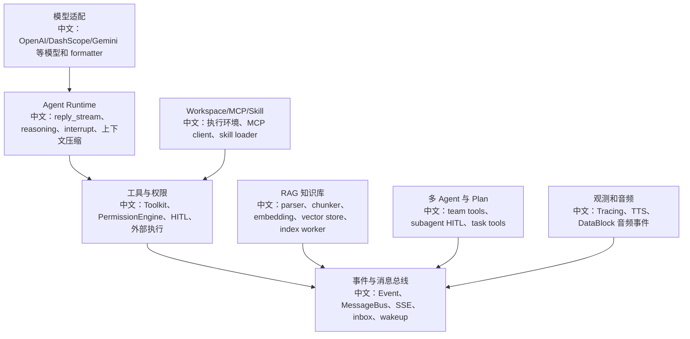

# 测试体系与回归用例地图

> 面试定位：如果前面的文档讲“系统怎么设计”，这一份讲“怎么证明它没有坏”。AgentScope 的测试覆盖很适合拿来讲工程质量：模型适配、formatter、多模态、RAG、权限、HITL、多 Agent、MessageBus、Schedule、Workspace、Tracing、TTS 都有对应回归测试入口。

---

## 1. 结论先行

AgentScope 的测试不是只测工具函数，而是按 Agent 产品能力分层覆盖：

```text
模型层
  -> provider chat / embedding / TTS / formatter

Agent Runtime 层
  -> reasoning、streaming、interrupt、context compression、middleware

工具与权限层
  -> toolkit、permission engine、HITL、external execution

服务层
  -> ChatService、MessageBus、Session、KnowledgeBase、Schedule、Wakeup

产品能力层
  -> RAG、多 Agent、Workspace/MCP/Skill、Tracing、TTS
```

中文说明：这套测试结构本质上是面试里回答“你如何保证 Agent 系统可靠”的证据地图。

---

## 2. 回归地图



---

## 3. 模型与 Formatter

代表测试：

```text
tests/model_openai_chat_test.py
tests/model_openai_response_test.py
tests/model_dashscope_test.py
tests/model_gemini_test.py
tests/model_deepseek_test.py
tests/model_moonshot_test.py
tests/model_ollama_test.py
tests/model_anthropic_test.py
tests/model_xai_test.py
tests/model_count_tokens_test.py

tests/formatter_openai_chat_test.py
tests/formatter_openai_response_test.py
tests/formatter_dashscope_test.py
tests/formatter_gemini_test.py
tests/formatter_deepseek_test.py
tests/formatter_moonshot_test.py
tests/formatter_ollama_test.py
tests/formatter_anthropic_test.py
tests/formatter_xai_test.py
```

面试亮点：

```text
多 provider Agent 框架最容易坏在消息格式转换。
中文：同一个 Msg / ContentBlock 要被转换成不同厂商 API 的请求格式，formatter 测试是防止适配层回归的核心。
```

---

## 4. Agent Runtime 与上下文

代表测试：

```text
tests/agent_basic_test.py
tests/agent_interrupt_test.py
tests/compress_context_test.py
tests/compress_tool_result_test.py
tests/middleware_test.py
tests/middleware_budget_test.py
tests/middleware_background_acting_test.py
tests/model_response_test.py
```

覆盖点：

```text
1. streaming / non-streaming reply。
2. reasoning block 和 text block 的事件输出。
3. interrupt 对运行中 reply_stream 的影响。
4. 上下文压缩和工具结果 offload。
5. token budget 和 middleware 生命周期。
```

面试亮点：

```text
Agent Runtime 的测试不只断言最终文本，还要断言事件流、状态恢复、取消和压缩行为。
```

---

## 5. 权限、HITL 和工具

代表测试：

```text
tests/permission_engine_test.py
tests/permission_mode_test.py
tests/permission_bash_parser_test.py
tests/hitl_user_confirmation_test.py
tests/hitl_external_execution_test.py
tests/hitl_mixed_interrupt.py
tests/toolkit_test.py
tests/toolkit_task_test.py
tests/toolkit_skill_test.py
tests/task_tool_test.py
tests/tool_middleware_test.py
```

覆盖点：

```text
1. PermissionEngine allow / deny / ask。
2. 用户确认后如何继续执行。
3. external execution 如何提交外部结果。
4. HITL 中断和混合场景。
5. Toolkit 工具注册、调用、任务工具。
```

面试亮点：

```text
Agent 安全不是只靠 prompt，而是靠 tool call 进入执行前的权限引擎和 HITL 事件协议。
```

---

## 6. MessageBus、服务层和恢复

代表测试：

```text
tests/in_memory_message_bus_test.py
tests/service_message_bus_test.py
tests/service_agent_interrupt_test.py
tests/service_cancel_dispatcher_test.py
tests/service_inbox_middleware_test.py
tests/service_wakeup_dispatcher_test.py
tests/service_scheduler_test.py
tests/storage_redis_test.py
tests/app_lifespan_dedicated_test.py
```

覆盖点：

```text
1. pub/sub、queue、log、registry、lock。
2. interrupt / cancel dispatcher。
3. inbox 注入和 wakeup 触发。
4. schedule 自动运行。
5. app lifespan 启停 manager / worker。
```

面试亮点：

```text
事件流系统必须同时支持 live 推送和 replay 恢复，所以测试要覆盖 MessageBus 的多种模式，而不是只测一个 publish。
```

---

## 7. RAG 和知识库

代表测试：

```text
tests/rag_parser_test.py
tests/rag_chunker_approx_token_test.py
tests/rag_vdb_qdrant_test.py
tests/rag_vdb_mongodb_test.py
tests/rag_vdb_milvus_lite_test.py
tests/middleware_rag_test.py
tests/service_knowledge_base_upload_test.py
tests/service_enqueue_index_task_test.py
tests/service_index_task_consumer_test.py
tests/index_worker_lease_test.py
tests/storage_redis_knowledge_base_test.py
tests/blob_store_s3_test.py
```

覆盖点：

```text
1. 文档解析。
2. token 近似分块。
3. 向量库适配。
4. RAGMiddleware 检索注入。
5. 上传后异步索引任务。
6. index worker lease。
7. blob store 和 Redis 知识库记录。
```

面试亮点：

```text
RAG 的稳定性不只取决于检索算法，还取决于上传、索引、worker lease、状态轮询、向量库写入这些工程链路。
```

---

## 8. 多 Agent、Plan、Workspace、MCP、Skill

代表测试：

```text
tests/service_team_tools_test.py
tests/service_subagent_hitl_projector_test.py
tests/service_toolkit_test.py
tests/task_tool_test.py

tests/workspace_local_test.py
tests/workspace_docker_test.py
tests/workspace_e2b_test.py
tests/workspace_k8s_test.py
tests/workspace_daytona_test.py
tests/workspace_opensandbox_test.py
tests/workspace_manager_daytona_test.py

tests/mcp_sse_client_test.py
tests/mcp_streamable_http_client_test.py
tests/skill_loader_test.py
```

覆盖点：

```text
1. team tools 的创建、邀请、发言、删除。
2. 子智能体 HITL 投影到 leader。
3. workspace offload、文件、工具执行。
4. MCP SSE / streamable HTTP client。
5. skill loader 和 toolkit skill。
```

面试亮点：

```text
多 Agent 不是内存里 new 几个对象，而是涉及团队关系、独立 session、消息投递、HITL 投影和 UI 刷新。
```

---

## 9. Tracing、TTS、长期记忆

代表测试：

```text
tests/tracing_test.py
tests/tts_middleware_test.py
tests/tts_openai_test.py
tests/tts_dashscope_test.py
tests/reme_middleware_test.py
tests/mem0_middleware_test.py
tests/mem0_agentscope_adapter_test.py
tests/middleware_filesystem_memory_test.py
```

覆盖点：

```text
1. OpenTelemetry span 属性。
2. Agent / LLM / Tool span。
3. TTS DataBlock 音频事件。
4. OpenAI / DashScope TTS。
5. ReMe / Mem0 / filesystem memory 的检索和写回。
```

面试亮点：

```text
可观测性和长期记忆不是 demo 功能，而是有单独回归测试保护的运行时能力。
```

---

## 10. 面试沉淀

### 一句话回答

AgentScope 的测试体系按模型适配、Agent Runtime、工具权限、MessageBus、RAG、多 Agent、Workspace、Tracing、TTS 分层覆盖，能证明它不是只做 demo，而是在验证一个可恢复、可中断、可观测的 Agent 运行系统。

### 3 分钟讲解版

```text
我看这个项目测试时，会先按能力分层，而不是只看覆盖率数字。底层有 model 和 formatter 测试，保证不同 provider 的消息格式和 streaming/reasoning 行为不回归；中间有 Agent Runtime、middleware、interrupt、compress_context 测试，保证推理循环和长上下文可靠；再往上有 permission、HITL、external execution、toolkit 测试，保证工具执行安全；服务层有 MessageBus、inbox、wakeup、scheduler、cancel dispatcher 测试，保证异步运行和恢复；产品能力上还有 RAG、multi-agent、workspace、MCP、skill、TTS、Tracing、memory 测试。这个测试地图本身就体现了 Agent 工程化的复杂度。
```

### 高频追问

| 追问 | 回答方向 |
|---|---|
| 如何测试 Agent 不是只返回文本？ | 断言事件流、ToolCall、ToolResult、HITL、ReplyStart/End，而不是只比对最终字符串。 |
| RAG 回归应该测什么？ | parser、chunker、embedding、vector store、index worker、RAGMiddleware 全链路。 |
| 多 Agent 怎么测？ | 测 team tools、独立 session、消息投递、subagent HITL projector。 |
| 事件系统怎么测？ | MessageBus 的 pub/sub、queue、log、registry、lock 都要测。 |
| 观测怎么测？ | `tests/tracing_test.py` 断言 span 属性、conversation_id、reply_id、tool span。 |

### 项目表达

```text
我会把 AgentScope 的测试体系当成一个回归地图：底层测模型和格式化，中层测 Agent runtime 和 middleware，上层测 ChatService、MessageBus、RAG、Team、Workspace、Schedule、Tracing 和 TTS。这样每个产品能力都有对应的源码和测试证据，面试时能从“系统怎么设计”进一步讲到“怎么证明它可靠”。
```

---

## 11. 建议后续补齐的测试文档

```text
1. 为每个 P0 专题补“测试用例阅读指南”。
2. 把 tests 文件映射到 docs/API源码驱动学习/topics/ 对应专题。
3. 增加前端组件测试地图，当前后端测试证据更完整，前端测试证据相对少。
4. 增加接口级 smoke test 地图，用于覆盖 Router 层 status code 和 schema。
```

