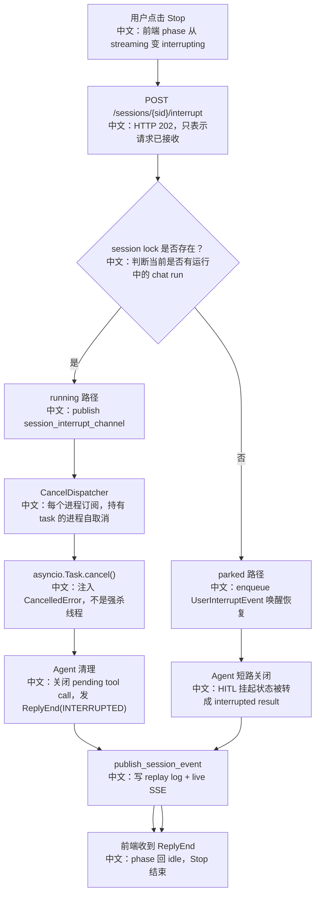

# 优雅终止会话与协作式取消

> 面试定位：这是一个非常值得展开的系统设计点。它连接了 HTTP 202、前端状态机、分布式任务定位、asyncio 协作式取消、Agent 清理逻辑、事件流收尾、幂等 no-op 和持久化一致性。

---

## 1. 先讲清楚“终止”的三种语义

在 AgentScope 里，“停一下”不是一个动作，而是三种不同语义：

| 语义 | 用户视角 | 系统动作 | 是否删除数据 |
|---|---|---|---|
| Interrupt 中断回复 | 停止当前回答 | 结束当前 reply，保留 session 和历史 | 否 |
| Cancel 取消运行 | 删除/关闭 session 前停止本地工作 | 取消 chat run 和后台任务 | 视调用方而定 |
| Delete 删除会话 | 删除整个会话 | 先取消运行，再清理存储和 bus 状态 | 是 |

中文说明：面试时要避免把 interrupt、cancel、delete 混在一起。Interrupt 是产品上的“Stop 按钮”；Cancel 更偏运行时清理；Delete 是资源生命周期结束。

---

## 2. 为什么不能简单 kill

Agent 运行不像普通 HTTP 请求：

```text
1. 运行可能在另一个进程。
2. 当前可能正在模型流式输出。
3. 当前可能正在工具调用。
4. 当前可能停在 HITL 等人确认。
5. 已经产生的部分消息需要落盘。
6. 前端需要一个明确的 ReplyEndEvent 收尾。
```

如果直接强杀，会出现：

```text
消息半截丢失
工具调用状态悬挂
前端一直显示 streaming
session lock 未释放
下一次运行加载旧状态
后台工具不知道是否还在跑
```

所以 AgentScope 选择协作式取消：发出取消信号，让拥有运行态的 task 自己在安全点清理。

---

## 3. 优雅终止全流程



---

## 4. HTTP 202 Accepted 的知识点

`POST /sessions/{sid}/interrupt` 返回 `202 Accepted`，含义是：

```text
服务器已经接收中断请求。
中文：但中断不是同步完成的，真正完成要等事件流里的 ReplyEndEvent。
```

为什么不是 200？

```text
因为 HTTP 请求处理进程未必就是运行 Agent 的进程。
中文：它可能只是发布一个 interrupt 信号，真正取消发生在另一个 worker。
```

为什么不是 204？

```text
返回 session_id 能让前端/调试工具确认目标。
中文：但主体信息很轻，不代表完整结果。
```

面试表达：

```text
这个接口符合异步控制命令的语义：HTTP 层只承诺“请求已受理”，业务完成状态由 SSE 事件流驱动。
```

---

## 5. 幂等和 no-op

Stop 按钮很容易被重复点击，或者前端状态和后端状态有短暂不同步。因此中断必须幂等。

AgentScope 的幂等体现在：

```text
running 时重复 interrupt
  -> 多次 publish interrupt signal
  -> task 已 done 时 CancelDispatcher 不再 cancel

parked 时重复 interrupt
  -> 多次 enqueue UserInterruptEvent
  -> agent 最终收敛到同一个 interrupted 结束态

idle 时 interrupt
  -> agent 层静默 no-op
  -> 不报错，不污染状态
```

中文说明：对于控制类 API，幂等比“严格报错”更适合产品体验。用户点 Stop 的目标是“不要继续”，不是关心后端此刻是否已经停了。

---

## 6. 协作式取消：asyncio.Task.cancel()

`task.cancel()` 的本质不是马上杀死执行，而是在协程下一个 await 点抛出 `CancelledError`。

优点：

```text
1. finally 块能执行。
2. async with 能退出。
3. session lock 能释放。
4. 已生成的 reply_msg 能落盘。
5. pending tool call 能被标记为 interrupted。
```

风险：

```text
1. 如果代码长期不 await，取消不会及时生效。
2. 如果吞掉 CancelledError，可能导致任务无法结束。
3. 如果 finally 里也被取消，状态可能未落盘。
```

AgentScope 对风险的处理：

```text
ChatService._run_impl finally
  -> 创建 _persist task
  -> asyncio.shield(persist_task)
  -> 被取消时仍 await persist_task 完成
  -> 再传播 CancelledError
```

中文说明：这就是“取消可以打断运行，但不能打断关键持久化”。

---

## 7. running 与 parked 为什么分两路

### running 路径

```text
session lock 存在
  -> 说明某个 worker 正在跑 ChatService.run
  -> 发布 session_interrupt_channel
  -> 持有 task 的 worker cancel
```

中文说明：运行中的 Agent 需要取消真实 task。

### parked 路径

```text
session lock 不存在
  -> 可能 idle，也可能停在 HITL
  -> 无 task 可 cancel
  -> 投递 UserInterruptEvent
  -> wakeup 后让 Agent 自己判断是否有 awaiting tool call
```

中文说明：HITL parked 状态没有运行中的 task，但有未完成的 reply，所以要通过事件恢复并关闭。

---

## 8. 前端状态机

前端不是等 HTTP 返回来结束 Stop，而是等 SSE：

```text
click Stop
  -> phase: streaming -> interrupting
  -> Stop 按钮 disabled，防止重复点击
  -> POST /interrupt
  -> 等 ReplyEndEvent
  -> phase: idle
```

还有 10 秒兜底：

```text
如果 ReplyEndEvent 丢失
  -> timer 把 phase 从 interrupting 拉回 idle
```

中文说明：这是产品体验上的“最终可恢复”。后端事件是主路径，timer 是防 UI 卡死的保护。

---

## 9. 面试亮点

### 一句话回答

AgentScope 的优雅终止不是强杀任务，而是用 `POST /interrupt` 返回 202，running 时跨进程广播让持有 worker 执行 `task.cancel()`，parked 时投递 `UserInterruptEvent` 唤醒关闭，最终都由 Agent 清理 pending tool call、发 `ReplyEnd(INTERRUPTED)`，前端通过 SSE 收尾。

### 3 分钟讲解版

```text
我会把 Stop 设计拆成 HTTP 控制命令、运行态定位、协作式取消和事件收尾四层。HTTP 层返回 202，因为中断是异步生效的。后端先看 session lock：如果 lock 存在，说明有 worker 正在跑，就往 session_interrupt_channel 发广播，所有进程都收到，但只有 ChatRunRegistry 里持有该 session task 的进程会 task.cancel。asyncio 的 cancel 会在 await 点抛 CancelledError，Agent 在清理路径里把未完成工具调用标成 INTERRUPTED，并发 ReplyEndEvent。如果 lock 不存在，可能是 HITL parked，没有 task 可取消，就投递 UserInterruptEvent 走 wakeup，让 Agent 恢复后短路关闭。前端不靠 HTTP 返回判断结束，而是等 SSE 的 ReplyEndEvent 把 phase 改回 idle，同时有 10 秒兜底避免丢帧卡住。
```

### 高频追问

| 追问 | 回答方向 |
|---|---|
| 为什么返回 202？ | 中断是异步控制命令，真正完成由 SSE ReplyEndEvent 表示。 |
| 为什么不直接 cancel 当前请求？ | Agent run 不在 POST 请求里，可能在另一个 worker。 |
| HITL 挂起时怎么中断？ | 没有运行 task，就投 UserInterruptEvent 走 wakeup 恢复后关闭。 |
| task.cancel 会不会丢状态？ | 关键持久化用 `asyncio.shield`，锁释放前落盘。 |
| 重复点 Stop 会怎样？ | 幂等，已结束任务 no-op，idle 静默无副作用。 |
| 后台工具会被 interrupt 取消吗？ | Interrupt 只取消 chat-run task，不取消后台任务；后台任务由 ToolStop 或 session cancel 管。 |

### 对比题

| 对比 | 重点 |
|---|---|
| Interrupt vs Delete | Interrupt 结束当前 reply；Delete 清理整个 session。 |
| task.cancel vs kill process | cancel 是协作式，finally 能跑；kill 容易丢状态。 |
| 202 + SSE vs 同步返回 | 适合跨进程异步运行，HTTP 不阻塞。 |
| running cancel vs parked resume | running 有 task；parked 没 task 但有未完成 reply。 |

---

## 10. 知识延伸

### 10.1 优雅关闭的一般原则

```text
1. 停止接收新工作。
2. 通知正在执行的工作尽快停。
3. 允许清理逻辑执行。
4. 持久化最后状态。
5. 向调用方发出明确终态。
6. 对重复请求保持幂等。
```

AgentScope 的 interrupt 正好对应这些原则。

### 10.2 分布式系统里的控制命令

控制命令常见设计：

```text
HTTP 接收命令
  -> 写队列/发广播
  -> 持有者执行
  -> 状态事件回流
```

中文说明：不要假设接收命令的节点就是执行节点。AgentScope 通过 MessageBus 让持有者自选择。

### 10.3 前端体验设计

Stop 的好体验不只是能停，还包括：

```text
1. 点击后立即反馈 interrupting。
2. 禁止重复点击。
3. 后端成功结束后恢复 idle。
4. 事件丢失时有兜底。
5. 历史消息恢复后仍能判断是否 pending。
```

---

## 11. 源码入口

```text
src/agentscope/app/_router/_session.py
中文：POST /sessions/{sid}/interrupt，HTTP 202。

src/agentscope/app/_service/_chat.py
中文：ChatService.interrupt，running/parked 分路。

src/agentscope/app/_manager/_cancel_dispatcher.py
中文：订阅 interrupt channel，找到本地 task cancel。

src/agentscope/app/_manager/_chat_run_registry.py
中文：保存本进程 chat-run asyncio.Task。

src/agentscope/agent/_agent.py
中文：CancelledError 和 UserInterruptEvent 的 Agent 收尾逻辑。

examples/web_ui/frontend/src/hooks/useMessages.ts
中文：前端 phase、interruptTimer、SSE ReplyEnd 收尾。
```

