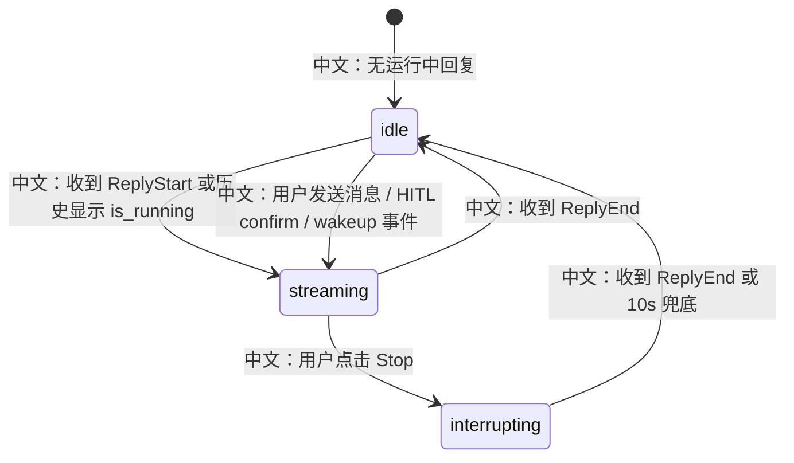

# 前端状态机与产品体验地图

> 面试定位：Agent 产品不是后端 API 的简单包装。Web UI 要把异步 run、SSE、HITL、音频、团队投影、任务面板、知识库轮询这些后端机制翻译成用户能理解的状态。

---

## 1. 前端状态不是装饰，而是协议的一部分

AgentScope Web UI 的关键职责：

```text
1. 触发异步运行。
2. 接收 SSE 事件。
3. 合并历史消息和实时事件。
4. 展示 HITL 确认卡。
5. 展示 Plan / MCP / Skill / Permission / Knowledge 面板。
6. 处理 interrupting、loading、error、polling、audio playback。
```

中文说明：后端提供事件和状态，前端负责把它们变成“用户能操作的产品流程”。

---

## 2. 聊天主状态机



`useMessages.ts` 里的核心状态：

```text
msgs
中文：当前会话消息列表。

phase
中文：idle / streaming / interrupting。

currentReplyRef
中文：当前正在接收事件的 assistant message。

subagentHitl
中文：投影到 leader UI 的 worker 确认卡。

audioManager
中文：音频 DataBlock 播放状态。
```

---

## 3. 历史 + 实时合并

页面加载时：

```text
GET /sessions/{sid}/messages
  -> persisted messages
  -> is_running

GET /sessions/{sid}/stream
  -> replay events
  -> live events
```

中文说明：历史消息提供稳定基线，SSE 提供实时增量。两者结合才能支持刷新恢复。

---

## 4. HITL 产品体验

HITL 的体验不是“后端暂停一下”这么简单：

```text
模型产生 tool_call
  -> PermissionEngine 返回 ASK
  -> Agent 发 RequireUserConfirmEvent
  -> 前端把 tool_call 渲染成确认卡
  -> 用户确认/拒绝
  -> POST /chat/ 发送 UserConfirmResultEvent
  -> 后端继续同一个 reply
```

多 Agent 场景更复杂：

```text
worker session 产生 HITL
  -> SubagentHitlProjector 投影到 leader session
  -> leader UI 显示 subagentHitl card
  -> 用户在 leader 视图确认
  -> 后端路由到 worker session 继续执行
```

面试点：

```text
HITL 是产品状态，不只是后端事件。没有前端投影，用户不知道谁在等确认。
```

---

## 5. 面板状态

聊天页右侧面板包括：

```text
Plan
中文：展示 TaskContext，解释 Agent 的计划和任务状态。

MCP
中文：配置 workspace 中的 MCP server。

Skill
中文：配置 workspace skill。

Permission
中文：展示/调整权限上下文。

Knowledge
中文：选择知识库和 RAG 参数。
```

这些面板的价值：

```text
把 Agent 的内部状态外显。
中文：用户不只看到最终回答，还能看到计划、权限、知识和工具环境。
```

---

## 6. 音频状态

TTS / omni 音频走 DataBlock：

```text
DATA_BLOCK_START
  -> 创建音频 session

DATA_BLOCK_DELTA
  -> append base64 chunk

DATA_BLOCK_END
  -> ready，可回放
```

前端体验点：

```text
1. 新回复开始时 stopAllPlayback，避免音频重叠。
2. wav 可以实时播放。
3. 非 wav 缓冲结束后播放。
4. session 切换时 disposeAll 释放资源。
```

---

## 7. 知识延伸：前端如何服务异步系统

异步 Agent 产品常见前端策略：

```text
Optimistic update
中文：用户消息先显示，再触发后端 run。

Phase state
中文：用明确状态控制按钮和输入框。

Event reducer
中文：把后端事件增量应用到当前消息。

Reconnect recovery
中文：先拉历史，再接事件。

Timeout fallback
中文：防止网络丢帧导致 UI 永久卡住。

Projection UI
中文：把跨 session 状态投影到当前用户视图。
```

---

## 8. 面试沉淀

### 一句话回答

AgentScope Web UI 用 `useMessages` 把历史消息、SSE 事件、HITL 确认、interrupt 状态、subagent 投影和音频 DataBlock 合并成一个可恢复的聊天状态机。

### 3 分钟讲解版

```text
前端不是简单调用 POST /chat 等返回。它先乐观展示用户消息，然后触发后端异步 run，真正的 assistant 回复通过 SSE 事件增量构建。页面加载时先拉历史消息，再打开 stream，所以刷新后可以恢复。phase 管理 idle、streaming、interrupting，Stop 后不靠 HTTP 返回，而是等 ReplyEndEvent，同时有 10 秒兜底。HITL 时，RequireUserConfirmEvent 会渲染成确认卡；多 Agent 的 worker HITL 还会被投影到 leader UI。TTS 音频则通过 DataBlockStart/Delta/End 交给 StreamingAudioManager。整体上，前端状态机是 Agent 异步协议的一部分。
```

### 高频追问

| 追问 | 回答方向 |
|---|---|
| 为什么要先拉 messages 再接 stream？ | 历史提供稳定基线，stream 提供实时增量和运行中 replay。 |
| Stop 后为什么不是 HTTP 返回就 idle？ | 真正终止由后端 ReplyEndEvent 表示。 |
| 多 Agent HITL 怎么显示？ | worker pending 被 projector 投影成 leader session 的 CustomEvent。 |
| 音频为什么交给单独 manager？ | DataBlock 是消息内容，播放状态是 UI 资源状态，二者要分离。 |
| 前端如何避免卡死？ | phase timeout、error state、refetch、polling。 |

