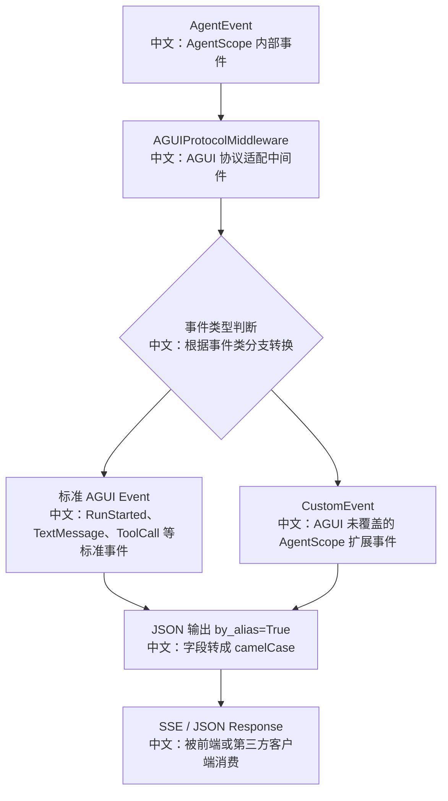

# AGUI 协议适配与事件转换

> 适合面试表达的关键词：协议适配、事件标准化、SSE 兼容、CustomEvent 扩展、camelCase 输出、工具结果缓冲、HITL 事件透传。

---

## 1. 结论先行

AgentScope 内部事件体系很丰富，包含文本、思考、工具调用、工具结果、数据块、HITL、外部执行等事件；AGUI 适配层的价值，是把这些内部 `AgentEvent` 转换成外部 UI 协议可以理解的 AGUI 事件。

这不是简单字段改名，而是一个“协议边界层”：

```text
AgentScope 内部事件
  ↓
AGUIProtocolMiddleware
  中文：协议适配中间件，把内部事件转换成 AGUI 标准事件或 CustomEvent
  ↓
model_dump(..., by_alias=True)
  中文：输出 JSON，并使用 AGUI 期望的 camelCase 字段名
  ↓
前端 / 第三方 AGUI 客户端消费
```

面试里可以把它讲成：**内部事件模型保持领域表达，外部协议适配保持生态兼容，中间用 Middleware 隔离变化。**

---

## 2. 源码入口

| 模块 | 源码路径 | 重点 |
|---|---|---|
| AGUI 适配中间件 | `src/agentscope/app/middleware/_protocol/_agui.py` | `_to_agui_event` 事件映射 |
| 协议中间件基类 | `src/agentscope/app/middleware/_protocol/` | 负责协议转换挂载点 |
| AGUI 协议测试 | `tests/agui_protocol_test.py` | JSON、SSE、生命周期、工具、HITL、camelCase 覆盖 |

---

## 3. 总体流程



---

## 4. 关键事件映射

| AgentScope 事件 | AGUI 输出 | 中文说明 |
|---|---|---|
| `ReplyStartEvent` | `RunStartedEvent` | 一次 reply/run 开始，使用 `session_id` 作为 thread，`reply_id` 作为 run |
| `ReplyEndEvent` | `RunFinishedEvent` | 一次 run 正常结束 |
| `ExceedMaxItersEvent` | `RunErrorEvent` | Agent 超过最大迭代次数，转成协议层错误 |
| `ModelCallStartEvent` | `StepStartedEvent` | 模型调用开始，保存当前模型名 |
| `ModelCallEndEvent` | `StepFinishedEvent` | 模型调用结束，复用上一次模型名 |
| `TextBlockStart/Delta/End` | `TextMessageStart/Content/End` | 文本流式输出 |
| `ThinkingBlockStart/Delta/End` | `ReasoningMessageStart/Content/End` | 思考过程流式输出 |
| `ToolCallStart/Delta/End` | `ToolCallStart/ToolCallArgs/ToolCallEnd` | 工具调用参数流式输出 |
| `ToolResultEnd` | `ToolCallResultEvent` | 工具结果最终汇总输出 |
| `DataBlockStart/Delta/End` | `CustomEvent` | AGUI 标准事件暂未覆盖，保留扩展 |
| HITL / 外部执行事件 | `CustomEvent` | 保留人类确认和外部执行语义 |
| 未知事件 | `CustomEvent(name="unknown")` | 兜底，避免协议转换直接崩掉 |

---

## 5. 面试亮点

### 5.1 协议适配层隔离内部模型和外部生态

内部 `AgentEvent` 可以继续服务 AgentScope 自己的产品逻辑，例如多智能体投影、TTS 音频块、HITL、外部工具执行。AGUI 层只负责对外兼容，不把外部协议侵入核心 Runtime。

面试表达：

```text
我会把 AGUI 看成一个 anti-corruption layer。
内部事件模型为 Agent 运行态服务，外部 AGUI 模型为 UI 协议兼容服务。
这样未来换协议、加协议，主要新增 Middleware，不需要重写 Agent Runtime。
```

### 5.2 标准事件 + CustomEvent 的双轨设计

AGUI 标准事件能覆盖生命周期、文本、思考、工具调用；但 AgentScope 有自己的扩展能力，例如数据块、TTS、HITL、外部执行。这些能力没有强行丢弃，而是通过 `CustomEvent` 保留下来。

这体现了一个重要权衡：

```text
标准协议负责互操作。
CustomEvent 负责保留产品差异化能力。
```

### 5.3 工具结果需要缓冲

`ToolResultTextDeltaEvent` 是流式增量；最终的 `ToolCallResultEvent` 需要完整 content。因此中间件维护 `_tool_result_buffers`，按 `tool_call_id` 聚合文本片段。

这类点很适合面试追问：

```text
为什么工具参数可以逐段转发，但工具结果结束时还要聚合？

因为协议消费者通常需要一个最终 ToolCallResultEvent 来更新工具调用状态；
如果只转发增量，外部客户端很难判断最终结果和工具调用之间的稳定关联。
```

### 5.4 camelCase 输出不是小细节

源码里使用：

```text
model_dump(mode="json", exclude_none=True, by_alias=True)
```

中文解释：

```text
mode="json"：输出 JSON 友好的数据。
exclude_none=True：不输出空字段，减少协议噪声。
by_alias=True：使用协议定义的别名，通常是前端更习惯的 camelCase。
```

这个细节说明协议层考虑了跨语言消费者，而不是只服务 Python 内部对象。

---

## 6. 测试证据

`tests/agui_protocol_test.py` 覆盖了这些场景：

| 测试方向 | 说明 |
|---|---|
| 原始 JSON 响应转换 | 确认非 SSE JSON 可以被协议层处理 |
| SSE `data:` 帧转换 | 确认流式协议兼容 |
| CRLF 兼容 | 覆盖不同换行格式 |
| FastAPI SSE 响应 | 贴近真实 Web 服务输出 |
| 生命周期事件 | `RunStarted` / `RunFinished` |
| Step 事件 | 模型调用开始和结束 |
| 文本 / 思考事件 | 文本流和 reasoning 流 |
| 工具调用 / 工具结果 | 工具参数增量、工具结果聚合 |
| DataBlock / Permission | 扩展事件通过 CustomEvent 透传 |
| camelCase | 确认前端协议字段命名 |

---

## 7. 设计权衡

| 方案 | 优点 | 代价 |
|---|---|---|
| 直接让 Agent Runtime 输出 AGUI | 少一层转换 | 内部运行态被外部协议绑定，后续难扩展 |
| 单独 AGUI Middleware | 隔离清晰，可插拔，可测试 | 需要维护事件映射和扩展事件 |
| 不支持 CustomEvent | 协议更纯粹 | AgentScope 自有能力会丢失 |
| 支持 CustomEvent | 保留 HITL、DataBlock、TTS 等能力 | 客户端需要理解扩展事件 |

---

## 8. 面试沉淀

### 一句话回答

AGUI 适配层把 AgentScope 内部丰富的 `AgentEvent` 转成外部 AGUI 标准事件，并用 `CustomEvent` 保留标准协议未覆盖的 HITL、数据块和外部执行能力。

### 3 分钟讲解版

```text
AgentScope 的内部事件不是直接等同于 UI 协议。
内部事件要表达 Agent 运行态，例如 reply 生命周期、模型调用、文本流、thinking、工具调用、工具结果、HITL 和 DataBlock。
AGUIProtocolMiddleware 负责把这些事件转换成 AGUI 客户端能消费的协议事件：
生命周期转 RunStarted/RunFinished，文本转 TextMessage，思考转 ReasoningMessage，工具调用转 ToolCall。
AGUI 标准里没有覆盖的 AgentScope 特有能力，比如 DataBlock、RequireUserConfirm、ExternalExecution，就转成 CustomEvent。
同时输出时使用 by_alias=True，把字段转成前端协议更常见的 camelCase。
所以这个设计的重点不是“字段改名”，而是把内部领域事件和外部协议生态隔离开。
```

### 高频追问

| 追问 | 回答方向 |
|---|---|
| 为什么不直接让 Runtime 输出 AGUI？ | Runtime 应该服务内部领域模型，AGUI 是外部协议，放在 Middleware 更可插拔。 |
| AGUI 不支持的事件怎么办？ | 用 `CustomEvent` 保留语义，避免丢失 HITL、DataBlock 等产品能力。 |
| 工具结果为什么要缓存？ | 增量结果需要聚合成最终 ToolCallResult，才能和工具调用稳定关联。 |
| reasoning 为什么单独映射？ | 前端可以把模型思考过程和最终文本分开展示。 |
| camelCase 有什么意义？ | 协议面向前端和跨语言客户端，不能只按 Python snake_case 输出。 |

### 项目表达

```text
我分析过 AgentScope 的 AGUI 协议适配层。它没有把外部协议侵入 Agent Runtime，而是通过 Middleware 把内部 AgentEvent 转换成 AGUI 标准事件；标准协议覆盖不了的 HITL、DataBlock、外部执行事件用 CustomEvent 扩展。这个设计体现了协议适配层、领域事件和前端生态之间的边界隔离。
```

---

## 9. 后续可深挖

```text
1. 对比 AGUI 协议事件和 AgentScope 原生事件的完整字段差异。
2. 继续分析 ProtocolMiddlewareBase 如何挂载到 FastAPI 响应链路。
3. 设计一个第三方 AGUI 客户端如何消费这些 CustomEvent。
```
