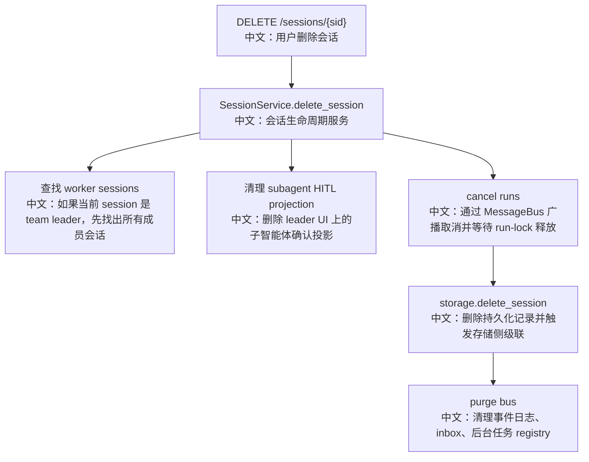

# Session 删除与级联清理

> 适合面试表达的关键词：生命周期边界、级联删除、协作式取消、消息总线清理、Team 生命周期、AgentInvite 差异、幂等删除。

---

## 1. 结论先行

`DELETE /sessions/{sid}` 不是简单删除一条 Session 记录。源码里的删除链路包含三层语义：

```text
先停运行
  中文：通过 MessageBus 广播 cancel，并等待分布式 run-lock 释放

再删持久化记录
  中文：删除 SessionRecord、消息、schedule 索引、必要时触发 team 级联

最后清理瞬态状态
  中文：清理 MessageBus 上的事件日志、inbox、后台任务 registry
```

它真正解决的是：**用户删除一个会话时，不能留下仍在运行的 Agent、孤儿事件流、过期 HITL 投影、team worker 会话或 schedule 反向索引。**

---

## 2. 源码入口

| 模块 | 源码路径 | 重点 |
|---|---|---|
| Session API | `src/agentscope/app/_router/_session.py` | DELETE endpoint 入口 |
| 生命周期服务 | `src/agentscope/app/_service/_session.py` | cancel + delete + bus purge 编排 |
| Redis 存储级联 | `src/agentscope/app/storage/_redis_storage.py` | session/team/agent/schedule 删除规则 |
| Team 成员解析 | `src/agentscope/app/storage/_utils.py` | `_ensure_team_members` |
| 存储测试 | `tests/storage_redis_test.py` | team、schedule、session 级联覆盖 |
| 服务测试 | `tests/service_team_tools_test.py` | AgentInvite、TeamDelete、陈旧邀请清理 |

---

## 3. 删除主流程



---

## 4. 服务层为什么要存在

存储层只应该知道持久化记录；消息总线只应该知道瞬态运行状态。删除一个 Session 同时涉及两边，所以需要 `SessionService` 作为编排层。

源码注释里已经把分层讲得很清楚：

```text
Storage 和 MessageBus 被当成两个不同后端。
Service 是唯一同时触碰两者的组件。
Storage 不 import bus；bus 不 import storage。
```

中文理解：

```text
这是典型的应用服务层职责：
它不负责具体存储实现，也不负责消息总线底层实现；
它负责把“业务生命周期”拆成可执行的跨资源步骤。
```

---

## 5. 三个核心清理点

### 5.1 先取消运行

`cancel_session_run` 的逻辑是：

```text
publish cancel 消息到 session_cancel_channel
  中文：跨进程广播取消命令

轮询 session_lock(session_id)
  中文：检查是否还有 worker 持有运行锁

超时返回 False，但不永久阻塞删除
  中文：删除操作不能被一个可能已崩溃的 worker 卡死
```

面试亮点：

```text
取消是 best-effort + 有界等待。
系统追求“尽量优雅停止”，但不会为了优雅停止牺牲删除操作的可完成性。
```

### 5.2 再删持久化记录

`storage.delete_session` 负责：

```text
1. session 不存在时返回 False。
2. 如果该 session 是 team leader，则先 delete_team。
3. 删除 session key。
4. 从 agent 的 session index 中移除。
5. 删除会话消息列表。
6. 如果来自 schedule，清理 schedule_session_index。
```

中文重点：

```text
Session 是运行态边界，但它可能被 Agent、Team、Schedule 三个资源引用。
删除时必须同时处理这些反向索引，否则列表页和定时任务页会出现陈旧数据。
```

### 5.3 最后清理 MessageBus

`_purge_session_bus` 会清理：

```text
session_events(session_id)
  中文：事件 replay log

inbox(session_id)
  中文：后续 wakeup / 后台结果回灌队列

bg_tasks(session_id)
  中文：后台任务 registry
```

这一步的面试价值很高：

```text
只删数据库记录不够。
Agent 系统里还有事件流、消息队列、后台任务注册表这些“运行态垃圾”。
如果不清理，前端重连、后台唤醒、事件回放都可能看到已经删除的会话。
```

---

## 6. Team 删除和 AgentInvite 差异

Team 生命周期是这条链路里最值得展开的地方。

| 成员来源 | 删除 team 时做什么 | 中文解释 |
|---|---|---|
| `created` | `delete_agent(member.agent_id)` | 由 Team 创建出来的 worker 只属于这个 team，team 解散时 agent 也删除 |
| `invited` | `delete_session(member.session_id)` | 被邀请的已有 Agent 仍属于用户，只删除这次 team-scoped session |
| leader session | 不删除 leader session，只清空 `team_id` | 解散团队不等于删除发起者会话 |

这就是 `AgentCreate` 和 `AgentInvite` 最重要的生命周期差异：

```text
AgentCreate：创建临时 worker，team 解散时 worker agent 可以一起消失。
AgentInvite：借用已有 agent，team 解散时只能删除借用会话，不能删除 agent 本体。
```

面试表达：

```text
多 Agent 不是简单把几个对象放到一个数组里。
它必须建模成员来源，否则删除 team 时会误删用户已有 agent。
```

---

## 7. Leader session 和 worker session 的非对称性

源码里有一个很重要的设计：

```text
删除 leader session：
  中文：会解散整个 team。

直接删除 worker session：
  中文：不会解散整个 team。
```

为什么？

```text
leader session 是 team 的主生命周期边界；
worker session 是 team 的成员运行态。

删除 leader 相当于用户结束团队协作；
删除某个 worker 更像移除/失效一个成员，不应该把整个团队一起删掉。
```

这类非对称规则非常适合面试，因为它体现了产品语义决定系统行为。

---

## 8. Schedule 级联

`delete_schedule` 会：

```text
list_sessions_by_schedule(user_id, schedule_id)
  中文：找出这个定时任务创建过的所有 session

逐个 delete_session
  中文：复用会话删除的 cancel + storage + bus 清理

删除 schedule record 和索引
  中文：清理定时任务本体
```

设计亮点：

```text
更高层资源删除时，不重复实现 session 清理逻辑，而是全部委托到 delete_session。
这样 cancel、bus purge、HITL projection 清理只有一个权威入口。
```

---

## 9. 并发、异常与幂等

| 场景 | 设计 |
|---|---|
| 重复删除同一个 session | storage 返回 False，清理逻辑可重复执行 |
| worker 已经崩溃 | run-lock 有 TTL，cancel 等待有 timeout |
| team 已经不存在但索引残留 | storage.delete_team 会做残留清理 |
| bus 清理和 storage 删除跨后端 | service 编排，步骤幂等化 |
| subagent HITL 投影清理失败 | 记录 warning，不阻塞删除；后续 read reconcile 可自愈 |

---

## 10. 测试证据

| 测试文件 | 覆盖点 |
|---|---|
| `tests/storage_redis_test.py` | `delete_session`、schedule cascade、leader session 解散 team、worker session 不解散 team |
| `tests/service_team_tools_test.py` | TeamDelete、AgentInvite 生命周期、陈旧邀请清理 |

重点测试场景包括：

```text
test_delete_team_cascades_workers_and_clears_leader
test_delete_leader_session_dissolves_team
test_delete_leader_agent_dissolves_all_its_teams
test_direct_delete_worker_session_does_not_dissolve_team
test_delete_schedule_cascades_sessions
test_delete_session_cleans_schedule_index
```

---

## 11. 面试沉淀

### 一句话回答

Session 删除是一个跨资源生命周期操作：先通过 MessageBus 取消运行，再删除存储记录和级联资源，最后清理事件日志、inbox、后台任务等瞬态状态。

### 3 分钟讲解版

```text
在 AgentScope 里，Session 不只是一条数据库记录，而是一次可恢复 Agent 运行的边界。
删除 Session 时，服务层会先找到可能关联的 team worker session，清理 leader 侧的 subagent HITL 投影，然后通过 MessageBus 广播 cancel，等待分布式 run-lock 释放。
接着才调用 storage.delete_session 删除持久化记录。
存储层会清理 session record、消息、agent session index、schedule-session index；如果这个 session 是 team leader，还会解散 team。
最后服务层会清理 MessageBus 上的事件 replay log、inbox 和后台任务 registry。
这个设计体现了 storage 和 bus 的职责隔离：存储层管持久化，消息总线管瞬态运行态，SessionService 负责跨资源编排。
```

### 高频追问

| 追问 | 回答方向 |
|---|---|
| 为什么删除前要 cancel？ | 防止 Agent 还在运行时记录被删，产生事件流和状态写回不一致。 |
| 为什么 cancel 要有 timeout？ | worker 可能崩溃，删除不能无限等待。 |
| 为什么 service 同时操作 storage 和 bus？ | 删除是业务生命周期操作，跨持久化和瞬态状态，不能放在单一后端里。 |
| 删除 leader session 为什么会解散 team？ | leader session 是团队生命周期边界。 |
| 删除 worker session 为什么不解散 team？ | worker 是成员运行态，不应该反向删除团队。 |
| AgentInvite 为什么不能删 agent 本体？ | 被邀请的是已有用户 agent，只能删除借用会话。 |
| 只删数据库会怎样？ | 事件回放、inbox、后台任务可能残留，前端或 worker 会看到幽灵状态。 |

### 对比题

| 对比 | 重点 |
|---|---|
| 记录删除 vs 生命周期删除 | 前者只删数据，后者要停运行、清事件、处理级联 |
| 同步强事务 vs 幂等编排 | 多后端难做强事务，所以通过幂等步骤和可恢复清理降低风险 |
| AgentCreate vs AgentInvite | 一个是 team 拥有生命周期，一个是借用已有资源 |

### 项目表达

```text
我重点分析过 AgentScope 的 Session 删除链路。它不是简单 CRUD，而是一个跨 MessageBus 和 Storage 的生命周期编排：先跨进程 cancel 运行，再删除持久化记录和 Team/Schedule 反向索引，最后清理事件日志、inbox 和后台任务 registry。这个设计让我能从分布式运行态、一致性和产品生命周期三个角度解释 Agent 系统的删除语义。
```

---

## 12. 后续可深挖

```text
1. 继续对比 DELETE /agents/{id} 和 DELETE /schedules/{id} 的级联链路。
2. 补一份“AgentCreate vs AgentInvite 生命周期对比”专题。
3. 结合前端删除按钮、列表刷新和 toast 反馈补齐完整用户体验链路。
```
