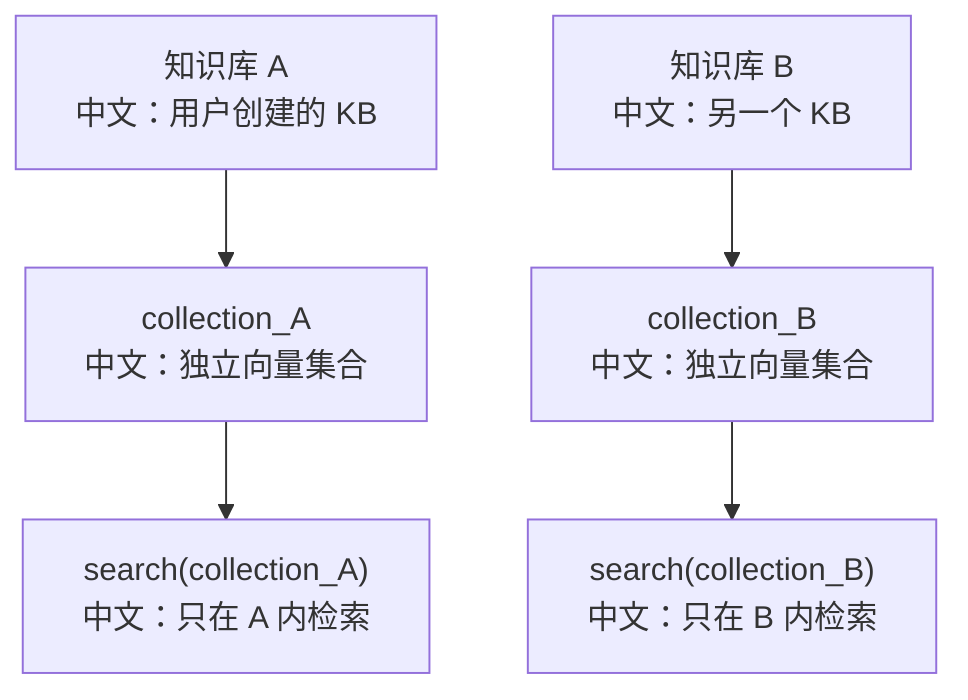

# RAG 向量库适配对比

> 适合面试表达的关键词：向量库抽象、集合隔离、元数据过滤、Qdrant、MongoDB Vector Search、Milvus Lite、embedding 维度、召回一致性。

---

## 1. 结论先行

AgentScope 的 RAG 不是把某个向量库写死在业务代码里，而是抽象了 `VectorStoreBase`：

```text
KnowledgeBase / IndexWorker / RAGMiddleware
  ↓
VectorStoreBase
  中文：统一向量库接口，屏蔽不同后端差异
  ↓
Qdrant / MongoDB / Milvus Lite
  中文：不同向量库实现，服务不同部署场景
```

面试里最值得讲的是：

```text
1. 每个知识库对应一个 collection，做物理隔离。
2. 每条向量记录保存 vector、document_id、chunk。
3. 检索接口统一返回 score、document_id、chunk。
4. metadata_filter 作为额外过滤能力，即使当前有 collection 隔离，也保留更细粒度约束。
```

---

## 2. 源码入口

| 模块 | 源码路径 | 重点 |
|---|---|---|
| 向量库抽象 | `src/agentscope/rag/_vdb/_vector_store.py` | `VectorStoreBase`、`VectorRecord`、`VectorSearchResult` |
| Qdrant 实现 | `src/agentscope/rag/_vdb/_qdrant.py` | 本地内存、本地文件、远程 Qdrant |
| MongoDB 实现 | `src/agentscope/rag/_vdb/_mongodb.py` | MongoDB Vector Search、索引等待、聚合查询 |
| Milvus Lite 实现 | `src/agentscope/rag/_vdb/_milvus_lite.py` | 本地 Milvus Lite 或兼容 URI |
| 向量库测试 | `tests/rag_vdb_qdrant_test.py`、`tests/rag_vdb_mongodb_test.py`、`tests/rag_vdb_milvus_lite_test.py` | 三种后端行为验证 |

---

## 3. 统一抽象层

`VectorStoreBase` 定义的关键方法：

| 方法 | 中文说明 |
|---|---|
| `create_collection(name, dimensions)` | 创建知识库对应的 collection，并指定 embedding 维度 |
| `delete_collection(name)` | 删除整个知识库向量集合 |
| `has_collection(name)` | 判断 collection 是否存在 |
| `insert(collection, records)` | 批量写入向量记录 |
| `delete(collection, document_id)` | 删除某个文档产生的所有 chunk 向量 |
| `search(collection, query_vector, top_k, metadata_filter)` | 向量召回 |
| `list_documents(collection, metadata_filter)` | 汇总 collection 中有哪些文档 |

核心数据模型：

```text
VectorRecord
  vector：embedding 向量
  document_id：文档 ID
  chunk：分块内容和元数据

VectorSearchResult
  score：相似度分数
  document_id：文档 ID
  chunk：召回的分块

DocumentSummary
  document_id：文档 ID
  source：来源文件
  chunk_count：分块数量
  metadata：文档元数据
```

---

## 4. 为什么“一个知识库一个 collection”



好处：

```text
1. 隔离直接：不同知识库的向量不会混搜。
2. 删除简单：删除知识库可以直接删除 collection。
3. 查询简单：不用每次都强依赖 kb_id filter。
```

代价：

```text
1. collection 数量会随知识库数量增长。
2. 某些向量库在 collection 很多时需要额外运维关注。
3. 如果未来要跨知识库检索，需要增加聚合层。
```

---

## 5. 三种向量库对比

| 后端 | 适合场景 | 关键实现 | 面试表达 |
|---|---|---|---|
| Qdrant | 本地开发、轻量部署、远程 Qdrant 服务 | `AsyncQdrantClient`、`PointStruct`、payload filter | 工程友好，支持内存、本地文件、远程 URL |
| MongoDB Vector Search | 已有 MongoDB/Atlas 体系 | `create_search_index`、`$vectorSearch`、metadata filter 字段定义 | 适合把业务数据和向量检索放在同一数据库生态 |
| Milvus Lite | 本地向量检索、Milvus 生态验证 | `pymilvus.MilvusClient`、JSON metadata、scalar filter | 适合从本地轻量版过渡到 Milvus 兼容服务 |

---

## 6. Qdrant 实现亮点

Qdrant 支持三种连接方式：

```text
location=":memory:"
  中文：内存模式，适合测试或临时开发

path="..."
  中文：本地文件持久化

url="..."
  中文：远程 Qdrant 服务
```

写入时：

```text
upsert PointStruct
  id：uuid
  vector：embedding
  payload：
    document_id
    chunk
```

检索时：

```text
query_points(
  collection_name,
  query=query_vector,
  query_filter=metadata_filter,
  limit=top_k
)
```

metadata filter 会映射到：

```text
chunk.metadata.<key>
```

中文解释：

```text
chunk 的元数据被放进 payload，过滤时要按 payload 路径过滤。
这说明 chunk 不只是文本，还携带来源、页码、标题等可过滤上下文。
```

---

## 7. MongoDB Vector Search 实现亮点

MongoDB 版本的价值不是“更好”，而是适合已有 MongoDB 技术栈：

```text
1. 使用 async pymongo 客户端。
2. 创建 Vector Search index。
3. 等待索引 ready。
4. 用 $vectorSearch 做召回。
5. metadata filter 需要在索引定义里声明可过滤字段。
```

面试表达：

```text
MongoDB 适配的 trade-off 是：它能复用 MongoDB 生态和权限运维，但 metadata filter 不是完全随便加的，通常要在索引定义里提前规划字段。
```

---

## 8. Milvus Lite 实现亮点

Milvus Lite 更适合本地验证和 Milvus 生态迁移：

```text
1. 用 `MilvusClient` 管理 collection。
2. 支持本地 `.db` 或 Milvus-compatible URI。
3. metadata 用 JSON 字段保存。
4. document_id 和 metadata 过滤通过 scalar filter 实现。
```

面试表达：

```text
Milvus Lite 的价值在于把开发环境和向量数据库能力绑定起来，便于本地跑完整 RAG 流程；如果后续切 Milvus 服务端，抽象层可以尽量保持上层代码不变。
```

---

## 9. metadata_filter 的价值

即使每个知识库已经有独立 collection，`metadata_filter` 仍然有意义。

典型场景：

```text
1. 只检索某个 source 文件。
2. 只检索某个 tag。
3. 只检索某个时间范围的数据。
4. 未来如果改成多个知识库共用 collection，可以继续用 metadata 做租户/权限过滤。
```

面试表达：

```text
collection 隔离解决粗粒度隔离，metadata_filter 解决细粒度过滤。
两个不是互斥关系，而是 defense-in-depth。
```

---

## 10. 测试证据

| 测试文件 | 覆盖点 |
|---|---|
| `tests/rag_vdb_qdrant_test.py` | Qdrant collection、insert、search、delete、metadata filter |
| `tests/rag_vdb_mongodb_test.py` | MongoDB 向量搜索、索引创建、查询过滤 |
| `tests/rag_vdb_milvus_lite_test.py` | Milvus Lite 本地 collection、检索、删除 |
| `tests/rag_parser_test.py` | 文档解析 |
| `tests/rag_chunker_approx_token_test.py` | 分块策略 |
| `tests/middleware_rag_test.py` | RAGMiddleware 注入和检索使用 |

---

## 11. 面试沉淀

### 一句话回答

AgentScope 用 `VectorStoreBase` 抽象向量库能力，上层 RAG 只依赖 collection、insert、search、delete 等统一接口，底层可以切换 Qdrant、MongoDB Vector Search 或 Milvus Lite。

### 3 分钟讲解版

```text
AgentScope 的 RAG 不是把某一个向量库写死，而是定义了 VectorStoreBase。
每个知识库会映射成一个 collection，文档解析和分块后，每个 chunk 会生成 embedding，并以 VectorRecord 写入向量库。
检索时，RAGMiddleware 会把用户问题转成 query vector，再调用 search(collection, query_vector, top_k, metadata_filter)，拿到 score、document_id 和 chunk。
Qdrant 实现适合本地和远程轻量部署；MongoDB Vector Search 适合已有 MongoDB/Atlas 生态；Milvus Lite 适合本地验证和 Milvus 生态。
collection 隔离保证不同知识库不会混搜，metadata_filter 则提供更细粒度过滤。
这个设计的核心是让 RAG 主流程不依赖某个向量库 SDK，从而保持可替换性。
```

### 高频追问

| 追问 | 回答方向 |
|---|---|
| 为什么一个知识库一个 collection？ | 隔离清晰，删除简单，检索不用每次依赖 kb_id filter。 |
| collection 多了怎么办？ | 需要看向量库运维能力；未来可改成共享 collection + metadata 隔离。 |
| metadata_filter 有什么用？ | source/tag/权限/时间等细粒度过滤，也为共享 collection 留扩展。 |
| Qdrant 和 MongoDB 怎么选？ | Qdrant 更专注向量检索；MongoDB 更适合已有 MongoDB 生态。 |
| Milvus Lite 的价值是什么？ | 本地低成本跑通向量检索，并向 Milvus 生态迁移。 |
| embedding 维度在哪里体现？ | `create_collection(name, dimensions)` 创建 collection 时指定。 |
| 删除文档怎么删向量？ | `delete(collection, document_id)` 删除该文档对应的所有 chunk 向量。 |

### 对比题

| 对比 | 重点 |
|---|---|
| collection 隔离 vs metadata 隔离 | 前者简单可靠，后者灵活但依赖过滤正确性 |
| Qdrant vs MongoDB Vector Search | 专用向量库 vs 业务数据库生态 |
| 本地向量库 vs 远程向量库 | 开发便利 vs 生产可扩展和运维能力 |

### 项目表达

```text
我分析过 AgentScope 的 RAG 向量库适配层。它通过 VectorStoreBase 抽象 collection、insert、search、delete 等能力，上层索引 worker 和 RAGMiddleware 不绑定具体向量库。底层提供 Qdrant、MongoDB Vector Search 和 Milvus Lite 适配，并通过 collection 隔离和 metadata_filter 共同保证检索边界。
```

---

## 12. 后续可深挖

```text
1. 把 IndexWorker 的“解析 -> 分块 -> embedding -> insert”链路和本文件合并成完整 RAG 运行图。
2. 补充不同向量库在生产部署、备份、索引构建耗时上的对比。
3. 继续分析 RAGMiddleware 如何把检索结果注入 Agent 上下文。
```
