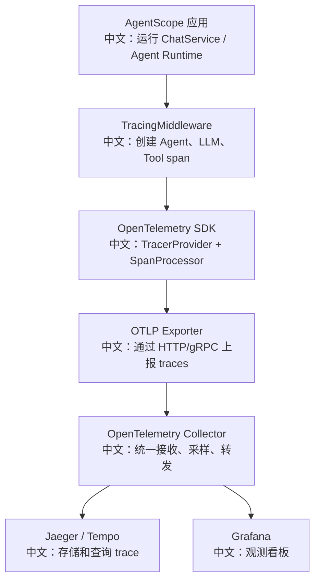

# OpenTelemetry 部署与观测看板

> 适合面试表达的关键词：可观测性、TracingMiddleware、span 分层、token usage、HITL 暂停恢复、OTLP Exporter、Collector、Tempo/Jaeger。

---

## 1. 结论先行

AgentScope 的 tracing 设计不是在业务代码里到处手写日志，而是通过 `TracingMiddleware` 把 Agent、模型调用、工具执行这些关键边界转换成 OpenTelemetry span。

核心链路：

```text
应用启动时配置 OpenTelemetry TracerProvider
  中文：接入标准 tracing SDK 和 exporter

Agent 运行时挂载 TracingMiddleware
  中文：在 on_reply / on_model_call / on_acting 等边界创建 span

span 输出到 OTLP Collector / Jaeger / Tempo
  中文：统一进入观测系统

看板按 session_id / reply_id / tool_name / model_name 查询
  中文：排查一次 Agent 回复为什么慢、为什么失败、卡在哪个工具
```

---

## 2. 源码入口

| 模块 | 源码路径 | 重点 |
|---|---|---|
| Tracing 中间件 | `src/agentscope/middleware/_tracing/_trace.py` | 创建 Agent、模型、工具 span |
| tracer 获取 | `src/agentscope/middleware/_tracing/_setup.py` | `_get_tracer()` 使用 `agentscope` 作为 instrumentation 名称 |
| tracing 测试 | `tests/tracing_test.py` | in-memory exporter 验证 span 和 attributes |
| 中间件示例文档 | `docs/08_中间件知识文档.md` | OpenTelemetry SDK 接入示例 |

说明：

```text
源码提供 TracingMiddleware 和 tracer 获取逻辑。
完整 Collector / Tempo / Jaeger 部署属于运维集成层，需要按项目环境配置。
```

---

## 3. Tracing 是否启用

源码中 `_check_tracing_enabled()` 会判断：

```text
1. 当前全局 tracer provider 是否来自 opentelemetry.sdk.trace.TracerProvider。
2. 如果没有正确配置 SDK provider，TracingMiddleware 会短路，不创建 span。
```

中文理解：

```text
TracingMiddleware 是“可选增强”。
没有配置 OpenTelemetry SDK 时，它不会影响 Agent 正常运行；
配置后才开始记录 span。
```

这个设计非常适合生产系统：

```text
开发或轻量运行：不开 tracing，少依赖。
生产排障：接入 OTel SDK 和 exporter，打开可观测链路。
```

---

## 4. 建议部署链路



最小接入示例：

```python
from opentelemetry import trace
from opentelemetry.sdk.trace import TracerProvider
from opentelemetry.sdk.trace.export import BatchSpanProcessor
from opentelemetry.exporter.otlp.proto.http.trace_exporter import OTLPSpanExporter

provider = TracerProvider()
provider.add_span_processor(
    BatchSpanProcessor(
        OTLPSpanExporter(endpoint="http://localhost:4318/v1/traces"),
    ),
)
trace.set_tracer_provider(provider)
```

中文说明：

```text
这段代码负责把 OpenTelemetry SDK 装到全局 trace provider 上。
AgentScope 的 TracingMiddleware 检测到 provider 后，才会真正创建并导出 span。
```

---

## 5. AgentScope 里应该重点观察什么

| 观测对象 | 价值 | 示例问题 |
|---|---|---|
| Agent reply span | 一次完整回复耗时 | 为什么这次回复比平时慢？ |
| Model call span | LLM 调用耗时和 token | 是模型慢，还是工具慢？ |
| Tool execution span | 工具执行耗时和错误 | 哪个工具调用失败？ |
| HITL pending 信息 | 人类确认导致的暂停 | 系统是卡住了，还是在等用户确认？ |
| `session_id` / `reply_id` | 串联一次会话运行 | 如何从前端问题定位到后端 trace？ |
| token usage | 成本和上下文膨胀 | 哪些请求 token 消耗异常？ |

---

## 6. 建议看板设计

### 6.1 Agent 运行总览

```text
指标：
1. 每分钟 reply 数。
2. reply 平均耗时 / P95 耗时。
3. model call 平均耗时。
4. tool execution 平均耗时。
5. error span 数量。
```

中文价值：

```text
回答“系统整体健康吗，慢在哪里”。
```

### 6.2 模型调用看板

```text
维度：
model_name
provider
input_tokens
output_tokens
reasoning_tokens
latency
error
```

中文价值：

```text
回答“哪个模型慢、哪个模型贵、哪个模型失败率高”。
```

### 6.3 工具调用看板

```text
维度：
tool_name
session_id
reply_id
duration
status
error_message
```

中文价值：

```text
回答“Agent 为什么没完成任务，是哪个工具卡住或失败”。
```

### 6.4 HITL 与人工确认看板

```text
维度：
pending tool calls
permission result
等待时长
用户确认/拒绝比例
```

中文价值：

```text
回答“系统卡住是 bug，还是产品设计要求等人确认”。
```

---

## 7. 与日志的区别

| 机制 | 适合回答 | 局限 |
|---|---|---|
| 普通日志 | 某个点发生了什么 | 难串联完整请求链路 |
| Metrics | 系统整体趋势如何 | 不容易定位单次异常 |
| Tracing | 一次请求穿过哪些组件、每段耗时多少 | 成本更高，需要采样和存储 |

面试表达：

```text
日志回答“发生了什么”，指标回答“整体是否健康”，trace 回答“一次 Agent 运行到底慢在哪里”。
```

---

## 8. 常见坑

| 坑 | 说明 |
|---|---|
| 只加 Middleware 但没配置 TracerProvider | `_check_tracing_enabled()` 会返回 false，不会导出 span |
| 没有 `session_id` / `reply_id` | 前端问题无法关联后端 trace |
| 不采样 | 高流量 Agent 系统成本可能很高 |
| 只看模型 span | 工具、HITL、RAG 检索也可能是耗时来源 |
| 不记录错误属性 | trace 只能看到慢，看不到为什么失败 |

---

## 9. 测试证据

`tests/tracing_test.py` 使用 in-memory exporter 和 `TracerProvider` 验证：

```text
1. middleware 能创建 span。
2. Agent / chat / execute_tool 等 span 边界存在。
3. span 中包含 session_id、reply_id 等关联属性。
4. token usage、HITL、external execution 等关键属性可被记录。
```

中文理解：

```text
测试不是验证某个真实 Jaeger 服务，而是验证 AgentScope 自己是否正确产出 span。
Exporter 和后端存储属于部署集成层。
```

---

## 10. 面试沉淀

### 一句话回答

AgentScope 通过 TracingMiddleware 把 Agent reply、模型调用和工具执行转换成 OpenTelemetry span，再通过标准 OTel SDK 导出到观测系统，用于定位一次 Agent 运行慢在哪里、失败在哪里。

### 3 分钟讲解版

```text
Agent 系统的问题是链路长：一次回复可能包含模型调用、工具调用、RAG 检索、HITL 暂停和后台任务。
AgentScope 没有只靠日志排查，而是提供 TracingMiddleware，在 reply、model call、acting/tool execution 这些边界创建 OpenTelemetry span。
应用启动时需要配置 TracerProvider 和 OTLP Exporter；配置后 span 可以进入 Collector，再进入 Jaeger 或 Tempo。
看板上我会按 session_id 和 reply_id 串联一次会话运行，分别看 Agent 总耗时、模型耗时、工具耗时、token usage 和错误。
这样面试里我可以讲清楚：可观测性不是事后打印日志，而是把 Agent 运行态建模成可查询的 trace。
```

### 高频追问

| 追问 | 回答方向 |
|---|---|
| 为什么 Middleware 没产出 span？ | 可能没有配置 SDK TracerProvider，`_check_tracing_enabled()` 会短路。 |
| 日志和 tracing 有什么区别？ | trace 能串联一次请求的跨组件耗时，日志更偏单点事实。 |
| 怎么关联前端问题？ | 用 `session_id` / `reply_id` 从前端报错定位后端 trace。 |
| 怎么控制成本？ | 采样、限制高基数字段、只保留必要 attribute。 |
| Agent 卡住怎么排查？ | 看 trace 是模型慢、工具慢、HITL pending，还是外部执行未返回。 |

### 项目表达

```text
我分析过 AgentScope 的 OpenTelemetry 接入方式。它通过 TracingMiddleware 在 Agent、LLM、Tool 边界创建 span，并用 session_id/reply_id 关联一次会话运行。部署上接入 OTel SDK、OTLP Exporter 和 Collector 后，可以在 Jaeger/Tempo/Grafana 里定位模型慢、工具慢、HITL 等待和 token 成本异常。
```

---

## 11. 后续可深挖

```text
1. 补充一份 docker-compose 级别的 Collector + Tempo + Grafana 本地部署示例。
2. 把 RAG 检索、IndexWorker、MessageBus 延迟纳入 tracing 设计建议。
3. 设计 trace attribute 命名规范，避免高基数字段污染观测系统。
```
