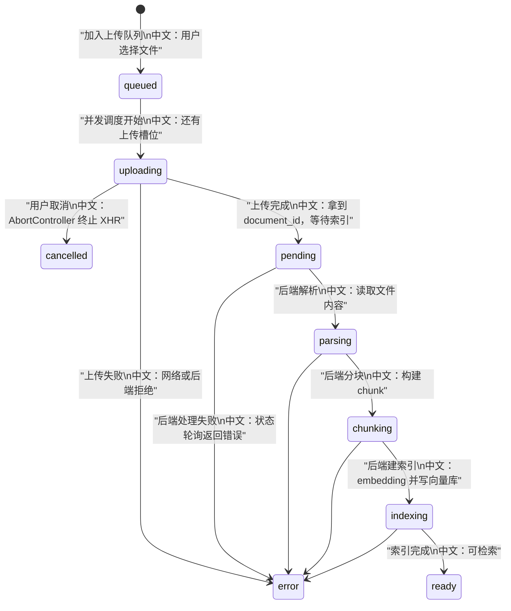
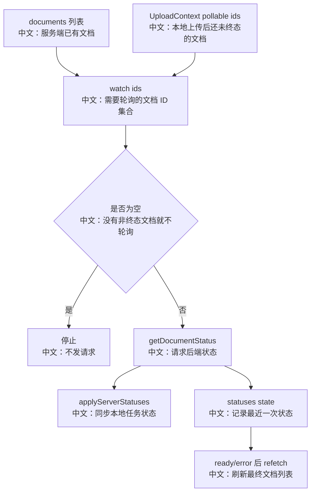

# 前端知识库上传轮询状态机

> 适合面试表达的关键词：XHR 上传进度、任务队列、并发控制、AbortController、服务端索引状态、条件轮询、终态刷新、本地任务和服务端文档合并。

---

## 1. 结论先行

知识库上传在 Web UI 里不是一个简单的 `fetch(file)`，而是一套完整状态机：

```text
用户选择/拖拽文件
  ↓
UploadContext 入队
  中文：本地任务队列，控制并发、进度、取消
  ↓
XHR 上传
  中文：因为 fetch 不能稳定暴露上传进度，所以用 XMLHttpRequest
  ↓
后端返回 document_id
  中文：上传完成不代表索引完成
  ↓
useDocumentStatusPolling 轮询
  中文：追踪 pending/parsing/chunking/indexing
  ↓
ready/error 后 refetch 文档列表
  中文：拿到最终 chunk_count 和错误信息
```

这个设计的重点是：**上传进度和索引进度是两个阶段，前端必须把本地任务状态和后端文档状态合并成一个用户可理解的进度体验。**

---

## 2. 源码入口

| 模块 | 源码路径 | 重点 |
|---|---|---|
| 知识库 API | `examples/web_ui/frontend/src/api/knowledgeBase.ts` | `uploadDocumentXhr`、`getDocumentStatus` |
| 上传上下文 | `examples/web_ui/frontend/src/context/UploadContext.tsx` | reducer、并发控制、取消、服务端状态同步 |
| 上传状态类型 | `examples/web_ui/frontend/src/context/uploadTypes.ts` | `queued/uploading/pending/parsing/chunking/indexing/ready/error` |
| 状态轮询 hook | `examples/web_ui/frontend/src/hooks/useDocumentStatusPolling.ts` | 条件轮询、watch ids、终态停止 |
| 文档面板 | `examples/web_ui/frontend/src/components/knowledge/KnowledgeDocumentsPanel.tsx` | 本地任务和服务端文档合并渲染 |
| 知识库页面 | `examples/web_ui/frontend/src/pages/knowledge/index.tsx` | 选择知识库、展示文档面板 |

---

## 3. 状态机



---

## 4. 为什么用 XHR

`knowledgeBase.ts` 中上传走 `uploadDocumentXhr`。

中文解释：

```text
浏览器 fetch 更适合普通请求，但上传进度事件支持不如 XMLHttpRequest 直接。
知识库上传需要显示文件级进度条，所以前端选择 XHR 来监听 upload progress。
```

面试表达：

```text
这里不是技术怀旧，而是产品体验驱动：
用户上传大文件时需要看到字节级进度，否则会以为页面卡住。
```

---

## 5. UploadContext 做了什么

`UploadContext` 是本地上传任务的单一入口。

核心职责：

| 职责 | 中文说明 |
|---|---|
| `enqueue` | 把文件加入本地任务队列 |
| 并发调度 | 最多同时启动固定数量上传任务 |
| `progress` | 接收 XHR 上传进度 |
| `upload done` | 保存后端返回的 `document_id` 和初始 status |
| `cancel` | queued 直接移除，uploading 用 AbortController 取消 |
| `applyServerStatuses` | 把轮询到的后端状态同步回本地任务 |
| `pollableDocumentIds` | 返回还需要继续轮询的 document id |
| `beforeunload` | 有 queued/uploading 时提示用户不要直接关页 |

关键设计：

```text
本地任务用 taskId 识别。
服务端文档用 documentId 识别。
上传完成后，两者建立关联。
```

中文理解：

```text
上传前只有本地 taskId，没有 documentId。
上传后有 documentId，才进入服务端索引状态轮询。
```

---

## 6. 条件轮询怎么避免浪费

`useDocumentStatusPolling` 的逻辑：

```text
1. 从服务端 documents 列表找出非终态文档。
2. 从 UploadProvider 找出本地还在等待服务端状态的 documentId。
3. 两者合并、排序，生成 watchIdsKey。
4. 如果没有 watch ids，不启动轮询。
5. 如果有 watch ids，立即 tick 一次，然后每 1500ms 查询。
6. 查询结果通过 applyServerStatuses 写回 UploadContext。
7. ready/error 后从 watch ids 中自然消失，轮询停止。
```

流程图：



---

## 7. 本地任务和服务端文档如何合并渲染

`KnowledgeDocumentsPanel` 把两类数据合成一个 `Row`：

```text
server row
  中文：服务端已经存在的文档记录

local row
  中文：还没有 documentId 的本地上传任务
```

如果本地任务已经有 `documentId`：

```text
不再单独渲染 local row，
而是挂到对应 server row 的 localTask 上。
```

中文理解：

```text
这避免同一个文件出现两行：
一行是“上传中任务”，另一行是“服务端文档”。
```

状态展示规则：

```text
1. 服务端还没到 ready/error 时，本地 phase 可以优先显示。
2. 服务端一旦 ready/error，服务端状态就是最终真相。
3. uploading 显示字节级进度。
4. parsing/chunking/indexing 显示阶段型进度。
```

---

## 8. 取消语义

| 阶段 | 取消行为 | 中文解释 |
|---|---|---|
| `queued` | 直接移除任务 | 文件还没开始上传，没有后端副作用 |
| `uploading` | AbortController 取消 XHR | 上传请求被中断 |
| `pending/parsing/chunking/indexing` | 本地 cancel 不直接处理 | 已经进入后端索引，应使用文档删除接口 |
| `ready/error/cancelled` | dismiss 或 delete | 终态清理展示或删除服务端文档 |

面试重点：

```text
前端取消不等于所有阶段都能无副作用取消。
上传前/上传中是客户端控制；
上传后进入后端索引，则需要服务端文档生命周期接口处理。
```

---

## 9. 产品体验亮点

| 亮点 | 说明 |
|---|---|
| 拖拽上传 | 降低知识库导入成本 |
| accept 过滤 | 根据后端支持的 content types 限制文件选择 |
| XHR 进度条 | 大文件上传有确定反馈 |
| 后端状态轮询 | 上传完成后仍能看到解析、分块、索引进度 |
| 终态 refetch | 拿到最终 chunk_count 和错误信息 |
| 轮询自停止 | 没有非终态文档时不浪费请求 |
| beforeunload | 上传中关闭页面有提示 |

---

## 10. 面试沉淀

### 一句话回答

知识库上传前端用 UploadContext 管理本地上传队列和 XHR 进度，上传完成后通过 document status polling 跟踪后端解析、分块、索引状态，最终合并本地任务和服务端文档渲染成一套进度体验。

### 3 分钟讲解版

```text
知识库上传分成两个阶段：文件上传和后端索引。
前端选择 XHR 上传，因为需要 upload progress 来展示字节级进度；UploadContext 负责把文件入队、并发调度、记录进度、处理取消。
上传成功后，后端会返回 document_id，但这时文档不一定可检索，因为还要经历 pending、parsing、chunking、indexing。
所以前端的 useDocumentStatusPolling 会把服务端非终态文档和本地上传任务里的 documentId 合并成 watch ids，只要还有非终态文档，就每 1.5 秒请求一次状态。
当文档 ready 或 error 后，轮询自然停止，并触发 refetch 拿到最终 chunk_count 和错误信息。
KnowledgeDocumentsPanel 再把本地任务和服务端文档合并渲染，避免同一个文件出现重复行。
```

### 高频追问

| 追问 | 回答方向 |
|---|---|
| 为什么不用 fetch 上传？ | 需要稳定的上传进度事件，XHR 更直接。 |
| 上传完成为什么还要轮询？ | 上传只代表文件到达后端，索引还要解析、分块、embedding、写向量库。 |
| 轮询怎么停止？ | watch ids 只包含非终态文档，ready/error 后自然为空。 |
| 页面刷新后还能看到索引状态吗？ | 能，轮询会从服务端 documents 列表找非终态文档。 |
| 为什么本地 task 和 server doc 要合并？ | 避免同一文件重复展示，并把上传进度和索引状态接起来。 |
| 上传后还能取消吗？ | 前端 XHR 取消只适用于上传前/上传中；后端索引阶段应走文档删除生命周期。 |

### 项目表达

```text
我分析过 AgentScope Web UI 的知识库上传状态机。它用 UploadContext 管理本地上传队列和并发，用 XHR 暴露字节级进度；上传后通过 document_id 进入服务端状态轮询，跟踪 parsing、chunking、indexing、ready/error，并把本地任务和服务端文档合并渲染，形成完整的异步索引产品体验。
```

---

## 11. 后续可深挖

```text
1. 结合后端 IndexWorker 写一份“上传到可检索”的端到端链路。
2. 分析删除文档时如何取消或清理未完成索引任务。
3. 补充前端 i18n 文案、toast、错误展示和重试体验。
```
