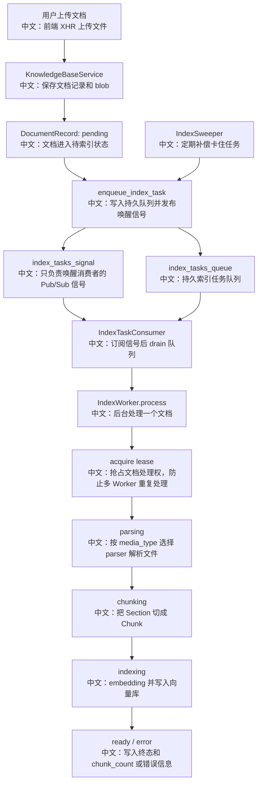

# 完整 RAG 索引 Worker 端到端链路

> 适合面试表达的关键词：异步索引、持久队列、Pub/Sub 信号、Lease 抢占、Heartbeat 续租、Sweeper 补偿、Parser/Chunker/Embedding/VectorStore。

---

## 1. 结论先行

知识库文档上传后，AgentScope 不会在 HTTP 请求里同步完成解析、分块、向量化和写库，而是把文档登记成待处理记录，然后交给后台索引 Worker。

完整链路是：

```text
上传文件
  ↓
保存 blob + DocumentRecord(status=pending)
  中文：先把原始文件和文档元数据持久化
  ↓
enqueue_index_task
  中文：把索引任务写入持久队列，并发布唤醒信号
  ↓
IndexTaskConsumer
  中文：订阅信号，批量 drain 队列，派发给 IndexWorker
  ↓
IndexWorker
  中文：抢 lease，解析、分块、embedding、写向量库，更新状态
  ↓
IndexSweeper
  中文：补偿卡住或丢信号的任务，重新入队
```

面试里可以把它讲成：**这是一个典型的异步后台任务系统，核心不是“怎么切 chunk”，而是如何保证上传请求快、索引可恢复、重复入队不重复写、Worker 崩溃后能接管。**

---

## 2. 源码入口

| 模块 | 源码路径 | 重点 |
|---|---|---|
| 上传服务 | `src/agentscope/app/_service/_knowledge_base.py` | 上传后 enqueue index task |
| 任务入队 | `src/agentscope/app/_bus_ops.py` | `enqueue_index_task` 先 queue_push 再 publish signal |
| Worker 核心 | `src/agentscope/app/_service/_index_worker.py` | parse → chunk → index，lease + heartbeat |
| 任务消费者 | `src/agentscope/app/_service/_index_task_consumer.py` | subscribe signal + drain durable queue |
| 补偿扫描器 | `src/agentscope/app/_service/_index_sweeper.py` | 找 expired lease / orphan pending 并重新入队 |
| 应用生命周期 | `src/agentscope/app/_lifespan.py` | embedded / dedicated 两种 Worker 部署形态 |
| 独立 Worker 入口 | `src/agentscope/app/rag/index_worker/__init__.py`、`__main__.py` | `run_worker` 和 `AGENTSCOPE_WORKER_BOOTSTRAP` |

---

## 3. 端到端流程图



---

## 4. 为什么要“队列 + 信号”双结构

`enqueue_index_task` 做了两件事：

```text
1. queue_push(MessageBusKeys.index_tasks_queue(), payload)
   中文：把任务写入持久队列。

2. publish(MessageBusKeys.index_tasks_signal(), {})
   中文：发布一个唤醒信号，让在线 consumer 立刻 drain 队列。
```

为什么不只用 Pub/Sub？

```text
Pub/Sub 是 fire-and-forget。
如果所有 Worker 都离线，信号会丢。
所以真正的任务必须落到 durable queue 里，signal 只负责“提醒你来拿”。
```

为什么不只用队列、不用信号？

```text
可以轮询队列，但延迟和资源浪费更高。
signal 让在线 worker 能低延迟响应。
```

面试表达：

```text
队列保证任务不丢，信号保证响应及时。
这是持久工作队列和瞬时通知的职责拆分。
```

---

## 5. Worker 的状态流转

`IndexWorker._run_pipeline` 会按阶段更新状态：

| 状态 | 触发点 | 中文说明 |
|---|---|---|
| `pending` | 上传服务创建记录 | 文档已上传，等待 Worker |
| `parsing` | Worker 找到 parser 后 | 读取 blob 并解析成 Section |
| `chunking` | parser 返回 sections 后 | 调用 chunker 生成 chunks |
| `indexing` | chunk 完成后 | 构建 KnowledgeBase runtime，embedding 并写向量库 |
| `ready` | 插入向量库成功 | 写入 `chunk_count`，前端可检索 |
| `error` | 任意阶段异常 | 写入脱敏错误，前端展示失败 |

这和前端文档状态轮询刚好对应：

```text
前端不是猜进度，而是读取后端真实状态。
```

---

## 6. Lease + Heartbeat：防止重复处理

`IndexWorker.process` 的第一步是：

```text
acquire_knowledge_document_lease(...)
  中文：用存储层 CAS 抢占文档处理租约
```

如果抢不到：

```text
说明其他 Worker 正在处理，当前 Worker 直接跳过。
```

处理过程中会启动 heartbeat：

```text
每隔一段时间 renew_knowledge_document_lease(...)
  中文：告诉系统我还活着，不要把任务交给别人
```

如果 heartbeat 失败：

```text
说明租约可能被 Sweeper 回收并被其他 Worker 接管。
当前 Worker 必须取消 pipeline，避免重复写向量库。
```

这是面试高频点：

```text
重复入队不可怕，重复写库才可怕。
队列可以至少一次投递，Worker 通过 lease CAS 把真正执行变成“同一时刻最多一个”。
```

---

## 7. Sweeper：补偿而不是主流程

`IndexSweeper` 定期找两类卡住记录：

```text
1. expired lease
   中文：Worker 处理到一半崩了，lease 过期。

2. orphan pending
   中文：上传后记录已写入，但任务没有成功入队或所有 Worker 当时离线。
```

然后重新调用 `enqueue_index_task`。

为什么安全？

```text
因为真正处理前还要 acquire lease。
多个 sweeper 同时 re-enqueue 同一个文档，也会被 lease 去重。
```

面试表达：

```text
Sweeper 是补偿机制，不是主调度器。
主流程靠上传入队和 consumer drain，Sweeper 负责从异常状态里把任务捞回来。
```

---

## 8. Parser、Chunker、Embedding、VectorStore 的职责

| 层 | 职责 | 中文解释 |
|---|---|---|
| Parser | `bytes -> Section[]` | 按文件类型解析原始内容 |
| Chunker | `Section[] -> Chunk[]` | 控制 chunk 粒度、顺序和元数据 |
| EmbeddingModel | `Chunk text -> vector` | 把文本变成向量 |
| KnowledgeBase | `chunks + metadata -> vector store` | 统一封装 embedding + insert |
| VectorStore | `insert/search/delete` | 写入和检索具体向量库 |

索引 Worker 不直接关心 Qdrant/MongoDB/Milvus 的细节，而是通过 `KnowledgeBase` 和 `VectorStoreBase` 间接写入。

---

## 9. Embedded 和 Dedicated 两种部署

`_lifespan.py` 里有两个模式：

| 模式 | 行为 | 适合场景 |
|---|---|---|
| Embedded | API 进程内启动 `IndexWorker + IndexTaskConsumer` | 本地开发、小规模部署 |
| Dedicated | API 不启动 Worker，独立进程跑 `python -m agentscope.app.rag.index_worker` | 生产部署、弹性扩容 |

重点：

```text
无论哪种模式，API 进程都会跑 IndexSweeper。
因为上传发生在 API，API 最清楚 pending 记录是否可能被遗漏。
```

---

## 10. 面试沉淀

### 一句话回答

AgentScope 的 RAG 索引是异步后台任务链路：上传只落 blob 和 pending 记录，索引任务通过持久队列 + Pub/Sub 信号交给 Worker，Worker 用 lease + heartbeat 防重复，用 sweeper 补偿崩溃和丢信号。

### 3 分钟讲解版

```text
用户上传知识库文档后，后端不会在 HTTP 请求里同步完成索引。
它先保存 blob 和 DocumentRecord，并把状态置为 pending，然后调用 enqueue_index_task。
这个函数先把任务写入 durable queue，再发布一个 signal 唤醒 IndexTaskConsumer。
Consumer 收到信号后 drain 队列，为每个 entry 创建 IndexWorker.process 任务。
Worker 先通过 storage CAS 抢 lease，抢不到说明别的 worker 在处理，就跳过。
抢到后按 parsing、chunking、indexing、ready 更新状态：先读 blob，按 media_type 找 parser，解析成 Section，再用 chunker 切成 Chunk，最后通过 KnowledgeBase 做 embedding 并写向量库。
处理期间 heartbeat 持续续租；如果 lease 丢了，说明任务可能被别人接管，当前 pipeline 会被取消，避免重复写库。
另外 IndexSweeper 会扫描 expired lease 和长期 pending 文档并重新入队，保证 worker 崩溃或信号丢失后能恢复。
```

### 高频追问

| 追问 | 回答方向 |
|---|---|
| 为什么上传不直接索引？ | 解析和 embedding 可能很慢，HTTP 请求应快速返回，前端通过状态轮询感知进度。 |
| 为什么要 queue + signal？ | queue 保证任务不丢，signal 保证在线 worker 低延迟响应。 |
| 重复入队会不会重复写向量库？ | Worker 先抢 lease，CAS 拒绝重复处理；heartbeat 丢失时也会取消 pipeline。 |
| Worker 崩溃怎么办？ | lease 过期后 Sweeper 重新入队，其他 worker 接管。 |
| pending 卡住怎么办？ | Sweeper 用 pending_grace 找 orphan pending 并重新入队。 |
| parser 很耗 CPU 怎么办？ | 支持注入 ProcessPoolExecutor，把 CPU 密集解析放进进程池。 |
| 文档状态怎么给前端？ | 状态存在 DocumentRecord，前端通过 document status polling 查询。 |

### 项目表达

```text
我分析过 AgentScope 的 RAG 异步索引链路。它把上传和索引解耦：上传只保存 blob 和 pending 记录，后台通过持久队列和 Pub/Sub 信号触发 IndexWorker。Worker 用 lease CAS 和 heartbeat 防止多实例重复处理，并用 IndexSweeper 补偿 worker 崩溃、信号丢失和 pending 卡住。这套设计可以很好地解释异步任务、一致性和可恢复性。
```

---

## 11. 后续可深挖

```text
1. 结合具体 Parser 实现，看 PDF、Markdown、纯文本等文件如何解析成 Section。
2. 继续分析 ApproxTokenChunker 的分块策略和 chunk metadata。
3. 补一份“RAG 检索阶段如何注入 Agent 上下文”的运行时文档。
```
