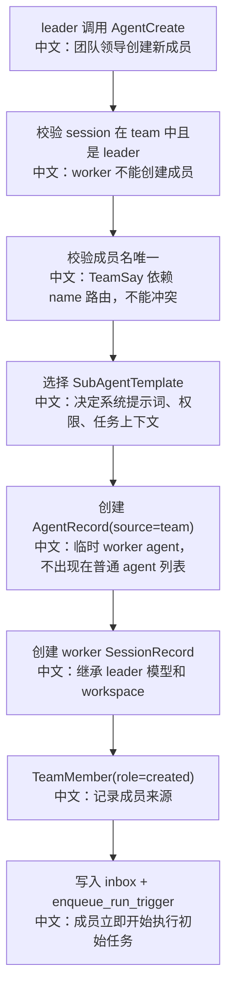
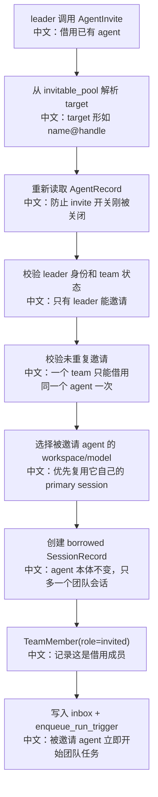
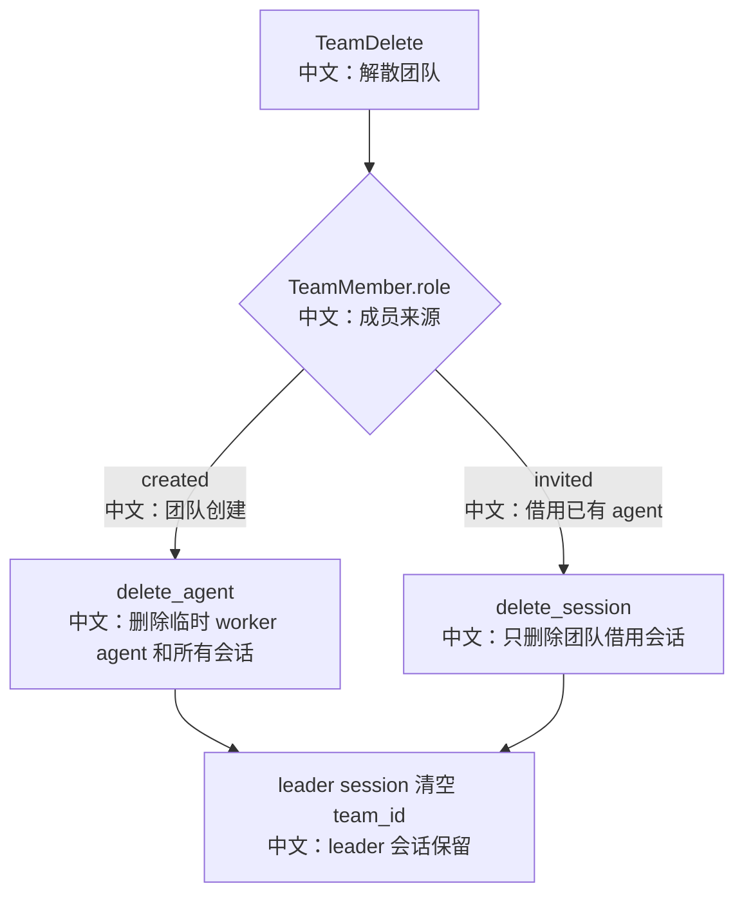

# AgentCreate 与 AgentInvite 生命周期对比

> 适合面试表达的关键词：多智能体生命周期、临时 Worker、借用已有 Agent、TeamMember role、权限继承、Workspace 边界、删除级联。

---

## 1. 结论先行

`AgentCreate` 和 `AgentInvite` 都能把成员加入团队，但它们的生命周期完全不同：

```text
AgentCreate
  中文：创建一个只属于当前 team 的临时 worker agent。
  team 解散时，这个 worker agent 和它的 session 会一起删除。

AgentInvite
  中文：借用一个已经存在的用户 agent，只新建一个 team-scoped session。
  team 解散时，只删除借用 session，agent 本体保留。
```

面试里最有价值的点是：**多 Agent 协作不能只建一个成员列表，必须建模“成员从哪里来”，否则删除 team 时会误删用户已有 Agent，或者留下孤儿 session。**

---

## 2. 源码入口

| 模块 | 源码路径 | 重点 |
|---|---|---|
| 创建临时成员 | `src/agentscope/app/_tool/_agent_create.py` | 创建 team-owned AgentRecord + SessionRecord |
| 邀请已有成员 | `src/agentscope/app/_tool/_agent_invite.py` | 为已有 AgentRecord 新建 team-scoped SessionRecord |
| Team 成员模型 | `src/agentscope/app/storage/_model_team.py` | `TeamMember.role = created / invited` |
| Toolkit 装配 | `src/agentscope/app/_service/_toolkit.py` | leader/worker 不同工具集合 |
| 删除级联 | `src/agentscope/app/_service/_session.py` | created 删除 agent，invited 只删 session |
| 测试证据 | `tests/service_team_tools_test.py`、`tests/storage_redis_test.py` | 生命周期和级联边界 |

---

## 3. 生命周期对比表

| 维度 | AgentCreate | AgentInvite |
|---|---|---|
| 成员来源 | 新创建的 worker agent | 已存在的用户 agent |
| AgentRecord | 新建，`source="team"` | 复用已有 AgentRecord |
| SessionRecord | 新建 worker session | 新建 borrowed/team-scoped session |
| TeamMember.role | `created` | `invited` |
| system prompt | 由 SubAgentTemplate 渲染 | 沿用已有 agent 的配置 |
| workspace | 默认继承 leader workspace | 优先使用被邀请 agent 自己的 primary session workspace |
| permission | 可按模板继承 leader mode/rules/working dirs | 不继承 leader 权限，使用新的 PermissionContext |
| 初始任务 | 通过 inbox + wakeup 发送 | 通过 inbox + wakeup 发送 |
| TeamDelete | 删除 worker agent 和 session | 只删除 borrowed session，保留 agent |
| 适用场景 | 为当前任务临时创建角色 | 复用已有专业 Agent |

---

## 4. AgentCreate 流程



### 4.1 为什么要成员名唯一

`TeamSay` 的路由依赖成员 name。`AgentCreate` 会拒绝：

```text
1. 和 leader 名称重复。
2. 和已有成员名称重复。
3. 名字里包含 @。
```

中文解释：

```text
invited 成员显示为 "<name>@<agent_id_prefix>"。
如果 created 成员也允许 @，路由展示会混乱。
```

### 4.2 权限继承不是简单复制

`AgentCreate` 通过 `SubAgentTemplate` 决定是否继承 leader：

| 模板字段 | 中文说明 |
|---|---|
| `override_leader_mode` | 是否用模板自己的权限模式覆盖 leader |
| `extend_leader_permission_rules` | 是否追加 leader 已确认的 allow/deny/ask 规则 |
| `extend_leader_working_directories` | 是否合并 leader 的工作目录 |

面试表达：

```text
临时 worker 默认像 leader 的助手，所以可以继承 workspace 和权限上下文；
但继承行为由模板控制，不是无脑复制。
```

---

## 5. AgentInvite 流程



### 5.1 为什么不继承 leader 权限

源码注释给出的理由很关键：

```text
被邀请 agent 可能有自己的 workspace。
leader 的 working directories 和权限规则锚定在 leader 的文件系统。
如果继承过去，会让 invited agent 看到它无法访问的路径，或者复用不该跨 session 复用的用户确认。
```

中文总结：

```text
AgentCreate 是“创建助手”，可以按模板继承 leader。
AgentInvite 是“借用专家”，必须尊重专家自己的 workspace 和上下文边界。
```

### 5.2 target 为什么是 `name@handle`

被邀请 Agent 的 display name 可能重复，所以 `AgentInvite` 用：

```text
"<agent_name>@<agent_id_prefix>"
```

解析时既看 name，也看 handle，处理前缀冲突和歧义。

面试表达：

```text
这是产品可读性和系统唯一性之间的折中：
用户看到的是名字，系统路由需要稳定 ID 前缀。
```

---

## 6. 删除级联差异

`SessionService.delete_team` 的核心分支：

```text
role == "created"
  → delete_agent(member.agent_id)
  中文：临时 worker 随 team 消失。

role == "invited"
  → delete_session(member.session_id)
  中文：只删除这次借用会话，保留 agent 本体。
```

流程图：



---

## 7. 面试高频亮点

### 7.1 多智能体不是内存对象列表

这里至少涉及：

```text
AgentRecord
SessionRecord
TeamRecord
TeamMember
MessageBus inbox
wakeup queue
PermissionContext
Workspace
```

面试表达：

```text
多 Agent 产品化的难点不是“创建几个对象”，而是每个成员要有独立 session、独立运行态、可恢复消息、权限边界和删除生命周期。
```

### 7.2 初始任务用 inbox + wakeup，而不是直接调用

无论 `AgentCreate` 还是 `AgentInvite`，初始 prompt 都会写入 worker session 的 inbox，然后 `enqueue_run_trigger`。

中文意义：

```text
leader 不直接同步调用 worker。
worker 是一个独立 session，通过消息总线被唤醒运行。
```

这让 worker 可以：

```text
1. 跨进程执行。
2. 崩溃后恢复。
3. 被前端单独订阅或投影。
4. 和普通 session 使用同一套 ChatService.run。
```

---

## 8. 测试证据

| 测试文件 | 覆盖方向 |
|---|---|
| `tests/service_team_tools_test.py` | Team 工具、AgentInvite、TeamDelete、陈旧邀请清理 |
| `tests/storage_redis_test.py` | created/invited 删除级联、leader/worker session 删除差异 |

建议重点读：

```text
test_delete_team_cascades_workers_and_clears_leader
test_delete_leader_session_dissolves_team
test_direct_delete_worker_session_does_not_dissolve_team
AgentInvite survival / stale invite cleanup 相关测试
```

---

## 9. 面试沉淀

### 一句话回答

`AgentCreate` 是为当前团队创建临时 worker，生命周期归 team；`AgentInvite` 是借用已有用户 agent，只创建团队会话，team 解散时 agent 本体必须保留。

### 3 分钟讲解版

```text
AgentScope 的多 Agent 里，AgentCreate 和 AgentInvite 看起来都能加成员，但生命周期不同。
AgentCreate 会基于 SubAgentTemplate 创建一个新的 AgentRecord，source 是 team，再创建 worker session，继承 leader 的模型和 workspace，并按模板决定是否继承权限规则。
这个成员在 TeamMember 里标记为 role=created，team 删除时会 delete_agent，临时 worker 随团队消失。
AgentInvite 则不同，它借用一个已有的用户 agent，不修改 agent 本体，只新建一个 team-scoped session。
它优先复用被邀请 agent 自己的 workspace 和模型配置，而且不继承 leader 的权限上下文，因为两个 agent 可能不共享文件系统，权限确认不能跨 workspace 偷渡。
这个成员标记为 role=invited，team 删除时只删 borrowed session，保留 agent 本体。
这说明多 Agent 的关键不是对象协作，而是生命周期、权限边界和会话边界。
```

### 高频追问

| 追问 | 回答方向 |
|---|---|
| AgentCreate 和 AgentInvite 最大区别是什么？ | 前者创建临时 agent，后者借用已有 agent。 |
| 为什么 invited 不继承 leader 权限？ | workspace 可能不同，权限确认不能跨文件系统复用。 |
| 为什么 created 可以继承 leader workspace？ | 它是为当前 team 创建的助手，默认协作同一个任务环境。 |
| TeamDelete 会删除 invited agent 吗？ | 不会，只删除 borrowed session。 |
| 初始任务为什么走 inbox + wakeup？ | worker 是独立 session，统一走异步运行和消息总线。 |
| 为什么成员需要 `role` 字段？ | 删除级联和生命周期差异必须依赖成员来源。 |
| 为什么 invited target 要带 handle？ | 名称可读但不唯一，ID 前缀用于路由和消歧。 |

### 项目表达

```text
我分析过 AgentScope 的多智能体生命周期设计。AgentCreate 创建团队私有 worker，AgentInvite 借用用户已有 agent；两者都用 TeamMember.role 记录来源。删除 team 时，created 成员会连 agent 一起删除，invited 成员只删除团队会话。这让我能讲清多 Agent 协作中的会话边界、权限边界和资源生命周期。
```

---

## 10. 后续可深挖

```text
1. 继续分析 TeamSay 如何根据 created/invited 成员进行路由。
2. 补一份 SubagentHitlProjector 如何把 worker HITL 投影到 leader UI。
3. 对比多 Agent 的 star topology 和 peer-to-peer topology 设计权衡。
```
