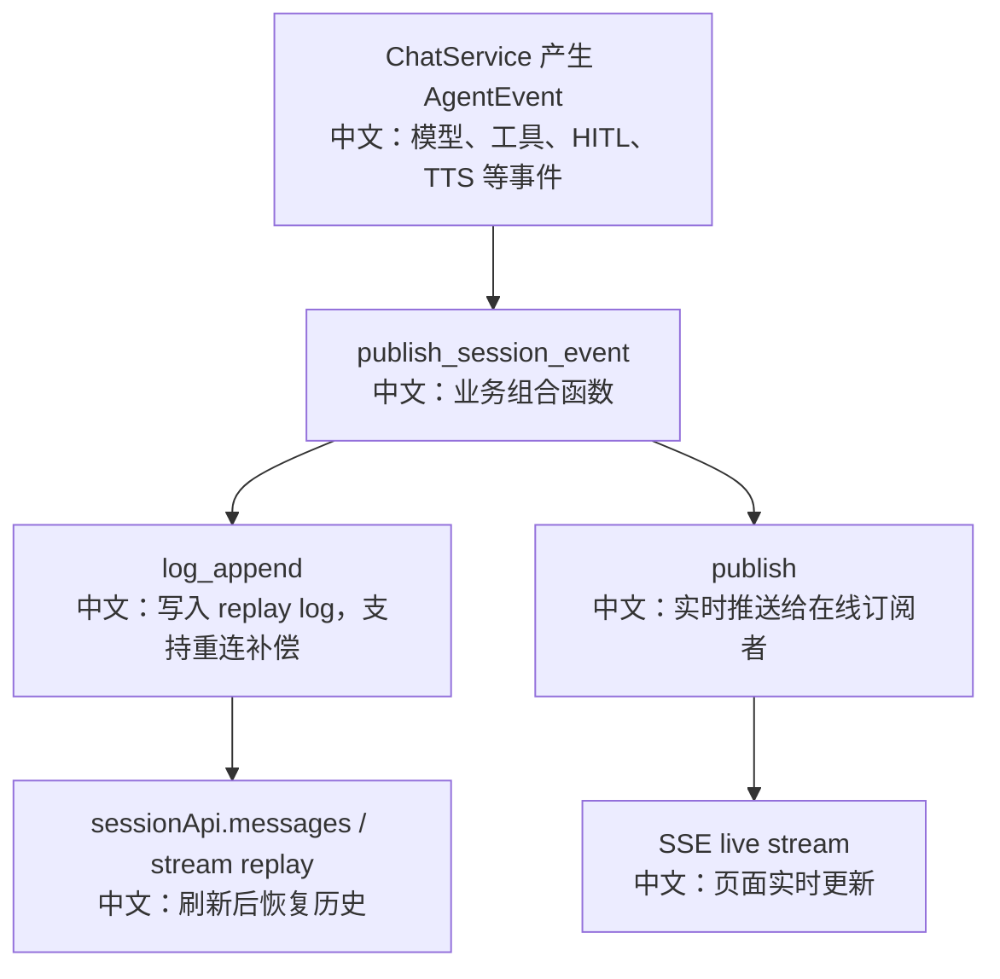

# 消息总线键设计与 Redis 数据结构

> 适合面试表达的关键词：MessageBus 抽象、Redis key 规范、Replay Log、Pub/Sub、Queue、Registry、Distributed Lock、职责分离。

---

## 1. 结论先行

AgentScope 的 `MessageBus` 不是一个单一“消息队列”，而是一组通信原语：

```text
log_append / log_read / log_trim
  中文：可回放事件日志

publish / subscribe
  中文：瞬时广播，在线订阅者实时收到

queue_push / queue_drain / queue_delete
  中文：持久队列，任务或 inbox 消息至少能被后续 drain

registry_set / registry_getall / registry_drop
  中文：hash-like 注册表，保存投影卡片或后台任务状态

acquire_lock / is_locked
  中文：分布式锁，控制同一 session 同时只能有一个 run
```

`MessageBusKeys` 把业务 key 集中管理，避免各个服务到处拼 Redis key。

---

## 2. 源码入口

| 模块 | 源码路径 | 重点 |
|---|---|---|
| key 规范 | `src/agentscope/app/message_bus/_keys.py` | 业务 key 统一定义 |
| MessageBus 抽象 | `src/agentscope/app/message_bus/_base.py` | transport-level primitives |
| 内存实现 | `src/agentscope/app/message_bus/_in_memory_message_bus.py` | 测试和开发用，语义对齐 Redis |
| Redis 实现 | `src/agentscope/app/message_bus/_redis_message_bus.py` | 生产实现 |
| 业务组合函数 | `src/agentscope/app/_bus_ops.py` | publish_session_event、enqueue_run_trigger、enqueue_index_task |
| ChatService | `src/agentscope/app/_service/_chat.py` | session event、run lock、interrupt |
| SessionService | `src/agentscope/app/_service/_session.py` | cancel、delete、bus purge |

---

## 3. 五类数据结构

| 模式 | Bus API | Redis 直觉 | AgentScope 用途 |
|---|---|---|---|
| Replay Log | `log_append/read/trim` | Redis Stream / capped log | Session 事件回放 |
| Pub/Sub | `publish/subscribe` | Redis Pub/Sub | 实时 SSE、cancel、interrupt、wakeup signal |
| Queue | `queue_push/drain/delete` | Redis List / Stream queue | inbox、wakeup queue、index task queue |
| Registry | `registry_set/getall/drop` | Redis Hash | subagent HITL 投影、后台任务 registry |
| Lock | `acquire_lock/is_locked` | SET NX EX | session run lock |

面试表达：

```text
MessageBus 不是把所有通信都塞进一个模型。
它按语义拆成日志、广播、队列、注册表和锁，每种原语解决不同一致性问题。
```

---

## 4. 核心 key 地图

| key | 中文用途 |
|---|---|
| `agentscope:session:events:{sid}` | session 事件 replay log + live pub/sub channel |
| `agentscope:session:lock:{sid}` | session 运行锁，同一 session 同时只能有一个 run |
| `agentscope:inbox:{sid}` | session inbox，TeamSay、Schedule、后台结果等写入 |
| `agentscope:wakeups` | run trigger 持久队列 |
| `agentscope:wakeup_signal` | 唤醒 dispatcher drain wakeups |
| `agentscope:session:cancel` | 全局 session cancel 广播 |
| `agentscope:task:cancel` | 单任务 cancel 广播 |
| `agentscope:session:interrupt` | 全局 graceful interrupt 广播 |
| `agentscope:bg_tasks:{sid}` | session 后台任务 registry |
| `agentscope:index:tasks` | RAG 索引任务持久队列 |
| `agentscope:index:tasks:wake` | RAG 索引 worker 唤醒信号 |
| `agentscope:session:projection:{sid}` | 投影到某个 session UI 的 registry |

---

## 5. Session 事件为什么同时写 log 和 publish

`publish_session_event` 做两步：

```text
1. log_append(session_events, event, max_len=SESSION_REPLAY_MAX_LEN)
   中文：写入可回放事件日志，前端重连时可以补历史。

2. publish(session_events, event + _entry_id)
   中文：实时广播给当前在线的 SSE 订阅者。
```

流程图：



面试表达：

```text
Pub/Sub 解决实时性，Replay Log 解决可恢复性。
只用 Pub/Sub，断线会丢事件；只用 Log，实时性和延迟差。
```

---

## 6. Wakeup queue 为什么也有 signal

`enqueue_run_trigger`：

```text
queue_push(agentscope:wakeups, payload)
publish(agentscope:wakeup_signal, {})
```

payload 里有：

```text
user_id
session_id
agent_id
kind: wake / resume
input: UserConfirmResultEvent / ExternalExecutionResultEvent / UserInterruptEvent / null
```

`wake` 和 `resume` 的区别：

| kind | 中文语义 |
|---|---|
| `wake` | 唤醒 idle session 去 drain inbox，如果 session 正在运行可以跳过，因为 live run 会自己 drain |
| `resume` | 恢复 HITL parked session，不能丢；如果 session 还在运行，要 backoff 后重入队 |

面试表达：

```text
wake 是提醒，resume 是延续一个被暂停的 reply。
两者都用同一个 queue，但语义不同，所以 payload 里必须带 kind。
```

---

## 7. Projection registry：跨 session UI 投影

`agentscope:session:projection:{sid}` 是一个 registry namespace。

典型用途：

```text
worker session 里产生 HITL 确认请求。
leader UI 只订阅 leader session。
所以后端把 worker 的确认卡片投影到 leader session 的 projection registry，
再通过 CustomEvent 推送给 leader。
```

field 设计：

```text
projection_field(kind, entry_id) = "{kind}:{entry_id}"
```

中文意义：

```text
同一个 leader session 可以承载多种投影 feed。
kind 前缀避免不同投影类型字段冲突，也便于按 kind 清理。
```

---

## 8. Index task queue：持久任务 + 瞬时唤醒

RAG 索引任务使用：

```text
agentscope:index:tasks
  中文：持久队列，保存 user_id / knowledge_base_id / document_id

agentscope:index:tasks:wake
  中文：Pub/Sub 信号，提醒 IndexTaskConsumer drain 队列
```

这和 wakeup queue 形状一致，说明系统有一个统一模式：

```text
重要工作落队列。
实时唤醒走 signal。
执行权由 consumer/worker 决定。
```

---

## 9. Lock：Session run lease

`agentscope:session:lock:{sid}` 控制：

```text
同一个 session 同一时刻只能有一个 ChatService.run。
```

它用于：

```text
1. session status 判断 RUNNING。
2. interrupt 判断 running vs parked。
3. WakeupDispatcher 判断是否可以 spawn run。
4. delete_session cancel 后等待 lock 释放。
```

面试表达：

```text
Session lock 是运行态真相。
持久化 context 可能滞后，但 lock 表示现在是否有 worker 正在持有这次运行。
```

---

## 10. 设计权衡

| 选择 | 好处 | 代价 |
|---|---|---|
| key 集中在 `MessageBusKeys` | 易审计、易迁移、避免散落硬编码 | 新增业务 key 要维护集中类 |
| Bus 保持 domain-agnostic | Redis/NATS 等后端可以替换 | 业务层要写组合 helper |
| log + pub/sub 双写 | 兼顾实时和恢复 | 写路径多一步 |
| queue + signal | 兼顾可靠和低延迟 | consumer 要处理重复入队 |
| registry 存 UI 投影 | 跨 session UI 可恢复 | 投影生命周期需要清理 |

---

## 11. 面试沉淀

### 一句话回答

AgentScope 的 MessageBus 把 Redis 能力抽象成 log、pub/sub、queue、registry、lock 五类原语，并用 `MessageBusKeys` 统一管理业务 key，让事件回放、实时推送、后台任务、UI 投影和分布式锁各自有清晰语义。

### 3 分钟讲解版

```text
AgentScope 的 MessageBus 不是简单消息队列。
它把不同通信语义拆成五类：log 用于 session 事件回放，pub/sub 用于实时 SSE 和 cancel/interrupt 广播，queue 用于 inbox、wakeup 和 RAG 索引任务，registry 用于后台任务和 subagent HITL 投影，lock 用于控制同一个 session 只能有一个 run。
比如 ChatService 产生事件时，会通过 publish_session_event 同时 log_append 和 publish：log 让页面刷新后能 replay，publish 让在线页面实时收到。
再比如 RAG 索引和 wakeup 都是 queue + signal：queue 保证任务不丢，signal 负责低延迟唤醒 consumer。
业务 key 全部集中在 MessageBusKeys，比如 session_events、session_lock、inbox、wakeup_queue、index_tasks_queue，这样 Redis key 可以统一审计和迁移。
```

### 高频追问

| 追问 | 回答方向 |
|---|---|
| 为什么事件要 log + publish？ | log 支持重连回放，publish 支持实时更新。 |
| 为什么任务要 queue + signal？ | queue 防丢，signal 降低延迟。 |
| Pub/Sub 会丢怎么办？ | 重要任务不依赖 Pub/Sub 本身，真实任务在 queue 或 log。 |
| registry 用来干嘛？ | 保存 hash-like 状态，例如后台任务和跨 session UI 投影。 |
| session lock 解决什么？ | 防止同一 session 并发 run，并作为 RUNNING 状态依据。 |
| 为什么 key 要集中管理？ | 避免散落硬编码，便于审计、迁移和防碰撞。 |

### 项目表达

```text
我分析过 AgentScope 的 MessageBus key 设计。它把 Redis 语义拆成 replay log、pub/sub、durable queue、registry 和 distributed lock，并用 MessageBusKeys 集中维护业务 key。这样 session 事件可以同时支持实时 SSE 和断线回放，后台任务可以通过 queue + signal 保证可靠和低延迟，多 Agent 的 HITL 投影也能用 registry 做可恢复状态。
```

---

## 12. 后续可深挖

```text
1. 对照 RedisMessageBus 实现，看每个 primitive 对应的具体 Redis 命令。
2. 画一张“Chat run 期间哪些 key 会被读写”的时序图。
3. 继续分析 MessageBus 从 Redis 迁移到 NATS/Kafka 时哪些语义需要适配。
```
