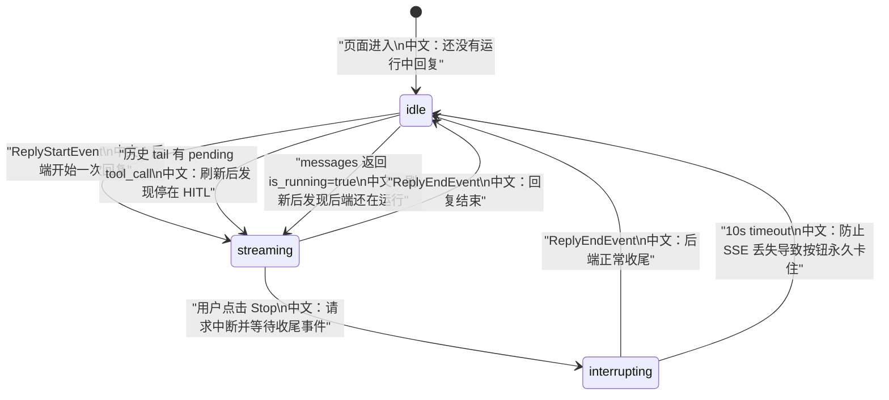

# 前端 Chat 状态机逐事件回放

> 适合面试表达的关键词：历史消息、SSE 增量、乐观追加、ReplyPhase、HITL、Subagent projection、音频 DataBlock、interrupt 兜底。

---

## 1. 结论先行

Web UI 的 Chat 不是简单“发请求，等响应”。`useMessages` 把三类信息合成一个可恢复状态机：

```text
历史消息
  中文：GET /sessions/{sid}/messages 拿到持久化 Msg 列表

实时事件
  中文：GET /sessions/{sid}/stream 建立 SSE，接收 AgentEvent 增量

用户动作
  中文：POST /chat/ 触发 run，POST interrupt 请求停止，HITL 确认继续
```

核心思想：

```text
HTTP trigger 只负责“开始/继续/中断”。
真正的 UI 状态由历史消息和 SSE 事件驱动。
```

---

## 2. 源码入口

| 模块 | 源码路径 | 重点 |
|---|---|---|
| Chat hook | `examples/web_ui/frontend/src/hooks/useMessages.ts` | 历史加载、SSE、事件处理、phase |
| Chat 页面 | `examples/web_ui/frontend/src/pages/chat/ChatViewport.tsx` | 绑定 send、interrupt、HITL、subagentHitl |
| 消息展示 | `examples/web_ui/frontend/src/components/chat/ChatContent.tsx` | 消息列表和输入区 |
| 消息气泡 | `examples/web_ui/frontend/src/components/chat/MessageBubble.tsx` | tool call 分组、音频块、usage 展示 |
| HITL 卡片 | `examples/web_ui/frontend/src/components/chat/ConfirmCard.tsx`、`SubagentHitlCard.tsx` | 普通确认和子智能体确认 |
| API | `examples/web_ui/frontend/src/api/` | `sessionApi.messages`、`sessionApi.streamEvents`、`chatApi.trigger` |

---

## 3. 总体状态机



`ReplyPhase` 只有三个值：

```text
idle：没有进行中的 reply，输入可用。
streaming：reply 正在生成，或者停在 HITL 等待用户。
interrupting：用户已点击 Stop，等待后端 ReplyEndEvent 或超时兜底。
```

---

## 4. 页面加载：先历史，后 SSE

`useMessages` 的加载顺序：

```text
1. 清空当前 msgs、phase、error、subagentHitl、音频播放状态。
2. GET /sessions/{sid}/messages。
3. 把持久化 messages 放入 msgsRef。
4. 如果 is_running=true，则 phase=streaming。
5. 如果最后一条 assistant message 有 asking/submitted tool_call，也 phase=streaming。
6. 建立 SSE 长连接，开始接收 live events。
```

为什么要看 tail pending tool call？

```text
用户刷新页面时，后端可能已经不在 RUNNING，而是停在 HITL。
这时如果只看 is_running，前端会误判 idle，用户看不到 Stop/继续控制。
```

面试表达：

```text
前端恢复状态不能只依赖“是否正在运行”，还要从持久化消息尾部推断 parked 状态。
```

---

## 5. 发送消息：乐观追加 + fire-and-forget trigger

`send(content)` 做两件事：

```text
1. 本地创建 UserMsg 并追加到 msgsRef。
   中文：用户立刻看到自己发出的消息。

2. 调用 chatApi.trigger({ agent_id, session_id, input: userMsg })。
   中文：只触发后端 run，不从这个 HTTP 响应里拿模型输出。
```

模型输出从哪里来？

```text
从已经打开的 SSE stream 里来。
```

这个设计和后端一致：

```text
POST /chat/ 是触发器。
GET /sessions/{sid}/stream 是结果通道。
```

---

## 6. 逐事件回放

### 6.1 ReplyStartEvent

处理逻辑：

```text
1. 停止所有正在播放的音频。
2. 创建新的 AssistantMsg。
3. currentReplyRef 指向这条消息。
4. phase=streaming。
5. 清理 interrupt timer。
```

中文意义：

```text
ReplyStartEvent 是一次 assistant reply 的边界。
它告诉前端后续 delta 应该追加到哪条 assistant message 上。
```

### 6.2 普通 AgentEvent 增量

对于非 CustomEvent、非 ReplyStart/ReplyEnd：

```text
appendEvent(currentReplyRef.current, event)
```

中文意义：

```text
前端不手写每种文本/工具事件的拼接逻辑，而是复用 SDK 的 appendEvent，
把 AgentEvent 转成 Msg.content 的持续变化。
```

### 6.3 ReplyEndEvent

处理逻辑：

```text
1. appendEvent，把 finished_at、usage 等结束信息写入消息。
2. phase=idle。
3. currentReplyRef=null。
4. 清理 interrupt timer。
```

中文意义：

```text
ReplyEndEvent 是 UI 从运行态回到可输入态的主要信号。
```

### 6.4 ExceedMaxItersEvent

处理逻辑：

```text
显示错误：Agent 超过最大迭代次数。
```

中文意义：

```text
系统没有静默截断，而是把“为什么停止”反馈给用户。
```

---

## 7. CustomEvent 不进入消息内容

`useMessages` 对 CustomEvent 单独处理，不调用 `appendEvent`。

| CustomEvent name | 中文行为 |
|---|---|
| `team_updated` | 回调外层刷新 team/session 列表 |
| `state_updated` | 更新任务面板、权限面板等 agent state |
| `subagent_require_user_confirm` | 在 leader 视图添加子智能体 HITL 卡片 |
| `subagent_user_confirm_result` | 清除子智能体 HITL 卡片 |

面试表达：

```text
不是所有事件都属于聊天消息内容。
有些事件是产品状态通知，例如 team 更新、任务状态更新、子智能体确认投影。
前端把它们从消息 append 逻辑里分流出来，避免污染聊天正文。
```

---

## 8. HITL：普通确认和子智能体确认

### 8.1 普通 HITL

用户确认某个 tool call：

```text
1. 找回 replyId 对应的 assistant message。
2. 构造 UserConfirmResultEvent。
3. POST /chat/，input 是这个确认事件。
4. 后续 continuation events 仍然通过 SSE 到达。
```

关键点：

```text
确认结果不是直接改前端状态，而是作为事件喂回后端 Agent。
```

### 8.2 子智能体 HITL

worker session 产生确认请求，但 leader UI 只订阅 leader session。

前端做法：

```text
1. 接收 subagent_require_user_confirm CustomEvent。
2. 在 leader UI 渲染 SubagentHitlCard。
3. 用户确认后，仍然 POST 到 leader session。
4. 后端根据 leader pending hash 把 reply_id 路由到 worker session。
```

中文重点：

```text
前端从不直接操作 worker session。
它只和 leader front door 通信，由后端负责 worker 路由。
```

---

## 9. 音频 DataBlock

TTS 音频通过 DataBlock 事件流回来：

| 事件 | 前端行为 |
|---|---|
| `DATA_BLOCK_START` | 如果 media_type 是 `audio/*`，audioManager.start |
| `DATA_BLOCK_DELTA` | audioManager.append 追加 base64/二进制片段 |
| `DATA_BLOCK_END` | audioManager.end，播放状态完成 |

同时：

```text
这些 DataBlock 仍然会 append 到 Msg.content。
MessageBubble 展示时过滤音频块并交给音频控件渲染。
```

面试表达：

```text
音频没有单独开一套协议，而是复用 AgentEvent 和 SSE，只是在前端按 DataBlock media_type 分流给 audio manager。
```

---

## 10. interrupt：乐观进入 interrupting + 超时兜底

用户点击 Stop：

```text
1. 如果当前 phase=streaming，前端先切到 interrupting。
2. 设置 10 秒 timer。
3. 调用 sessionApi.interrupt。
4. 正常情况下，后端通过 SSE 发 ReplyEndEvent，phase 回到 idle。
5. 如果 ReplyEndEvent 丢失，timer 到期后强制回 idle。
```

中文理解：

```text
interrupt API 返回 202 只代表“控制命令已接受”，不代表回复已经结束。
前端真正收尾依赖 ReplyEndEvent。
```

---

## 11. 为什么用 ref 而不是每个事件都 setState

`useMessages` 使用：

```text
msgsRef
currentReplyRef
requestAnimationFrame scheduleUpdate
```

中文意义：

```text
SSE 事件可能很密集。
如果每个 delta 都 setState，React 渲染压力会很大。
所以先在 ref 里累积，再用 requestAnimationFrame 合并刷新。
```

这是非常实用的前端性能点。

---

## 12. 面试沉淀

### 一句话回答

前端 Chat 状态机把历史消息、SSE 增量事件和用户控制动作合并：POST /chat 只触发运行，真正的文本、工具、HITL、音频和结束状态都由 SSE 事件驱动。

### 3 分钟讲解版

```text
AgentScope Web UI 的聊天不是一次 HTTP 请求拿完整响应。
页面进入时，useMessages 先请求 /sessions/{sid}/messages 拿持久化历史，然后建立 /sessions/{sid}/stream 的 SSE 长连接。
如果后端返回 is_running，或者最后一条 assistant message 有 asking/submitted tool_call，前端会把 phase 初始化为 streaming，这样刷新到 HITL 状态也能恢复控制按钮。
用户发送消息时，前端只乐观追加 UserMsg，然后 POST /chat 触发后端 run；模型输出、工具调用、工具结果、ReplyEnd 都从 SSE 回来。
ReplyStart 创建新的 AssistantMsg，普通事件通过 appendEvent 追加到当前 reply，ReplyEnd 把 phase 切回 idle。
CustomEvent 会被分流处理，比如 team_updated 刷新团队，state_updated 更新任务和权限，subagent_require_user_confirm 展示子智能体确认卡。
点击 Stop 时，前端先进入 interrupting，等待后端 ReplyEndEvent 收尾；如果事件丢失，10 秒超时兜底回 idle。
```

### 高频追问

| 追问 | 回答方向 |
|---|---|
| 为什么 POST /chat 不直接返回回答？ | 回答是流式事件，统一从 SSE 通道回来。 |
| 刷新页面怎么恢复运行态？ | 先拉历史消息，再看 is_running 和 tail pending tool_call。 |
| CustomEvent 为什么不 append 到 Msg？ | 它们是产品状态通知，不是聊天正文。 |
| 子智能体 HITL 为什么 POST 到 leader？ | 前端只操作 leader front door，后端负责路由到 worker。 |
| Stop 为什么需要超时兜底？ | ReplyEndEvent 可能因网络或异常丢失，不能让按钮永久卡住。 |
| 为什么用 requestAnimationFrame？ | 合并密集 SSE delta，减少 React 渲染压力。 |

### 项目表达

```text
我分析过 AgentScope 前端 Chat 状态机。它把历史消息恢复、SSE 增量事件、HITL 确认、子智能体投影、TTS 音频和 interrupt 收尾统一到 useMessages 里。POST /chat 只是触发器，UI 的真实状态由 ReplyStart/Delta/ReplyEnd 和 CustomEvent 驱动，这让我能讲清流式 Agent 产品的前端状态恢复和事件回放设计。
```

---

## 13. 后续可深挖

```text
1. 对 MessageBubble 的 tool_call / tool_result 分组渲染做单独分析。
2. 结合后端 /sessions/{sid}/stream 写一份前后端 SSE 对照表。
3. 补充前端错误态、重连策略和网络断开恢复体验。
```
