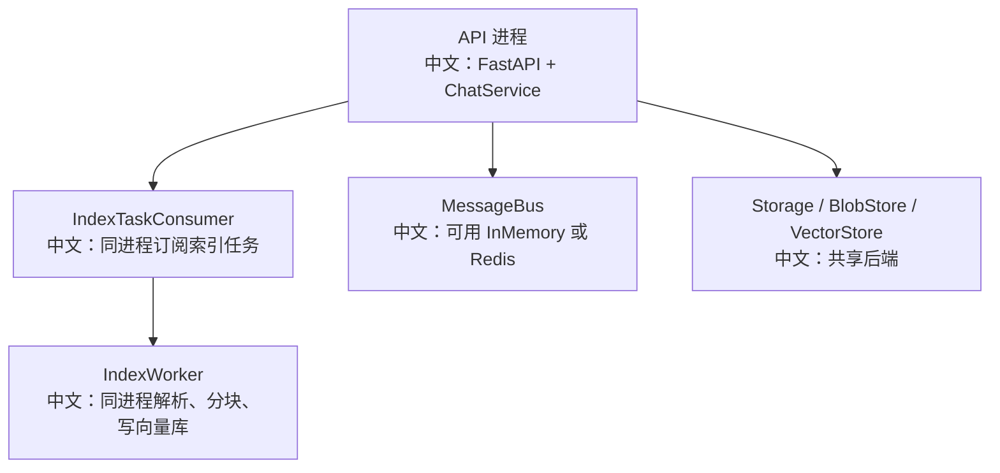
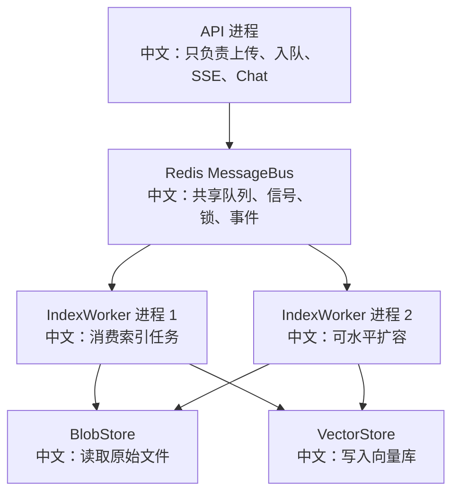

# 部署形态与生产化清单

> 适合面试表达的关键词：应用生命周期、嵌入式 Worker、独立 Worker、Redis、BlobStore、VectorStore、OpenTelemetry、Graceful Shutdown、容量规划。

---

## 1. 结论先行

AgentScope 的生产化部署不是“把 FastAPI 跑起来”这么简单。它至少包含：

```text
API 进程
  中文：处理 HTTP、Chat trigger、SSE、Session/Agent/KnowledgeBase 管理

MessageBus
  中文：Redis 这类共享通信层，承载事件流、队列、锁、广播

Storage
  中文：保存 Agent、Session、Message、KnowledgeBase、Schedule 等记录

BlobStore
  中文：保存知识库上传的原始文件

VectorStore
  中文：保存 RAG chunk embedding

IndexWorker
  中文：异步解析、分块、embedding、写向量库

Observability
  中文：日志、metrics、OpenTelemetry tracing、告警
```

面试里可以把它讲成：**Agent 产品的生产化重点是状态外置、任务可恢复、Worker 可扩缩、事件可回放、运行可观测。**

---

## 2. 源码入口

| 模块 | 源码路径 | 重点 |
|---|---|---|
| App 生命周期 | `src/agentscope/app/_lifespan.py` | 启动 storage、message_bus、workspace、worker、dispatcher |
| RAG 独立 Worker | `src/agentscope/app/rag/index_worker/__init__.py` | `run_worker` 管理 worker 后端生命周期 |
| Worker CLI 入口 | `src/agentscope/app/rag/index_worker/__main__.py` | `AGENTSCOPE_WORKER_BOOTSTRAP` |
| MessageBus | `src/agentscope/app/message_bus/` | Redis / InMemory 通信实现 |
| Storage | `src/agentscope/app/storage/` | RedisStorage 等存储实现 |
| Tracing | `src/agentscope/middleware/_tracing/` | OpenTelemetry 接入 |

---

## 3. 两种部署形态

### 3.1 Embedded：API 进程内跑索引 Worker



适合：

```text
1. 本地开发。
2. Demo。
3. 小规模部署。
4. 简化运维。
```

风险：

```text
1. 大文件解析和 embedding 可能影响 API 响应。
2. Worker 扩容和 API 扩容绑在一起。
3. CPU 密集 parser 需要额外注意进程池。
```

### 3.2 Dedicated：独立索引 Worker



适合：

```text
1. 生产环境。
2. RAG 文档多或文件大。
3. 需要单独扩缩索引能力。
4. API 延迟和后台索引互不影响。
```

关键点：

```text
独立 Worker 通过 AGENTSCOPE_WORKER_BOOTSTRAP 加载部署提供的 backend。
backend 选择属于部署层，不写死在框架里。
```

---

## 4. 启动生命周期

`_lifespan.py` 的启动顺序体现了生产化资源管理：

```text
1. enter storage
2. enter message_bus
3. enter workspace_manager
4. enter knowledge_base_manager / vector_store
5. enter blob_store
6. start BackgroundTaskManager
7. start ChatRunRegistry
8. start SchedulerManager
9. build ResourceAccessService
10. build ChatService / SessionService
11. optionally start IndexTaskConsumer + IndexWorker
12. start IndexSweeper
13. start WakeupDispatcher
14. start CancelDispatcher
```

中文理解：

```text
所有有生命周期的资源都放进 AsyncExitStack。
启动中途失败时，已经进入的资源会按反向顺序退出，避免泄漏。
```

面试表达：

```text
这体现了生产服务的启动/关闭纪律：资源集中托管，失败可回滚，关闭反序释放。
```

---

## 5. 生产化清单

### 5.1 状态外置

| 项 | 要求 |
|---|---|
| Storage | 不能用只存在进程内的临时存储承载生产 Session |
| MessageBus | 多 API / 多 Worker 必须共享同一个 Redis 或等价后端 |
| BlobStore | 知识库文件应使用持久化对象存储 |
| VectorStore | 使用可备份、可扩容的向量库 |
| Workspace | 明确本地、容器、远程沙箱等隔离边界 |

面试表达：

```text
生产化第一件事是把运行态和持久态从单进程内存里拿出来。
```

### 5.2 可靠性

| 风险 | 机制 |
|---|---|
| API 进程崩溃 | Chat run lock TTL、事件 replay、持久 storage |
| Worker 崩溃 | RAG lease TTL + Sweeper 重新入队 |
| SSE 断开 | 前端重新读取历史消息和事件流 |
| Pub/Sub 信号丢失 | 重要任务落 durable queue，signal 只做唤醒 |
| 删除会话时残留状态 | SessionService cancel + storage delete + bus purge |

### 5.3 容量规划

| 维度 | 关注点 |
|---|---|
| API replicas | SSE 长连接数量、Chat trigger QPS |
| Redis | Stream/List/Hash/Lock key 数量、TTL、内存 |
| IndexWorker | parser CPU、embedding API rate limit、max_concurrency |
| VectorStore | collection 数、embedding 维度、索引构建耗时 |
| BlobStore | 文件大小、读取吞吐、生命周期清理 |
| LLM Provider | token 速率限制、失败重试、成本 |

### 5.4 可观测性

最低要求：

```text
1. 结构化日志：session_id、agent_id、reply_id、document_id。
2. OpenTelemetry tracing：Agent、Model、Tool span。
3. RAG 索引指标：pending/parsing/chunking/indexing/ready/error 数量。
4. Redis key 健康：wakeup queue、index task queue、lock 数量。
5. 错误告警：worker error、embedding 失败、tool 失败、SSE 异常。
```

---

## 6. RAG Worker 部署要点

独立 Worker 的入口：

```text
AGENTSCOPE_WORKER_BOOTSTRAP=mydeploy.worker_bootstrap:bootstrap
python -m agentscope.app.rag.index_worker
```

bootstrap 返回：

```text
storage
message_bus
blob_store
knowledge_base_manager
parsers
chunker
可选：worker_max_concurrency、consumer_max_batch、parser_executor
```

中文说明：

```text
框架不替你决定用 Redis、S3、Qdrant、MongoDB 还是 Milvus。
这些属于部署决策，所以通过 bootstrap 注入。
```

生产建议：

```text
1. Worker 和 API 使用同一套 storage/message_bus/blob_store/vector_store。
2. parser 列表要和 API 上传支持的 content types 对齐。
3. 根据 embedding 模型限流设置 worker_max_concurrency。
4. 对大 PDF/Office 文件配置 ProcessPoolExecutor。
5. 给 Worker 设置优雅退出，避免直接 kill。
```

---

## 7. Redis 生产关注点

| key 类型 | 关注点 |
|---|---|
| session events | `SESSION_REPLAY_MAX_LEN` 控制事件日志长度 |
| session lock | TTL 是否足够覆盖长 reply，是否有续租机制 |
| inbox | 删除 session 时是否 purge |
| wakeup queue | 是否出现长期积压 |
| index tasks queue | 是否和 Worker 消费能力匹配 |
| bg_tasks registry | TTL 和清理策略 |
| projection registry | team/HITL 删除时是否清理 |

面试表达：

```text
Redis 在这里不是缓存，而是运行时协调层。
它的 key 增长、TTL、队列积压和锁状态都需要监控。
```

---

## 8. 安全与权限

生产环境必须关注：

```text
1. Credential 不直接暴露给前端。
2. ResourceAccessService 统一处理资源访问策略。
3. PermissionEngine 控制工具调用。
4. HITL 用于危险操作确认。
5. Workspace 隔离避免工具越权访问文件。
6. AgentInvite 不继承 leader 权限，避免跨 workspace 偷渡确认。
```

---

## 9. 面试沉淀

### 一句话回答

AgentScope 生产化部署要把 API、Redis MessageBus、Storage、BlobStore、VectorStore、IndexWorker 和可观测系统分清职责，并用队列、锁、lease、sweeper、tracing 保证异步 Agent 系统可恢复、可扩缩、可排障。

### 3 分钟讲解版

```text
如果要把 AgentScope 部署到生产，我不会只说启动 FastAPI。
它至少有 API 进程、MessageBus、Storage、BlobStore、VectorStore、IndexWorker 和 Observability。
API 负责 HTTP、SSE、Chat trigger 和资源管理；Redis MessageBus 承载 session event、wakeup queue、index task queue、cancel/interrupt 广播和 session lock；Storage 保存 Agent、Session、Schedule、KnowledgeBase 等记录；BlobStore 保存上传原文档；VectorStore 保存 RAG embedding。
RAG 索引可以 embedded 跑在 API 内，也可以 dedicated 独立跑。生产更适合 dedicated，因为解析和 embedding 可能耗 CPU 和外部 API quota。
可靠性上，Chat 依赖 session run lock 和事件 replay，RAG 依赖 lease、heartbeat 和 sweeper，前端依赖历史消息 + SSE 恢复。
可观测上，要接 OpenTelemetry tracing，按 session_id、reply_id、document_id 关联问题。
```

### 高频追问

| 追问 | 回答方向 |
|---|---|
| Embedded 和 Dedicated Worker 怎么选？ | 本地/小规模用 embedded，生产/大文件/高吞吐用 dedicated。 |
| Redis 在这里是缓存吗？ | 不是单纯缓存，是运行协调层：事件、队列、锁、registry。 |
| Worker 崩溃怎么恢复？ | RAG lease 过期后 sweeper 重新入队，其他 worker 接管。 |
| SSE 断线怎么办？ | 前端重新拉历史消息，再订阅事件流，后端有 replay log。 |
| 如何控制索引吞吐？ | worker_max_concurrency、consumer_max_batch、embedding rate limit、parser executor。 |
| 怎么排查一次回复慢？ | 用 OpenTelemetry trace 看 Agent、model、tool、HITL、RAG 等 span。 |
| 生产最怕什么残留？ | session event、inbox、bg_tasks、projection registry 和 vector collection 残留。 |

### 项目表达

```text
我分析过 AgentScope 的生产化部署边界。它把 API、Redis MessageBus、Storage、BlobStore、VectorStore 和 IndexWorker 分层，RAG 索引支持 API 内嵌和独立 Worker 两种形态；生产环境通过 Redis 队列/信号/锁、Worker lease/sweeper、SSE replay log 和 OpenTelemetry tracing 保证可恢复、可扩缩和可排障。
```

---

## 10. 后续可深挖

```text
1. 补一份 docker-compose 示例：API + Redis + Qdrant + MinIO + Worker。
2. 设计 Grafana 面板：Chat 延迟、RAG 队列积压、Worker 成功率、Redis key 数量。
3. 写一份生产故障演练清单：Worker kill、Redis 重启、SSE 断线、向量库不可用。
```
