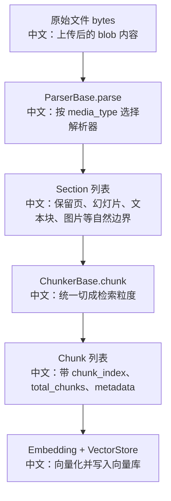

# RAG 解析器与分块策略逐源码分析

> 适合面试表达的关键词：Parser 与 Chunker 职责分离、Section、Chunk、结构边界、近似 token、overlap、多模态 DataBlock、前端 accept 类型。

---

## 1. 结论先行

AgentScope 的 RAG 索引链路把“解析”和“分块”拆成两层：

```text
Parser
  中文：按文件格式读取原始 bytes，保留自然结构边界，输出 Section。

Chunker
  中文：按模型上下文和检索粒度，把 Section 切成 Chunk。
```

这不是随便拆类，而是为了让不同文件格式的结构理解和统一检索粒度控制解耦。PDF 可能按页，PPT 可能按幻灯片，图片可能是一个 DataBlock；但后续向量库只需要统一的 Chunk。

---

## 2. 源码入口

| 模块 | 源码路径 | 重点 |
|---|---|---|
| 文档结构 | `src/agentscope/rag/_document.py` | `Section`、`Chunk` |
| Parser 抽象 | `src/agentscope/rag/_parser/_base.py` | parser 只负责文件格式解析，不负责切 chunk |
| TextParser | `src/agentscope/rag/_parser/_text.py` | 文本类文件解析成单个 Section |
| PDF/Word/PPT/Excel/Image Parser | `src/agentscope/rag/_parser/` | 多格式解析 |
| Chunker 抽象 | `src/agentscope/rag/_chunker/_base.py` | chunker 统一输入输出 |
| ApproxTokenChunker | `src/agentscope/rag/_chunker/_approx_token_chunker.py` | 近似 token 切分、overlap、多模态透传 |
| 测试 | `tests/rag_parser_test.py`、`tests/rag_chunker_approx_token_test.py` | 解析和分块行为 |

---

## 3. 端到端结构



---

## 4. Parser 的边界：只解析，不分块

`ParserBase` 的注释强调：

```text
Parsers do not chunk text.
中文：Parser 不负责长文本切分。
```

它的职责是：

```text
1. 接收 bytes 或文件路径。
2. 根据文件格式解析内容。
3. 输出 Section。
4. 保留 source 和 metadata。
5. 不关心最终 chunk 大小。
```

面试表达：

```text
Parser 关注“原文结构”，Chunker 关注“检索粒度”。
如果让 PDF parser 直接切 chunk，以后换 chunk 策略就要改所有 parser。
```

---

## 5. Section 和 Chunk 的区别

| 概念 | 中文含义 | 典型来源 |
|---|---|---|
| Section | 文档自然结构单元 | PDF 页、PPT 页、文本文件整体、图片 |
| Chunk | 检索和 embedding 单元 | Section 经过 chunker 切分后得到 |

为什么不能直接把 Section 当 Chunk？

```text
1. Section 可能太大，超过 embedding 模型输入限制。
2. Section 可能太小，召回信息不足。
3. 不同文件格式的 Section 粒度不一致。
4. Chunk 需要统一编号和总数，便于引用和展示。
```

---

## 6. TextParser 的设计

`TextParser` 支持：

```text
text/plain
text/markdown
text/csv
text/html
text/x-rst
application/json
application/xml
application/x-yaml
```

它会：

```text
1. 如果输入是 bytes，用指定 encoding 解码。
2. 如果输入是 str 且是本地文件路径，读取文件后解码。
3. 如果输入是普通 str，直接当作已解码文本。
4. 返回一个 Section。
```

重点：

```text
TextParser 不尝试按标题、段落、Markdown heading 切分。
它把文本当作一个 Section，后续交给 Chunker。
```

前端体验细节：

```text
TextParser 重写 supported_extensions。
原因是 mimetypes 对 text/plain 会反查出很多开发扩展，例如 .c、.bat、.pl。
这些不适合直接出现在知识库上传文件选择器里。
```

---

## 7. ApproxTokenChunker 策略

`ApproxTokenChunker` 的核心参数：

| 参数 | 默认值 | 中文说明 |
|---|---|---|
| `chunk_size` | 512 | 每个 chunk 约 512 token |
| `overlap` | 50 | 相邻 chunk 约 50 token 重叠 |

近似 token 计算：

```text
len(text.encode("utf-8")) // 4
```

中文解释：

```text
不依赖具体 tokenizer，用 UTF-8 字节数粗估 token。
好处是轻量、通用、无额外依赖。
代价是不同语言和不同模型 tokenizer 下不完全准确。
```

---

## 8. overlap 为什么重要

没有 overlap 的风险：

```text
一个完整语义刚好跨两个 chunk 边界。
检索时两个 chunk 都不完整，召回质量下降。
```

有 overlap 的好处：

```text
相邻 chunk 保留一部分上下文，降低语义被硬切断的风险。
```

代价：

```text
1. 向量数量增加。
2. 存储成本增加。
3. 检索结果可能更重复。
```

面试表达：

```text
overlap 是召回质量和存储成本之间的 trade-off。
```

---

## 9. 为什么 Chunk 不能跨 Section

源码注释强调：

```text
Chunks never span across two input Sections.
中文：Chunk 不跨 Section。
```

原因：

```text
1. Section 是原文自然边界，例如 PDF 页或 PPT 页。
2. 跨 Section 可能把两个页面、两张幻灯片、两个图片说明硬拼在一起。
3. source 和 metadata 会变得难解释。
4. 引用和定位会变差。
```

---

## 10. DataBlock 透传

`ApproxTokenChunker` 对 `DataBlock`：

```text
不切分，作为一个 chunk 透传。
```

中文解释：

```text
图片、音频、视频这类多模态数据不能用文本 token 方式切。
它们要么作为整体进入 embedding，要么由支持多模态的 embedding 模型处理。
```

这和 `middleware_rag_test.py` 中的多模态检索测试可以串起来讲：

```text
如果 embedding 模型支持多模态，DataBlock 可以进入 query。
如果不支持，会退化为文本部分。
```

---

## 11. 面试沉淀

### 一句话回答

AgentScope 的 RAG 把 Parser 和 Chunker 分开：Parser 保留文件格式的自然结构输出 Section，Chunker 再按近似 token 和 overlap 切成统一的 Chunk，用于 embedding 和向量检索。

### 3 分钟讲解版

```text
AgentScope 的 RAG 索引不是上传文件后直接把全文 embedding。
它先根据 media_type 选择 Parser，把原始 bytes 解析成 Section。
Section 表示文档的自然边界，比如 PDF 页、PPT 幻灯片、文本文件整体或图片。
Parser 不负责 chunk，这是为了避免每种文件格式都重复实现分块策略。
后续 ApproxTokenChunker 会把 Section 切成 Chunk，每个 chunk 约 512 token，并保留约 50 token overlap。
token 不是用具体 tokenizer 算，而是用 UTF-8 字节数除以 4 做近似，这样无依赖、够轻量。
Chunk 不跨 Section，避免把不同页面或不同结构硬拼在一起。
DataBlock 不会被切分，而是作为一个 chunk 透传，给多模态 embedding 留空间。
```

### 高频追问

| 追问 | 回答方向 |
|---|---|
| Parser 为什么不直接切 chunk？ | 文件结构解析和检索粒度控制是两个变化方向，拆开更可维护。 |
| 为什么用近似 token？ | 避免绑定某个 tokenizer，部署更轻；代价是精度不如模型 tokenizer。 |
| overlap 有什么作用？ | 保留边界上下文，提高跨边界语义召回。 |
| overlap 的代价是什么？ | 向量数量、存储成本和重复召回增加。 |
| Chunk 为什么不跨 Section？ | 保留原文结构边界，便于引用和解释。 |
| DataBlock 怎么处理？ | 不切分，整体透传给后续 embedding 或检索逻辑。 |

### 项目表达

```text
我分析过 AgentScope 的 RAG 解析和分块源码。它用 ParserBase 把不同文件格式解析成 Section，再用 ApproxTokenChunker 按近似 token 和 overlap 切成 Chunk，且保证 chunk 不跨 Section。这个设计把文件格式结构和检索粒度解耦，便于扩展 PDF、PPT、图片等不同解析器，也方便统一向量化。
```

---

## 12. 后续可深挖

```text
1. 逐个分析 PDF、Word、PPT、Excel、Image parser 如何构造 Section metadata。
2. 对比按字符、按句子、按标题、按语义 embedding 的分块策略。
3. 结合检索评估，分析 chunk_size 和 overlap 如何影响召回质量。
```
