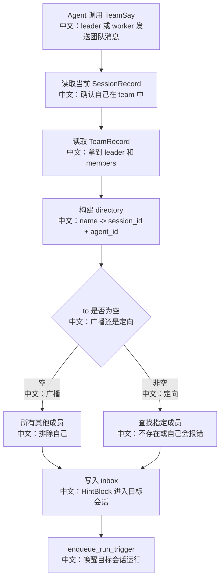

# TeamSay 消息路由与协作拓扑

> 适合面试表达的关键词：多智能体通信、星型拓扑、动态成员目录、inbox+wakeup、HintBlock、created/invited 路由、避免轮询成员。

---

## 1. 结论先行

`TeamSay` 是多智能体之间的主要通信工具。它不是进程内直接调用另一个 Agent，而是：

```text
构造成 HintBlock
  中文：把团队消息伪装成对目标 session 的上下文输入

写入目标 session inbox
  中文：消息持久进入目标会话收件箱

enqueue_run_trigger
  中文：唤醒目标 session 运行，让它处理这条消息
```

这意味着多智能体协作是基于 session 和 MessageBus 的异步通信，而不是内存对象互调。

---

## 2. 源码入口

| 模块 | 源码路径 | 重点 |
|---|---|---|
| TeamSay | `src/agentscope/app/_tool/_team_say.py` | 构建成员目录、选择收件人、写 inbox、唤醒 |
| Toolkit 装配 | `src/agentscope/app/_service/_toolkit.py` | leader/worker 拿到不同 TeamSay 描述和工具集合 |
| Team 成员模型 | `src/agentscope/app/storage/_model_team.py` | `TeamMember(role=created/invited)` |
| bus 操作 | `src/agentscope/app/_bus_ops.py` | `enqueue_run_trigger` |
| 测试 | `tests/service_team_tools_test.py` | Team 工具和路由边界 |

---

## 3. 路由流程



---

## 4. 成员目录如何构建

目录格式：

```text
display_name -> (session_id, agent_id)
```

规则：

| 成员 | display name | 中文说明 |
|---|---|---|
| leader | leader agent name | leader 使用普通名称 |
| created worker | worker agent name | AgentCreate 时已保证 team 内唯一 |
| invited worker | `name@agent_id_prefix` | 防止借用已有 agent 时名称冲突 |

为什么 invited 要带 ID 前缀？

```text
已有用户 Agent 名称可能和 leader 或 created worker 重复。
用 name@handle 兼顾可读性和唯一性。
```

---

## 5. Leader 和 Worker 的工具描述不同

`TeamSay` 根据 role 使用不同 description：

| role | 描述重点 |
|---|---|
| leader | 不要反复轮询成员；成员完成后会主动报告 |
| worker | 完成任务后必须用 TeamSay 向 leader 汇报 |

这不是文案细节，而是协作拓扑设计：

```text
leader 负责任务分发和最终整合。
worker 负责执行子任务并主动回报。
系统避免 leader 不断 poll worker，减少无意义消息和 run 次数。
```

---

## 6. 为什么是星型拓扑

AgentCreate 的工具说明里明确建议：

```text
leader 组织团队，成员向 leader 汇报。
避免鼓励成员互相沟通。
避免创建 integrator-style members。
```

中文理解：

```text
这是一个以 leader 为中心的星型拓扑，而不是完全 peer-to-peer。
```

优点：

```text
1. 通信路径清晰。
2. 最终责任在 leader，便于生成最终答案。
3. 减少多 Agent 互相聊天导致的上下文膨胀。
4. 前端 UI 更容易投影和解释。
```

代价：

```text
1. leader 可能成为协调瓶颈。
2. worker 之间直接协作能力较弱。
3. 非常复杂的团队任务可能需要更强调度器。
```

---

## 7. HintBlock 的意义

`TeamSay` 写入目标 inbox 的内容是：

```text
<team-message from="sender_name">
消息正文
</team-message>
```

并包装成 `HintBlock`。

中文意义：

```text
这不是普通 user 输入，而是一条带来源的系统提示式团队消息。
目标 Agent 能知道这条消息来自哪个成员，且它会进入自己的上下文。
```

---

## 8. inbox + wakeup 的价值

为什么不直接调用目标 Agent？

```text
1. 目标 session 可能在另一个进程。
2. 目标 session 可能当前正在运行。
3. 目标 session 需要可恢复地处理消息。
4. 目标 session 的后续事件应走自己的 event stream。
```

`inbox + wakeup` 解决：

```text
消息先持久化到 inbox。
wakeup 只是触发运行。
如果目标 session 正在运行，live run 可以 drain inbox。
如果目标 session idle，WakeupDispatcher 会启动 run。
```

---

## 9. 边界情况

| 边界 | 行为 |
|---|---|
| 当前 session 不在 team | 返回错误，提示先 TeamCreate |
| team 不存在 | 返回错误 |
| leader session 丢失 | 返回错误 |
| 目标成员不存在 | 返回已知成员列表 |
| 发送给自己 | 返回错误，提示用自己的 reasoning |
| 广播 | 发给所有其他成员，不发给自己 |
| legacy member_ids | `_ensure_team_members` 会迁移成结构化 members |

---

## 10. 面试沉淀

### 一句话回答

TeamSay 通过动态成员目录把团队消息写入目标 session 的 inbox，并用 wakeup queue 唤醒目标 Agent，是基于 MessageBus 的异步多智能体通信机制。

### 3 分钟讲解版

```text
AgentScope 的多智能体通信不是直接在内存里调用另一个 Agent。
TeamSay 调用时会先读取当前 session，确认它在 team 里，再读取 TeamRecord 和 leader session，构建 display_name 到 session_id/agent_id 的目录。
created worker 用普通名字，invited worker 用 name@agent_id_prefix，避免名称冲突。
如果 to 为空，就是广播给所有其他成员；如果 to 指定成员，就定向发送；发送给自己会报错。
真正投递时，TeamSay 会构造 HintBlock，把内容包成 <team-message from="...">，写入目标 session 的 inbox，然后 enqueue_run_trigger 唤醒目标 session。
这说明多 Agent 协作是 session 级异步通信，支持跨进程、可恢复和统一事件流。
```

### 高频追问

| 追问 | 回答方向 |
|---|---|
| TeamSay 是同步调用 worker 吗？ | 不是，写 inbox + wakeup，目标 session 自己运行。 |
| 为什么 invited 名称带 handle？ | 防止已有 agent 名称冲突。 |
| leader 为什么不要反复 poll worker？ | worker 完成后会主动 TeamSay，轮询会增加无效 run 和上下文噪声。 |
| 为什么是星型拓扑？ | leader 负责协调和最终答案，通信更可控。 |
| 广播会发给自己吗？ | 不会，广播排除当前 session。 |
| worker 如何向 leader 汇报？ | worker 也有 TeamSay，但工具描述强调完成任务必须回报 leader。 |

### 项目表达

```text
我分析过 AgentScope 的 TeamSay 路由。它动态构建 team 成员目录，用 created 名称和 invited name@handle 解决路由冲突，并通过 HintBlock 写入目标 session inbox，再用 wakeup queue 唤醒执行。这个设计说明多智能体协作是可恢复的异步 session 通信，而不是进程内对象互调。
```

---

## 11. 后续可深挖

```text
1. 结合 WakeupDispatcher 看目标 session 如何 drain inbox。
2. 补一份 “star topology vs peer-to-peer 多 Agent 拓扑” 对比。
3. 分析 TeamSay 消息如何在前端聊天气泡里展示来源。
```
