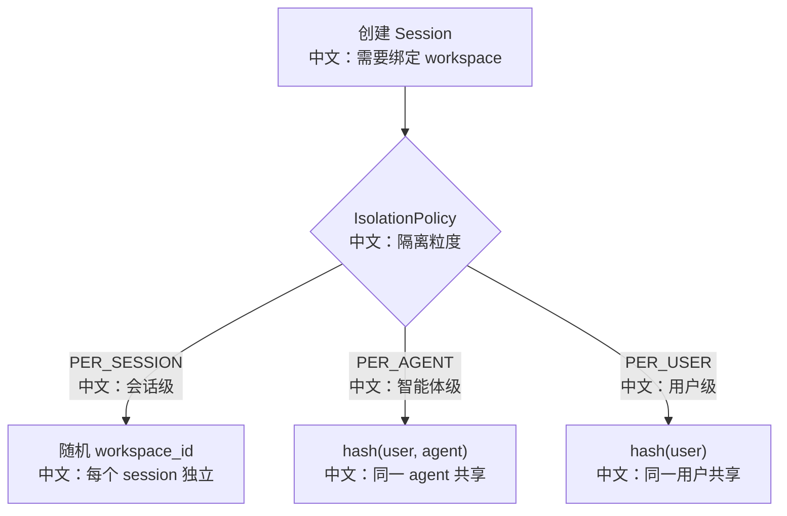

# Workspace 隔离与文件工具安全边界

> 适合面试表达的关键词：隔离粒度、PER_SESSION/PER_AGENT/PER_USER、Sandbox、Backend、working_directories、Bash 安全检查、Accept Edits、危险路径。

---

## 1. 结论先行

AgentScope 的 Workspace 不是“一个目录路径”这么简单。它同时解决两个问题：

```text
执行环境隔离
  中文：工具到底在本地、容器、云沙箱、K8s 还是 OpenSandbox 中运行。

文件权限边界
  中文：哪些路径可以自动读写，哪些操作必须 ASK 或 DENY。
```

面试里可以这样讲：

```text
Workspace 决定工具在哪里执行，PermissionContext 决定工具能不能执行。
一个是运行环境边界，一个是行为授权边界。
```

---

## 2. 源码入口

| 模块 | 源码路径 | 重点 |
|---|---|---|
| WorkspaceManager 抽象 | `src/agentscope/app/workspace_manager/_base.py` | 隔离粒度和 workspace_id 分配 |
| 具体 Manager | `src/agentscope/app/workspace_manager/` | Local/Docker/E2B/Daytona/K8s/OpenSandbox |
| Workspace 实现 | `src/agentscope/workspace/` | 不同后端执行环境 |
| 文件工具 | `src/agentscope/tool/_builtin/` | Bash/Read/Write/Edit/Grep/Glob |
| 权限上下文 | `src/agentscope/permission/_context.py` | working_directories、rules、mode |
| 权限引擎 | `src/agentscope/permission/_engine.py` | allow/deny/ask/mode 决策 |
| 测试 | `tests/workspace_*_test.py`、`tests/builtin_*_test.py`、`tests/permission_bash_parser_test.py` | 隔离和工具安全 |

---

## 3. Workspace 隔离粒度

`WorkspaceManagerBase.assign_workspace_id` 支持三种策略：

| 隔离策略 | workspace_id 生成 | 中文含义 |
|---|---|---|
| `PER_SESSION` | 每个 session 新 UUID | 每次会话独立环境，隔离最强 |
| `PER_AGENT` | hash(user_id + agent_id) | 同一个 agent 的多个 session 共享环境 |
| `PER_USER` | hash(user_id) | 用户级共享环境，协作方便但隔离较弱 |

流程图：



面试表达：

```text
隔离越细，安全和可复现越好；隔离越粗，协作和缓存复用越方便。
```

---

## 4. Workspace 和 Backend 的关系

可以这样理解：

```text
Workspace
  中文：Agent 可使用的执行环境和工具生态，例如 MCP、Skill、文件系统布局。

Backend
  中文：真正执行 shell、读写文件、列目录的底层能力。
```

不同 Workspace 后端：

| 类型 | 中文说明 |
|---|---|
| Local | 在本机目录执行，开发方便，隔离较弱 |
| Docker | 容器隔离，适合本地生产化和 CI |
| E2B / Daytona / OpenSandbox | 云沙箱，适合远程隔离和弹性环境 |
| K8s | 面向集群部署和容器编排 |

---

## 5. PermissionContext 的工作目录边界

文件工具会使用：

```text
PermissionContext.working_directories
```

`ToolBase._path_in_allowed_working_path` 会：

```text
1. 收集当前进程目录和 additional working directories。
2. 对 file_path 和 working_dir 做 expanduser + realpath。
3. 判断目标路径是否在某个 working_dir 内。
```

中文意义：

```text
Accept Edits 模式下，不是所有写操作都自动允许。
只有落在允许工作目录内的文件操作，才可能被自动放行。
```

---

## 6. Bash 工具安全边界

`Bash.check_permissions` 不是简单问一句“是否允许 Bash”。它有多层检查：

```text
0. 注入风险检查
   中文：例如命令替换、动态展开，无法静态分析时要求确认。

1. 只读命令检查
   中文：ls、pwd、git status 等可自动允许。

2. 危险命令模式检查
   中文：匹配高风险命令。

3. sed in-place 约束
   中文：修改敏感文件时要求确认。

4. 危险路径检查
   中文：.ssh、.git、.bashrc 等敏感路径。

5. 危险删除路径检查
   中文：rm/rmdir 指向 /、~、/usr、/etc、* 等系统级路径。

6. ACCEPT_EDITS 工作目录自动允许
   中文：mkdir/touch/rm/mv/cp/sed 等仅在所有目标路径都在工作目录内时自动允许。

7. PASSTHROUGH
   中文：交给 PermissionEngine 的 allow/deny/ask 规则继续判断。
```

---

## 7. 为什么有 bypass_immune

某些安全 ASK 会标记：

```text
bypass_immune=True
```

中文理解：

```text
这类操作即使用户配置了 allow rule，在 DEFAULT / ACCEPT_EDITS 中也不能被普通 allow 规则静默绕过。
例如 rm -rf /、命令注入、敏感路径修改。
```

注意：

```text
BYPASS 模式会跳过安全 ASK。
DONT_ASK 模式会把 ASK 转成 DENY。
```

这正好体现不同运行场景：

| 模式 | 中文含义 |
|---|---|
| DEFAULT | 默认需要确认 |
| EXPLORE | 只读探索 |
| ACCEPT_EDITS | 工作目录内编辑可自动接受 |
| BYPASS | 完全信任，适合强沙箱 |
| DONT_ASK | 无人值守，不能问用户，所以 ASK 变 DENY |

---

## 8. AgentInvite 为什么不继承 leader workspace 权限

这是 Workspace 安全边界的一个典型案例：

```text
AgentCreate 创建的 worker 默认是 leader 的助手，可以按模板继承 leader workspace 和权限规则。
AgentInvite 借用已有 agent，它可能有自己的 workspace。
所以不能把 leader 的 working_directories 和 allow rules 偷渡给 invited agent。
```

面试表达：

```text
权限规则不是纯文本偏好，它绑定到具体 workspace 和文件系统。
跨 workspace 复用用户确认，可能让 Agent 以为自己能访问或修改不该访问的路径。
```

---

## 9. 面试沉淀

### 一句话回答

Workspace 决定工具在哪里执行，PermissionContext 决定工具是否能执行；AgentScope 通过隔离粒度、沙箱后端、working directories 和工具级安全检查共同构成文件工具安全边界。

### 3 分钟讲解版

```text
AgentScope 的 Workspace 不是简单目录，而是执行环境边界。
WorkspaceManager 可以按 session、agent、user 三种粒度分配 workspace_id：session 级隔离最强，agent/user 级更方便复用。
具体执行环境可以是 Local、Docker、E2B、Daytona、K8s 或 OpenSandbox。
但有了 workspace 还不够，文件工具能不能执行要看 PermissionContext。
例如 Accept Edits 模式下，Write/Edit/Bash 文件操作只有在 working_directories 内才可能自动允许。
Bash 工具还有额外安全检查：命令注入、危险命令、敏感路径、危险删除路径、sed in-place 修改等。
一些安全 ASK 是 bypass_immune，在 DEFAULT/ACCEPT_EDITS 下不能被 allow rule 静默绕过。
所以我会把 Workspace 理解为“执行环境隔离”，把 PermissionEngine 理解为“行为授权边界”。
```

### 高频追问

| 追问 | 回答方向 |
|---|---|
| PER_SESSION/PER_AGENT/PER_USER 怎么选？ | 安全隔离 vs 协作复用的权衡。 |
| Workspace 和 Permission 有什么区别？ | Workspace 是在哪里执行，Permission 是能否执行。 |
| Accept Edits 是否允许所有写操作？ | 不是，只自动允许工作目录内符合规则的操作。 |
| Bash 为什么还要检查危险路径？ | Bash 太通用，需要额外静态分析防止命令注入和系统破坏。 |
| BYPASS 安全吗？ | 只适合强沙箱或完全信任场景；无人值守更适合 DONT_ASK。 |
| AgentInvite 为什么不继承 leader 权限？ | workspace 可能不同，权限不能跨文件系统复用。 |

### 项目表达

```text
我分析过 AgentScope 的 Workspace 和文件工具安全边界。WorkspaceManager 负责按 session/agent/user 粒度分配执行环境，具体可以接 Local、Docker 或云沙箱；PermissionContext 则用 working_directories 和 allow/deny/ask 规则控制工具行为。Bash 这类高风险工具还有命令注入、敏感路径和危险删除检查，体现了 Agent 工具执行的纵深防护。
```

---

## 10. 后续可深挖

```text
1. 对比 Local、Docker、Daytona、OpenSandbox 在隔离和恢复上的差异。
2. 逐个分析 Read/Write/Edit/Grep/Glob 的权限规则匹配。
3. 设计“生产环境默认权限模式”建议表。
```
