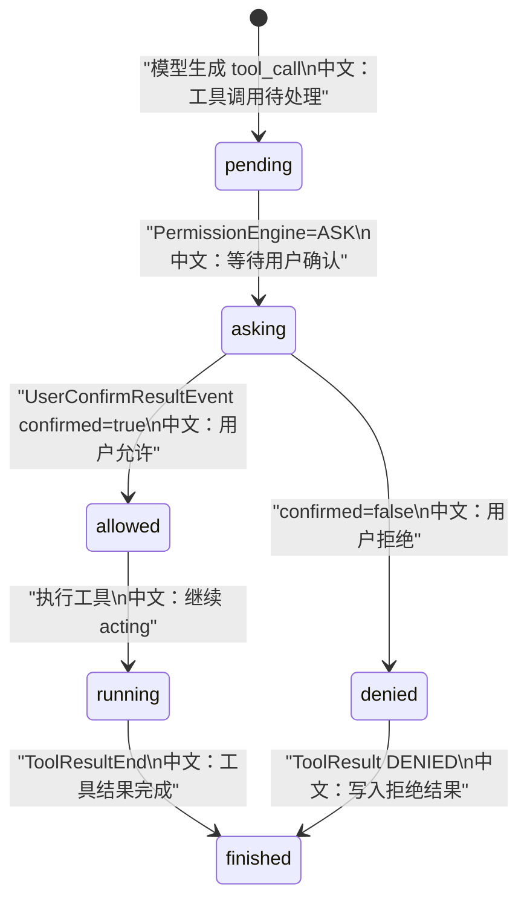

# 权限规则持久化与 HITL 恢复链路

> 适合面试表达的关键词：PermissionEngine、ASK/ALLOW/DENY、suggested_rules、UserConfirmResultEvent、AgentState、HITL parked、resume trigger、state_updated。

---

## 1. 结论先行

AgentScope 的 HITL 不是“弹个确认框”这么简单。完整链路是：

```text
工具调用前检查权限
  ↓
PermissionEngine 返回 ASK
  ↓
Agent 把 tool_call 标记为 asking
  ↓
发出 RequireUserConfirmEvent
  ↓
前端展示确认卡片和 suggested_rules
  ↓
用户确认/拒绝，POST UserConfirmResultEvent
  ↓
Agent 恢复 parked reply
  ↓
如果用户接受 suggested_rules，写入 PermissionContext
  ↓
后续同类工具调用可自动放行
```

这套设计的面试价值在于：**它把工具安全、用户确认、规则学习、状态持久化和断点恢复串成了一条完整链路。**

---

## 2. 源码入口

| 模块 | 源码路径 | 重点 |
|---|---|---|
| 权限引擎 | `src/agentscope/permission/_engine.py` | 模式、规则优先级、suggestions |
| 权限上下文 | `src/agentscope/permission/_context.py` | mode、allow/deny/ask、working dirs |
| Agent HITL | `src/agentscope/agent/_agent.py` | `RequireUserConfirmEvent`、`UserConfirmResultEvent` 处理 |
| 事件定义 | `src/agentscope/event/_event.py` | HITL 事件结构 |
| 前端确认 | `examples/web_ui/frontend/src/hooks/useMessages.ts`、`components/chat/ConfirmCard.tsx` | 构造确认事件、传 rules |
| 子智能体投影 | `src/agentscope/app/_service/_projectors/_subagent_hitl.py` | worker HITL 投影到 leader |
| 测试 | `tests/hitl_user_confirmation_test.py`、`tests/event_to_message_test.py`、`tests/agent_interrupt_test.py` | 确认、恢复、中断 |

---

## 3. 权限决策优先级

`PermissionEngine` 在 DEFAULT 模式的核心顺序：

```text
1. deny rules
   中文：拒绝规则优先级最高。

2. ask rules
   中文：命中后要求用户确认，并生成 suggested_rules。

3. tool.check_permissions
   中文：工具自己的安全检查，例如 Bash 危险命令、Read/Write 路径检查。

4. allow rules
   中文：普通 allow 规则。

5. 默认 ASK
   中文：没有明确放行，就问用户。
```

不同模式：

| 模式 | 中文说明 |
|---|---|
| DEFAULT | 默认谨慎，大多数操作需要确认 |
| EXPLORE | 只允许只读操作 |
| ACCEPT_EDITS | 工作目录内编辑可自动接受 |
| BYPASS | 高信任模式，尽量放行 |
| DONT_ASK | 无人值守，不允许 ASK，ASK 会变 DENY |

---

## 4. HITL 状态流转



关键代码点：

```text
Agent 在 yield RequireUserConfirmEvent 之前，先把 tool_call.state 更新为 ASKING。
中文：这样即使 run 停住，持久化 context 也能表示“正在等确认”。
```

---

## 5. suggested_rules 如何变成持久规则

前端确认卡片会把用户选择的 rules 放进 `UserConfirmResultEvent`。

Agent 处理确认结果时：

```text
if confirmation.confirmed:
    tool_call.state = ALLOWED
    tool_call.name/input = 用户确认后的 tool_call
    if confirmation.rules:
        self._engine.add_rule(rule)
```

中文解释：

```text
用户不是只确认这一次。
如果用户选择“以后也允许类似操作”，suggested_rules 会被加入当前 AgentState.permission_context。
后续同类 tool call 就能被 allow_rules 命中。
```

这就是“规则学习”的工程化形态。

---

## 6. parked reply 如何恢复

刷新页面后，前端会看到最后一条 assistant message 有 `tool_call.state=asking`，于是 phase 仍然是 `streaming`。

用户确认时：

```text
前端构造 UserConfirmResultEvent
  ↓
POST /chat/
  ↓
后端把确认事件作为 resume input
  ↓
Agent._check_incoming_event 校验它是否匹配正在等待的 tool_call
  ↓
Agent._handle_incoming_event 更新 tool_call 状态和规则
  ↓
继续执行工具
```

关键点：

```text
确认事件必须和正在等待的 tool_call id 匹配。
如果传了一个不在 awaiting_confirmations 里的 id，Agent 会报错。
```

这防止前端或过期事件错误恢复别的工具调用。

---

## 7. 子智能体 HITL 为什么需要投影

worker session 自己产生 `RequireUserConfirmEvent`，但用户通常只看 leader session。

所以后端用 `SubagentHitlProjector`：

```text
worker RequireUserConfirmEvent
  ↓
写入 leader 的 projection registry
  ↓
向 leader session 发布 CustomEvent(subagent_require_user_confirm)
  ↓
leader UI 展示 SubagentHitlCard
  ↓
用户确认后仍 POST 到 leader session
  ↓
后端根据 projection 找到 worker_session_id 并转发
```

中文重点：

```text
投影只是镜像，权威状态仍然在 worker session 的 AgentState.context。
```

---

## 8. state_updated 与权限面板

当权限规则或任务状态变化时，后端会通过 `CustomEvent(name="state_updated")` 通知前端。

前端 `ChatViewport` 会更新：

```text
permissionContext
tasksContext
```

中文意义：

```text
用户确认后新增的规则，不只是保存在后端状态里，也能反映到前端权限面板。
```

---

## 9. 面试沉淀

### 一句话回答

AgentScope 的 HITL 把工具调用状态持久化为 asking，通过 RequireUserConfirmEvent 暂停 run，用户确认后用 UserConfirmResultEvent 恢复，并可把 suggested_rules 写入 PermissionContext，形成可恢复、可学习的权限系统。

### 3 分钟讲解版

```text
AgentScope 的工具调用不会直接执行，而是先经过 PermissionEngine。
在 DEFAULT 模式下，它会先看 deny，再看 ask，再看工具自己的安全检查，然后才看 allow，最后默认 ASK。
如果需要确认，Agent 会先把 tool_call.state 更新成 asking，再发出 RequireUserConfirmEvent。
前端收到事件后展示确认卡片，同时可能展示 suggested_rules。
用户确认时，前端 POST 一个 UserConfirmResultEvent。Agent 会检查这个事件是否匹配当前等待确认的 tool_call，匹配才会继续。
如果用户确认，tool_call 会变成 allowed；如果用户还选择了建议规则，Agent 会把规则加入 PermissionContext，后续类似操作可以自动放行。
如果用户拒绝，Agent 会写入 denied 的 tool result。
对于子智能体，worker 的 HITL 会投影到 leader session，leader UI 确认后由后端路由回 worker。
```

### 高频追问

| 追问 | 回答方向 |
|---|---|
| HITL 状态存在哪里？ | 存在 AgentState.context 的 tail assistant message 里，tool_call.state=asking。 |
| suggested_rules 有什么用？ | 用户确认时可把规则写入 PermissionContext，减少未来重复确认。 |
| 确认事件怎么防串？ | Agent 会校验 confirm_results 中的 tool_call id 是否正在等待确认。 |
| DONT_ASK 为什么不返回 ASK？ | 无人值守没有用户可确认，所以 ASK 必须变 DENY。 |
| 子智能体确认为什么投影？ | leader UI 不订阅 worker session，需要把 worker 的确认卡片镜像到 leader。 |
| 投影是不是权威状态？ | 不是，权威状态仍在 worker session 的 context。 |

### 项目表达

```text
我分析过 AgentScope 的权限与 HITL 恢复链路。工具调用前由 PermissionEngine 按 deny/ask/tool safety/allow/default 的优先级决策；ASK 会把 tool_call 持久化成 asking 并发 RequireUserConfirmEvent。用户确认后，UserConfirmResultEvent 恢复 parked reply，并可把 suggested_rules 写入 PermissionContext。这个设计把安全确认、规则学习和断点恢复统一起来。
```

---

## 10. 后续可深挖

```text
1. 逐个权限模式画决策表。
2. 对 ConfirmCard 的 suggested_rules 交互做前端分析。
3. 补充 external execution 的 SUBMITTED 状态恢复链路。
```
