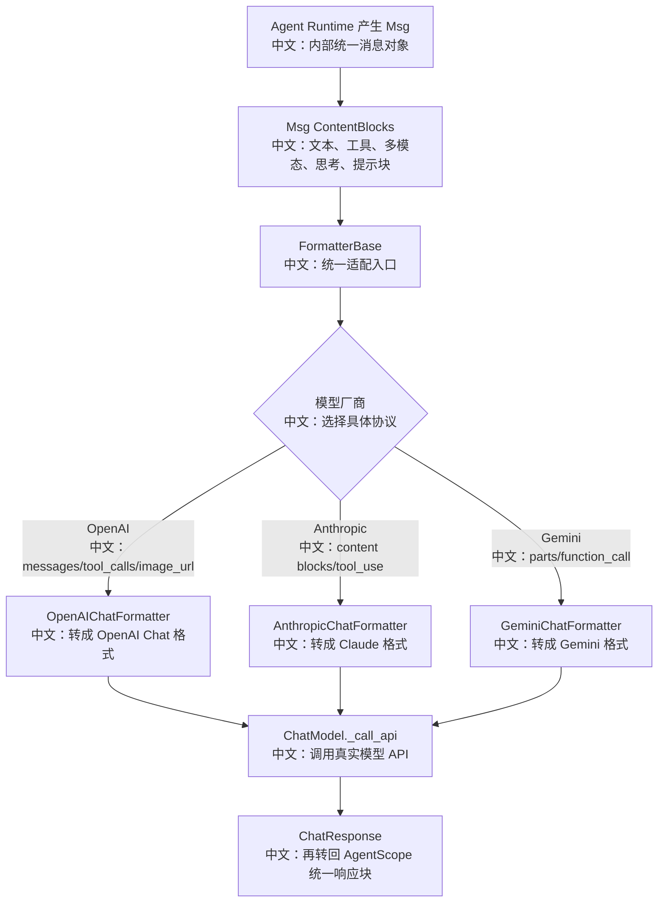

# 模型 Formatter 与多模型协议适配

> 适合面试表达的关键词：统一消息模型、Formatter 适配层、多模态 DataBlock、ToolCall/ToolResult、ThinkingBlock、ModelCard、厂商协议差异、schema 兼容。

---

## 1. 为什么这个点值得单独讲

很多 Agent 项目只做“把 prompt 发给模型”。AgentScope 更像一个多模型运行时：内部统一使用 `Msg`、`TextBlock`、`DataBlock`、`ToolCallBlock`、`ToolResultBlock`、`ThinkingBlock`、`HintBlock`，但外部模型 API 的协议各不相同。

面试里可以这样说：

```text
AgentScope 的 Formatter 层解决的是“内部 Agent 语义”和“外部模型协议”之间的适配问题。
Agent Runtime 不需要知道 OpenAI、Anthropic、Gemini 对 tool call、多模态、thinking 的字段差异；
它只产生统一的消息块，由 Formatter 按模型厂商转换成目标 API 需要的格式。
这让上层 ReAct、HITL、RAG、多 Agent、TTS 等能力可以复用，而不是为每个模型重写一套运行逻辑。
```

**亮点一句话：Formatter 是 AgentScope 的模型协议防腐层。**

---

## 2. 源码入口

| 入口 | 作用 |
|---|---|
| `src/agentscope/formatter/_formatter_base.py` | Formatter 抽象基类，定义输入类型、多模态工具结果降级、消息分组 |
| `src/agentscope/formatter/_openai_formatter.py` | OpenAI Chat / MultiAgent 格式化 |
| `src/agentscope/formatter/_openai_response_formatter.py` | OpenAI Responses API 格式化 |
| `src/agentscope/formatter/_anthropic_formatter.py` | Anthropic 协议适配，thinking 签名、tool_result 用户消息 |
| `src/agentscope/formatter/_gemini_formatter.py` | Gemini parts / function_call / function_response 适配 |
| `src/agentscope/model/_openai_chat/_model.py` | OpenAI 模型调用前使用 formatter.format |
| `src/agentscope/model/_anthropic/_model.py` | Anthropic 调用前抽出 system message |
| `src/agentscope/model/_gemini/_model.py` | Gemini 调用前做 schema sanitize 和 contents/config 适配 |
| `src/agentscope/model/_model_card.py` | 模型能力卡片，决定 UI 参数和输入输出类型 |
| `tests/formatter_*_test.py` | Formatter 契约测试，适合反推协议边界 |

---

## 3. 总体链路



这张图的中文解释：

```text
上层 Agent 只理解统一消息块；Formatter 负责把统一消息块翻译成每个模型厂商自己的请求结构。
模型返回后，再由各模型实现解析成统一的 ChatResponse。
因此“模型可替换”不是只靠配置 model name，而是靠 Formatter + Model 实现共同屏蔽协议差异。
```

---

## 4. FormatterBase 的核心职责

### 4.1 输入类型过滤

`FormatterBase.input_types` 与 `ModelCard.input_types` 对齐。

```text
text/plain
application/x-thinking
image/*
audio/*
video/*
```

中文理解：

```text
模型卡片告诉前端“这个模型能接收什么”；
Formatter 告诉后端“真正发给模型时，哪些 DataBlock 可以透传”。
如果模型不支持某种媒体类型，Formatter 会跳过或降级成文本提醒。
```

### 4.2 工具结果的多模态降级

`convert_tool_result_to_string` 处理一个很容易被忽略的边界：

```text
工具结果可能不是纯文本，而是 TextBlock + DataBlock。
但不是所有 LLM API 都允许 tool_result 里直接放图片/音频。
```

源码策略：

| 场景 | 处理方式 | 中文说明 |
|---|---|---|
| 工具结果是字符串 | 直接作为 tool result 文本 | 最简单路径 |
| 工具结果含支持的 DataBlock | 生成 identifier，并把多模态块提升成后续 user message | 让模型能引用图片/音频 |
| 工具结果含 URL 但模型不支持 | 在文本里说明 URL | 降级但不丢信息 |
| 工具结果含 base64 但模型不支持 | 保存为临时文件，在文本里说明路径 | 保留可追踪位置 |

**面试亮点：这不是格式转换细节，而是多模态工具生态的兼容策略。**

### 4.3 工具序列分组

`_group_messages` 会把消息分成：

```text
tool_sequence：包含 tool_call / tool_result 的连续片段
agent_message：普通对话消息片段
```

为什么需要分组？

```text
多 Agent 场景里，普通对话历史可以被压平成“谁说了什么”的文本历史；
但 tool_call/tool_result 必须保留厂商协议要求的结构，否则模型无法继续工具链。
```

---

## 5. OpenAI Formatter 的关键处理

### 5.1 多模态输入

OpenAI formatter 对 `DataBlock` 的处理：

| 类型 | OpenAI 格式 | 中文说明 |
|---|---|---|
| image | `image_url` | URL 直接透传，本地 `file://` 转 base64 data URI |
| audio | `input_audio` | 音频必须转 base64，并限制 `wav/mp3` |
| 不支持类型 | warning 后跳过 | 避免发送非法请求 |

面试表达：

```text
OpenAI 的图片和音频字段结构不同，所以 Formatter 先按 media_type 分流。
图片可以是 URL 或 base64；音频则需要 input_audio 结构，并且要校验 wav/mp3。
```

### 5.2 ToolCall / ToolResult

OpenAI 工具调用结构：

```text
ToolCallBlock
  -> role=assistant
  -> tool_calls=[{id,type=function,function:{name,arguments}}]

ToolResultBlock
  -> role=tool
  -> tool_call_id
  -> content
```

中文解释：

```text
AgentScope 内部的工具块是统一对象；OpenAI 要求 assistant 消息携带 tool_calls，
工具结果必须是 role=tool，并且用 tool_call_id 对齐之前的调用。
Formatter 在这里维护了工具调用和工具结果之间的关联。
```

### 5.3 ThinkingBlock 的处理

OpenAI Chat Formatter 会跳过 `ThinkingBlock`：

```text
OpenAI API 不接受 conversation history 中的 reasoning/thinking content，
所以 Formatter 静默跳过，避免下一轮请求失败。
```

这是一个典型面试点：

```text
不同模型对 reasoning history 的要求不同。
有些需要保留，有些不能回传。
Formatter 必须按厂商协议处理，而不是一刀切。
```

---

## 6. Anthropic Formatter 的关键处理

Anthropic 的协议差异更多。

### 6.1 system message 单独抽出

在 `AnthropicChatModel._call_api` 中：

```text
formatted_messages[0].role == system
  -> kwargs["system"] = formatted_messages[0]["content"]
  -> 从 messages 列表里移除 system
```

中文说明：

```text
Anthropic API 不把 system 当普通 messages 之一，而是单独字段。
所以模型层还要配合 Formatter 做最后一次厂商字段拆分。
```

### 6.2 ThinkingBlock 要有 signature

Anthropic formatter 只保留带 signature 的 thinking block。

```text
如果 ThinkingBlock 没有 signature，就丢弃。
原因是 Anthropic 会校验 thinking signature，空签名会导致 400。
```

面试表达：

```text
Thinking 不是普通文本。
对 Anthropic 来说，它有连续推理上下文和签名校验语义；
从其他厂商来的 thinking block 不能直接塞回 Anthropic 请求。
```

### 6.3 tool_result 必须放在 user message

Anthropic 要求工具结果是用户侧 content block：

```text
ToolResultBlock
  -> {"type": "tool_result", "tool_use_id": id, "content": [...]}
  -> role 强制为 user
```

同时源码里还处理了空文本：

```text
Anthropic 拒绝空 text block 和空 tool_result content。
如果工具输出为空，会补 "(empty tool output)"。
```

这类细节非常适合回答“你读源码读到了什么边界条件？”

---

## 7. Gemini Formatter 的关键处理

Gemini 的核心结构是 `contents[].parts[]`。

| AgentScope 块 | Gemini 格式 | 中文说明 |
|---|---|---|
| TextBlock | `{text: ...}` | 普通文本 |
| ThinkingBlock | `{thought: true, text: ...}` | Gemini 用 thought 标记思考 |
| ToolCallBlock | `{function_call: {id,name,args}}` | 工具调用 |
| ToolResultBlock | `{function_response: {id,name,response}}` | 工具结果 |
| DataBlock | `{inline_data: {data,mime_type}}` | 多模态内容 |

### 7.1 schema sanitize

`GeminiChatModel` 里有 `_sanitize_schema_for_gemini`，会处理：

```text
additionalProperties：删除
const：转 enum
anyOf + null：简化
type=null：转 object
```

中文说明：

```text
工具 schema 通常来自 Pydantic、MCP 或其他外部系统。
Gemini 不支持完整 JSON Schema，所以模型调用前必须做兼容清洗。
这说明多模型适配不仅是 message 格式，还包括工具 schema 语法差异。
```

---

## 8. MultiAgent Formatter 为什么特殊

多智能体对话不是普通 user/assistant 二人对话。

OpenAI MultiAgent Formatter 的思路：

```text
普通 agent_message：
  合并成 Conversation History
  每行带 msg.name

tool_sequence：
  交给 OpenAIChatFormatter 保留结构
```

中文解释：

```text
多智能体场景里，模型需要知道“谁说了什么”。
但大多数模型 API 没有真正的多角色 Agent 协议，只支持 user/assistant/tool。
所以 Formatter 把成员发言压平成带名字的历史文本，同时保留工具调用结构。
```

面试亮点：

```text
这是“产品语义”和“模型协议能力不足”之间的折中。
产品上有 leader/worker/team message；
模型协议上只有少数 role；
Formatter 用 history prompt 承载多智能体身份。
```

---

## 9. ModelCard 如何和 Formatter 配合

`ModelCard.from_yaml` 会读取模型 YAML，并根据参数类生成前端参数 schema。

关键逻辑：

| 逻辑 | 中文说明 |
|---|---|
| `input_types` / `output_types` | 声明模型支持的输入输出类型 |
| 没有 `application/x-thinking` 就隐藏 thinking 参数 | 避免 UI 暴露无效开关 |
| 没有 `audio/*` output 就隐藏 voice 参数 | 只有语音输出模型展示 voice |
| `output_size` 注入到 `max_tokens.maximum` | 前端参数上限来自模型卡 |
| `parameter_overrides` | 模型 YAML 可以隐藏或覆盖参数 |

这条链路可以讲成：

```text
ModelCard 负责“能力发现和 UI 约束”，Formatter 负责“协议转换和运行时校验”。
前者减少用户选错参数，后者保证请求真的符合模型 API。
```

---

## 10. 面试沉淀

### 一句话回答

```text
AgentScope 的 Formatter 层是多模型适配的核心，它把内部统一的 Msg/Block 语义转换成 OpenAI、Anthropic、Gemini 等厂商各自的 messages、parts、tool_call、tool_result、thinking 和多模态格式，让上层 Agent Runtime 不需要关心模型协议差异。
```

### 3 分钟回答

```text
我会把 Formatter 理解成 AgentScope 的模型协议防腐层。
Agent Runtime 内部只处理统一的 Msg 和内容块，比如 TextBlock、DataBlock、ToolCallBlock、ToolResultBlock、ThinkingBlock、HintBlock。
真正调用模型前，具体模型实现会调用 formatter.format，把这些统一块转换成目标厂商协议。

OpenAI 需要 messages、tool_calls、role=tool、image_url、input_audio；
Anthropic 需要 content blocks、tool_use、tool_result，并且 tool_result 必须放在 user message，thinking block 还要有 signature；
Gemini 则使用 contents.parts、function_call、function_response、inline_data，并且工具 schema 还要 sanitize。

多 Agent 场景更有意思，因为模型 API 通常没有真正的多智能体 role。
所以 MultiAgentFormatter 会把普通成员发言压成带 name 的 conversation history，但保留工具调用序列的结构。
再配合 ModelCard 的 input_types、output_types、parameter_schema，前端能知道模型支持什么，后端能保证请求格式正确。
```

### 高频追问

| 追问 | 回答方向 |
|---|---|
| Formatter 和 Model 有什么区别？ | Formatter 负责消息协议转换；Model 负责参数、重试、真实 API 调用和响应解析。 |
| 为什么不用一个通用 JSON 直接发给所有模型？ | 各厂商对 role、tool、thinking、多模态、schema 的结构要求不同，通用 JSON 会丢语义或直接报错。 |
| ThinkingBlock 能不能跨模型复用？ | 不能简单复用。OpenAI Chat 跳过 thinking，Anthropic 需要 signature，Gemini 用 thought 标记。 |
| 多 Agent 历史怎么喂给模型？ | 多数模型没有多 agent role，所以 Formatter 把成员名字写进 conversation history 文本。 |
| 工具返回图片怎么办？ | 如果模型支持对应媒体类型，就提升成 user message；不支持则降级成 URL 或本地路径提醒。 |
| Gemini 为什么要 sanitize schema？ | Gemini 不支持完整 JSON Schema，比如 additionalProperties、const、null，需要调用前改写。 |

---

## 11. 可以延伸的知识

| 方向 | 可延伸知识 |
|---|---|
| 适配器模式 | Formatter 是典型 adapter，把统一领域模型转成外部 API 协议 |
| 防腐层 | 隔离厂商协议变化，保护 Agent Runtime 的稳定语义 |
| 多模态工程 | 图片、音频、视频的 source、base64、URL、本地文件处理 |
| 工具调用协议 | tool_call/tool_result 的 ID 对齐、并行结果、空结果兜底 |
| 多模型兼容 | 参数能力发现、schema 降级、thinking 差异、streaming 差异 |
| 测试策略 | 用 formatter tests 覆盖边界输入，比只测模型调用更稳定 |
