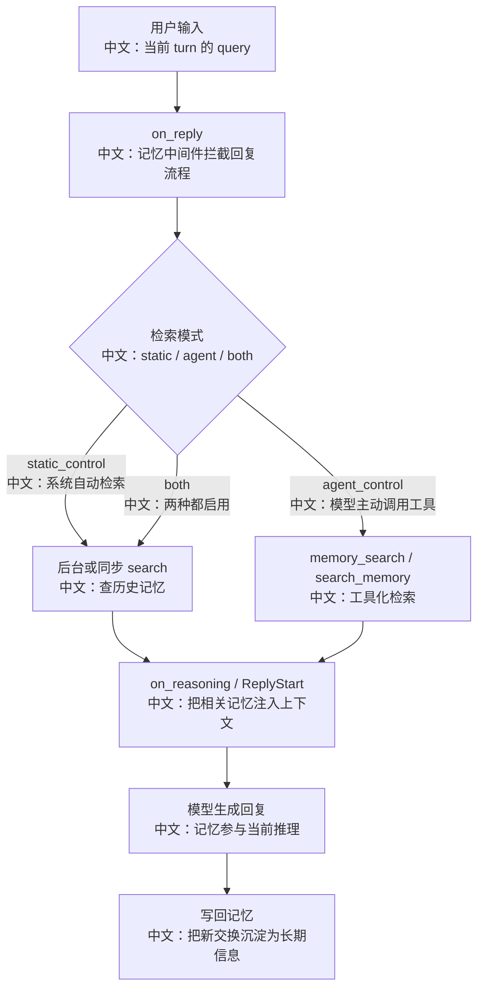

# 长期记忆写入检索与注入链路

> 适合面试表达的关键词：长期记忆、检索注入、自动写回、static_control、agent_control、mem0、ReMe、文件型记忆、session/user/agent 作用域、异步检索。

---

## 1. 为什么长期记忆是面试高频

Agent 系统只靠当前上下文是不够的。用户偏好、历史决策、项目背景、跨会话事实，都需要被持久化，并在未来任务里重新注入。

AgentScope 的长期记忆不是单一实现，而是提供了多种中间件路线：

| 实现 | 适合场景 | 核心特点 |
|---|---|---|
| AgenticMemoryMiddleware | 文件型、可读可编辑、适合本地 workspace | `MEMORY.md` 索引 + Markdown 记忆文件 + LLM 选择相关文件 |
| Mem0Middleware | 接入 mem0 生态或托管平台 | `search_memory` / `add_memory` 工具 + 自动检索/写回 |
| ReMeMiddleware | 嵌入 ReMe 应用 | `memory_search` 工具 + `auto_memory` 自动写回 |

面试里可以这样说：

```text
长期记忆的本质不是“把所有历史塞进 prompt”，而是把跨会话信息结构化存储，并在当前任务需要时检索、筛选、注入。
AgentScope 把长期记忆做成 Middleware，让记忆能力可以插入 Agent 的 on_system_prompt、on_reply、on_reasoning 等生命周期节点。
```

---

## 2. 源码入口

| 入口 | 作用 |
|---|---|
| `src/agentscope/middleware/_longterm_memory/_agentic_memory/_middleware.py` | 文件型长期记忆，实现 `MEMORY.md` 注入和相关文件异步检索 |
| `src/agentscope/middleware/_longterm_memory/_mem0/_middleware.py` | mem0 长期记忆中间件，支持自动检索/写回和工具控制 |
| `src/agentscope/middleware/_longterm_memory/_mem0/_tools.py` | `search_memory` / `add_memory` 工具 |
| `src/agentscope/middleware/_longterm_memory/_reme/_middleware.py` | ReMe 长期记忆中间件，嵌入 ReMe 应用 |
| `src/agentscope/middleware/_longterm_memory/_reme/_tools.py` | `memory_search` 工具 |
| `src/agentscope/agent/_agent.py` | Middleware 生命周期挂载点 |

---

## 3. 总体链路



中文解释：

```text
长期记忆通常分成三步：检索、注入、写回。
检索可以由系统自动做，也可以暴露成工具让模型按需调用。
注入不是把所有记忆塞进去，而是把相关片段作为 HintBlock 或上下文消息加入当前推理。
写回发生在回复完成后，避免半成品对话污染记忆。
```

---

## 4. 三种控制模式

### 4.1 static_control

```text
系统自动检索
  -> 把结果注入上下文
  -> Agent 不需要知道有工具
```

适合：

```text
用户偏好、身份信息、常见背景自动生效。
```

风险：

```text
如果检索不准，模型可能被无关记忆干扰。
```

### 4.2 agent_control

```text
系统不自动检索
  -> 暴露 memory_search / search_memory 工具
  -> 模型自己判断什么时候搜
```

适合：

```text
需要模型先理解任务，再判断是否需要历史信息。
```

风险：

```text
模型可能忘记调用工具，导致本该使用的记忆没有被用上。
```

### 4.3 both

```text
自动检索 + 工具检索同时启用
```

适合：

```text
既希望常用记忆自动注入，又允许模型在复杂任务中主动补查。
```

---

## 5. AgenticMemoryMiddleware：文件型记忆

### 5.1 数据结构

文件型记忆由两层组成：

```text
Memory/
  MEMORY.md                 # 索引，始终注入 system prompt
  user_role.md              # 具体记忆文件
  feedback_testing.md
  project_context.md
```

`MEMORY.md` 是索引，不直接承载完整记忆内容。

中文理解：

```text
索引用于快速告诉模型有哪些记忆；
具体文件用于保存详细内容；
这样可以在 prompt 成本和信息完整性之间做平衡。
```

### 5.2 system prompt 注入

`on_system_prompt` 会：

```text
1. 确保 Memory 目录和 MEMORY.md 存在
2. 读取 MEMORY.md
3. 按 memory_max_tokens 截断
4. 把记忆写入说明 + MEMORY.md 索引追加到 system prompt
```

亮点：

```text
这不是只给模型“历史摘要”，而是给模型一套如何读写记忆的操作规范。
```

### 5.3 异步相关文件检索

`on_reply` 中会根据用户输入启动 `_retrieve_relevant_files` 异步任务。

检索流程：

```text
扫描 Markdown 文件 frontmatter
  -> 生成文件 manifest
  -> 调用模型结构化输出选择 relevant files
  -> 丢弃幻觉文件名
  -> 读取选中文件并截断
  -> on_reasoning 中注入 HintBlock
```

面试亮点：

```text
它没有全量读取所有记忆文件，而是先读 frontmatter 低成本筛选，再读取少量相关文件。
这和 RAG 的“先召回再注入”思想一致，只是索引形态是 Markdown 文件。
```

---

## 6. Mem0Middleware：外部记忆服务路线

### 6.1 命名空间

mem0 使用：

```text
user_id
agent_id
```

源码中支持：

| 参数 | 中文说明 |
|---|---|
| `user_id` | 必填，用户级命名空间 |
| `agent_id` | 可选，细分到 agent |
| `scope_search_by_agent` | 是否检索时也按 agent_id 过滤 |

中文解释：

```text
如果按 agent 过滤，记忆更隔离；
如果只按 user 过滤，用户记忆可以跨 agent 共享。
这是“相关性”和“隔离性”的权衡。
```

### 6.2 自动检索和写回

在 `static_control` / `both` 下：

```text
on_reply
  -> 从 inputs 提取 query_text
  -> mem0.search(query, filters={user_id, agent_id})
  -> ReplyStartEvent 后把 memory message 插入 context
  -> 回复结束后 mem0.add(user+assistant exchange)
```

注意点：

```text
mem0 写回默认 await_write=True，可以保证写入完成；
也可以 fire-and-forget，降低响应延迟，但错误只在日志里出现。
```

### 6.3 工具控制

mem0 暴露两个工具：

| 工具 | 是否只读 | 作用 |
|---|---|---|
| `search_memory` | 是 | 多关键词并行搜索、合并去重 |
| `add_memory` | 否 | 记录 durable facts，只持久化 content，不持久化 thinking |

`add_memory` 的设计细节很适合面试：

```text
thinking 用于让模型说明为什么要记；
但真正写入 mem0 的只有 content。
这样既保留决策可审计性，又避免把模型自我叙述污染成用户事实。
```

---

## 7. ReMeMiddleware：自动写回 + 搜索工具

ReMe 的定位不同：

```text
它嵌入一个 ReMe 应用，不需要单独起服务。
写入由 auto_memory job 自动完成；
对 Agent 暴露的只有 memory_search，没有 manual add tool。
```

### 7.1 session_id 作用域

ReMe 写回按 `agent.state.session_id` 取 session：

```text
session_id 不存在 middleware 配置里；
每次 hook 时从 agent.state.session_id 读取。
```

中文理解：

```text
一个 ReMeMiddleware 实例可以被多个 agent/session 共享；
但写回时按当前 agent 的 session_id 隔离，避免并发会话互相污染。
```

### 7.2 检索并发

ReMe 在 `static_control` / `both` 下会：

```text
on_reply 开始时创建后台 search task
on_reasoning 检查 task 是否完成
完成后把 memories 作为 HintBlock 注入
reply finally 中取消/消费未完成 task，避免泄漏
```

面试亮点：

```text
这是一个延迟和完整性的权衡。
检索和回复并行，减少首 token 等待；
但单轮短回复可能在检索完成前结束，本轮就注入不到。
源码注释把这种 best-effort 语义写得很清楚。
```

### 7.3 自动写回

ReMe 在 reply finally 中：

```text
比较 pre_ids 和当前 context
  -> 找出本轮新增消息
  -> 排除 memory hint
  -> 确认有用户 query 和非空 assistant 回复
  -> 调用 auto_memory job 写回
```

中文解释：

```text
它不是把整个历史重复喂给记忆系统，而是只写入本轮增量。
这样能减少重复记忆，也避免旧上下文被反复抽取。
```

---

## 8. 三种实现对比

| 维度 | AgenticMemory | Mem0 | ReMe |
|---|---|---|---|
| 存储形态 | Markdown 文件 | mem0 OSS/Platform | ReMe workspace |
| 自动检索 | 支持 | 支持 | 支持 |
| 工具检索 | 通过文件工具间接读 | `search_memory` | `memory_search` |
| 手动写入工具 | 通过 Write 工具写文件 | `add_memory` | 无，自动写回 |
| 写回时机 | 模型按说明写文件 | 回复后 add | 回复后 auto_memory |
| 作用域 | workspace 文件目录 | user_id / agent_id | session_id 写回，workspace 搜索 |
| 可解释性 | 很强，用户可直接读 Markdown | 中等，依赖 mem0 结果 | 中等，依赖 ReMe memory cards |
| 工程复杂度 | 本地简单 | 依赖 mem0 客户端/服务 | 嵌入 ReMe app |

---

## 9. 长期记忆和 RAG 的区别

| 对比项 | 长期记忆 | RAG 知识库 |
|---|---|---|
| 内容来源 | 对话中沉淀的用户偏好、历史事实、项目背景 | 用户上传的文档、知识库材料 |
| 更新方式 | 对话后自动写回或工具写入 | 上传后异步解析、分块、embedding |
| 检索粒度 | 记忆条目、memory file、memory card | chunk |
| 注入时机 | 回复前或 reasoning 中 | RAG middleware 检索后注入 |
| 面试关键词 | personalization、cross-session memory | retrieval augmented generation、document indexing |

一句话：

```text
RAG 解决“查外部知识”，长期记忆解决“记住用户和历史互动”。
```

---

## 10. 面试沉淀

### 一句话回答

```text
AgentScope 的长期记忆通过 Middleware 插入 Agent 生命周期，在回复前检索相关历史，在 reasoning 中注入 HintBlock 或上下文消息，并在回复完成后把新交换写回记忆系统；它支持文件型记忆、mem0、ReMe 等不同后端。
```

### 3 分钟回答

```text
长期记忆不是简单保存聊天记录，而是把跨会话有价值的信息变成可检索、可注入、可更新的知识。
AgentScope 里长期记忆做成 Middleware，所以可以挂到 on_system_prompt、on_reply、on_reasoning 等生命周期。

文件型 AgenticMemory 会把 MEMORY.md 索引注入 system prompt，并异步让模型从 Markdown frontmatter 中挑选相关文件，再把文件内容作为 HintBlock 注入。
Mem0Middleware 则可以在 static_control 下自动搜索并写回，也可以在 agent_control 下暴露 search_memory/add_memory 工具。
ReMeMiddleware 更偏自动化，暴露 memory_search，但写入由 auto_memory job 自动完成，没有手动 add 工具。

这里的工程亮点是作用域和时机控制。
mem0 用 user_id/agent_id 控制记忆隔离；ReMe 从 agent.state.session_id 实时读取 session_id，避免共享 middleware 时串会话。
写回通常发生在 reply finally，且只写本轮增量，避免半成品或重复历史污染长期记忆。
```

### 高频追问

| 追问 | 回答方向 |
|---|---|
| 长期记忆和上下文压缩有什么区别？ | 上下文压缩服务当前长会话；长期记忆服务跨会话复用。 |
| 长期记忆和 RAG 有什么区别？ | RAG 面向上传文档；长期记忆面向对话中沉淀的用户/项目事实。 |
| 为什么不把所有历史都放进 prompt？ | 成本高、噪声大、会超过上下文窗口，所以要检索筛选后注入。 |
| static_control 和 agent_control 怎么选？ | 前者自动稳定，后者让模型按需搜索；both 兼顾但可能增加噪声。 |
| 写回为什么放在回复完成后？ | 避免中途失败、空回复、半成品工具链污染记忆。 |
| ReMe 为什么没有 add_memory 工具？ | 它用 auto_memory 从完整对话增量中抽取记忆，减少模型手动乱写。 |
| mem0 的 thinking 为什么不持久化？ | thinking 是写入理由，不是用户事实；持久化会污染记忆库。 |

---

## 11. 可以延伸的知识

| 方向 | 可延伸知识 |
|---|---|
| 个性化 Agent | 用户偏好、长期画像、跨会话连续性 |
| 检索系统 | query 抽取、top_k、threshold、去重、注入格式 |
| 数据治理 | 记忆删除、过期、隐私、错误记忆修正 |
| 并发安全 | per-session retrieval task、finally 清理、共享 middleware 隔离 |
| 产品设计 | 用户是否可见、可编辑、可关闭长期记忆 |
| 面试表达 | 从“能聊天”升级到“能长期协作”的关键能力 |
