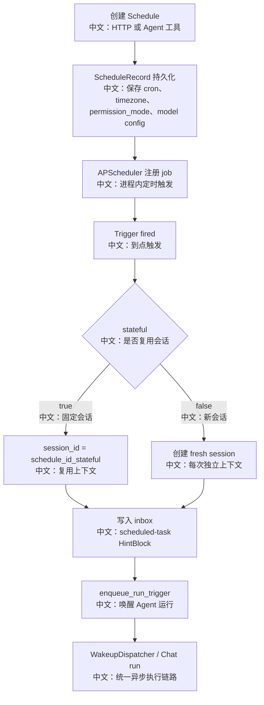

# 定时任务无人值守权限模型

> 适合面试表达的关键词：APScheduler、cron、stateful session、non-stateful session、inbox+wakeup、DONT_ASK、无用户确认、级联删除、任务恢复。

---

## 1. 为什么定时任务值得深挖

定时任务看起来只是 cron，但放在 Agent 系统里会牵出一串关键问题：

```text
定时触发时用户不在线，工具权限怎么处理？
每次触发是新会话还是复用会话？
触发后是直接调用 ChatService，还是走统一事件/唤醒链路？
服务重启后持久化 schedule 怎么恢复？
删除 schedule 时，它派生的 session 怎么清理？
```

面试里可以这样说：

```text
AgentScope 的 Schedule 不是简单定时调用函数。
它把 cron 触发转成 session inbox 中的 HintBlock，再通过 wakeup 机制触发 Agent 运行；
这样定时任务、团队消息、后台工具结果都复用同一套异步恢复链路。
权限上默认使用 DONT_ASK，因为无人值守任务不能停下来等待用户确认。
```

---

## 2. 源码入口

| 入口 | 作用 |
|---|---|
| `src/agentscope/app/_manager/_scheduler/_scheduler_manager.py` | APScheduler 管理、启动恢复、触发执行、工具列表 |
| `src/agentscope/app/_manager/_scheduler/_tools/_schedule_create.py` | Agent 通过工具创建定时任务 |
| `src/agentscope/app/_manager/_scheduler/_tools/_schedule_delete.py` | Agent 通过工具删除定时任务并级联清理 |
| `src/agentscope/app/_router/_schedule.py` | HTTP schedule CRUD 接口 |
| `src/agentscope/app/storage/_model/_schedule.py` | ScheduleRecord / ScheduleData 数据模型 |
| `src/agentscope/permission/_engine.py` | `DONT_ASK` 权限语义 |
| `src/agentscope/app/_bus_ops.py` | `enqueue_run_trigger` 唤醒运行 |

---

## 3. 总体链路



中文解释：

```text
APScheduler 只负责“到点”。
到点后并不直接同步跑完整 Agent，而是创建或复用 session，把定时任务描述写进 inbox，再 enqueue wakeup。
这样即使运行由其他进程接管，也能复用 session run lease、MessageBus、SSE、状态恢复等机制。
```

---

## 4. ScheduleData 的关键字段

| 字段 | 中文说明 | 面试价值 |
|---|---|---|
| `name` | 展示名 | 便于 UI 和日志识别 |
| `description` | 触发时给 Agent 的任务描述 | 是无人值守执行的主要上下文来源 |
| `cron_expression` | 5 段 cron 表达式 | 定义触发周期 |
| `timezone` | IANA 时区 | 避免用户本地时间和服务器时间混淆 |
| `started_at` / `ended_at` | 生效窗口 | 支持一次性或阶段性任务 |
| `stateful` | 是否复用会话 | 控制是否保留历史上下文 |
| `permission_mode` | 定时执行权限模式 | 默认 DONT_ASK |
| `chat_model_config` | 触发时使用的模型配置 | 让定时任务不依赖创建时的临时 session |
| `source` | USER 或 AGENT | 区分 UI 创建和 Agent 工具创建 |
| `source_session_id` | 来源会话 | 可用于追踪创建来源 |

---

## 5. 创建链路：HTTP 和 Agent 工具的差异

### 5.1 HTTP 创建

`POST /schedule/` 做了两类可见性校验：

```text
access.resolve_agent(user_id, body.agent_id)
access.get_resource(user_id, ResourceKind.CREDENTIAL, credential_id)
```

中文说明：

```text
创建定时任务时就检查 agent 和 credential 是否对当前用户可见。
这样不会等到未来某个时间触发时才发现权限或资源不存在。
```

### 5.2 Agent 工具创建

`ScheduleCreate` 工具特点：

| 设计 | 中文说明 |
|---|---|
| 继承当前 session 的 `chat_model_config` | 未来触发时用同样模型配置 |
| `is_state_injected=True` | 可以拿到 `_agent_state.session_id` 作为来源 |
| `check_permissions` 总是 ALLOW | 创建 schedule 被视为 agent 内置能力 |
| `permission_mode` 默认 `dont_ask` | 无人值守时不能等待确认 |

工具描述里还强调：

```text
必须先确定 timezone；
description 是未来新 session 触发时唯一可用上下文，要写完整目标、约束、文件路径等。
```

面试亮点：

```text
定时任务的 description 不是普通备注，而是未来 Agent 的任务输入。
它写得好不好，直接决定无人值守执行质量。
```

---

## 6. 触发链路：为什么用 inbox+wakeup

`SchedulerManager._build_trigger` 到点后：

```text
1. 检查 schedule 是否 enabled
2. 根据 stateful 决定复用或创建 session
3. 给 session 设置 PermissionContext(mode=record.data.permission_mode)
4. 构造 HintBlock：<scheduled-task>...</scheduled-task>
5. message_bus.queue_push(MessageBusKeys.inbox(session.id), hint)
6. enqueue_run_trigger(...)
```

中文解释：

```text
定时任务被包装成 HintBlock，而不是普通用户消息。
这样模型可以识别它是系统驱动的定时触发，不是用户临时输入。
source 里还会带 label=schedule、sublabel=任务名，便于 UI 或日志投影。
```

为什么不直接调用 ChatService？

```text
直接调用会把调度器和聊天服务强耦合在一起。
inbox+wakeup 让调度器只负责投递任务，真正运行由统一的 wakeup/Chat run 链路处理。
这对多进程、恢复、取消、状态一致性更友好。
```

---

## 7. Stateful 与 Non-stateful

| 模式 | session 策略 | 适合场景 | 风险 |
|---|---|---|---|
| `stateful=True` | 固定 `schedule_id_stateful` | 每日跟踪、持续积累上下文 | 历史越来越长，需要压缩 |
| `stateful=False` | 每次 fresh session | 独立报告、一次性检查 | 不能自动记住上次执行结果 |

面试表达：

```text
stateful 是“持续任务”的体验设计，non-stateful 是“每次独立执行”的隔离设计。
这不是技术偏好，而是产品语义不同。
```

---

## 8. DONT_ASK 权限模型

定时任务默认权限：

```text
PermissionMode.DONT_ASK
```

核心语义：

```text
永不返回 ASK。
如果某个工具或规则需要 ASK，就转换成 DENY。
```

为什么？

```text
无人值守任务触发时没有用户在场。
如果返回 ASK，Agent 会停在 HITL，任务就无法完成。
DONT_ASK 的策略是：能安全自动执行就执行；需要人工确认就拒绝。
```

和其他模式对比：

| 模式 | 语义 | 适合场景 |
|---|---|---|
| DEFAULT | 允许 ASK | 用户在线聊天 |
| ACCEPT_EDITS | 自动接受部分文件编辑 | 编程协作 |
| BYPASS | 尽量放行 | 高信任环境，不适合默认 |
| DONT_ASK | ASK 转 DENY | 定时任务、后台无人值守 |

面试亮点：

```text
DONT_ASK 不是“全部允许”，而是“无人确认时宁可拒绝，也不悬挂等待”。
这是安全性和可用性的折中。
```

---

## 9. 恢复与删除

### 9.1 服务启动恢复

`SchedulerManager.__aenter__`：

```text
启动 APScheduler
  -> storage.list_all_schedules()
  -> restore(enabled records)
  -> register_schedule(record)
```

中文解释：

```text
ScheduleRecord 持久化在 storage 里；
APScheduler job 是进程内对象。
服务重启后必须从 storage 重新注册 enabled schedule。
```

### 9.2 删除级联

HTTP 删除：

```text
SessionService.delete_schedule(user_id, schedule_id)
  -> 取消 schedule 派生的运行
  -> 删除派生 session
  -> 清理 bus 状态
  -> 删除 schedule record
SchedulerManager.remove_schedule(schedule_id)
  -> 移除 APScheduler job
```

Agent 工具删除：

```text
先 best-effort remove_job
再调用 SessionService.delete_schedule 做 storage + bus 级联
```

面试表达：

```text
删除 schedule 不能只删 cron job。
因为它可能已经创建过多个执行 session，也可能有正在运行的任务。
所以删除需要覆盖 scheduler、storage、message bus、running session 四个层面。
```

---

## 10. 面试沉淀

### 一句话回答

```text
AgentScope 的定时任务用 APScheduler 管理 cron，但触发后通过 inbox+wakeup 投递 scheduled-task HintBlock，由统一 Chat run 链路执行；权限默认 DONT_ASK，保证无人值守时不会悬挂等待用户确认。
```

### 3 分钟回答

```text
我会把 AgentScope 的 schedule 理解成“无人值守 Agent 运行入口”。
创建时，HTTP 路由会校验目标 agent 和 credential 是否可见；Agent 自己也可以通过 ScheduleCreate 工具创建 schedule，并继承当前 session 的模型配置。

真正到点时，APScheduler 触发的并不是直接同步调用 ChatService。
SchedulerManager 会根据 stateful 决定复用固定 session 还是创建新 session，然后把 description 包装成 <scheduled-task> HintBlock 写入目标 session 的 inbox，再 enqueue_run_trigger。
这样 schedule、TeamSay、后台工具结果都复用同一套 inbox+wakeup 和 Chat run lease 机制。

权限上默认 DONT_ASK，因为定时任务触发时没有用户在线。
如果工具需要人工确认，系统不能停在 HITL 等人，所以 DONT_ASK 会把 ASK 转成 DENY。
删除 schedule 时也不是只删 job，还要级联取消和清理它派生的 sessions 与 message bus 状态。
```

### 高频追问

| 追问 | 回答方向 |
|---|---|
| 定时任务为什么默认 dont_ask？ | 无人值守时没有用户确认，ASK 会导致任务悬挂，所以转 DENY。 |
| stateful 有什么用？ | 连续触发共享一个 session，适合持续追踪；非 stateful 每次独立执行。 |
| 为什么不直接调用 ChatService？ | inbox+wakeup 解耦调度和执行，复用多进程恢复、lease、MessageBus 链路。 |
| 服务重启后 schedule 还在吗？ | ScheduleRecord 在 storage，启动时 restore enabled records 到 APScheduler。 |
| description 为什么重要？ | 它是未来触发时 Agent 的主要任务上下文，不是普通备注。 |
| 删除 schedule 要清理什么？ | APScheduler job、ScheduleRecord、派生 sessions、running runs、bus 状态。 |
| HTTP 创建为什么校验 credential？ | 避免等到未来触发才发现模型凭证不可见或不可用。 |

---

## 11. 可以延伸的知识

| 方向 | 可延伸知识 |
|---|---|
| 分布式调度 | 进程内 APScheduler 与持久化 schedule 的恢复边界 |
| 无人值守安全 | ASK 转 DENY、最小权限、任务描述完整性 |
| 事件驱动架构 | cron trigger 转 inbox+wakeup，而不是同步调用 |
| 产品设计 | stateful vs non-stateful、一次性任务、时区确认 |
| 运维可靠性 | misfire_grace_time、服务重启恢复、日志追踪 |
| 测试策略 | 触发、禁用、删除、恢复、权限模式、派生 session 清理 |
