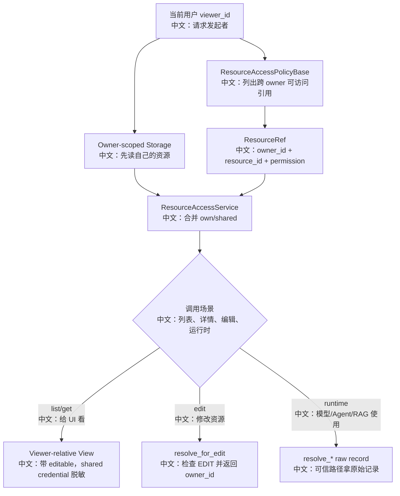

# 资源访问策略与共享权限深挖

> 适合面试表达的关键词：owner-scoped storage、cross-owner access、ResourceAccessPolicy、read/edit、credential 脱敏、runtime raw resolve、team agent 不共享。

---

## 1. 为什么资源访问是系统设计亮点

Agent 产品里有很多资源：

```text
Credential：模型/API 凭证
Agent：智能体配置
KnowledgeBase：知识库
```

默认情况下，这些资源按 `user_id` 隔离。但产品上又常常需要共享：

```text
一个用户使用别人共享的 Agent
一个团队成员使用共享知识库
一个 schedule 引用可见的模型 credential
```

AgentScope 的设计不是把共享逻辑写死到 storage，而是引入：

```text
ResourceAccessPolicyBase
  -> 返回 viewer 可访问的跨 owner 资源引用
ResourceAccessService
  -> 合并 own/shared，构造 viewer-relative view，处理脱敏和 edit 权限
```

面试一句话：

```text
AgentScope 用 owner-scoped storage 保持数据隔离，用 ResourceAccessPolicy 扩展跨用户共享，再由 ResourceAccessService 统一解析 read/edit、脱敏和 runtime raw access。
```

---

## 2. 源码入口

| 入口 | 作用 |
|---|---|
| `src/agentscope/app/access/_policy.py` | 资源访问抽象、ResourceKind、ResourcePermission、ResourceRef |
| `src/agentscope/app/_service/_access.py` | 资源访问服务，合并 own/shared、脱敏 credential、edit 校验 |
| `src/agentscope/app/_app.py` | `create_app(resource_access_policy=...)` 注入自定义策略 |
| `src/agentscope/app/_lifespan.py` | 创建 ResourceAccessService 并挂到 app.state |
| `src/agentscope/app/_router/_agent.py` | Agent 列表、更新、删除使用 access service |
| `src/agentscope/app/_router/_credential.py` | Credential 列表和编辑权限 |
| `src/agentscope/app/_router/_knowledge_base.py` | KB 资源可见性和编辑权限 |
| `src/agentscope/app/_router/_session.py` | 创建 session 时校验 agent/credential/KB 可见性 |
| `src/agentscope/app/_router/_schedule.py` | 创建 schedule 时校验 agent 和 credential |
| `src/agentscope/app/_service/_chat.py` | runtime 使用 `resolve_agent` |

---

## 3. 总体链路



中文解释：

```text
Storage 仍然是 owner-scoped，不负责复杂共享。
Policy 只声明“viewer 能看到哪些别人的资源”。
Service 把自己的资源和共享资源合并，再根据调用场景返回不同视图。
UI 看的是脱敏 view；运行时可信路径才能拿 raw credential。
```

---

## 4. ResourceRef 的设计

`ResourceRef` 包含：

| 字段 | 中文说明 |
|---|---|
| `kind` | 资源类型：credential / agent / knowledge_base |
| `owner_id` | 资源真正拥有者 |
| `resource_id` | owner 下的资源 ID |
| `permission` | read 或 edit |

为什么不直接返回完整资源？

```text
Policy 只负责授权判断，不负责数据读取和脱敏。
真正读取仍然通过 owner-scoped storage API 完成。
这样授权系统可以来自外部 IAM、LDAP、配置文件、团队系统，而不污染存储模型。
```

---

## 5. 默认策略：DenyAll

`DenyAllResourceAccessPolicy` 默认返回空列表。

中文解释：

```text
如果应用没有显式传入 resource_access_policy，就保持历史行为：所有跨 owner 访问都被拒绝。
这是安全默认值。
```

面试表达：

```text
共享能力是显式开启的 extension point，不是默认开放。
```

---

## 6. list_resource：合并 own/shared

`ResourceAccessService.list_resource(viewer_id, kind)`：

```text
1. 先从 storage 读取 viewer 自己的资源
2. 自己的资源 editable=True
3. 调 policy.list_accessible 拿跨 owner refs
4. 对每个 ref 再从 owner storage 读真实 record
5. 去重，过滤非法或不存在资源
6. 构造 viewer-relative view
```

特殊点：

```text
Agent 列表会过滤 source == "team" 的 agent。
Team worker 是团队内部临时资源，不作为可共享用户 Agent 出现在列表里。
```

面试亮点：

```text
共享资源不是复制到 viewer 名下，而是保留 owner_id，用引用方式跨 owner 读取。
这样权限和所有权边界更清晰。
```

---

## 7. Credential 脱敏策略

`CredentialView` 对 shared credential 做脱敏：

```text
如果 record.user_id != viewer_id:
  payload["data"] 只保留 type 和 name
```

中文解释：

```text
用户可以看到“有一个可用凭证”，但不能看到 API key 等敏感字段。
```

但运行时有 `resolve_credential`：

```text
resolve_credential(viewer_id, credential_id)
  -> 返回 raw CredentialRecord
```

为什么运行时能拿 raw？

```text
模型调用、embedding、TTS 等可信服务路径需要真实凭证去构造 provider client。
但这个 raw record 不应该直接返回给前端。
```

面试表达：

```text
这是典型的“展示视图”和“运行时能力”分离。
UI 层脱敏，runtime trusted path 才能解密使用。
```

---

## 8. read/edit 权限

`ResourcePermission`：

| 权限 | 中文说明 |
|---|---|
| READ | 可以查看和使用 |
| EDIT | 可以查看、使用、修改，等价于该资源的协作者 |

`resolve_for_edit` 的语义：

```text
如果是 owner 自己的资源：
  允许，返回 (viewer_id, record)

如果是 shared 资源：
  找到 ref
  如果 permission != EDIT:
    返回 403
  如果 EDIT:
    返回 (owner_id, record)

如果不可见：
  返回 404
```

为什么 read-only 是 403，而不可见是 404？

```text
不可见时不暴露资源存在性，所以 404。
可见但只读时，用户已经知道资源存在，编辑被禁止，所以 403。
```

这是非常好的 API 语义追问点。

---

## 9. Runtime resolve 为什么不同

Service 提供三类 runtime helper：

| 方法 | 返回 | 使用场景 |
|---|---|---|
| `resolve_credential` | raw CredentialRecord | 模型、embedding、TTS 构造 provider client |
| `resolve_agent` | raw AgentRecord | ChatService 运行 agent |
| `resolve_knowledge_base` | raw KnowledgeBaseRecord | RAG middleware / KB service 查 collection |

和 `get_resource` 的区别：

```text
get_resource 面向 UI，返回带 editable 的 view，shared credential 脱敏。
resolve_* 面向可信 runtime，返回 raw record。
```

Team agent 特殊规则：

```text
owner 读取 source == "team" agent 是允许的，因为 ChatService 要运行 team worker。
cross-owner ref 不能解析 team worker，因为 team worker 不是可共享用户资源。
```

---

## 10. 在产品流程中的使用点

### 10.1 创建 Session

创建会话时会校验：

```text
agent 是否可见
chat_model_config.credential_id 是否可见
knowledge base 是否可见
```

中文说明：

```text
用户不能通过伪造 ID 引用自己看不到的 Agent、Credential 或 KB。
```

### 10.2 创建 Schedule

Schedule 创建时：

```text
access.resolve_agent(user_id, body.agent_id)
access.get_resource(user_id, ResourceKind.CREDENTIAL, credential_id)
```

中文说明：

```text
因为 schedule 未来才触发，所以创建时就提前校验资源可见性，避免未来无人值守运行失败。
```

### 10.3 Toolkit 组装

Toolkit 会读取 visible agents：

```text
resource_access_service.list_resource(user_id, ResourceKind.AGENT)
```

中文说明：

```text
AgentInvite 等工具能邀请的不是所有 agent，而是当前用户可见的 agent。
```

---

## 11. 面试沉淀

### 一句话回答

```text
AgentScope 的资源访问设计保留 owner-scoped storage 作为数据边界，再用 ResourceAccessPolicy 声明跨 owner 可访问资源，由 ResourceAccessService 统一合并 own/shared、处理 read/edit、credential 脱敏和 runtime raw resolve。
```

### 3 分钟回答

```text
我会把它理解成一套“共享授权层”，而不是把共享逻辑塞进 storage。
Storage 仍然按 user_id 读写资源，默认所有资源 owner 隔离。
如果应用需要跨用户共享，就实现 ResourceAccessPolicyBase，让它返回 viewer 可访问的 ResourceRef，里面包含 kind、owner_id、resource_id 和 read/edit 权限。

ResourceAccessService 再把 viewer 自己的资源和 policy 返回的共享资源合并。
给 UI 的 list/get 返回 viewer-relative view，并且会给 shared credential 脱敏，只保留 type/name。
但模型调用、RAG、TTS 这类可信 runtime path 可以走 resolve_credential、resolve_agent、resolve_knowledge_base 拿 raw record。

编辑权限也分得很清楚。
不可见返回 404；可见但只读编辑返回 403；EDIT 权限则返回 owner_id 和 raw record，让 router 写回真正 owner 的 storage key。
这个设计同时兼顾了隔离、共享、脱敏和运行时使用。
```

### 高频追问

| 追问 | 回答方向 |
|---|---|
| 为什么 policy 返回 ref 而不是完整资源？ | 授权和数据读取分离；真实数据仍从 owner-scoped storage 读取。 |
| shared credential 会泄露 API key 吗？ | UI view 会脱敏，只保留 type/name；runtime trusted path 才能拿 raw。 |
| 404 和 403 怎么区分？ | 不可见返回 404；可见但没有 edit 权限时返回 403。 |
| EDIT 权限怎么写回？ | `resolve_for_edit` 返回真实 owner_id，router 按 owner key 写回。 |
| Team worker 为什么不共享？ | `source == "team"` 是团队内部临时 agent，不作为用户可共享资源。 |
| 默认共享策略是什么？ | DenyAll，默认拒绝所有跨 owner 访问。 |
| schedule 为什么也要 access check？ | 它未来无人值守运行，创建时必须提前确认 agent/credential 可见。 |

---

## 12. 可以延伸的知识

| 方向 | 可延伸知识 |
|---|---|
| 多租户系统 | owner-scoped storage、viewer-relative view、跨租户引用 |
| 授权模型 | RBAC/ABAC、read/edit、外部 IAM 集成 |
| 敏感数据保护 | credential 脱敏、运行时可信边界、最小暴露 |
| API 语义 | 404 隐藏资源存在性，403 表示可见但禁止操作 |
| 产品协作 | 共享 Agent、共享 KB、共享凭证的可用性和风险 |
| 测试策略 | own/shared、read/edit、masked/raw、team agent filter、schedule 引用校验 |
