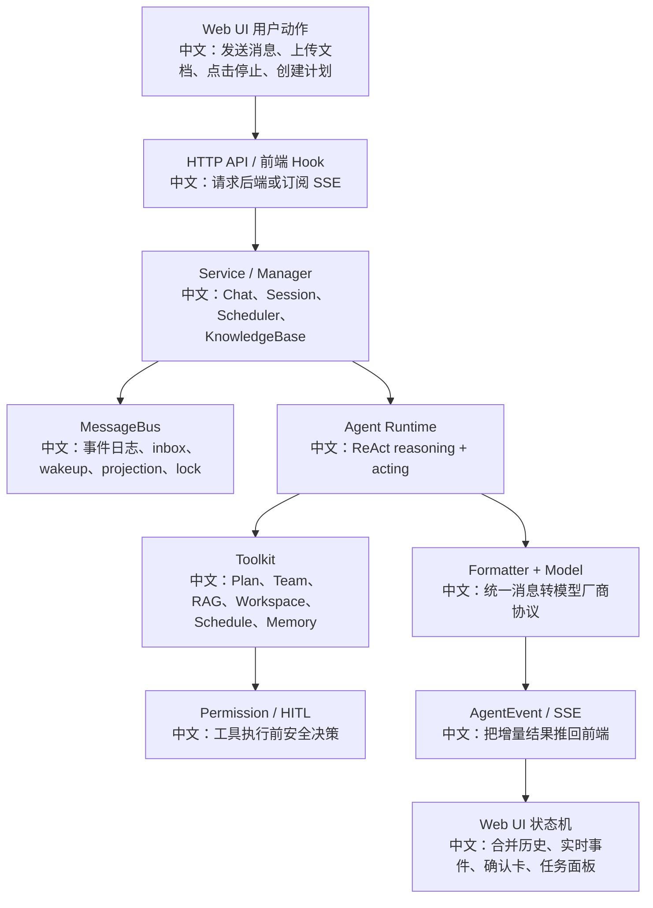

# 从文档到面试题库与复习路线

> 适合面试表达的关键词：源码学习闭环、题库化、模块复习、白板表达、追问演练、简历转化、AI 执行提示词。

---

## 1. 这份文档解决什么问题

前面的文档已经覆盖了很多模块：

```text
Chat / Session / Event / Interrupt
Plan / Multi-Agent / TeamSay / AgentInvite
RAG / IndexWorker / Parser / Chunker / VectorStore
Permission / HITL / Workspace / Schedule
Formatter / ModelCard / TTS / Tracing
Resource Access / Deployment / Tests
```

但“读完文档”不等于“面试能讲”。还需要把材料转成：

```text
一句话回答
3 分钟系统讲解
白板流程图
高频追问
对比题
源码证据
测试证据
简历表达
```

这份文档就是把已有资料转成面试题库和复习路线的总执行说明。

---

## 2. 推荐复习路线

### 2.1 第一阶段：建立主线

先读这些：

```text
01_面试高频亮点总索引.md
02_聊天意图识别与工具选择.md
03_什么时候开启计划模式.md
04_什么时候开启多智能体协作.md
05_RAG文档解析清洗分块与检索.md
07_权限控制与HITL人类确认.md
08_事件流与产品可观测性.md
```

目标：

```text
能用 3 分钟讲清 AgentScope 是什么，以及一次用户输入如何变成完整 Agent 运行。
```

### 2.2 第二阶段：掌握工程亮点

继续读：

```text
18_优雅终止会话与协作式取消.md
20_前端状态机与产品体验地图.md
29_完整RAG索引Worker端到端链路.md
31_消息总线键设计与Redis数据结构.md
32_前端Chat状态机逐事件回放.md
33_部署形态与生产化清单.md
```

目标：

```text
能回答“这个系统如何可靠运行、如何恢复、如何跨进程协作、如何部署”。
```

### 2.3 第三阶段：补齐高频追问

重点读：

```text
34_RAG解析器与分块策略逐源码分析.md
36_Workspace隔离与文件工具安全边界.md
37_权限规则持久化与HITL恢复链路.md
39_模型Formatter与多模型协议适配.md
40_长期记忆写入检索与注入链路.md
41_定时任务无人值守权限模型.md
42_资源访问策略与共享权限深挖.md
```

目标：

```text
能应对面试官深入问“为什么这样设计、边界条件怎么处理、和另一种方案有什么区别”。
```

### 2.4 第四阶段：输出简历和项目表达

最后读：

```text
22_从源码到简历项目表达.md
28_测试用例逐模块阅读指南.md
38_故障演练与补测清单.md
```

目标：

```text
把源码理解转成项目经历、STAR 表达、测试意识和故障演练能力。
```

---

## 3. 题库生成框架

每个模块都按 8 类题生成。

| 类型 | 问题模板 | 输出要求 |
|---|---|---|
| 概念题 | 这个模块解决什么问题？ | 一句话 + 3 分钟版 |
| 流程题 | 从用户操作到后端执行怎么走？ | Mermaid 图 + 中文节点说明 |
| 源码题 | 关键类/函数在哪里？ | 文件路径 + 关键逻辑 |
| 设计题 | 为什么这样设计？ | trade-off |
| 对比题 | 和另一种方案有什么区别？ | 表格对比 |
| 边界题 | 出错、刷新、中断、并发怎么办？ | 异常分支 |
| 测试题 | 怎么证明它可靠？ | 对应 tests 或补测建议 |
| 简历题 | 这段经历怎么写？ | bullet + 面试展开 |

---

## 4. 每篇文档的题库模板

给 AI 或自己执行时，按这个模板整理：

```markdown
# 模块名：xxx

## 1. 一句话回答

用 1-2 句话回答这个模块的价值。

## 2. 3 分钟回答

按“用户动作 -> 前端 -> 后端 -> runtime -> 事件/状态 -> 边界处理”讲清楚。

## 3. 白板流程

用 Mermaid 画流程图。节点中如果出现英文代码名，必须附中文说明。

## 4. 源码证据

列出 5-10 个最关键源码入口，每个入口写一句中文解释。

## 5. 高频追问

至少 8 个追问，每个追问给出可直接背诵的回答方向。

## 6. 设计权衡

至少 3 个 trade-off，例如：同步 vs 异步、自动 vs 人工、隔离 vs 共享。

## 7. 测试与故障演练

列出现有测试入口；如果没有测试，写补测建议。

## 8. 简历表达

写 2-3 条项目 bullet，并附面试展开话术。
```

---

## 5. 重点模块题库种子

### 5.1 Chat / Session

| 题目 | 回答方向 |
|---|---|
| 一次聊天为什么不是同步 HTTP 返回？ | Chat run 是异步可恢复执行，结果通过事件流回到 UI。 |
| Session 状态包括哪些东西？ | Agent state、context、permission context、task context、workspace、事件日志。 |
| 刷新页面如何恢复正在运行的聊天？ | 历史消息 + replay log + SSE + state projection。 |
| Stop / Interrupt 为什么返回 202？ | 控制命令被接受，取消是异步协作式完成。 |

### 5.2 Plan

| 题目 | 回答方向 |
|---|---|
| Plan 是不是前端开关？ | 不是，Plan 工具被装配，模型在复杂任务中主动调用。 |
| Plan 解决什么问题？ | 把开放任务变成结构化 task list，支持进度可视化和中断恢复。 |
| Plan 和普通 prompt 分解有什么区别？ | Plan 有状态，有工具更新，有 UI 投影。 |

### 5.3 多 Agent

| 题目 | 回答方向 |
|---|---|
| 什么时候开启多 Agent？ | 任务可并行、需要不同角色、需要隔离上下文或权限时。 |
| AgentCreate 和 AgentInvite 区别？ | 前者创建临时 worker，后者借用已有 user agent 创建 team-scoped session。 |
| TeamSay 是同步调用吗？ | 不是，写目标 inbox 并 wakeup。 |
| 子 Agent HITL 怎么投影给 leader？ | worker HITL 写 leader projection，leader UI 展示确认卡。 |

### 5.4 RAG

| 题目 | 回答方向 |
|---|---|
| 上传后为什么不能立即检索？ | 还要异步解析、分块、embedding、写向量库。 |
| Parser 和 Chunker 为什么分开？ | Parser 保留自然结构，Chunker 控制检索粒度。 |
| VectorStore 为什么要抽象？ | 屏蔽 Qdrant/MongoDB/Milvus Lite 差异。 |
| Worker 崩溃怎么办？ | lease + heartbeat + sweeper 重新入队。 |

### 5.5 Permission / HITL

| 题目 | 回答方向 |
|---|---|
| 工具调用前如何做权限控制？ | PermissionEngine 根据 mode、rules、tool check_permissions 决策。 |
| ASK 后如何恢复执行？ | UserConfirmResultEvent 喂回 Agent，更新 tool_call 状态为 ALLOWED/DENIED。 |
| 用户确认的规则如何持久化？ | confirmation.rules 加入 AgentState.permission_context。 |
| DONT_ASK 和 BYPASS 区别？ | DONT_ASK 把 ASK 转 DENY；BYPASS 尽量放行。 |

### 5.6 Workspace / Resource

| 题目 | 回答方向 |
|---|---|
| Workspace 和 Permission 区别？ | Workspace 决定在哪里执行；Permission 决定能不能执行。 |
| PER_SESSION/PER_AGENT/PER_USER 怎么选？ | 对应会话隔离、智能体共享、用户共享。 |
| shared credential 会不会泄露？ | UI view 脱敏，runtime trusted path 才拿 raw。 |

### 5.7 Formatter / Model

| 题目 | 回答方向 |
|---|---|
| Formatter 解决什么问题？ | 内部统一 Msg/Block 到外部模型协议的转换。 |
| ThinkingBlock 为什么不能统一处理？ | 不同厂商规则不同：OpenAI 跳过、Anthropic 需 signature、Gemini 用 thought。 |
| ModelCard 的作用？ | 能力发现、UI 参数约束、输入输出类型声明。 |

---

## 6. 白板表达主图



中文讲法：

```text
这张图可以作为任何面试问题的总入口。
面试官问某个 API，就把它放到这条链路上定位；
面试官问某个设计点，就说明它解决的是链路中的哪个一致性或扩展性问题。
```

---

## 7. 简历表达模板

### 7.1 偏后端系统设计

```text
深入分析并复现 AgentScope 的异步 Agent 运行链路，覆盖 Session 状态、MessageBus 事件流、工具权限、HITL 恢复、后台任务和多进程唤醒机制，沉淀源码级系统设计文档与故障演练清单。
```

### 7.2 偏 AI 工程

```text
系统梳理 AgentScope 的 Plan、多智能体协作、RAG 索引检索、长期记忆、模型 Formatter 和工具调用协议，能够从源码解释 Agent 如何完成复杂任务拆解、协作执行、知识注入和多模型适配。
```

### 7.3 偏产品工程化

```text
从 Web UI 到 Agent Runtime 端到端分析聊天、知识库上传、HITL 确认、定时任务和子智能体协作流程，重点关注前端状态恢复、异步任务可观测性、权限安全边界和生产部署形态。
```

---

## 8. AI 执行提示词

可以把下面这段完整复制给其他 AI：

```text
你现在在一个 AgentScope 项目源码仓库中。请基于 docs/API源码驱动学习/ 下已有中文文档，继续做“源码驱动学习 + 面试题库化”的全量分析。

执行要求：
1. 所有输出必须是中文，新增文件名也必须是中文。
2. 不要凭印象写，必须先搜索源码，再写文档。
3. 每个模块都要结合 Web UI、HTTP API、Service/Manager、MessageBus、Agent Runtime、Tool/Middleware、测试证据一起分析。
4. 流程图可以出现英文代码名，但每个节点必须有中文说明。
5. 不要只堆代码细节，要突出产品流程、系统设计亮点、面试高频追问、设计权衡和知识延伸。
6. 每篇文档至少包含：源码入口、流程图、关键机制、边界条件、面试一句话、3 分钟回答、高频追问、可延伸知识。
7. 如果发现已有文档缺重点，要补充亮点索引和阅读路线。
8. 每批建议生成 3-5 个文件，完成后更新 docs/API源码驱动学习/interview/01_面试高频亮点总索引.md 和 docs/API源码驱动学习/00_总纲与智能体执行协议.md。
9. 不要修改源码，只新增或更新学习文档。
10. 完成后自检：文件是否存在、索引链接是否正确、是否有英文节点缺中文解释、是否覆盖源码入口。

当前重点不是“解释 API 怎么用”，而是把 AgentScope 作为可面试的 AI Agent 工程项目来分析。
```

---

## 9. 自我检查清单

每学完一个模块，用这张表打分：

| 检查项 | 达标标准 | 分数 |
|---|---|---|
| 一句话 | 能 20 秒讲清价值 | 0/1 |
| 主流程 | 能画出端到端链路 | 0/1 |
| 源码入口 | 能说出 3 个关键文件 | 0/1 |
| 设计权衡 | 能讲出至少 2 个 trade-off | 0/1 |
| 边界条件 | 能回答失败/取消/并发/恢复 | 0/1 |
| 测试证据 | 能指出测试或补测方案 | 0/1 |
| 面试追问 | 能连续回答 5 个追问 | 0/1 |
| 简历表达 | 能写成一条项目 bullet | 0/1 |

评分建议：

```text
0-3：只是看过，还不能面试
4-5：能讲基础，但容易被追问打断
6-7：能应对大多数追问
8：可以写进简历并主动展开
```

---

## 10. 最终目标

最终你应该能从任何一个入口讲完整套系统：

```text
从 POST /sessions/{sid}/interrupt
讲到 asyncio cancel、MessageBus、SSE、前端状态机；

从上传知识库文档
讲到 Parser、Chunker、Embedding、VectorStore、IndexWorker、Sweeper；

从 Plan 工具
讲到任务状态、UI 投影、复杂任务拆解；

从 AgentInvite
讲到 team-scoped session、TeamSay、subagent HITL projection；

从 Permission
讲到 HITL 恢复、规则持久化、DONT_ASK、Workspace 安全边界；

从 Formatter
讲到多模型协议适配、thinking、多模态、tool schema 兼容。
```

这时候，这套资料就不只是文档了，而是一套可以支撑面试深聊的项目知识体系。
