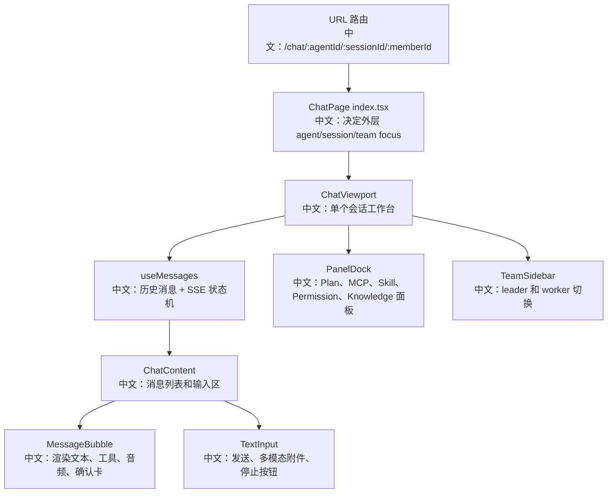

# 前端组件地图与交互状态细节

> 适合面试表达的关键词：URL 状态、ChatViewport、useMessages、PanelDock、TeamSidebar、TextInput、MessageBubble、工具渲染器、HITL 确认卡、模型能力驱动输入。

---

## 1. 为什么要单独看前端

AgentScope 的 Web UI 不是简单聊天框。它要同时承载：

```text
聊天消息流
工具调用过程
HITL 确认卡
Plan 任务面板
Permission 面板
KnowledgeBase 面板
MCP / Skill 面板
Team leader / worker 切换
音频流播放
文件上传和多模态输入
Stop / interrupt 状态
```

面试里可以这样说：

```text
这个前端的难点不是“把消息列表渲染出来”，而是把后端异步 Agent 运行态投影成一个可恢复、可切换、可交互的产品工作台。
URL 决定当前 agent/session/team member，ChatViewport 负责单个会话的工作台状态，useMessages 合成历史和 SSE，MessageBubble 再把内容块、工具组、音频和确认卡渲染出来。
```

---

## 2. 源码入口

| 入口 | 作用 |
|---|---|
| `examples/web_ui/frontend/src/pages/chat/index.tsx` | Chat 页面外壳，URL 驱动 agent/session/member 选择 |
| `examples/web_ui/frontend/src/pages/chat/ChatViewport.tsx` | 单个 `(agentId, sessionId)` 的聊天工作台 |
| `examples/web_ui/frontend/src/hooks/useMessages.ts` | 历史消息 + SSE + HITL + interrupt 状态机 |
| `examples/web_ui/frontend/src/components/chat/ChatContent.tsx` | 消息滚动区、底部输入区、footerSlot |
| `examples/web_ui/frontend/src/components/chat/MessageBubble.tsx` | 内容块、工具组、音频、确认卡渲染 |
| `examples/web_ui/frontend/src/components/chat/TextInput.tsx` | 文本输入、文件附件、send/stop 按钮 |
| `examples/web_ui/frontend/src/components/panel/PanelDock.tsx` | 右侧可停靠面板布局 |
| `examples/web_ui/frontend/src/components/team/TeamSidebar.tsx` | leader/member 团队侧栏 |
| `examples/web_ui/frontend/src/components/chat/tool-renderers/` | Bash/Read/Edit/Write/Grep/Glob/Task 等工具专用渲染 |
| `examples/web_ui/frontend/src/api/client.ts` | 统一 HTTP client、错误处理、stream 请求 |

---

## 3. 前端总体结构



中文解释：

```text
外层页面只决定“看哪个会话”；
ChatViewport 决定“这个会话有哪些工作台能力”；
useMessages 决定“后端事件如何合成 UI 状态”；
MessageBubble 和 TextInput 决定“用户如何看见和干预 Agent 执行”。
```

---

## 4. URL 是选择态的单一来源

`pages/chat/index.tsx` 的核心设计：

```text
/chat/:agentId
/chat/:agentId/:sessionId
/chat/:agentId/:sessionId/:memberId
```

中文说明：

```text
agent、session、team member 的选择不额外复制到 React state，而是从 URL params 推导。
点击 agent、session、team member 都是 navigate(...)。
```

好处：

| 好处 | 中文说明 |
|---|---|
| 刷新可恢复 | URL 带着当前上下文 |
| 浏览器前进后退可用 | 切换会话也是历史记录 |
| 可分享链接 | 能定位到具体 session/member |
| 外层和内层解耦 | leader session list 保持不变，ChatViewport 可聚焦 worker session |

团队 member 的特殊逻辑：

```text
外层 URL 仍保留 leaderAgentId + leaderSessionId；
第三段 memberId 只让 ChatViewport 切换到 worker 的 session。
这样主侧栏仍锚定 leader 的团队上下文。
```

面试表达：

```text
这是一个很产品化的状态设计：URL 承载导航状态，React state 只承载临时 UI 状态。
```

---

## 5. ChatViewport：单会话工作台

`ChatViewport` 负责这个 `(agentId, sessionId)` 的所有交互能力：

```text
模型选择
fallback 模型
TTS 模型
KnowledgeBase 挂载
Permission mode
MCP / Skill
Plan 面板
Permission 面板
Team 侧栏
Subagent HITL 卡片
```

核心 hooks：

| Hook | 作用 |
|---|---|
| `useMessages(agentId, sessionId)` | 消息和运行态 |
| `useWorkspace(agentId, sessionId)` | MCP / Skill |
| `useAvailableModels()` | 模型列表和模型卡 |
| `useKnowledgeBases()` | 可选知识库 |
| `useKnowledgeBaseMiddlewareSchema()` | KB 参数 schema |
| `useSessions(agentId)` | 当前 agent 的 session view |

`handleStateUpdated`：

```text
收到 state_updated 事件
  -> 更新 tasksContext
  -> 更新 permissionContext
  -> 面板立刻反映后端状态
```

中文说明：

```text
Plan 面板和 Permission 面板不是前端自己猜状态，而是由后端 AgentState 投影过来的。
```

---

## 6. PanelDock：工作台面板布局

PanelDock 支持这些 panel：

```text
plan
mcp
skill
permission
knowledge
```

布局规则：

```text
外层数组 = 列
内层数组 = 这一列中的面板
每列最多 2 个面板
超过后新建右侧列
```

中文解释：

```text
PanelDock 不关心业务数据，只负责布局。
ChatViewport 构造每个 panel 的 title、icon、actions、content。
这让布局组件保持纯粹，业务数据集中在 ChatViewport。
```

面试亮点：

```text
这是前端组件分层的一个好例子：ChatViewport 是容器组件，PanelDock 是纯布局组件，具体 Panel 是业务组件。
```

---

## 7. TextInput：输入、附件、停止按钮

TextInput 的关键点：

| 能力 | 中文说明 |
|---|---|
| `allowedInputTypes` | 根据模型能力限制文件选择 |
| `fileProcessor` | 选中文件时立即处理成 ContentBlock |
| `ProcessedFile.status` | 附件处理期间显示 loading |
| Enter / Shift+Enter | Enter 发送，Shift+Enter 换行 |
| phase 驱动按钮 | idle 显示 Send；streaming 显示 Stop；interrupting 禁用 Stop |

按钮状态：

```text
idle
  -> Send
  -> 有文本且文件处理完成才可点

streaming
  -> Stop
  -> 点击触发 interrupt

interrupting
  -> Stop disabled
  -> 防止重复中断
```

面试表达：

```text
输入框不是独立组件，它被后端 reply phase 驱动。
同一个按钮在 idle/streaming/interrupting 下代表发送、停止、等待停止完成。
这和后端 interrupt 的 202 异步语义对应。
```

---

## 8. MessageBubble：工具组、音频和确认卡

### 8.1 工具调用分组

`groupToolCalls` 做两件事：

```text
第一遍：按 id 把 tool_call 和 tool_result 配对
第二遍：把连续 tool_call 收成 tool_call_group
```

为什么要配对？

```text
并行工具调用可能按 [call_A, call_B, result_A, result_B] 到达。
UI 要按 id 把调用和结果关联起来，而不能只靠相邻位置。
```

为什么要分组？

```text
连续工具调用如果逐条展开会很吵。
前端把它们折叠成一个工具组，再在组内按工具类型渲染详情。
```

### 8.2 工具专用渲染器

`tool-renderers/index.tsx` 注册：

```text
Bash
Read
Write
Edit
Glob
Grep
TaskCreate
```

中文说明：

```text
通用工具走 DefaultRenderer；
高频工具有专用 renderer，用更贴近产品语义的方式展示。
比如 Edit/Write 可以展示 diff，TaskCreate 可以显示 todo 更新。
```

### 8.3 音频块

MessageBubble 中的 `AudioInlineControl`：

```text
streaming 中不构建巨大的 base64 URL
  -> 直播播放交给 AudioContext
结束后再用 Blob URL 或 base64 data URL 回放
```

面试亮点：

```text
音频流处理不能每个 delta 都重建 data URL，否则会造成大量内存分配。
前端区分 live streaming 和 replay，这是产品体验和性能的交叉点。
```

### 8.4 HITL 确认卡

当工具调用状态是 asking 时，MessageBubble 渲染 `ConfirmCard`。

中文说明：

```text
后端 PermissionEngine 返回 ASK；
前端展示确认卡；
用户确认后通过 useMessages 把 UserConfirmResultEvent 发回后端。
```

---

## 9. TeamSidebar：团队协作导航

TeamSidebar 通过 `TeamDetailResponse` 渲染：

```text
leader_agent
members: agent + session_id
```

点击逻辑：

```text
leader
  -> /chat/<leaderAgentId>/<leaderSessionId>

member
  -> /chat/<leaderAgentId>/<leaderSessionId>/<memberAgentId>
```

中文解释：

```text
URL 第三段 memberId 表示“聚焦某个 worker 的 session”。
外层 leader session 不变，所以团队上下文不会丢。
```

这和后端 TeamSay / AgentInvite 的关系：

```text
后端维护 team record、worker session、inbox+wakeup；
前端通过 TeamDetailResponse 把它投影成可点击的团队侧栏。
```

---

## 10. API Client：错误和用户身份

`api/client.ts`：

```text
X-User-ID 来自 localStorage.username
base URL 来自 localStorage.server_url
非 2xx 返回 ApiError(status, detail)
默认 toast.error(detail)
204 返回 undefined
streamRequest 返回 Response 给 SSE/stream 消费
```

中文说明：

```text
前端把 API 错误统一抽象成 ApiError，并从后端 detail 字段提取人类可读信息。
stream 请求不直接 json，而是把 Response 交给上层处理事件流。
```

---

## 11. 面试沉淀

### 一句话回答

```text
AgentScope Web UI 把 URL 作为 agent/session/member 选择态，把 ChatViewport 作为单会话工作台，把 useMessages 作为事件状态机，再用 MessageBubble、TextInput、PanelDock、TeamSidebar 把异步 Agent 运行投影成可交互产品体验。
```

### 3 分钟回答

```text
前端的核心不是聊天列表，而是 Agent 工作台。
最外层 ChatPage 用 URL 参数决定当前 agent、session 和可选 team member，所以刷新、回退和分享链接都天然可用。
ChatViewport 接收一个 agentId/sessionId 后，负责装配模型选择、权限模式、知识库、MCP、Skill、Plan、Permission、Team 等工作台能力。

消息部分由 useMessages 合成历史消息和 SSE 实时事件，ChatContent 负责滚动区域和输入区。
MessageBubble 再把统一 content blocks 渲染成文本、工具调用组、音频播放、文件附件和 HITL 确认卡。
工具调用会按 id 把 call/result 配对，并把连续工具调用折叠成一个 group，避免 UI 过载。

输入框也和后端状态联动。
idle 时显示发送，streaming 时显示停止，interrupting 时禁用停止按钮，对应后端 interrupt 的异步语义。
TeamSidebar 则把后端 TeamDetailResponse 投影成 leader/member 导航，点击 member 只切换 ChatViewport 聚焦的 worker session，不破坏外层 leader 上下文。
```

### 高频追问

| 追问 | 回答方向 |
|---|---|
| 为什么选择态放 URL？ | 刷新、分享、前进后退天然可恢复，避免 React state 和路由状态不一致。 |
| ChatViewport 负责什么？ | 单个会话工作台：消息、模型、权限、知识库、面板、团队侧栏。 |
| 工具调用为什么要按 id 配对？ | 并行工具结果可能乱序，必须按 tool_call_id 关联。 |
| 为什么把工具调用折叠成组？ | 连续工具调用展开会干扰阅读，折叠后既保留过程又降低噪声。 |
| Stop 按钮状态怎么来？ | 来自 useMessages 的 phase：idle/send、streaming/stop、interrupting/disabled。 |
| Team member 点击为什么 URL 仍保留 leader session？ | leader 是团队上下文锚点，member 只是 ChatViewport 的内层聚焦。 |
| 文件附件什么时候处理？ | 选中文件时立即处理成 ContentBlock，不等发送时才处理。 |
| 音频为什么 streaming 和 replay 分开？ | streaming 时避免频繁构建巨大 data URL，结束后再生成可回放 URL。 |

---

## 12. 可以延伸的知识

| 方向 | 可延伸知识 |
|---|---|
| 状态管理 | URL state、server state、local UI state 的边界 |
| 复杂 UI 投影 | 后端 AgentEvent 如何变成 UI 消息和面板 |
| 并发渲染 | 并行工具调用的 call/result 配对 |
| 产品体验 | 折叠工具过程、确认卡、音频播放、team focus |
| 可访问性 | 图标按钮 tooltip、disabled 状态、键盘输入 |
| 前端架构 | 容器组件、纯布局组件、业务组件、renderer registry |
