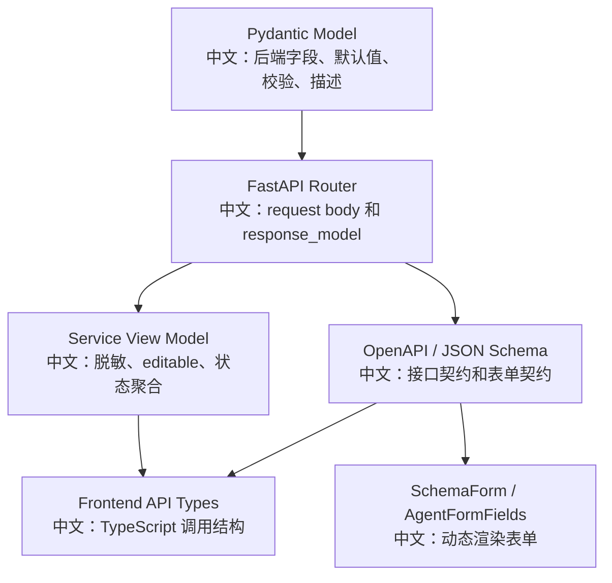

# OpenAPI 与 Schema 契约阅读指南

> 适合面试表达的关键词：Pydantic Schema、FastAPI response_model、前后端契约、schema-driven form、AgentData、KnowledgeDocumentView、ModelCard、字段脱敏、OpenAPI。

---

## 1. 为什么要读 Schema

源码学习不能只看实现函数，也要看“接口契约”。AgentScope 的契约主要来自：

```text
FastAPI Router
Pydantic Request / Response Schema
Storage Model
Service View Model
前端 TypeScript types
SchemaForm / AgentFormFields
```

面试里可以这样说：

```text
AgentScope 的 API 契约不是散落在文档里手写的，而是通过 Pydantic model 和 FastAPI response_model 自动形成。
前端大量表单也不是硬编码字段，而是读取后端 JSON Schema 来渲染，减少前后端字段漂移。
```

---

## 2. 源码入口

| 入口 | 作用 |
|---|---|
| `src/agentscope/app/_router/_schema/` | HTTP request/response Pydantic schema |
| `src/agentscope/app/_router/_agent.py` | Agent schema v1/v2、CRUD |
| `src/agentscope/app/_router/_session.py` | Session 创建、更新、消息、状态、中断 |
| `src/agentscope/app/_router/_knowledge_base.py` | KB 上传、状态轮询、检索 |
| `src/agentscope/app/_service/_access.py` | AgentView / CredentialView / KnowledgeBaseView |
| `src/agentscope/model/_model_card.py` | 模型参数 schema |
| `examples/web_ui/frontend/src/api/types.ts` | 前端手写/生成的契约类型 |
| `examples/web_ui/frontend/src/components/form/SchemaForm.tsx` | 通用 schema 表单 |
| `examples/web_ui/frontend/src/components/form/AgentFormFields.tsx` | Agent schema v2 的分区渲染 |

---

## 3. 契约层总图



中文解释：

```text
Pydantic 是后端契约源头。
FastAPI 用这些 model 生成 OpenAPI，也用 response_model 控制返回结构。
前端既用 TypeScript 类型调用 API，也直接消费部分 JSON Schema 渲染动态表单。
```

---

## 4. Agent Schema：从 v1 到 v2

### 4.1 旧版 `/agent/schema`

旧版返回三段：

```text
identity
context_config
react_config
```

问题：

```text
每新增一个 user-editable 字段，router 都要手动补 section。
比如新增 invite_config，就需要改后端 schema endpoint 和前端渲染。
```

### 4.2 新版 `/agent/schema/v2`

新版返回：

```json
{
  "schema": { "... full AgentData JSON Schema ..." }
}
```

源码关键逻辑：

```text
AgentData.model_json_schema()
  -> _flatten_json_schema(...)
  -> 删除 context_config.summary_schema
  -> 返回 AgentSchemaV2Response(schema=schema)
```

中文说明：

```text
schema v2 把 AgentData 作为单一真相来源。
前端从 schema.properties 自动推导 identity/context/react/invite 等 section。
新增字段只要进入 AgentData，就能进入前端表单。
```

面试亮点：

```text
这是一种 schema-driven form 设计，减少前后端重复维护字段。
```

---

## 5. 为什么要 flatten JSON Schema

Pydantic 生成的 JSON Schema 可能包含：

```text
$defs
$ref
嵌套引用
```

前端动态表单如果直接渲染 `$ref` 会复杂很多，所以后端做 `_flatten_json_schema`。

中文解释：

```text
后端把 schema 展平成前端可以直接消费的形态，前端就不需要实现完整 JSON Schema resolver。
这是后端为前端体验做的契约适配。
```

---

## 6. Request Schema 和 Storage Model 的区别

以 Agent 为例：

| 层 | 例子 | 中文说明 |
|---|---|---|
| Request Schema | `CreateAgentRequest` | 用户可提交字段 |
| Storage Model | `AgentData` / `AgentRecord` | 后端真实存储形态 |
| View Model | `AgentView` | 返回给当前 viewer 的视图，带 editable |

为什么不直接把 Storage Model 暴露成 Request？

```text
存储模型可能有 id、source、created_at、updated_at、内部字段；
请求模型只允许用户提交安全可编辑字段。
```

为什么 response 用 View Model？

```text
返回给 UI 的结构需要包含 viewer-relative 信息，比如 editable；
这些字段不是资源本身，而是当前用户看这个资源时的权限投影。
```

---

## 7. SessionView：减少前端瀑布请求

`SessionView` 包含：

```text
session: SessionRecord
is_running: bool
team: TeamDetailResponse | None
```

中文说明：

```text
打开会话列表时，前端不需要再分别请求 session、running 状态、team detail。
SessionView 把这些 UI 必需信息打包在一个响应里。
```

消息为什么不放进去？

```text
消息历史可能很长，需要单独分页。
所以 ListSessionsResponse 只返回会话视图，消息通过 GET /sessions/{id}/messages 获取。
```

面试表达：

```text
这是典型的 BFF 思路：为 UI 场景组装刚好需要的数据，同时避免把大列表塞进同一个接口。
```

---

## 8. KnowledgeDocumentView：隐藏内部字段

`KnowledgeDocumentRecord` 内部有：

```text
user_id
knowledge_base_id
processing_node
blob_uri
lease_expires_at
status
error
chunk_count
```

但 `KnowledgeDocumentView` 只暴露：

```text
id
filename
size
content_type
status
error
chunk_count
created_at
updated_at
```

中文解释：

```text
前端需要展示文件名、大小、状态、错误和 chunk 数；
不需要知道 blob_uri、processing_node、lease 信息。
这些是后端索引和恢复机制的内部细节。
```

面试亮点：

```text
View Model 是安全边界。
它既满足 UI，又避免泄露内部存储路径、worker 节点、lease 信息。
```

---

## 9. ModelCard 与参数 Schema

`ModelCard.from_yaml` 会：

```text
读取模型 YAML
合并参数类的 model_json_schema
根据 output_types 隐藏 thinking / voice
把 output_size 注入 max_tokens.maximum
应用 parameter_overrides
```

前端用它渲染：

```text
ModelParametersPopover
LlmSelect
InputTypeBadges
```

中文说明：

```text
模型参数不是前端硬编码。
后端模型卡告诉前端这个模型支持什么输入、输出和参数。
```

---

## 10. KB Middleware 参数 Schema

`KbMiddlewareParametersSchemaResponse` 暴露：

```text
RAGMiddleware.Parameters.model_json_schema()
```

用途：

```text
前端挂载知识库到 session 时，用同一套 SchemaForm 渲染 RAG 参数。
```

面试表达：

```text
Agent 配置、模型参数、RAG 参数都在走 schema-driven UI。
这让后端能力扩展后，前端不必每次手写表单字段。
```

---

## 11. API 语义里的状态码

| 场景 | 状态码 | 中文说明 |
|---|---|---|
| 创建资源 | 201 | 资源创建成功 |
| 删除资源 | 204 | 删除成功，无响应体 |
| 中断会话 | 202 | 接受异步控制命令 |
| 不可见资源 | 404 | 不暴露资源存在性 |
| 可见但无编辑权限 | 403 | read-only 资源禁止修改 |
| 字段校验失败 | 422 | Pydantic 校验或业务 invariant 失败 |

---

## 12. 面试沉淀

### 一句话回答

```text
AgentScope 用 Pydantic 和 FastAPI response_model 作为 API 契约源头，并把部分 JSON Schema 暴露给前端做动态表单；同时通过 View Model 区分存储模型、请求模型和 UI 返回模型，保证字段稳定、权限清晰、敏感信息不泄露。
```

### 3 分钟回答

```text
我会从“契约源头”和“视图投影”两个角度讲。
后端的 request/response schema 都放在 app/_router/_schema 下，由 Pydantic 定义字段、默认值、校验和描述，FastAPI 再用 response_model 生成 OpenAPI 和运行时响应约束。

Agent 表单是 schema-driven 的典型例子。
旧版 /agent/schema 手动拆 identity/context/react 三段，扩展字段不方便。
新版 /agent/schema/v2 直接返回完整 AgentData JSON Schema，并 flatten 掉 $ref，前端从 properties 推导表单 section。

另一个重点是 View Model。
SessionView 把 session、is_running、team detail 打包，减少前端瀑布请求。
KnowledgeDocumentView 只暴露 UI 需要的状态字段，不暴露 blob_uri、processing_node、lease。
CredentialView 对 shared credential 脱敏，只保留 type/name。
这说明 API 契约不只是类型定义，也是安全边界和产品体验边界。
```

### 高频追问

| 追问 | 回答方向 |
|---|---|
| 为什么要 schema v2？ | 避免每次新增 AgentData 字段都手动改 router 和前端表单。 |
| flatten JSON Schema 的价值？ | 让前端无需实现完整 `$ref` resolver，直接渲染。 |
| Request Schema 和 Storage Model 为什么分开？ | 防止用户提交内部字段，也让存储形态可以独立演进。 |
| View Model 有什么价值？ | 聚合 UI 所需数据，并处理 editable、脱敏、隐藏内部字段。 |
| SessionView 为什么不带 messages？ | messages 可能很长，需要单独分页。 |
| shared credential 怎么保证安全？ | CredentialView 脱敏，runtime resolve 才能拿 raw。 |
| 为什么中断是 202？ | 中断是异步控制命令，HTTP 只表示已接受。 |
| schema-driven form 的风险？ | 前端渲染能力受 JSON Schema 表达能力限制，复杂交互仍需定制组件。 |

---

## 13. 可以延伸的知识

| 方向 | 可延伸知识 |
|---|---|
| API 契约 | OpenAPI、Pydantic、response_model、TypeScript 类型同步 |
| BFF 设计 | SessionView 聚合 UI 所需数据 |
| 安全边界 | View Model 脱敏和隐藏内部字段 |
| 表单工程 | schema-driven form、字段默认值、动态参数 |
| 版本演进 | deprecated endpoint、v2 schema、向后兼容 |
| 测试策略 | schema snapshot、字段脱敏、422 invariant、403/404 语义 |
