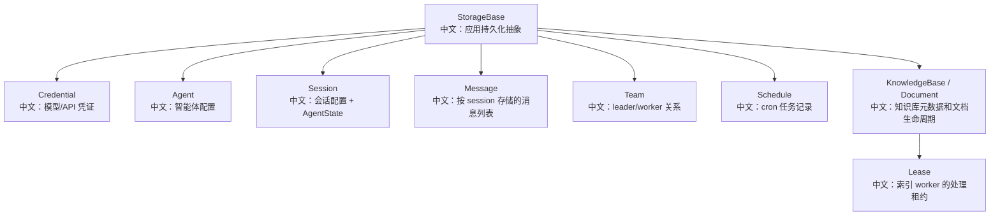

# Storage 模型与持久化边界

> 适合面试表达的关键词：StorageBase、RedisStorage、owner-scoped key、record/index 分离、message list、session state、team cascade、schedule index、document lease。

---

## 1. 为什么 Storage 是核心模块

Agent 系统不是无状态服务。它要持久化：

```text
用户凭证
Agent 配置
Session 配置和 AgentState
消息历史
Team 关系
Schedule 记录
KnowledgeBase 元数据
KnowledgeDocument 生命周期
```

面试里可以这样说：

```text
AgentScope 的 StorageBase 定义了应用层持久化边界；RedisStorage 是一个具体实现，用 record key + index key 的方式组织数据。
它不仅是 CRUD，还承担 session state、message upsert、team 级联、schedule 恢复、RAG document lease 等一致性语义。
```

---

## 2. 源码入口

| 入口 | 作用 |
|---|---|
| `src/agentscope/app/storage/_base.py` | StorageBase 抽象接口 |
| `src/agentscope/app/storage/_redis_storage.py` | Redis 存储实现 |
| `src/agentscope/app/storage/_model/` | Agent/Session/Team/Schedule/KB/Document record |
| `src/agentscope/app/storage/_utils.py` | SecretStr 存储、Team legacy migration |
| `src/agentscope/app/_service/_session.py` | 删除级联的服务层入口 |
| `src/agentscope/app/_manager/_scheduler/_scheduler_manager.py` | 启动时从 storage 恢复 schedule |
| `src/agentscope/app/_service/_index_worker.py` | RAG document lease 与状态更新 |

---

## 3. Storage 总体结构



中文解释：

```text
StorageBase 不只是数据库 DAO。
它把 AgentScope 的产品对象和恢复边界统一抽象出来，让 Redis、SQL 或其他后端都能实现同一套语义。
```

---

## 4. RedisStorage 的 key 设计

RedisStorage 使用两类 key：

```text
record key：保存完整 JSON record
index key：保存某个 scope 下的 id 集合或列表
```

例子：

| 类型 | key 形态 | Redis 数据结构 | 中文说明 |
|---|---|---|---|
| credential record | `agentscope:user:{user_id}:credential:{credential_id}` | String | 单个凭证 |
| agent index | `agentscope:user:{user_id}:agents` | Set | 用户下 agent id 集合 |
| session index | `agentscope:user:{user_id}:agent:{agent_id}:sessions` | Set | 某个 agent 下 session id |
| messages | `agentscope:user:{user_id}:session:{session_id}:messages` | List | session 消息历史 |
| schedule global index | `agentscope:schedules` | Set | 启动恢复所有 schedule |
| document global index | `agentscope:knowledge_documents` | Set | sweeper 扫描 stuck document |

面试亮点：

```text
Redis 不是关系型数据库，所以要显式维护二级索引。
record key 负责随机读写，index key 负责 list 查询，global index 负责跨用户后台任务扫描。
```

---

## 5. Record 模型

所有 record 继承 `_RecordBase`：

```text
id
created_at
updated_at
```

常见结构：

```text
AgentRecord
  user_id
  data: AgentData

SessionRecord
  user_id
  agent_id
  config: SessionConfig
  state: AgentState

KnowledgeDocumentRecord
  user_id
  knowledge_base_id
  processing_node
  data: KnowledgeDocumentData
```

中文解释：

```text
顶层字段通常是索引和关系字段；
data 内部是业务可变 payload。
这种结构让 storage 能按 user/agent/kb/node 建索引，同时保留业务模型的完整性。
```

---

## 6. SecretStr 存储

`_dump_with_secrets` 做了一个重要动作：

```text
model_dump(mode="json")
  -> SecretStr 默认会被 mask
  -> 手动把 SecretStr 替换成 get_secret_value()
```

为什么？

```text
API 返回时要脱敏；
但存储时必须保存真实 API key，否则运行时无法构造模型 client。
```

面试表达：

```text
秘密字段的“存储真实值”和“展示脱敏值”是两条不同路径，不能混用。
```

---

## 7. Session 持久化边界

Session 保存：

```text
config：模型、workspace、knowledge、tts 等配置
state：AgentState，包括 context、permission_context、tasks_context 等
source：user / schedule
source_schedule_id：来源 schedule
team_id：团队关系
```

RedisStorage 的 `upsert_session`：

```text
如果 session_id 存在且已有 record：
  更新 config 和 state
否则：
  创建新 SessionRecord
  写 session record key
  sadd session index
  如果来自 schedule，再 sadd schedule_session_index
```

`update_session_state`：

```text
只更新 state
用于 chat turn 后的热路径持久化
```

面试亮点：

```text
config 和 state 分别代表“会话配置”和“运行态快照”。
运行中频繁变化的是 state，所以有专门的 update_session_state。
```

---

## 8. Message 持久化：upsert 而不是 append-only

`upsert_message` 的逻辑：

```text
读取 messages list 最后一条
如果 last_msg.id == msg.id:
  lset 覆盖最后一条
否则:
  rpush 新消息
```

为什么？

```text
一次 assistant reply 可能流式增量更新同一个 message。
如果每个增量都 append，就会产生大量重复消息。
upsert_message 用相同 msg.id 覆盖最后一条，保留最终聚合结果。
```

面试表达：

```text
事件流可以是 append-only，但消息历史不是纯 append-only。
消息历史需要按 message id 做最终态合并，方便刷新后恢复 UI。
```

---

## 9. Team 级联和 legacy migration

`_ensure_team_members` 处理历史兼容：

```text
旧版本 TeamData 只有 member_ids
新版本需要 members: owner_id + agent_id + session_id + role
读取时如果 members 为空，就从 member_ids 迁移
迁移后 upsert_team 写回
```

中文说明：

```text
这是懒迁移：不需要一次性跑数据迁移脚本，而是在读取 team 时自动补齐新结构。
```

Team 删除也有角色差异：

```text
created worker：
  delete_agent，连 worker agent 和 session 都删除

invited worker：
  只删除 team-scoped session，不删除用户原本的 agent
```

面试亮点：

```text
级联删除必须理解业务所有权。
临时 worker 是 team-owned，可以删除 agent；
被邀请 agent 是 user-owned，只能清理这次协作 session。
```

---

## 10. Schedule 持久化和恢复

Schedule 有：

```text
per-user schedule index
global schedule index
schedule_session_index
```

为什么有 global index？

```text
SchedulerManager 启动时需要恢复所有用户的 enabled schedules。
如果只按 user 建索引，启动时就不知道有哪些 user。
```

为什么有 schedule_session_index？

```text
删除 schedule 时要找到它派生的执行 sessions，并级联取消和删除。
```

---

## 11. KnowledgeDocument lease

RAG 文档索引需要防止多个 worker 同时处理同一文件。

RedisStorage 使用：

```text
processing_node
lease_expires_at
WATCH + MULTI/EXEC
```

`acquire_knowledge_document_lease`：

```text
watch document key
读取 record
如果已有 holder 且 lease 未过期 -> 返回 False
否则设置 processing_node 和 lease_expires_at
multi + set
execute
```

`renew_knowledge_document_lease`：

```text
只有 processing_node 匹配当前 worker 才能续租
```

`release_knowledge_document_lease`：

```text
只有 holder 匹配时才清空 processing_node 和 lease_expires_at
```

面试表达：

```text
这是一个轻量分布式锁。
它不是 Redis SET NX 锁，而是把 lease 信息保存在 document record 里，用 WATCH 实现 compare-and-swap。
这样 status、holder、lease 都在同一个 document record 中，便于 sweeper 诊断和恢复。
```

---

## 12. key_ttl 和滑动过期

RedisStorage 支持 `key_ttl`：

```text
_set_with_ttl 写 key 后 expire
_refresh_key_ttl 刷新消息 list 等 key
```

中文说明：

```text
如果配置 TTL，写入会刷新过期时间，形成滑动 TTL。
适合 demo 或临时环境；生产环境要谨慎，因为 record key 过期可能导致 index 里残留孤儿 id。
```

源码也多处对“index 有 id 但 record 不存在”做了跳过处理。

---

## 13. 面试沉淀

### 一句话回答

```text
AgentScope 的 StorageBase 定义了应用持久化边界，RedisStorage 用 record key + index set/list 实现 owner-scoped 存储，并额外承载消息 upsert、team 级联、schedule 恢复和 RAG document lease 等一致性语义。
```

### 3 分钟回答

```text
我会先把 StorageBase 理解成产品对象的持久化契约，而不是普通数据库 DAO。
它覆盖 credential、agent、session、message、team、schedule、knowledge base、knowledge document 等对象。

RedisStorage 的实现方式是 record key + index key。
每个资源有一个 JSON record key，同时用 set/list 维护列表查询需要的索引，比如 user 的 agents、agent 的 sessions、session 的 messages。
对于 schedule 和 knowledge document，还额外有 global index，因为后台 scheduler 和 sweeper 需要跨用户扫描。

几个细节很能体现系统设计。
message 不是简单 append，而是如果最后一条 message id 相同就覆盖，支持流式 assistant 消息的最终态合并。
team 删除要区分 created worker 和 invited worker，因为所有权不同。
RAG document processing 用 processing_node + lease_expires_at，并通过 Redis WATCH 做 CAS，防止多个 worker 同时处理同一文档。
```

### 高频追问

| 追问 | 回答方向 |
|---|---|
| Redis 为什么要 index key？ | Redis 没有关系型查询，list 资源必须显式维护 id 集合。 |
| message 为什么 upsert？ | 流式回复会更新同一 message，最终历史需要覆盖而不是重复 append。 |
| global schedule index 有什么用？ | 服务启动时恢复所有用户的 enabled schedules。 |
| schedule_session_index 有什么用？ | 删除 schedule 时级联找到它创建的执行 sessions。 |
| Team 删除为什么区分 created/invited？ | created worker 属于 team；invited agent 属于用户，只删协作 session。 |
| RAG document lease 怎么防并发？ | processing_node + lease_expires_at + Redis WATCH CAS。 |
| key_ttl 有什么风险？ | record 过期后 index 可能残留孤儿 id，所以读取时要跳过 missing record。 |
| SecretStr 存储为什么特殊？ | API 展示要 mask，存储和 runtime 要真实 secret。 |

---

## 14. 可以延伸的知识

| 方向 | 可延伸知识 |
|---|---|
| 数据建模 | record/index 分离、owner-scoped key、global index |
| 一致性 | Redis 多 key 非事务边界、best-effort cascade、CAS lease |
| 恢复设计 | session state、message history、schedule restore、document sweeper |
| 数据迁移 | lazy migration、legacy member_ids 到 members |
| 安全 | SecretStr 存储与脱敏展示分离 |
| 可替换存储 | StorageBase 让 Redis/SQL/其他 backend 可替换 |
