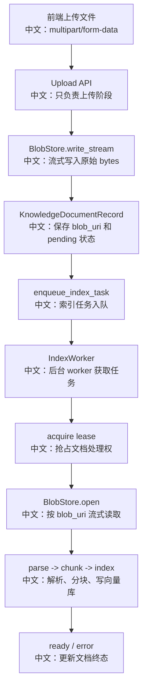

# BlobStore 与文件生命周期

> 适合面试表达的关键词：BlobStoreBase、LocalBlobStore、S3BlobStore、流式上传、blob_uri、KnowledgeDocumentRecord、pending/parsing/chunking/indexing/ready/error、向量库删除顺序。

---

## 1. 为什么 BlobStore 很关键

知识库上传不是“把文件读进内存然后立刻解析”。真实系统要考虑：

```text
大文件不能常驻内存
API 进程和 IndexWorker 可能不是同一个进程
上传完成不等于索引完成
文档删除要同时清理向量库、记录和原始文件
本地开发和生产对象存储要可替换
```

AgentScope 用 `BlobStoreBase` 作为字节层抽象。

面试里可以这样说：

```text
BlobStore 负责保存上传文档的原始 bytes，KnowledgeDocumentRecord 保存 blob_uri 和生命周期状态，IndexWorker 通过 blob_uri 重新流式读取文件完成解析、分块和索引。
这样 API 上传和后台索引被解耦，文件也不会在 HTTP 请求期间一直占内存。
```

---

## 2. 源码入口

| 入口 | 作用 |
|---|---|
| `src/agentscope/app/rag/blob_store/_base.py` | BlobStoreBase 抽象 |
| `src/agentscope/app/rag/blob_store/_local.py` | 本地文件系统实现 |
| `src/agentscope/app/rag/blob_store/_s3.py` | S3 兼容对象存储实现 |
| `src/agentscope/app/storage/_model/_knowledge_document.py` | KnowledgeDocumentRecord 和生命周期状态 |
| `src/agentscope/app/_service/_knowledge_base.py` | 上传注册、删除清理、检索 |
| `src/agentscope/app/_router/_knowledge_base.py` | 上传/状态轮询/删除 API |
| `src/agentscope/app/_service/_index_worker.py` | 从 blob 读 bytes，解析、分块、索引 |
| `src/agentscope/app/_service/_index_sweeper.py` | stuck document 重新入队 |

---

## 3. 文件生命周期总图



中文解释：

```text
HTTP 上传只覆盖“文件进入系统”的阶段。
真正解析、分块、embedding、写向量库都在后台 worker 完成。
前端通过 document status polling 观察 pending/parsing/chunking/indexing/ready/error。
```

---

## 4. BlobStoreBase 的抽象

核心接口：

| 方法 | 中文说明 |
|---|---|
| `write_stream(key, stream)` | 把上传流写入后端，返回 URI |
| `open(uri)` | 根据 URI 打开异步读取流 |
| `delete(uri)` | 删除 blob，要求幂等 |
| `exists(uri)` | 判断 blob 是否存在 |

关键设计：

```text
write_stream 必须分块复制，不能 stream.read() 一次性读完整文件。
open 返回 async context manager，调用方只依赖 read(n)。
```

面试亮点：

```text
BlobStoreBase 的价值是把“字节存哪里”从业务逻辑里抽出去。
API、Worker、删除逻辑都只认 blob_uri，不关心是本地文件还是 S3。
```

---

## 5. LocalBlobStore

LocalBlobStore 使用：

```text
root_dir
local://{key}
1 MiB chunk
```

关键安全逻辑：

```text
拒绝空 key
拒绝绝对路径
拒绝包含 ..
resolve 后必须仍在 root_dir 内
```

中文说明：

```text
虽然 key 是服务端生成的，但本地文件系统实现仍然防御路径逃逸。
```

删除逻辑：

```text
删除文件
best-effort 清理空父目录直到 root
文件不存在则 no-op
```

适合：

```text
本地开发、单机部署、测试环境。
```

---

## 6. S3BlobStore

S3BlobStore 使用：

```text
s3://{bucket}/{key}
aioboto3
upload_fileobj
get_object streaming body
delete_object
head_object
```

兼容对象存储：

```text
AWS S3
MinIO
Cloudflare R2
Aliyun OSS S3-compatible
Tencent COS S3-compatible
```

关键设计：

```text
URI 里带 bucket。
open(uri) 时从 URI 读取 bucket，而不是只用当前配置 bucket。
这样 bucket 迁移后，旧 document record 仍可能被读取。
```

但 delete/exists 会校验 bucket 必须等于配置 bucket：

```text
变更操作只能操作当前 store 负责的 bucket，避免误删别的 bucket。
```

面试表达：

```text
读路径为了兼容历史数据更宽松；
写/删路径为了所有权更严格。
```

---

## 7. KnowledgeDocumentRecord 是生命周期源头

`KnowledgeDocumentStatus`：

```text
pending
parsing
chunking
indexing
ready
error
```

`KnowledgeDocumentData` 关键字段：

| 字段 | 中文说明 |
|---|---|
| `filename` | 原始文件名，用于引用和 chunk metadata |
| `size` | 上传时看到的字节数 |
| `content_type` | 解析器路由用 media type |
| `blob_uri` | BlobStore 返回的原始文件位置 |
| `status` | 当前生命周期 |
| `error` | 用户可见错误，不含堆栈和敏感路径 |
| `chunk_count` | ready 后写入 chunk 数 |
| `lease_expires_at` | worker 租约过期时间 |
| `processing_node` | 当前处理 worker |

中文解释：

```text
向量库只能表示“已经索引的 chunk”。
在文档还没索引或索引失败时，只有 KnowledgeDocumentRecord 能表示完整生命周期。
```

---

## 8. 上传注册流程

`KnowledgeBaseService.register_document` 做：

```text
1. 检查 KB 编辑权限
2. 生成 document_id 和 blob key
3. blob_store.write_stream(key, file.file)
4. 创建 KnowledgeDocumentRecord(status=pending, blob_uri=...)
5. storage.upsert_knowledge_document(...)
6. enqueue_index_task(...)
7. 返回 document_id / filename / pending
```

中文说明：

```text
上传接口返回时，文档只是 pending。
这时原始文件已经进入 BlobStore，元数据已经进入 Storage，索引任务已经进入队列。
```

面试亮点：

```text
上传阶段和索引阶段解耦，HTTP 请求不会等待 embedding 和向量库写入。
```

---

## 9. IndexWorker 读取 blob

Worker 流程：

```text
acquire lease
  -> update status parsing
  -> blob_store.open(blob_uri)
  -> 分块 read 到 buffer
  -> parser.parse(bytes, filename)
  -> update status chunking
  -> chunker.chunk(sections)
  -> update status indexing
  -> knowledge.insert_document(chunks, document_id, metadata)
  -> update status ready + chunk_count
```

为什么 `_read_blob` 最后还是转成 bytes？

```text
当前 Parser API 是 byte-oriented：parse(file: bytes, filename: str)。
Worker 仍然用 read(n) 循环避免一次性大 read；
未来如果 parser 支持真正 streaming，只需要改 _read_blob / parser 接口附近。
```

---

## 10. 删除顺序

`delete_document` 的顺序：

```text
1. knowledge.delete_document(document_id)
2. storage.delete_knowledge_document(...)
3. blob_store.delete(blob_uri)
```

为什么先删向量库？

```text
向量库是用户检索可见结果。
如果向量删除失败，record 和 blob 保留，重试还能看到同一状态。
```

为什么 blob 最后删？

```text
blob 是清理项。
如果 blob 删除失败，record/vector 已经一致；只留下可后续 sweep 的孤儿文件。
```

中文面试表达：

```text
删除顺序体现了可重试设计：先处理用户可见的检索数据，再删元数据，最后 best-effort 清理原始 bytes。
```

---

## 11. 错误和恢复

Worker 错误处理：

```text
捕获异常
  -> _sanitise_error
  -> status=error
  -> error 写入用户可见短消息
  -> release lease
```

错误消息只保留：

```text
异常类名 + 第一行 message，最多 240 字符
```

中文说明：

```text
堆栈、路径、敏感信息留在日志里，不直接暴露给 UI。
```

Sweeper 恢复：

```text
扫描 expired lease 或 pending too long
  -> 重新 enqueue_index_task
  -> 其他 worker 接管
```

---

## 12. 面试沉淀

### 一句话回答

```text
AgentScope 用 BlobStore 保存上传文档原始 bytes，用 KnowledgeDocumentRecord 保存 blob_uri 和生命周期状态，再由 IndexWorker 后台读取 blob 完成解析、分块、索引，从而把 HTTP 上传和耗时索引解耦。
```

### 3 分钟回答

```text
知识库文件生命周期可以分成上传、索引、查询、删除四段。
上传时，API 不会直接解析文件，而是把 UploadFile.file 通过 BlobStore.write_stream 分块写入本地或 S3，拿到 blob_uri 后创建 pending 的 KnowledgeDocumentRecord，并把 document id 入队给 IndexWorker。

Worker 拿到任务后先抢占 document lease，防止多个 worker 同时处理。
然后通过 blob_store.open(blob_uri) 流式读回文件，进入 parsing、chunking、indexing 三个阶段，最后把 chunk 写入向量库并把 document 标成 ready。
如果失败，就把错误清洗成短消息写入 record，供前端轮询展示。

删除时顺序也很讲究：先删向量库里的 chunks，再删 storage record，最后 best-effort 删除 blob。
这样如果向量库删除失败，record 和 blob 还在，可以重试；如果 blob 删除失败，只是留下孤儿 bytes，可以后续清理。
```

### 高频追问

| 追问 | 回答方向 |
|---|---|
| 为什么需要 BlobStore？ | API 和 Worker 可能跨进程，原始 bytes 需要可持久读取的位置。 |
| 上传后为什么是 pending？ | 上传只完成 bytes 和 record 持久化，解析/embedding 在后台。 |
| LocalBlobStore 如何防路径逃逸？ | 拒绝绝对路径和 `..`，resolve 后必须在 root_dir 下。 |
| S3 URI 为什么带 bucket？ | 支持 bucket 迁移后读取旧记录。 |
| delete 为什么先删 vector store？ | 检索结果是用户可见状态，失败时保留 record/blob 便于重试。 |
| blob 删除失败怎么办？ | 作为 best-effort cleanup，记录和向量库已一致，后续 sweep 可清。 |
| Worker 为什么还是把 blob 读成 bytes？ | 当前 parser API 是 bytes 输入；read loop 已避免单次大分配。 |
| error 为什么要 sanitise？ | UI 直接展示 error，不能暴露堆栈、路径和敏感信息。 |

---

## 13. 可以延伸的知识

| 方向 | 可延伸知识 |
|---|---|
| 文件系统设计 | 原始文件、元数据、向量索引三层分离 |
| 大文件处理 | 流式上传、分块读写、内存峰值控制 |
| 对象存储 | local vs S3、URI 设计、bucket migration |
| 可恢复任务 | pending/status/lease/sweeper |
| 删除一致性 | 用户可见状态优先、best-effort cleanup |
| 安全 | 路径逃逸防护、错误脱敏、URI 不暴露给前端 |
