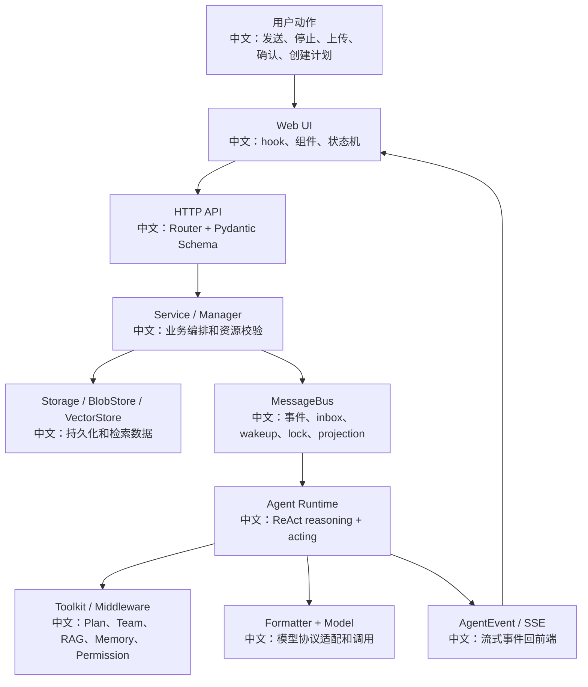

# 端到端面试演练题集

> 适合面试表达的关键词：端到端链路、白板题、追问演练、源码证据、产品流程、系统设计、故障恢复、简历表达。

---

## 1. 这份题集怎么用

前面 01-47 已经覆盖了大量模块。真正面试时，面试官通常不会按文件问，而会从一个产品动作切入：

```text
用户点击停止会发生什么？
用户上传文档为什么不能立刻搜？
Agent 怎么决定什么时候用 Plan？
多 Agent 是不是直接内存调用？
权限确认后怎么恢复？
定时任务无人值守怎么保证安全？
模型换成 Gemini 为什么还能跑工具？
```

这份题集把这些问题整理成“端到端回答模板”。

---

## 2. 回答结构模板

每道题都按 6 步回答：

```text
1. 一句话定位
2. 产品流程
3. 源码链路
4. 关键设计权衡
5. 边界和故障恢复
6. 测试或补测思路
```

通用开场：

```text
我不会只从某个函数解释这个点，而是从 Web UI、HTTP API、Service/Manager、MessageBus、Agent Runtime、前端状态恢复这条链路来看。
```

---

## 3. 白板主图



中文讲法：

```text
任何面试题都可以先放到这张图上定位。
比如 Stop 主要走 UI -> interrupt API -> CancelDispatcher/MessageBus -> Agent cleanup -> SSE 收尾；
上传文档主要走 UI -> upload API -> BlobStore/Storage -> IndexWorker -> VectorStore -> polling。
```

---

## 4. 题目一：点击 Stop / Interrupt 后发生什么？

### 一句话

```text
Stop 是一个 HTTP 202 的异步控制命令，后端根据 session 是 running 还是 parked 分别走取消广播或 resume trigger，最终让 Agent 进入协作式清理并通过 SSE 收尾。
```

### 主链路

```text
TextInput phase=streaming
  -> 用户点击 Stop
  -> useMessages.interrupt()
  -> POST /sessions/{sid}/interrupt
  -> ChatService / CancelDispatcher
  -> running: 跨进程取消任务
  -> parked: inbox+wakeup 注入 UserInterruptEvent
  -> Agent 捕获取消/中断
  -> ReplyEndEvent
  -> 前端 phase 回到 idle
```

### 关键追问

| 追问 | 回答方向 |
|---|---|
| 为什么返回 202？ | 取消不是同步完成，HTTP 只表示命令已接受。 |
| idle 时 interrupt 怎么办？ | 对存在的 session 是 no-op，保持幂等。 |
| parked HITL 怎么取消？ | 不能 cancel running task，要 enqueue resume trigger 让 Agent 恢复后短路清理。 |
| 前端怎么防重复点击？ | phase=interrupting 时 Stop disabled。 |

---

## 5. 题目二：上传知识库文档为什么不能立刻搜索？

### 一句话

```text
上传只完成原始 bytes 和 document record 的持久化，真正的解析、分块、embedding、写向量库在后台 IndexWorker 异步完成。
```

### 主链路

```text
前端 UploadContext / XHR progress
  -> POST /knowledge_bases/{kb}/documents
  -> BlobStore.write_stream
  -> KnowledgeDocumentRecord(status=pending)
  -> enqueue_index_task
  -> IndexWorker acquire lease
  -> parsing / chunking / indexing
  -> VectorStore insert
  -> status=ready
  -> 前端 polling 状态刷新
```

### 关键追问

| 追问 | 回答方向 |
|---|---|
| Parser 和 Chunker 为什么分开？ | Parser 保留结构边界，Chunker 控制检索粒度。 |
| Worker 崩溃怎么办？ | lease 过期后 sweeper 重新入队，其他 worker 接管。 |
| 原始文件放哪里？ | BlobStore，可能是 local 或 S3。 |
| 删除文档顺序？ | 先删向量库，再删 record，最后 best-effort 删 blob。 |

---

## 6. 题目三：Agent 什么时候开启 Plan？

### 一句话

```text
Plan 不是前端开关，而是 TaskCreate/TaskUpdate 等工具被装配进 Toolkit 后，由模型在复杂任务中基于工具 schema 主动调用。
```

### 主链路

```text
ChatService 组装 Agent
  -> Toolkit 装配 Plan 工具
  -> Agent reasoning
  -> 模型看到工具描述和复杂任务
  -> 产生 TaskCreate / TaskUpdate tool call
  -> AgentState.tasks_context 更新
  -> state_updated event
  -> 前端 TaskPanel 展示
```

### 关键追问

| 追问 | 回答方向 |
|---|---|
| 有没有独立 intent classifier？ | 没看到独立 classifier，主要靠 ReAct + tool schema。 |
| Plan 和普通 prompt 分解区别？ | Plan 有结构化状态、工具更新和 UI 投影。 |
| Plan 状态怎么到前端？ | AgentState.tasks_context 通过 state_updated 投影到 TaskPanel。 |

---

## 7. 题目四：多 Agent 是怎么协作的？

### 一句话

```text
多 Agent 不是进程内直接函数调用，而是 TeamRecord + SessionRecord + MessageBus + inbox+wakeup 组成的可恢复协作系统。
```

### 主链路

```text
Leader 调用 AgentCreate / AgentInvite
  -> 创建 worker agent/session 或 team-scoped invited session
  -> 更新 TeamRecord.members
  -> TeamSidebar 展示 leader/member
  -> TeamSay 写目标 session inbox
  -> enqueue_run_trigger 唤醒 worker
  -> worker 运行后 TeamSay 回 leader
```

### 关键追问

| 追问 | 回答方向 |
|---|---|
| AgentCreate 和 AgentInvite 区别？ | 前者创建 team-owned worker；后者借用已有 user agent 的 team session。 |
| TeamSay 是同步调用吗？ | 不是，写 inbox 并 wakeup，目标 session 自己运行。 |
| worker HITL 怎么给 leader 看？ | Subagent HITL projector 写 leader projection。 |
| 删除 team 怎么处理？ | created worker 删除 agent；invited worker 只删除 team session。 |

---

## 8. 题目五：权限确认后如何恢复执行？

### 一句话

```text
工具调用进入 ASK 后，前端展示确认卡；用户确认会生成 UserConfirmResultEvent，Agent 校验匹配 pending tool_call 后更新状态并继续 acting。
```

### 主链路

```text
模型产生 tool_call
  -> PermissionEngine.check_permission
  -> ASK
  -> ToolCallBlock.state=asking
  -> RequireUserConfirmEvent
  -> 前端 ConfirmCard
  -> 用户 allow/deny + rules
  -> UserConfirmResultEvent
  -> Agent 恢复 parked reply
  -> ALLOWED 执行工具 / DENIED 写拒绝结果
```

### 关键追问

| 追问 | 回答方向 |
|---|---|
| suggested_rules 怎么持久化？ | 确认后加入 AgentState.permission_context。 |
| DONT_ASK 怎么处理 ASK？ | 转成 DENY，适合无人值守。 |
| BYPASS 是否完全安全？ | BYPASS 跳过部分 safety ASK，不适合作默认。 |
| 多 Agent HITL 怎么投影？ | worker 的 HITL 投影到 leader，leader 确认后回 worker。 |

---

## 9. 题目六：模型换成 Gemini / Anthropic 为什么工具还能跑？

### 一句话

```text
Agent Runtime 内部使用统一 Msg/Block，Formatter 层把这些块转换成不同模型厂商的 tool_call、tool_result、thinking 和多模态协议。
```

### 主链路

```text
Agent 内部 Msg + ContentBlock
  -> FormatterBase
  -> OpenAIChatFormatter / AnthropicFormatter / GeminiFormatter
  -> 模型 API
  -> ChatResponse
  -> 统一 ToolCallBlock / TextBlock / ThinkingBlock
  -> Agent acting
```

### 关键追问

| 追问 | 回答方向 |
|---|---|
| Anthropic 的 tool_result 特殊在哪？ | 必须放 user message。 |
| Gemini 为什么 sanitize schema？ | 不支持完整 JSON Schema，比如 additionalProperties、const、null。 |
| ThinkingBlock 能跨模型复用吗？ | 不能一刀切，OpenAI 跳过、Anthropic 要 signature、Gemini 用 thought。 |
| 多模态工具结果怎么办？ | 支持则提升为 user message，不支持则降级成文本提醒/URL/文件路径。 |

---

## 10. 题目七：定时任务无人值守怎么保证安全？

### 一句话

```text
Schedule 用 APScheduler 管理 cron，但触发后走 inbox+wakeup 统一运行链路，权限默认 DONT_ASK，避免无人在线时卡在 HITL。
```

### 主链路

```text
创建 schedule
  -> 校验 agent / credential 可见性
  -> 保存 ScheduleRecord
  -> 注册 APScheduler job
  -> 到点触发
  -> stateful 复用 session / non-stateful 新建 session
  -> HintBlock <scheduled-task>
  -> inbox+wakeup
  -> Agent 运行
```

### 关键追问

| 追问 | 回答方向 |
|---|---|
| 为什么 DONT_ASK？ | 无人值守不能等确认，ASK 转 DENY。 |
| stateful 有什么用？ | 持续任务复用上下文。 |
| 服务重启后 schedule 怎么恢复？ | 从 storage.list_all_schedules 重新注册 enabled jobs。 |
| 删除 schedule 清什么？ | job、record、派生 session、running run、bus 状态。 |

---

## 11. 题目八：资源共享怎么避免泄露凭证？

### 一句话

```text
AgentScope 保持 owner-scoped storage，用 ResourceAccessPolicy 声明跨 owner 可见资源；UI view 对 shared credential 脱敏，只有 trusted runtime path 才能 resolve raw credential。
```

### 主链路

```text
viewer 请求资源
  -> 读取 own resources
  -> policy.list_accessible 返回 ResourceRef
  -> ResourceAccessService 合并 own/shared
  -> UI: CredentialView 脱敏 + editable
  -> runtime: resolve_credential 返回 raw record
```

### 关键追问

| 追问 | 回答方向 |
|---|---|
| 为什么 policy 返回 ref？ | 授权和数据读取分离。 |
| 404 和 403 怎么分？ | 不可见 404，可见但只读编辑 403。 |
| shared editor 怎么写回？ | resolve_for_edit 返回 owner_id，按 owner key 写回。 |
| team worker 能共享吗？ | source=team 是内部临时资源，不作为共享用户 agent。 |

---

## 12. 题目九：前端为什么复杂？

### 一句话

```text
前端要把历史消息、SSE、HITL、音频、工具调用、Plan、Permission、Team 和 interrupt 合成一个可恢复的 Agent 工作台。
```

### 主链路

```text
URL params
  -> ChatPage 决定 agent/session/member
  -> ChatViewport 装配工作台
  -> useMessages 合成消息和 phase
  -> ChatContent 渲染列表和输入
  -> MessageBubble 渲染工具组、音频、确认卡
  -> PanelDock 展示 Plan/Permission/KB/MCP/Skill
```

### 关键追问

| 追问 | 回答方向 |
|---|---|
| 为什么 URL 做状态源？ | 刷新、分享、回退可恢复。 |
| 工具结果乱序怎么办？ | 按 id 配对 call/result。 |
| Stop 状态怎么展示？ | idle/send、streaming/stop、interrupting/disabled。 |
| member view 怎么切？ | URL 第三段 memberId 聚焦 worker session。 |

---

## 13. 题目十：如何证明这个系统可靠？

### 一句话

```text
可靠性不能只靠读代码，要用测试和故障演练覆盖异步恢复边界：SSE、HITL、RAG worker、MessageBus、Schedule、Workspace/Permission、Formatter。
```

### 验证维度

| 维度 | 要验证什么 |
|---|---|
| Chat/SSE | 历史恢复、增量事件、ReplyEnd 收尾 |
| Interrupt | running cancel、parked resume、idle no-op |
| HITL | ASK、allow/deny、rules 持久化、刷新恢复 |
| RAG | upload pending、worker ready/error、lease 过期接管 |
| Team | AgentCreate/Invite、TeamSay、worker HITL projection |
| Formatter | tool、多模态、thinking、schema 兼容 |
| Schedule | restore、DONT_ASK、stateful/non-stateful、删除级联 |
| Resource | read/edit、credential 脱敏、raw runtime resolve |

---

## 14. 30 秒自我介绍版

```text
我最近按源码系统梳理了 AgentScope 这类 Agent 工程框架。
我不是只看怎么调用 API，而是从 Web UI、HTTP API、Service、MessageBus、Agent Runtime、Tool/Middleware、Storage 和测试去串完整链路。
比如一次 interrupt 可以讲到 202 异步语义、跨进程取消、parked HITL 恢复、asyncio 协作式取消和前端 phase 状态；
一次知识库上传可以讲到 BlobStore、DocumentRecord、IndexWorker lease、Parser/Chunker、Embedding、VectorStore 和前端轮询。
所以我对 Agent 产品工程化里的状态恢复、权限安全、多 Agent 协作、RAG 索引和多模型适配都有源码级理解。
```

---

## 15. 最后复习清单

面试前逐项检查：

| 能力 | 自测问题 |
|---|---|
| 总链路 | 能不能从用户动作讲到前端、后端、Agent、事件回流？ |
| 源码证据 | 每个模块能不能说出 3 个关键文件？ |
| 设计权衡 | 能不能讲同步/异步、自动/人工、隔离/共享？ |
| 故障恢复 | 能不能讲刷新、断线、worker 崩溃、取消、HITL 恢复？ |
| 前端体验 | 能不能讲 UI 为什么需要状态机和面板？ |
| 简历表达 | 能不能把源码学习转成项目 bullet？ |

一句提醒：

```text
不要只背“用了 Redis、用了 asyncio、用了 RAG”。
要讲清楚它们分别解决了哪个产品和系统问题。
```
