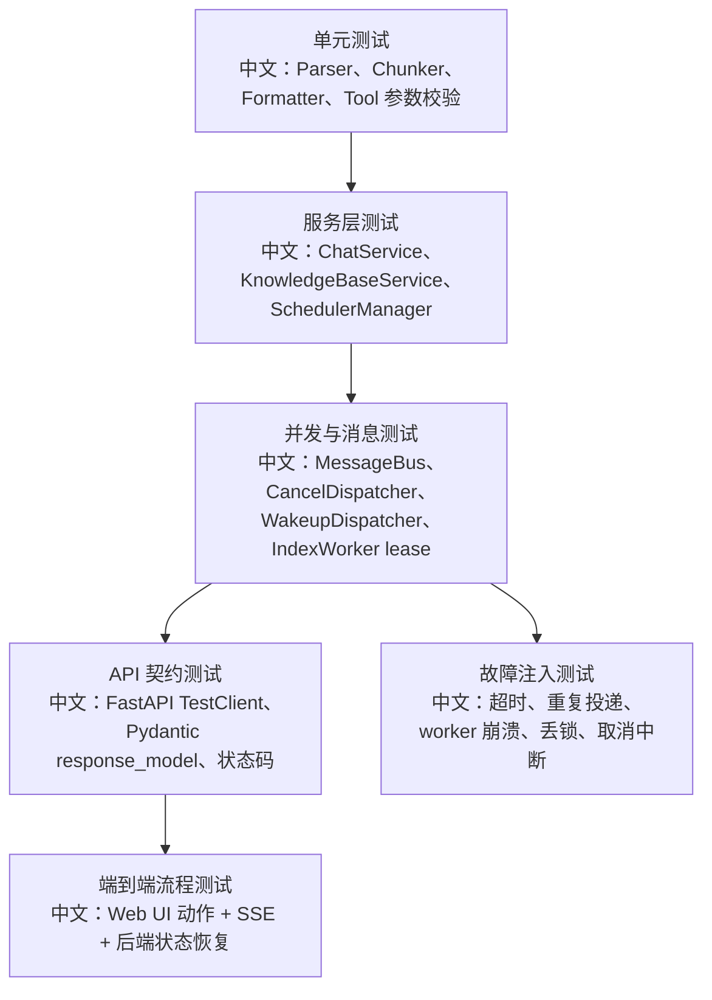

# 测试补齐路线与 pytest 实战清单

> 适合面试表达的关键词：测试金字塔、异步测试、SSE 流测试、分布式锁测试、租约测试、RAG 解析测试、前后端契约测试、故障注入、回归用例。

---

## 1. 这份文档解决什么问题

如果只会说“我写过单元测试”，面试深度是不够的。AgentScope 这类框架的测试重点在于：

```text
1. Agent 是异步流式系统，不能只测返回值。
2. 后端大量状态来自 Redis / MessageBus / Storage，需要测一致性。
3. HITL、interrupt、schedule、RAG worker 都是跨任务、跨进程语义，需要测 race condition。
4. 前端依赖 SSE 和状态投影，需要测事件顺序和 UI phase。
5. 生产问题往往来自取消、租约、重复投递、状态丢失，而不是普通 happy path。
```

面试里可以这样说：

```text
我会把 AgentScope 的测试分成“纯函数/模型契约测试、服务层状态机测试、消息总线与并发测试、端到端产品流程测试、故障注入测试”五层。尤其 interrupt、HITL、RAG worker、schedule 这几类场景，必须测异步边界和恢复语义。
```

---

## 2. 当前源码里的测试地图

| 测试区域 | 代表文件 | 重点 |
|---|---|---|
| Agent 与中断 | `tests/agent_interrupt_test.py`、`tests/service_agent_interrupt_test.py` | `asyncio.CancelledError`、协作式取消、状态收尾 |
| MessageBus | `tests/in_memory_message_bus_test.py`、`tests/service_message_bus_test.py` | queue、log、pub/sub、lock |
| CancelDispatcher | `tests/service_cancel_dispatcher_test.py` | 跨进程取消信号、本地 task cancel、后台任务取消 |
| WakeupDispatcher | `tests/service_wakeup_dispatcher_test.py` | wake/resume、busy session retry、orphan trigger drop |
| RAG 解析 | `tests/rag_parser_test.py`、`tests/rag_chunker_approx_token_test.py` | 文档解析、结构边界、分块策略 |
| RAG Worker | `tests/index_worker_lease_test.py`、`tests/service_index_task_consumer_test.py` | lease、heartbeat、重复投递、并发上限 |
| 知识库上传 | `tests/service_knowledge_base_upload_test.py`、`tests/blob_store_s3_test.py` | BlobStore、pending 状态、S3 行为 |
| Storage | `tests/storage_redis_test.py`、`tests/storage_redis_knowledge_base_test.py` | Redis record/index/list/upsert |
| 权限与 HITL | `tests/permission_engine_test.py`、`tests/hitl_user_confirmation_test.py`、`tests/hitl_external_execution_test.py` | 确认卡、恢复事件、权限模式 |
| Formatter / Model | `tests/formatter_*_test.py`、`tests/model_*_test.py` | 多模型协议适配、stream/non-stream 差异 |
| Workspace / Tool | `tests/workspace_*_test.py`、`tests/builtin_*_test.py` | 沙箱、文件工具、命令执行 |

亮点：测试目录已经覆盖很多核心模块，但你面试时要能说出“为什么这些测试重要”，而不是只背文件名。

---

## 3. 测试金字塔



中文讲法：

```text
越底层越关注确定性，越上层越关注产品流程和跨模块状态。
AgentScope 的测试不能只有 API happy path，因为真实风险在异步取消、消息重复、租约过期、SSE 事件顺序和权限恢复。
```

---

## 4. 最值得补的测试清单

### 4.1 Chat / Interrupt

| 场景 | 为什么高频 | 断言点 |
|---|---|---|
| running session 被 interrupt | 面试常问优雅终止 | 返回 202、任务被 cancel、finally 执行、session 回 idle |
| parked HITL 被 interrupt | 容易误以为只 cancel task | resume trigger 注入 `UserInterruptEvent`，后续能收尾 |
| interrupt 重复点击 | 幂等性 | 第二次不破坏状态，前端 phase 不乱跳 |
| 持久化被 cancel 包围 | `asyncio.shield` 亮点 | cancel 不应打断关键持久化 |

可以补的测试表达：

```text
我会用一个可控 fake Agent 或 fake ChatService，把运行卡在 await 点，然后触发 interrupt，验证取消信号、状态落库和 SSE 终态事件。
```

### 4.2 RAG 上传与索引

| 场景 | 为什么高频 | 断言点 |
|---|---|---|
| 上传大文件 | BlobStore 流式写入 | 不一次性读取整个文件，record 是 pending |
| worker 成功处理 | 异步 pipeline | pending -> parsing -> chunking -> indexing -> ready |
| worker 丢失 lease | 分布式一致性 | pipeline 被 cancel，不重复写向量库 |
| 解析失败 | 故障可见性 | status=error，error 被脱敏和截断 |
| 删除文档 | 生命周期顺序 | 先删 vector，再删 record，最后 best-effort 删 blob |

面试亮点：

```text
RAG 测试不是只测“能搜到”，还要测“为什么现在不能搜到”：上传和索引是两个阶段，中间靠 pending 状态、任务队列、lease 和 polling 连接。
```

### 4.3 MessageBus / Dispatcher

| 场景 | 为什么高频 | 断言点 |
|---|---|---|
| queue_drain 批量消费 | 消息队列语义 | FIFO、max_count、异常不丢整批 |
| session lock | 防并发 run | 同一 session 只能一个 runner |
| wake trigger 在 running 时到达 | 去重语义 | wake 可丢，因为 live run 会 drain inbox |
| resume trigger 在 running 时到达 | 不能丢 | 延迟 re-enqueue，避免 HITL 结果丢失 |
| orphan trigger | 删除后的残留消息 | session 不存在时 drop 并记录 warning |

这部分适合回答“你怎么测分布式系统”。

### 4.4 前端状态机

| 场景 | 断言点 |
|---|---|
| `phase=streaming` 时按钮显示 Stop | 用户能中断 |
| `phase=interrupting` 时 Stop disabled | 防重复点击 |
| SSE 断线后历史补偿 | `useMessages` 重新拉历史不重复 |
| Team member URL 切换 | leader shell 不变，ChatViewport 切换 member session |
| 文档上传 polling | pending/processing/ready/error 映射到 UI |

前端可以用 Playwright 或组件测试补。面试里不需要展开工具细节，重点讲“状态来自事件投影，不是本地猜测”。

---

## 5. pytest 实战模板

### 5.1 异步 race 测试模板

```python
async def test_interrupt_cancels_running_task():
    # 中文：用 Event 精确控制任务停在可取消点，避免靠 sleep 猜时间。
    started = asyncio.Event()
    cancelled = asyncio.Event()

    async def run_forever():
        started.set()
        try:
            await asyncio.Event().wait()
        except asyncio.CancelledError:
            cancelled.set()
            raise

    task = asyncio.create_task(run_forever())
    await asyncio.wait_for(started.wait(), timeout=2)

    task.cancel()

    with pytest.raises(asyncio.CancelledError):
        await task
    await asyncio.wait_for(cancelled.wait(), timeout=2)
```

关键点：

```text
不要用固定 sleep 判断任务是否开始；用 asyncio.Event 做同步点。
不要吞掉 CancelledError；取消语义本身就是测试对象。
```

### 5.2 租约测试模板

```python
async def test_worker_stops_when_lease_is_lost(fake_storage):
    # 中文：模拟 heartbeat 续租失败，验证 pipeline 不继续写向量库。
    worker = IndexWorker(..., storage=fake_storage)
    fake_storage.renew_returns = False

    await worker.process(user_id="u", knowledge_base_id="kb", document_id="doc")

    assert fake_storage.marked_error
    assert fake_storage.vector_write_count == 0
```

关键点：

```text
租约测试测的不是“是否能 acquire”，而是“失去租约后是否停止副作用”。
```

### 5.3 SSE 顺序测试模板

```python
def test_stream_events_are_ordered(client):
    # 中文：先触发 run，再读取 /sessions/{sid}/stream，按事件类型断言顺序。
    events = collect_sse(client, "/sessions/s1/stream")

    assert events[0]["type"] == "reply_start"
    assert any(e["type"] == "text_block_delta" for e in events)
    assert events[-1]["type"] == "reply_end"
```

关键点：

```text
SSE 不是普通 JSON response，要测 start/delta/end 的完整性和前端可重建性。
```

---

## 6. 面试追问

| 追问 | 回答方向 |
|---|---|
| 为什么很多测试要用 fake bus / fake storage？ | 先隔离服务逻辑，再用 Redis/S3 集成测试验证真实后端。 |
| 怎么避免异步测试 flaky？ | 用 Event、Queue、wait_for、可控 fake，不靠固定 sleep。 |
| 怎么测重复投递？ | 同一个 trigger 或 document task 投两次，断言幂等/lease 生效。 |
| 怎么测取消安全？ | 验证 `CancelledError` 传播、`finally` 执行、关键持久化被 shield。 |
| 怎么测前后端契约？ | 后端 Pydantic schema + API response，前端 type/schema-driven form，补契约快照或 e2e。 |

---

## 7. 简历表达

```text
我在阅读 AgentScope 源码时，不是只看 API happy path，而是按异步系统的风险点设计测试：interrupt 的协作式取消、HITL resume 的不丢消息、RAG worker 的 lease 与 heartbeat、MessageBus 的 queue/log/lock 语义，以及前端 SSE 事件投影。这样测试能覆盖真实生产故障，而不是只证明接口能调用。
```

