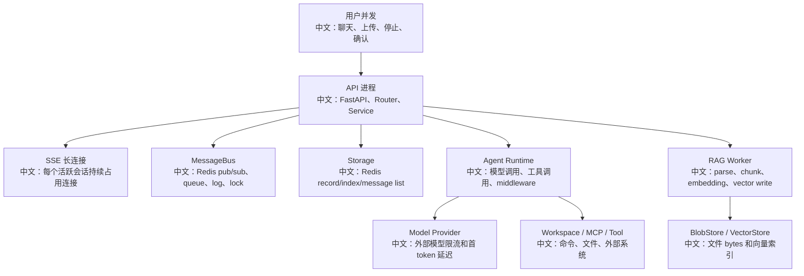

# 性能瓶颈与容量规划

> 适合面试表达的关键词：容量模型、SSE 长连接、Redis 热 key、向量检索、Embedding batch、Worker 并发、租约 TTL、队列积压、前端渲染压力、背压。

---

## 1. 先建立容量视角

AgentScope 不是一个单纯 HTTP CRUD 服务，它的性能瓶颈来自几条不同链路：

```text
1. Chat 链路：用户请求 -> Agent run -> 模型流式输出 -> 工具调用 -> SSE 回前端。
2. 控制链路：interrupt / confirm / external execution -> MessageBus -> resume。
3. RAG 链路：上传 -> BlobStore -> Worker 解析 -> chunk -> embedding -> vector store。
4. 后台链路：schedule、wakeup dispatcher、index sweeper、workspace sweeper。
5. 前端链路：长消息、工具调用、音频流、多 panel、多 agent team 视图。
```

面试里可以这样开场：

```text
我会先把系统拆成实时链路和离线链路。实时链路关注延迟、SSE 连接数、模型首 token、工具执行时间；离线链路关注上传吞吐、索引队列、embedding batch、向量库写入和 worker 租约。
```

---

## 2. 总体瓶颈图



中文解释：

```text
API 进程不一定是 CPU 瓶颈，很多时候瓶颈在模型供应商、Redis 热 key、SSE 连接数、RAG worker 并发、embedding batch 和向量库写入。
```

---

## 3. 实时聊天链路的性能点

| 点位 | 源码证据 | 性能风险 | 优化方向 |
|---|---|---|---|
| SSE stream | `examples/web_ui/frontend/src/api/session.ts`、`src/agentscope/app/_router/_session.py` | 长连接多，断线重连，事件堆积 | 心跳、断线重放、连接数限制 |
| Message log | `MessageBus.session_publish_event`、`log_read` | 每个 session 事件日志增长 | TTL、trim、分页读取 |
| Redis lock | `session_lock(session_id)` | 热 session 串行化 | 合理锁 TTL、避免长时间持锁 |
| 模型调用 | `ChatModelBase`、各 provider model | 外部限流、首 token 慢 | retry、fallback、限流队列 |
| 工具调用 | `Toolkit.call_tool`、Workspace backend | 命令慢或阻塞 | timeout、后台 offload、权限确认 |
| 前端渲染 | `MessageBubble`、工具 renderers | 长输出导致渲染卡顿 | 分块渲染、折叠、虚拟列表 |

面试亮点：

```text
聊天性能不能只看 QPS。Agent 是长事务：一次请求可能包含多轮模型调用、多个工具调用、持续 SSE 输出，还要持有 session run lease。容量评估要用“并发运行会话数”而不是只用 HTTP request/s。
```

---

## 4. RAG 索引链路的性能点

源码里的关键设计：

```text
IndexWorker 使用 max_concurrency 控制单 worker 内并发；
EmbeddingModelBase 使用 batch_size 把输入切批，并用 asyncio.gather 并发请求；
BlobStore.write_stream 要求分块写入，避免一次性读完整文件；
KnowledgeDocument lease 使用 heartbeat 续租，避免长解析任务被误接管；
Wakeup / index task consumer 使用 queue_drain 批量消费，减少队列往返。
```

容量估算可以这么讲：

```text
单文档索引耗时 = 上传写 blob + parser 耗时 + chunk 数量 * embedding 平均耗时 / batch 并发 + vector store 写入耗时。
Worker 总吞吐 = worker 进程数 * worker_max_concurrency / 单文档平均处理时长。
```

| 参数 | 影响 |
|---|---|
| `worker_max_concurrency` | 提高并发，但会放大 parser CPU、内存、embedding 请求数 |
| `batch_size` | 减少 embedding 请求次数，但受 provider token/长度限制 |
| `lease_ttl` | 太短容易误判 worker 死亡，太长会延迟故障恢复 |
| chunk size | 太小向量数量爆炸，太大召回精度下降 |
| BlobStore 后端 | local 快但不适合多节点共享，S3 适合分布式但有网络延迟 |

---

## 5. Redis 与状态存储容量

Redis 在这个项目里承担多种角色：

```text
1. Storage：agent/session/message/team/schedule/kb/document 的 record 和 index。
2. MessageBus：pub/sub、queue、event log、session lock。
3. RAG lease：document processing_node 和 lease_expires_at。
```

常见瓶颈：

| 瓶颈 | 表现 | 处理 |
|---|---|---|
| message list 太长 | 历史读取慢，内存增长 | 分页、归档、摘要、TTL |
| event log 太长 | SSE replay 成本高 | trim、按 session 生命周期清理 |
| index set 太大 | list agents/sessions 扫描慢 | 分页索引、二级索引 |
| lock TTL 不合理 | 重复运行或恢复慢 | heartbeat、合理 ttl、监控锁年龄 |
| queue 积压 | wake/index 延迟 | batch drain、worker 扩容、告警 |

面试表达：

```text
Redis 不是只做缓存，它在这里承担了“轻量事件系统 + 状态索引 + 分布式锁”。所以容量规划要分别看 key 数、value 大小、list/log 长度、pub/sub 连接数和 lock TTL。
```

---

## 6. 前端容量与体验

Web UI 的压力点：

```text
1. MessageBubble 要渲染文本、thinking、tool_call、tool_result、audio、confirm card。
2. TextInput 要处理附件加工状态，上传期间不能误发送。
3. PanelDock 同时显示 Plan、MCP、Skill、Permission、Knowledge。
4. TeamSidebar 切换 worker 时，ChatViewport 要换会话但保留外层 leader 上下文。
5. StreamingAudioManager 要边收音频边播放，不能等全文结束。
```

优化方向：

| 场景 | 优化 |
|---|---|
| 长历史消息 | 虚拟列表、按页加载、折叠工具结果 |
| 大工具输出 | 默认折叠、摘要预览、按需展开 |
| 音频流 | 只在 streaming 时持有 AudioContext，结束后转 Blob URL |
| 多 panel | 限制同列 panel 数，避免无限扩展 |
| 频繁状态事件 | 合并 state_updated，减少无意义重渲染 |

---

## 7. 监控指标清单

| 指标 | 为什么重要 |
|---|---|
| 活跃 SSE 连接数 | 反映实时会话压力 |
| running session 数 | 比普通 QPS 更接近 Agent 压力 |
| 模型首 token 延迟 | 用户体感最敏感 |
| 工具平均耗时 / 超时数 | 定位慢工具 |
| interrupt 到 reply_end 延迟 | 衡量优雅终止质量 |
| wakeup queue 积压 | HITL / schedule 恢复是否延迟 |
| index queue 积压 | 文档上传后多久可检索 |
| document error rate | parser/embedding/vector store 质量 |
| Redis 内存和 key 数 | 状态存储容量 |
| vector store 查询 p95 | RAG 延迟 |

---

## 8. 面试追问

| 追问 | 回答方向 |
|---|---|
| 怎么估算能支持多少用户？ | 看活跃会话数、平均 run 时长、模型/工具耗时、SSE 连接、Redis 和 worker 并发。 |
| RAG 为什么要异步索引？ | 上传可快速返回 pending，解析/embedding/vector write 放后台，避免阻塞 API。 |
| worker_max_concurrency 越大越好吗？ | 不是，会放大 CPU、内存、embedding 限流和向量库写压力。 |
| 怎么处理队列积压？ | 扩 worker、调 batch、拆 parser、降级大文件、增加告警和重试策略。 |
| Redis 挂了会怎样？ | Storage/MessageBus/lock 都受影响，需要高可用、降级、恢复和幂等补偿。 |

---

## 9. 简历表达

```text
我从容量角度分析过 AgentScope：实时聊天链路关注 SSE 长连接、模型首 token、工具执行、session lock；离线 RAG 链路关注 BlobStore 流式上传、IndexWorker 并发、lease heartbeat、embedding batch 和向量库写入。这个系统的核心容量单位不是 HTTP QPS，而是“活跃 Agent run + 后台索引任务”的组合压力。
```

