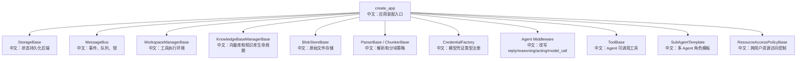

# 二次开发扩展点总览

> 适合面试表达的关键词：插件化、依赖注入、create_app、Middleware、Tool、Credential、Parser、Chunker、BlobStore、Storage、VectorStore、ResourceAccessPolicy、SubAgentTemplate。

---

## 1. 为什么这份文档重要

你未来如果用 AgentScope 做业务项目，面试官很可能会问：

```text
如果我要接入公司内部模型，怎么扩展？
如果我要把知识库文件放到对象存储，怎么扩展？
如果我要加企业权限和审计，改哪里？
如果我要加一个内部工具给 Agent 调用，怎么挂进去？
如果我要定制多 Agent 的角色模板，怎么做？
```

这类问题的答案不能是“改源码”。成熟框架应该有扩展点。

面试里可以这样说：

```text
AgentScope 的扩展点主要分三层：应用装配层通过 create_app 注入存储、消息总线、workspace、RAG 组件和权限策略；Agent 运行层通过 middleware、tool、custom_agent_cls、subagent template 扩展行为；模型和知识库层通过 Credential、Formatter、Parser、Chunker、BlobStore、VectorStore 适配外部系统。
```

---

## 2. create_app 是总装配入口

源码入口：`src/agentscope/app/_app.py`

核心参数：

| 参数 | 中文说明 | 适合扩展什么 |
|---|---|---|
| `storage` | 应用状态持久化 | Redis 换 SQL / Mongo / 企业存储 |
| `message_bus` | 实时消息、队列、锁 | Redis 换 Kafka / NATS / 内存测试实现 |
| `workspace_manager` | 工作区和工具执行环境 | local、Docker、K8s、E2B、Daytona |
| `knowledge_base_manager` | 知识库生命周期和向量库 runtime | Qdrant、Milvus、MongoDB 等 |
| `knowledge_parsers` | 上传文档解析器 | PDF、Word、Excel、图片 OCR、自定义格式 |
| `knowledge_chunker` | 文档分块策略 | token chunk、标题层级、语义分块 |
| `blob_store` | 原始文件存储 | local、S3、OSS、MinIO |
| `extra_credentials` | 额外凭证类型 | 内部模型、企业 API token |
| `extra_middlewares` | FastAPI/ASGI middleware | 鉴权、CORS、审计、trace |
| `extra_agent_middlewares` | 每次 Agent 组装时追加 middleware | 租户隔离、审计、成本控制 |
| `extra_agent_tools` | 每次 Agent 组装时追加工具 | 内部业务系统工具 |
| `custom_subagent_templates` | 多 Agent worker 模板 | researcher、coder、reviewer |
| `custom_agent_cls` | 自定义 Agent 类 | 改 reasoning/acting 行为 |
| `resource_access_policy` | 跨用户资源访问策略 | 组织共享、团队权限 |

---

## 3. 扩展点地图



中文解释：

```text
create_app 本身不是业务逻辑，而是把所有可替换组件挂到 app.state，再由 deps 和 lifespan 注入到 router、service、manager。
```

---

## 4. 工具扩展：ToolBase / extra_agent_tools

适合场景：

```text
查订单、查库存、查 CRM、创建工单、调用内部搜索、触发 CI/CD、访问企业数据。
```

核心思路：

```text
1. 定义一个 ToolBase 子类，声明参数 schema。
2. 在 __call__ 中返回 ToolChunk 或 ToolResponse。
3. 通过 extra_agent_tools 按 user_id / agent_id / session_id 动态注入。
4. 如有风险操作，配合 Permission / HITL。
```

面试亮点：

```text
我不会把企业业务能力硬编码进 Agent，而是作为 Tool 注入。这样工具可按租户、用户、权限动态开放，也可以被 middleware 审计和拦截。
```

---

## 5. Middleware 扩展：改变 Agent 运行行为

Agent 初始化时会把 middleware 按 hook 分类：

```text
on_reply
on_reasoning
on_acting
on_model_call
on_system_prompt
on_compress_context
```

适合做：

| Middleware 类型 | 能力 |
|---|---|
| 成本控制 | 控制 token、轮数、工具次数 |
| 审计日志 | 记录用户输入、工具调用、模型返回摘要 |
| 权限控制 | 在 acting 前检查 tool call |
| RAG 注入 | 在 reasoning 前检索知识库并加入 hint |
| 长期记忆 | reply 前检索，reply 后写入 |
| 模型调用治理 | 重试、fallback、限流、trace |

面试表达：

```text
Middleware 的价值是把横切逻辑从 Agent 主循环里拿出来，形成可组合的洋葱模型。比如权限、RAG、记忆、成本控制都不应该散落在 `_reply_impl` 的每个分支里。
```

---

## 6. 知识库扩展：Parser / Chunker / BlobStore / VectorStore

知识库链路可以拆成四个可替换点：

```text
Parser：把不同格式文件变成 Section。
Chunker：把 Section 切成可检索 chunk。
Embedding：把 chunk 变成向量。
VectorStore：存储和检索向量。
BlobStore：存储原始 bytes，供 worker 异步读取。
```

扩展案例：

| 需求 | 扩展点 |
|---|---|
| 支持企业 wiki 导出格式 | 自定义 Parser |
| 按标题层级切块 | 自定义 Chunker |
| 使用内部 embedding 模型 | 自定义 Credential + EmbeddingModel |
| 换成公司统一向量库 | KnowledgeBaseManager / VectorStore |
| 文件放对象存储 | BlobStoreBase 实现 |

面试亮点：

```text
Parser 和 Chunker 分离很关键：Parser 负责保留文档结构，Chunker 负责检索粒度。这样同一种文件解析结果，可以适配不同召回策略。
```

---

## 7. 多 Agent 扩展：SubAgentTemplate

`custom_subagent_templates` 用来注册可复用 worker 模板。

适合：

```text
researcher：偏搜索和资料整理
coder：偏代码修改和测试
reviewer：偏审查和风险发现
analyst：偏数据分析
operator：偏业务系统操作
```

源码设计亮点：

```text
create_app 会检查重复 type，然后存到 app.state.custom_subagent_templates；
AgentCreate 工具可以暴露 subagent_type；
leader 创建 worker 时按模板注入 system prompt、context、ReAct、permission、task context。
```

面试表达：

```text
多 Agent 不是复制一个通用 Agent，而是用模板把角色、权限、上下文和任务能力固定下来，避免 leader 每次临时编角色导致行为不稳定。
```

---

## 8. 权限扩展：ResourceAccessPolicy

默认策略是 `DenyAllResourceAccessPolicy`，保持 owner-isolated。

企业场景可能需要：

```text
同组织共享知识库
团队内共享 agent
管理员可查看 credential 元数据但不能看 secret
项目空间内资源可继承权限
```

扩展点：

```text
ResourceAccessPolicyBase
  -> can_read_resource
  -> can_write_resource
```

面试亮点：

```text
资源访问策略不应该散在每个 router 里，而应该集中成 policy。这样既方便企业定制，也能在审计和测试里统一覆盖。
```

---

## 9. 面试追问

| 追问 | 回答方向 |
|---|---|
| 你会怎么接入内部模型？ | Credential + Model + Formatter，必要时注册 extra_credentials，并在前端 schema 展示。 |
| 怎么接入内部工具？ | ToolBase + extra_agent_tools，按用户/租户动态注入，并配权限 middleware。 |
| 怎么换存储？ | 实现 StorageBase，保证 record/index/list/upsert/lease 语义一致。 |
| 怎么支持新文件格式？ | 实现 ParserBase，输出统一 Section，再复用现有 Chunker。 |
| 怎么做企业权限？ | 实现 ResourceAccessPolicyBase，不在业务 router 里到处写 if。 |

---

## 10. 简历表达

```text
我分析过 AgentScope 的二次开发扩展面：create_app 负责依赖注入和生命周期管理，Agent 层通过 Middleware 和 Tool 扩展运行行为，RAG 层通过 Parser/Chunker/BlobStore/VectorStore 扩展知识库能力，企业权限通过 ResourceAccessPolicy 集中治理，多 Agent 通过 SubAgentTemplate 固化角色模板。
```

