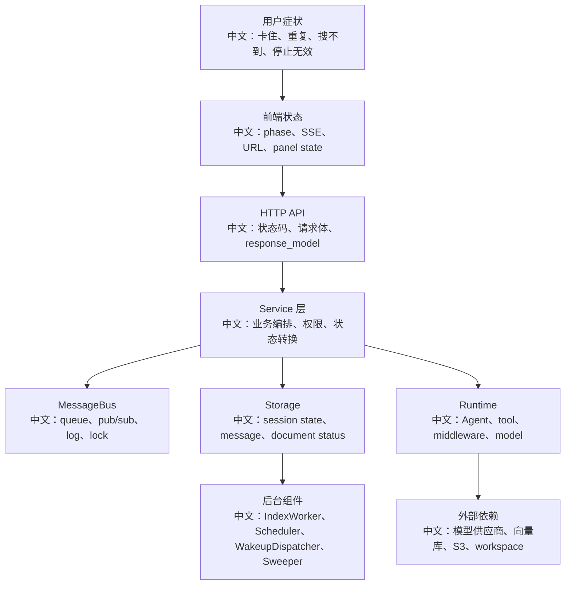

# 生产事故复盘模板

> 适合面试表达的关键词：事故复盘、时间线、影响面、根因分析、短期止血、长期修复、可观测性、幂等补偿、异步系统故障。

---

## 1. 为什么要写事故复盘

面试官很喜欢问：

```text
你遇到过线上问题吗？
你怎么定位？
你怎么复盘？
你怎么避免再次发生？
```

如果你能结合 AgentScope 的真实架构回答，会比泛泛而谈更有说服力。

面试开场：

```text
AgentScope 这类系统的事故通常不是单点函数 bug，而是异步链路的状态不一致：SSE 断流、interrupt 未收尾、HITL resume 丢失、RAG worker 租约异常、Redis 队列积压、工具执行超时、权限确认卡恢复失败。复盘时我会先按用户动作还原链路，再定位状态卡在哪一层。
```

---

## 2. 事故复盘总模板

```text
事故标题：
发生时间：
发现方式：
影响范围：
用户表现：
核心链路：
初步止血：
根因分析：
修复方案：
补测清单：
监控告警：
复盘结论：
```

更适合面试的说法：

```text
我不会一上来就说“Redis 有问题”或“模型慢”。我会先从用户看到的症状出发，沿着 Web UI -> API -> Service -> MessageBus -> Runtime -> Storage -> SSE 回流逐层排查。
```

---

## 3. 排查路线图



中文解释：

```text
先看“用户看到什么”，再看“系统认为它处于什么状态”。很多事故的本质是这两者不一致。
```

---

## 4. 典型事故一：用户点击 Stop 后还在输出

### 用户表现

```text
前端点击 Stop，按钮进入 interrupting，但模型仍继续输出，或最终没有回 idle。
```

### 可能根因

| 层级 | 可能问题 |
|---|---|
| 前端 | 重复点击、AbortController 只断本地 stream，没有调用 interrupt API |
| API | `/sessions/{sid}/interrupt` 未返回 202 或路由 session 错误 |
| CancelDispatcher | 跨进程 cancel 信号未被订阅进程收到 |
| ChatRunRegistry | 本地 task 不存在，session 实际在别的进程 |
| Agent Runtime | 工具或模型调用不响应 `CancelledError` |
| Storage | finally 没清理状态，session 卡 running |
| SSE | reply_end 未发布，前端 phase 无法收尾 |

### 止血

```text
1. 先确认 session 是否仍 running。
2. 对 stuck session 做后台清理或强制释放 lock。
3. 降级关闭高风险工具或长耗时模型。
```

### 长期修复

```text
1. 补 interrupt 到 reply_end 的延迟监控。
2. 给长耗时工具加 timeout 和取消检查。
3. 增加 CancelDispatcher 的订阅健康检查。
4. 补 running/parked/idle 三态 interrupt 测试。
```

---

## 5. 典型事故二：上传知识库后一直 pending

### 用户表现

```text
文件上传成功，UI 显示 pending 或 parsing 很久，无法检索到内容。
```

### 可能根因

| 层级 | 可能问题 |
|---|---|
| BlobStore | 文件写入失败、S3 权限错误、blob_uri 不可读 |
| Storage | document record 创建了，但 index task 未入队 |
| IndexTaskConsumer | 没有消费 queue 或订阅 signal 失败 |
| IndexWorker | `max_concurrency` 满、parser 卡住、lease 没抢到 |
| Embedding | provider 限流或 batch 过大 |
| VectorStore | collection 维度不匹配、写入失败 |
| Sweeper | worker 崩溃后没有重新入队 |

### 排查数据

```text
document.status
document.error
document.processing_node
document.lease_expires_at
index queue backlog
worker logs
embedding provider error
vector store insert error
```

### 长期修复

```text
1. pending/parsing/chunking/indexing 每个阶段打点耗时。
2. 对 error 做脱敏但保留错误类别。
3. 增加 index queue 积压告警。
4. 大文件限制和解析超时。
5. worker lease 丢失和重试测试。
```

---

## 6. 典型事故三：HITL 确认后 Agent 没有继续

### 用户表现

```text
前端确认工具调用后，确认卡消失或仍停留，Agent 没有继续生成结果。
```

### 可能根因

| 层级 | 可能问题 |
|---|---|
| 前端 | confirm result 没发到正确 session |
| API | resume input schema 校验失败 |
| MessageBus | resume trigger 入队失败 |
| WakeupDispatcher | session lock 忙时 resume 被误丢 |
| Storage | session 已删除，orphan trigger 被 drop |
| Agent | parked state 恢复失败，permission_context 不一致 |

### 面试亮点

```text
wake trigger 忙时可以丢，因为 running session 会 drain inbox；但 resume trigger 不能丢，因为它携带用户确认结果。源码里 WakeupDispatcher 对 resume 使用 backoff re-enqueue，这是典型的“消息语义区分”。
```

---

## 7. 典型事故四：定时任务重复触发或不触发

### 可能根因

```text
APScheduler job 未恢复
schedule record 与实际 job 不一致
多进程重复注册
目标 session 被删除
wakeup queue 积压
无人值守权限模式不足
```

排查顺序：

```text
1. 查 schedule record 是否 enabled。
2. 查 SchedulerManager 是否 restore 完成。
3. 查 wakeup queue 是否有 trigger。
4. 查 session lock 是否长期被占用。
5. 查目标 session 是否存在。
6. 查权限策略是否阻止工具执行。
```

---

## 8. 复盘报告示例骨架

```text
事故标题：知识库文档长时间停留 indexing，用户无法检索新上传资料

影响范围：
某租户 14:20-15:05 上传的 PDF 文档，状态停留 indexing，历史知识库可正常检索。

直接原因：
Embedding provider 返回限流错误，worker 将错误写入 document.error，但前端 polling 没有突出展示错误类别。

深层原因：
1. worker 并发和 embedding batch 同时放大，请求峰值超过 provider 配额。
2. 缺少 index queue backlog 和 document stage duration 告警。
3. 大文件上传后没有容量保护。

短期修复：
降低 worker_max_concurrency，减小 batch_size，对失败文档重入队。

长期修复：
增加 provider 限流退避，按租户限流，补 worker 压测和错误展示。
```

---

## 9. 面试追问

| 追问 | 回答方向 |
|---|---|
| 怎么快速定位 Agent 卡住？ | 看 session state、lock、SSE 最后事件、running task、模型/工具日志。 |
| 怎么判断是前端问题还是后端问题？ | 前端看 phase/SSE，后端看 event log/session state；如果 event log 已有 reply_end 而 UI 未更新，多半是前端投影问题。 |
| 怎么避免重复触发？ | lock、幂等 key、队列去重、状态机校验。 |
| 怎么恢复 pending 文档？ | 检查 lease 是否过期，过期由 sweeper 重入队；必要时手动重置状态并重投任务。 |
| 复盘最重要的产物是什么？ | 不是“谁写错了”，而是补监控、补测试、补降级和补恢复工具。 |

---

## 10. 简历表达

```text
我用生产事故视角分析过 AgentScope：围绕 Stop 无效、RAG pending、HITL resume 丢失、schedule 不触发等场景，建立了从 Web UI、API、Service、MessageBus、Storage、Runtime 到后台 worker 的排查路径，并把每类事故沉淀成监控指标、补测清单和恢复方案。
```

