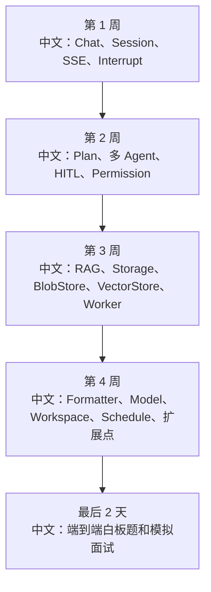

# 源码阅读每日训练计划

> 适合面试表达的关键词：源码驱动学习、刻意练习、API 切片、产品流程、源码证据、面试题生成、复盘卡片、每日节奏。

---

## 1. 这份计划怎么用

这不是普通“看源码计划”。目标是让你每次读完都产出三样东西：

```text
1. 能讲清一个产品流程。
2. 能指出关键源码入口。
3. 能形成面试回答和追问。
```

每天建议 60-90 分钟：

```text
15 分钟：跑通或复述一个产品动作。
30 分钟：沿 API / hook / service / runtime 读源码。
20 分钟：画链路图和状态机。
15 分钟：写一段面试表达 + 3 个追问。
```

---

## 2. 每日固定模板

```text
今天主题：
用户动作：
API / 前端入口：
后端 service：
运行时模块：
状态存储：
事件回流：
关键设计：
边界情况：
面试一句话：
可追问问题：
还没看懂的点：
```

面试训练核心：

```text
不要只回答“这个函数做了什么”，要回答“为什么产品上需要这个流程，系统上如何保证状态一致，工程上如何处理失败”。
```

---

## 3. 30 天训练路线



中文解释：

```text
先学实时聊天主链路，再学 Agent 的计划、协作和权限，第三周攻克知识库，最后补模型适配、工具生态、生产化和二次开发。
```

---

## 4. 第 1 周：Chat / Session / Interrupt

| 天数 | 主题 | 产出 |
|---|---|---|
| Day 1 | Web UI 聊天主流程 | 画 URL -> ChatViewport -> useMessages -> SSE 图 |
| Day 2 | `POST /chat` 和 run trigger | 写“为什么 chat 触发和 stream 分离” |
| Day 3 | `/sessions/{sid}/stream` | 写 SSE start/delta/end 事件重建逻辑 |
| Day 4 | `/sessions/{sid}/interrupt` | 写 running/parked/idle 三态回答 |
| Day 5 | MessageBus event log | 写 replay + live pub/sub 的设计权衡 |
| Day 6 | ChatService 状态清理 | 写 `finally`、`shield`、状态一致性 |
| Day 7 | 模拟面试 | 用 5 分钟讲“点击 Stop 后发生什么” |

推荐阅读文档：

```text
02_interrupt API源码链路深挖.md
20_ChatService运行态与分布式锁.md
31_消息总线键设计与Redis数据结构.md
32_前端Chat状态机逐事件回放.md
44_前端组件地图与交互状态细节.md
48_端到端面试演练题集.md
```

---

## 5. 第 2 周：Plan / 多 Agent / HITL / Permission

| 天数 | 主题 | 产出 |
|---|---|---|
| Day 8 | Plan 工具模型 | 写 TaskCreate/TaskUpdate 为什么是工具 |
| Day 9 | 什么时候开启 Plan | 写复杂任务识别和任务图维护 |
| Day 10 | AgentInvite / Team | 写 leader/worker 的创建与路由 |
| Day 11 | TeamSay | 写 worker 向 leader 回报，不靠轮询 |
| Day 12 | HITL 确认 | 写 confirm card -> resume trigger |
| Day 13 | Permission | 写权限模式、规则持久化、恢复链路 |
| Day 14 | 模拟面试 | 讲“多 Agent 是不是内存调用” |

推荐阅读文档：

```text
11_Tool_Plan任务工具源码链路深挖.md
12_Tool_Team多智能体工具源码链路深挖.md
24_Plan意图识别与任务图更新机制.md
25_多Agent编排与AgentInvite实现细节.md
35_TeamSay消息路由与协作拓扑.md
37_权限规则持久化与HITL恢复链路.md
```

---

## 6. 第 3 周：RAG / Storage / Worker

| 天数 | 主题 | 产出 |
|---|---|---|
| Day 15 | 知识库上传 | 写 upload pending 为什么异步 |
| Day 16 | Parser | 写 PDF/Word/Excel/图片解析差异 |
| Day 17 | Chunker | 写结构边界和 token 粒度权衡 |
| Day 18 | Embedding / VectorStore | 写 batch、维度、召回 |
| Day 19 | IndexWorker lease | 写 heartbeat 和丢锁停止副作用 |
| Day 20 | Storage / BlobStore | 写元数据和原始 bytes 分离 |
| Day 21 | 模拟面试 | 讲“文档为什么上传后不能立刻搜” |

推荐阅读文档：

```text
08_KnowledgeBase知识库API源码链路深挖.md
22_RAG检索增强生成链路深挖.md
29_RAG异步索引Worker与文档状态机.md
34_RAG解析器与分块策略逐源码分析.md
46_Storage模型与持久化边界.md
47_BlobStore与文件生命周期.md
```

---

## 7. 第 4 周：模型 / 工具 / Schedule / 扩展

| 天数 | 主题 | 产出 |
|---|---|---|
| Day 22 | Formatter | 写统一消息结构如何适配 OpenAI/Gemini/Anthropic |
| Day 23 | Model retry / fallback | 写模型失败和协议差异处理 |
| Day 24 | Workspace | 写本地、Docker、K8s、E2B 的隔离边界 |
| Day 25 | MCP / Skill | 写工具生态如何动态接入 |
| Day 26 | Schedule | 写无人值守触发和权限控制 |
| Day 27 | create_app 扩展点 | 写二次开发入口 |
| Day 28 | 生产化 | 写部署、监控、容量、事故复盘 |

推荐阅读文档：

```text
39_模型Formatter与多模型协议适配.md
36_Workspace隔离与文件工具安全边界.md
41_定时任务无人值守权限模型.md
33_部署形态与生产化清单.md
50_性能瓶颈与容量规划.md
51_二次开发扩展点总览.md
52_生产事故复盘模板.md
```

---

## 8. 最后 2 天：模拟面试

### Day 29：白板题

任选 3 题，每题 10 分钟：

```text
1. 用户点击 Stop 后发生什么？
2. 上传知识库文档后为什么要异步索引？
3. 多 Agent worker 怎么创建和通信？
4. HITL 确认后怎么恢复运行？
5. 模型换成 Gemini 为什么工具还能跑？
6. 定时任务无人值守怎么保证安全？
```

要求：

```text
每题都必须讲 Web UI、HTTP API、Service、MessageBus、Runtime、Storage、前端回流。
```

### Day 30：追问训练

每个主题追加 3 个追问：

```text
一致性：重复投递怎么办？
并发：两个 worker 同时处理怎么办？
安全：越权访问怎么办？
性能：队列积压怎么办？
恢复：进程挂了怎么办？
测试：怎么证明不会回归？
```

---

## 9. 每日复盘卡片

```text
今天我能讲清的一个亮点：

一句话回答：

源码证据：

系统设计关键词：

可能追问：

我还需要补的知识：
```

示例：

```text
今天我能讲清的一个亮点：
RAG 文档上传和索引解耦。

一句话回答：
上传只保证 bytes 和 document record 持久化，解析、分块、embedding、向量写入由 IndexWorker 异步完成。

源码证据：
KnowledgeBaseService.register_document -> BlobStore.write_stream -> document pending -> enqueue_index_task -> IndexWorker.process。

系统设计关键词：
异步任务、状态机、lease、heartbeat、幂等、polling。

可能追问：
worker 挂了怎么办？lease 丢了怎么办？为什么 BlobStore 独立于 Storage？
```

---

## 10. 最终目标

30 天后，你应该能做到：

```text
1. 看到任意 AgentScope API，可以从前端讲到后端。
2. 看到任意源码模块，可以提炼面试亮点。
3. 能把源码细节翻译成系统设计语言。
4. 能主动讲 trade-off，而不是等面试官追问。
5. 能说出“如果我二次开发，会改哪个扩展点”。
```

简历表达：

```text
我用源码驱动方式系统学习 AgentScope：按 API 和产品流程切片，逐层分析 Web UI、HTTP、Service、MessageBus、Agent Runtime、Storage、RAG Worker 和模型适配，并把每个模块沉淀成面试回答、白板图、设计权衡和补测清单。
```

