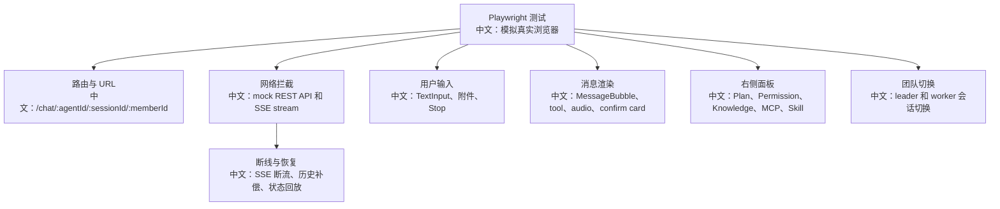

# 前端 E2E 测试与 Playwright 路线

> 适合面试表达的关键词：E2E、Playwright、SSE mock、网络拦截、URL 状态、HITL 确认卡、上传轮询、Team 切换、可访问性、视觉回归。

---

## 1. 先说结论

当前 `examples/web_ui/frontend/package.json` 里只有：

```text
dev / build / lint / preview
```

没有现成的 Playwright 或 Vitest 配置。这意味着前端质量保障目前更偏构建和 lint，真正的端到端产品流程测试还可以补。

面试里可以这样说：

```text
AgentScope Web UI 的 E2E 重点不是普通按钮点击，而是验证后端异步 Agent 事件如何投影成稳定 UI：URL 选择态、SSE 消息流、Stop/interrupt、HITL 确认卡、Plan 面板、知识库上传轮询、Team leader/worker 切换都需要端到端覆盖。
```

---

## 2. 为什么适合用 Playwright

Web UI 的关键能力天然是浏览器行为：

```text
1. URL 是 agent/session/member 选择态的单一来源。
2. SSE 使用 fetch stream，不是一次性 JSON response。
3. TextInput 有 Enter、Shift+Enter、附件处理、Stop 按钮状态。
4. MessageBubble 要渲染工具调用、工具结果、音频、确认卡。
5. KnowledgeBase 上传有 XHR progress + polling。
6. TeamSidebar 切换 worker 时要保留 leader shell。
```

这些用纯单元测试很难覆盖完整体验，Playwright 更适合从用户动作出发。

---

## 3. E2E 测试地图



中文解释：

```text
E2E 的核心不是测 React 组件内部实现，而是测“用户动作 -> 网络事件 -> UI 状态”的闭环。
```

---

## 4. 最值得补的 8 条 E2E

| 编号 | 场景 | 断言点 |
|---|---|---|
| 1 | 进入 chat URL | agent/session/member 从 URL 恢复，刷新后不丢 |
| 2 | 发送消息并接收 SSE | 显示用户消息、assistant 流式增量、最后回 idle |
| 3 | 点击 Stop | `phase=streaming` 显示 Stop，点击后进入 interrupting，最终回 idle |
| 4 | HITL 确认卡 | 工具确认卡出现，点击 approve 后发送 resume，卡片状态更新 |
| 5 | Plan 面板更新 | 收到 `state_updated` 后 tasks_context 更新，Plan 面板同步 |
| 6 | 权限面板更新 | permission_context 增加规则，UI 面板可见 |
| 7 | 知识库上传 | progress -> pending -> parsing/indexing -> ready/error |
| 8 | Team worker 切换 | URL 多出 memberId，ChatViewport 切到 worker session，leader shell 不变 |

面试亮点：

```text
我会优先测异步状态机和用户可见结果，而不是给每个按钮都写浅层测试。
```

---

## 5. SSE mock 思路

Playwright 可以拦截 `/sessions/{sid}/stream`，返回可控的 `text/event-stream`。

示意代码：

```ts
// 中文：测试里用可控 SSE 事件，模拟后端 reply_start、delta、reply_end。
await page.route('**/sessions/*/stream', async route => {
  await route.fulfill({
    status: 200,
    headers: { 'content-type': 'text/event-stream' },
    body: [
      'data: {"type":"reply_start","reply_id":"r1"}\n\n',
      'data: {"type":"text_block_delta","reply_id":"r1","delta":"你好"}\n\n',
      'data: {"type":"reply_end","reply_id":"r1"}\n\n',
    ].join(''),
  });
});
```

关键点：

```text
E2E 不一定依赖真实模型。把模型输出 mock 成 SSE，可以稳定测试前端状态投影。
```

---

## 6. 网络拦截分层

| 层级 | 用法 |
|---|---|
| API mock | mock agent/session/message/knowledge base 列表 |
| SSE mock | 控制事件顺序、断线、重复事件 |
| 上传 mock | 模拟 progress 和 document status polling |
| 错误 mock | 500、401、404、网络断开、超时 |
| 真实后端 smoke | 少量跑真实服务，验证契约没有漂移 |

面试表达：

```text
我会把大部分 E2E 做成 mock 后端，保证稳定和快速；再保留少量真实后端 smoke 测试，验证前后端契约没有漂移。
```

---

## 7. 推荐落地步骤

```text
1. 安装 Playwright，新增 e2e 目录。
2. 写统一 mock：agent、session、messages、stream、knowledge base。
3. 先覆盖 chat happy path。
4. 再覆盖 Stop、HITL、Plan、KB 上传、Team 切换。
5. 最后补断线恢复、错误提示和视觉快照。
```

示意脚本：

```json
{
  "scripts": {
    "e2e": "playwright test",
    "e2e:ui": "playwright test --ui"
  }
}
```

说明：

```text
当前项目还没接入 Playwright，上面是推荐路线，不是现有脚本。
```

---

## 8. 面试追问

| 追问 | 回答方向 |
|---|---|
| 为什么不用真实模型跑 E2E？ | 模型输出不稳定、成本高、速度慢；E2E 应 mock SSE，少量 smoke 用真实后端。 |
| 怎么测 SSE 断线？ | mock stream 中断，再验证前端重新拉历史或状态回补。 |
| 怎么测 Stop？ | mock streaming 中途点击 Stop，断言 interrupt API 被调用和 UI phase 收尾。 |
| 怎么测 Team？ | 断言 URL memberId、ChatViewport session、TeamSidebar 选中态一致。 |
| 怎么避免 E2E flaky？ | 用 route mock、明确等待可见 UI、避免 sleep、用稳定 data-testid。 |

---

## 9. 简历表达

```text
我为 AgentScope Web UI 设计过 E2E 测试路线：用 Playwright 从用户动作出发，mock REST API 和 SSE stream，覆盖 URL 状态恢复、消息流式渲染、Stop/interrupt、HITL 确认、Plan/Permission 面板、知识库上传轮询和多 Agent worker 切换，重点验证异步 Agent 状态能稳定投影到前端。
```

