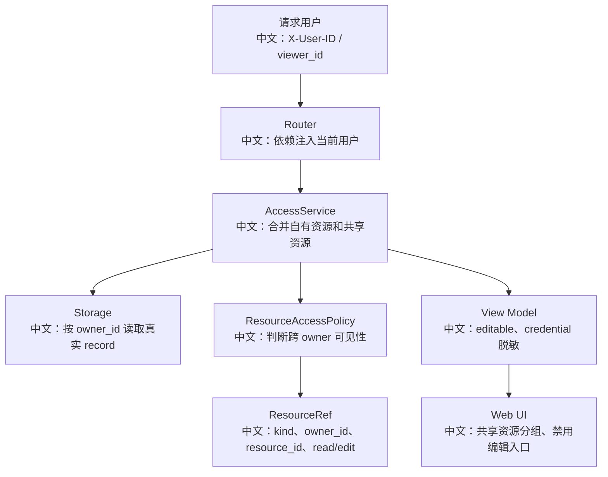

# 企业权限与多租户改造方案

> 适合面试表达的关键词：多租户、RBAC、ABAC、资源共享、ResourceAccessPolicy、owner-scoped storage、editable、脱敏、最小权限、审计。

---

## 1. 先说当前权限模型

AgentScope 当前资源访问有一个清晰边界：

```text
1. 请求通过 X-User-ID 标识当前用户。
2. Storage API 大多以 user_id 作为 owner scope。
3. 默认 ResourceAccessPolicy 是 DenyAll，也就是禁止跨 owner 访问。
4. 如果接入自定义 policy，可以把其他 owner 的 credential / agent / knowledge_base 暴露给 viewer。
5. API view 会带 editable，前端据此区分自己的资源和共享资源。
```

面试里可以这样说：

```text
这个项目的企业权限扩展点不是散落在每个接口里的 if 判断，而是集中在 ResourceAccessPolicy。默认 owner-isolated，企业接入时再实现跨用户资源可见性和可编辑性。
```

---

## 2. 权限模型图



中文解释：

```text
viewer_id 是当前访问者，owner_id 是资源拥有者。跨 owner 访问时，policy 只返回引用，真实数据仍然通过 owner-scoped storage 读取。
```

---

## 3. 当前源码里的关键设计

| 设计 | 源码入口 | 价值 |
|---|---|---|
| 当前用户 | `src/agentscope/app/deps.py` 的 `get_current_user_id` | 所有 API 都能拿到 viewer |
| 默认拒绝跨用户 | `DenyAllResourceAccessPolicy` | 安全默认值 |
| 资源引用 | `ResourceRef` | 只表达 owner/resource/permission，不复制数据 |
| 权限等级 | `ResourcePermission.READ / EDIT` | 读用和编辑分离 |
| 编辑判断 | `ResourceAccessPolicyBase.can_edit` | owner 永远可编辑，跨 owner 要 EDIT |
| 前端标识 | `editable` | UI 可以禁用编辑和删除 |
| 凭证脱敏 | `CredentialView` | shared credential 只能用，不能泄露 secret |

面试亮点：

```text
READ credential 不等于能看到密钥。它表示 runtime 可以代表用户使用这个 credential，但 API view 必须脱敏。
```

---

## 4. 企业多租户改造目标

企业系统通常需要：

```text
1. 用户属于组织 org。
2. 用户属于多个 project/team。
3. agent、knowledge_base、credential 可以在组织或项目内共享。
4. credential 只能被运行时使用，不能直接返回 secret。
5. 管理员可以审计，但不一定能读取密钥。
6. 所有高风险工具调用要有权限策略和审计日志。
```

推荐资源模型：

| 对象 | 字段 |
|---|---|
| User | user_id、org_id、roles |
| Group/Team | team_id、members |
| ResourceShare | kind、owner_id、resource_id、viewer/group、permission |
| AuditLog | actor、action、resource、decision、timestamp |
| Policy | RBAC + ABAC 规则 |

---

## 5. RBAC 和 ABAC 怎么结合

```text
RBAC：根据角色授权，例如 admin/editor/viewer。
ABAC：根据属性授权，例如 org_id、project_id、resource sensitivity、time、tool risk。
```

在 AgentScope 里可以这样落地：

```text
ResourceAccessPolicy 负责资源级读写；
PermissionContext 负责工具级 allow/deny/ask；
extra_agent_middlewares 负责运行时审计、租户校验、成本限额；
Storage owner scope 继续作为底层隔离边界。
```

面试表达：

```text
资源权限和工具权限要分开。能看到知识库，不代表能执行 Bash；能编辑 Agent，也不代表能读取 credential secret。
```

---

## 6. 示例：组织级共享知识库

```python
class OrgResourcePolicy(ResourceAccessPolicyBase):
    async def list_accessible(self, viewer_id, kind, storage):
        # 中文：从企业 IAM 或共享表查 viewer 所属组织可访问的资源。
        org_id = await iam.get_org_id(viewer_id)
        shares = await share_repo.list_by_org(org_id, kind)
        return [
            ResourceRef(
                kind=kind,
                owner_id=s.owner_id,
                resource_id=s.resource_id,
                permission=s.permission,
            )
            for s in shares
        ]
```

关键点：

```text
policy 不复制资源，只返回引用；router/service 再用 owner_id + resource_id 去 storage 取真实 record。
```

---

## 7. 前端要怎么配合

| 场景 | 前端行为 |
|---|---|
| `editable=true` | 显示编辑、删除、配置入口 |
| `editable=false` | 只允许查看/使用，隐藏编辑和删除 |
| shared agent | 在 AgentSelect 中分组显示 |
| shared credential | 只显示名称和类型，不显示 secret |
| shared knowledge base | 可 attach/search，不能上传/删除文档，除非 EDIT |

源码里 `AgentSelect` 已经有 shared 分组逻辑：

```text
当存在 editable=false 的 agent 时，前端把 yours 和 shared 分开显示。
```

---

## 8. 风险点

| 风险 | 说明 | 防护 |
|---|---|---|
| 横向越权 | viewer 猜 resource_id | 所有读取都走 policy resolve |
| 凭证泄露 | shared credential 返回 secret | View Model 脱敏，runtime 内部 resolve |
| 编辑绕过 | 前端隐藏按钮但后端没校验 | 后端 `resolve_for_edit` 强校验 |
| 工具越权 | 共享 agent 调用高危工具 | PermissionContext + middleware |
| 租户混写向量库 | 多租户共 collection | metadata_filter + collection isolation |
| 审计缺失 | 无法追踪谁用了资源 | extra_agent_middlewares 写审计 |

---

## 9. 面试追问

| 追问 | 回答方向 |
|---|---|
| 为什么默认 DenyAll？ | 安全默认值，企业共享必须显式接入 policy。 |
| READ credential 会不会泄露密钥？ | API view 脱敏，只有可信 runtime path 能使用 raw credential。 |
| 前端隐藏编辑按钮够吗？ | 不够，后端必须用 resolve_for_edit / can_edit 强校验。 |
| 多租户向量库怎么隔离？ | 优先 collection 隔离；共享 collection 时必须 metadata_filter 防御。 |
| RBAC 和 ABAC 怎么选？ | RBAC 管角色，ABAC 管资源属性和运行上下文，企业通常组合使用。 |

---

## 10. 简历表达

```text
我分析过 AgentScope 的企业多租户扩展：默认按 user_id 做 owner-scoped storage，并用 DenyAllResourceAccessPolicy 禁止跨 owner 访问；企业场景可通过 ResourceAccessPolicy 接入 IAM/组织/项目共享，前端用 editable 区分自有和共享资源，凭证 view 脱敏，运行时再结合 PermissionContext 和 middleware 做工具权限、审计和租户隔离。
```

