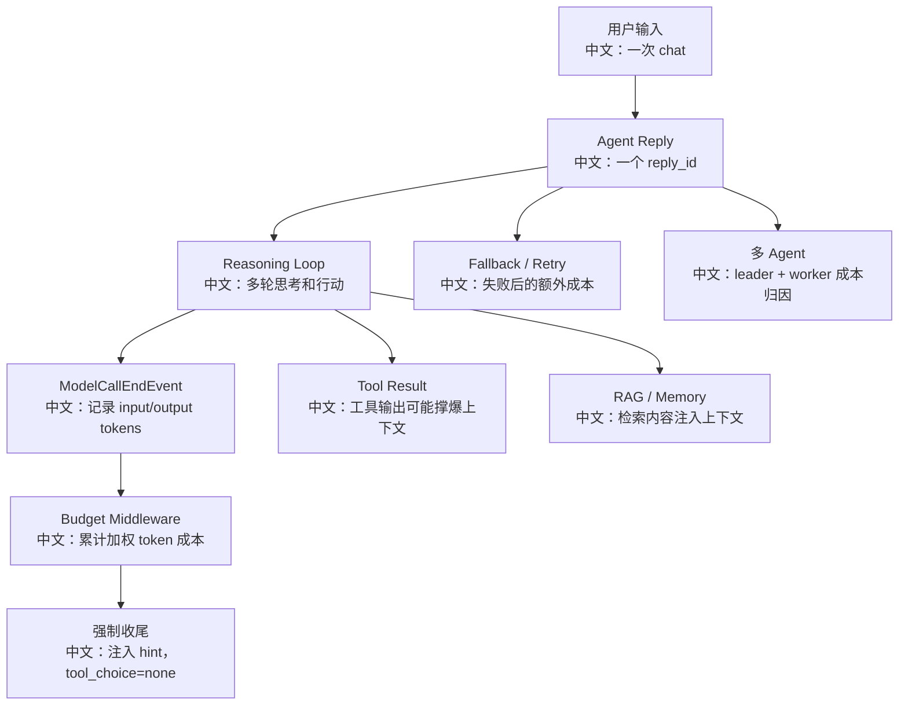

# 模型成本治理与限流策略

> 适合面试表达的关键词：token budget、ModelCallEndEvent、fallback、retry、tool_result_limit、限流、熔断、成本归因、Embedding batch、审计。

---

## 1. Agent 成本为什么难管

普通聊天应用的成本大致是“一次用户请求一次模型调用”。Agent 系统不是这样：

```text
1. 一次用户输入可能触发多轮 reasoning。
2. 每轮 reasoning 可能调用模型。
3. 工具结果会进入上下文，放大输入 token。
4. RAG 会注入检索结果。
5. 长期记忆会注入用户记忆。
6. 多 Agent 会把成本乘到多个 worker。
7. fallback 和 retry 会放大请求次数。
8. embedding 和 TTS 也是模型成本。
```

面试里可以这样说：

```text
Agent 成本治理不能只按请求数算，要按 reply 维度累计模型调用、输入输出 token、工具结果膨胀、RAG 注入、多 Agent 分支和 embedding batch。
```

---

## 2. 成本治理图



中文解释：

```text
成本治理要同时管“单次回复的预算”和“租户/用户/项目维度的总预算”。
```

---

## 3. 已有源码能力

| 能力 | 源码入口 | 作用 |
|---|---|---|
| 模型调用事件 | `ModelCallEndEvent` | 携带 input_tokens / output_tokens |
| Reply budget | `ReplyBudgetControlMiddleware` | 按 reply 维度累计 token 成本 |
| 强制收尾 | `tool_choice=none` | 超预算后不再调用工具 |
| 模型重试 | `ModelConfig.max_retries`、`ChatModelBase` | 失败重试 |
| fallback | `fallback_model` / session fallback config | 主模型失败后切备模型 |
| 工具结果限制 | `ContextConfig.tool_result_limit` | 防止工具输出撑爆上下文 |
| Embedding batch | `EmbeddingModelBase.batch_size` | 控制 embedding 请求批次 |
| Embedding usage | `EmbeddingUsage` | 记录 embedding tokens/time |

`ReplyBudgetControlMiddleware` 的亮点：

```text
它监听 ReplyStartEvent 初始化预算；
监听 ModelCallEndEvent 累计 input/output token；
下一轮 reasoning 前如果超预算，就向上下文插入 HintBlock，并把 tool_choice 改成 none，让 Agent 收尾。
```

---

## 4. 成本控制分层

| 层级 | 控制手段 |
|---|---|
| 单次 reply | token_budget、max_iters、tool_choice=none |
| 单个工具 | timeout、输出截断、权限确认 |
| 单个 session | 最大消息数、上下文压缩、历史摘要 |
| 单个 agent | 模型白名单、fallback 策略、Plan 开启条件 |
| 单个用户 | 日预算、月预算、并发 run 限制 |
| 租户/组织 | 配额、限流、审计、成本归因 |
| RAG | top_k、score_threshold、chunk size、embedding batch |
| 多 Agent | worker 数量、任务拆分阈值、worker 预算 |

面试表达：

```text
我会把预算从 reply 层扩展到用户/租户层：reply 内用 middleware 即时收尾，租户层用 Redis 计数或账单系统做配额和限流。
```

---

## 5. 限流策略

### 5.1 API 层限流

```text
限制每个 user/org 的 chat trigger 频率；
限制同时 running session 数；
限制上传文件大小和数量；
限制 schedule 数量和触发频率。
```

### 5.2 Runtime 层限流

```text
限制每个 reply 的模型调用次数；
限制工具调用次数；
限制多 Agent worker 数；
限制 RAG top_k 和注入 token；
限制 fallback 次数。
```

### 5.3 Provider 层限流

```text
按模型供应商做并发队列；
遇到 429 做指数退避；
熔断不可用 provider；
fallback 到低成本或本地模型。
```

---

## 6. 成本归因

建议归因维度：

```text
org_id
user_id
agent_id
session_id
reply_id
model_name
provider
input_tokens
output_tokens
embedding_tokens
tool_name
worker_agent_id
schedule_id
```

面试亮点：

```text
多 Agent 场景下不能只把成本记到 leader，要能追踪 worker_agent_id 和任务来源，否则无法解释成本为什么突然升高。
```

---

## 7. 典型事故与治理

| 事故 | 原因 | 治理 |
|---|---|---|
| 单次对话花费暴涨 | 工具输出很长，反复进上下文 | tool_result_limit、摘要、截断 |
| 多 Agent 成本爆炸 | leader 创建太多 worker | worker 数限制、模板预算 |
| RAG token 过多 | top_k 大、chunk 太长 | score_threshold、chunk 优化 |
| fallback 成本翻倍 | 主模型不稳定，反复重试 | 熔断、降级、限制 retry |
| embedding 账单高 | 重复索引同文档 | embedding cache、文档 hash 去重 |

---

## 8. 面试追问

| 追问 | 回答方向 |
|---|---|
| 为什么 output token 权重可以更高？ | 很多供应商输出 token 更贵，且输出越长越影响延迟。 |
| 超预算后为什么不用直接 cancel？ | 直接 cancel 体验差；注入 hint 并禁止工具，让 Agent 自然收尾。 |
| retry 和 fallback 怎么避免成本失控？ | 限制 max_retries，按错误类型重试，熔断不稳定 provider。 |
| RAG 怎么控成本？ | 控 top_k、chunk size、score_threshold、注入 token 和 embedding cache。 |
| 多 Agent 怎么算账？ | 成本归因到 leader、worker、session、reply 和 tool。 |

---

## 9. 简历表达

```text
我分析过 AgentScope 的模型成本治理：基于 ModelCallEndEvent 统计 input/output token，用 ReplyBudgetControlMiddleware 在 reply 内累计加权成本，超预算后注入 HintBlock 并设置 tool_choice=none 强制收尾；同时结合 tool_result_limit、fallback/retry 控制、RAG top_k、embedding batch/cache、多 Agent worker 预算和租户级限流，形成完整成本治理方案。
```

