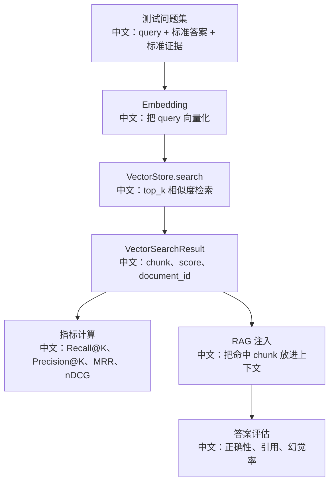

# 向量检索评估与召回质量优化

> 适合面试表达的关键词：RAG 评估、召回率、Precision@K、MRR、Chunker、Embedding、VectorStore、DimensionPolicy、metadata_filter、score_threshold、rerank。

---

## 1. 先说结论

AgentScope 的 RAG 链路已经有清晰抽象：

```text
Parser -> Section
Chunker -> Chunk
EmbeddingModel -> vector
VectorStore.insert -> VectorRecord
VectorStore.search -> VectorSearchResult
RAGMiddleware -> 把检索结果注入 Agent 上下文
```

但“能检索”不等于“检索质量好”。面试时要讲评估指标和优化方法。

面试开场：

```text
我会从 chunk 质量、embedding 维度和模型、向量库过滤、top_k/score_threshold、rerank、答案引用这几层评估 RAG。评估不只看最终回答，还要单独评估 retrieval hit 是否命中正确 chunk。
```

---

## 2. 检索评估图



中文解释：

```text
先评估检索，再评估生成。否则模型答错时，你不知道是没召回、召回错了，还是模型没用好证据。
```

---

## 3. 源码里的评估切入点

| 点位 | 源码入口 | 评估意义 |
|---|---|---|
| `Chunk` | `src/agentscope/rag/_document.py` | 文本、source、metadata 是否足够引用 |
| `VectorRecord` | `src/agentscope/rag/_vdb/_vector_store.py` | chunk 和 vector 分离，便于插入评估 |
| `VectorSearchResult` | `src/agentscope/rag/_vdb/_vector_store.py` | score、document_id、chunk 是评估核心 |
| `top_k` | `KnowledgeBaseConfig` / RAG 参数 | 控制召回数量 |
| `score_threshold` | RAG 参数 | 控制低分结果是否注入 |
| `metadata_filter` | `VectorStore.search` | 多租户/来源过滤 |
| `DimensionPolicy` | KB manager | 防止 embedding 维度不兼容 |
| `EmbeddingCache` | embedding model | 降低重复评估成本 |

---

## 4. 指标怎么讲

| 指标 | 中文解释 | 适合回答 |
|---|---|---|
| Recall@K | 前 K 个结果里是否包含正确证据 | “有没有找回来” |
| Precision@K | 前 K 个结果里有多少是有用证据 | “找回来的是不是干净” |
| MRR | 第一个正确结果排第几 | “正确证据是否靠前” |
| nDCG | 带等级相关性的排序质量 | “多个证据有强弱时排序如何” |
| Answer Accuracy | 最终答案正确率 | “生成是否正确” |
| Citation Accuracy | 引用是否来自命中证据 | “是否可追溯” |
| Hallucination Rate | 没证据乱答比例 | “是否可靠” |

面试亮点：

```text
RAG 评估要拆开看 retrieval 和 generation。只看最终答案，会掩盖召回质量问题。
```

---

## 5. 优化方向

### 5.1 Parser 优化

```text
保留标题、页码、表格、图片 OCR、sheet 名、slide 页码等结构信息。
```

为什么重要：

```text
chunk 的 source 和 metadata 越清楚，后续引用、过滤和调试越容易。
```

### 5.2 Chunker 优化

| 问题 | 优化 |
|---|---|
| chunk 太小 | 召回碎片化，答案缺上下文 |
| chunk 太大 | 相似度被稀释，注入 token 高 |
| 跨 section 合并 | 破坏文档结构 |
| 没有 overlap | 问题答案跨边界时召回失败 |

面试表达：

```text
Parser 负责结构边界，Chunker 负责检索粒度。AgentScope 的 Chunker 不跨 Section，是为了保留文档结构语义。
```

### 5.3 Embedding 优化

```text
选择适合领域语言的 embedding；
统一知识库维度；
用 DimensionPolicy 避免 collection 维度冲突；
对重复内容使用 embedding cache；
评估不同 dimensions 和 batch_size 的成本/效果。
```

### 5.4 检索参数优化

```text
top_k 太小：召回不足。
top_k 太大：噪声和 token 成本增加。
score_threshold 太高：漏召回。
score_threshold 太低：注入噪声。
metadata_filter：保证租户、知识库、文档类型边界。
```

### 5.5 Rerank

当前主链路以向量相似度为主。企业落地可以加 rerank：

```text
query -> vector top_k=30 -> reranker -> top_n=5 -> 注入上下文
```

面试表达：

```text
向量召回适合粗排，rerank 适合精排，尤其是长文档、相似术语、领域问答场景。
```

---

## 6. 评估数据集怎么做

```text
1. 从真实文档抽 50-200 个问题。
2. 每个问题标注标准答案。
3. 标注正确 document_id / page / chunk 证据。
4. 跑不同 chunk size、top_k、embedding 模型。
5. 记录 Recall@K、MRR、答案正确率和平均 token 成本。
```

示意记录：

```text
query_id: q001
query: 报销审批超过 5000 元需要谁批准？
gold_document: finance_policy.pdf
gold_evidence: 第 3 页 “超过 5000 元需部门负责人和财务经理审批”
top_k_hit: true
rank: 2
answer_correct: true
```

---

## 7. 面试追问

| 追问 | 回答方向 |
|---|---|
| 为什么检索到了但回答错？ | 可能注入顺序、prompt、模型忽略证据、证据冲突，需要生成评估。 |
| 为什么向量库要存 document_id？ | 删除文档、引用来源、评估命中都依赖 document_id。 |
| DimensionPolicy 解决什么？ | 防止不同 embedding 维度写入同 collection，避免静默错误。 |
| top_k 越大越好吗？ | 不是，会增加噪声和 token 成本，需要用 Recall/Precision 权衡。 |
| metadata_filter 有什么价值？ | 多租户隔离、按文档类型/权限过滤，是防御性边界。 |

---

## 8. 简历表达

```text
我从评估角度分析过 AgentScope RAG：基于 VectorSearchResult 的 document_id、score、chunk 做 Recall@K、Precision@K、MRR 等检索指标，再结合答案正确率和引用准确率评估生成效果；优化方向包括 Parser 结构保留、Chunker 粒度和 overlap、Embedding 维度策略、top_k/score_threshold 调参、metadata_filter 隔离和 rerank 精排。
```

