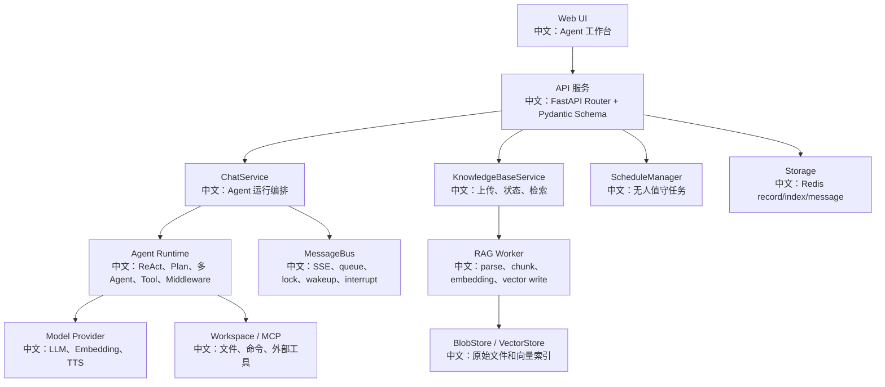

# 真实项目落地方案与简历包装

> 适合面试表达的关键词：项目落地、业务场景、Agent 工作台、RAG、Plan、多 Agent、权限、成本治理、监控、简历表达、STAR 法则。

---

## 1. 为什么要做项目包装

你学 AgentScope 源码，最终要转成面试里的“项目能力”：

```text
不是：我看过 interrupt API。
而是：我能设计一个可中断、可恢复、可审计、可扩展的企业 Agent 工作台。
```

面试里项目可以包装成：

```text
基于 AgentScope 的企业级多 Agent 知识工作台
```

一句话：

```text
这个项目面向企业内部知识问答和自动化任务执行，支持 Chat、RAG 知识库、多 Agent 协作、Plan 任务面板、HITL 权限确认、定时任务、工具调用、成本治理和生产监控。
```

---

## 2. 项目架构图



中文讲法：

```text
我会先从用户工作台讲起，再讲后端服务如何把 chat、RAG、schedule、多 Agent 和工具调用串起来，最后讲 MessageBus、Storage 和 Worker 如何保证异步状态一致。
```

---

## 3. 可以选的真实业务场景

| 场景 | 为什么适合 |
|---|---|
| 企业知识库助手 | RAG、权限、引用、文档更新都能讲 |
| 研发代码助理 | Workspace、工具调用、Plan、多 Agent review 能讲 |
| 客服工单助手 | 意图识别、知识检索、HITL、审计能讲 |
| 数据分析助手 | 文件上传、工具执行、图表生成、权限能讲 |
| 运营自动化助手 | Schedule、无人值守、权限降级、成本治理能讲 |

建议主项目：

```text
企业知识库 + 自动化任务 Agent 工作台
```

因为它能覆盖最多面试点。

---

## 4. 项目模块怎么讲

| 模块 | 面试讲法 |
|---|---|
| Chat | 支持流式 SSE、interrupt、历史回放、状态收尾 |
| Plan | 复杂任务用任务图拆解，前端 Plan 面板实时展示 |
| 多 Agent | leader 创建 worker，worker 专注子任务，通过 TeamSay 汇报 |
| RAG | 上传异步索引，Parser/Chunker/Embedding/VectorStore 分层 |
| HITL | 高风险工具调用需要确认，确认结果通过 resume trigger 恢复 |
| Permission | 支持 ASK/ALLOW/DENY，规则持久化和前端面板同步 |
| Schedule | 定时注入 HintBlock，无人值守时权限模式降级 |
| Workspace | 工具执行隔离，支持本地/容器/远程沙箱 |
| 成本治理 | token budget、tool result limit、fallback/retry 控制 |
| 生产化 | Redis、BlobStore、VectorStore、Worker、监控和事故复盘 |

---

## 5. 简历 bullet 示例

### 偏后端

```text
负责企业 Agent 工作台后端架构设计，基于 FastAPI + Redis MessageBus 实现 ChatService 流式运行、SSE 事件回放、session 分布式锁、interrupt 协作式取消和 HITL resume 恢复，保障多进程场景下会话状态一致。
```

### 偏 RAG

```text
设计知识库异步索引链路，将上传阶段与解析/分块/embedding/向量写入解耦；通过 BlobStore 保存原始文件，IndexWorker 使用 lease + heartbeat 防止重复处理，支持文档 pending/parsing/chunking/indexing/ready/error 状态可视化。
```

### 偏多 Agent

```text
实现多 Agent 协作流程，leader 可基于模板创建 researcher/coder/reviewer 等 worker，并通过 TeamSay 和 MessageBus 完成跨 session 通信，前端支持 leader/worker 会话切换和任务状态同步。
```

### 偏安全和企业化

```text
扩展企业资源权限模型，通过 ResourceAccessPolicy 接入组织/项目级共享，区分 READ/EDIT 权限；credential API view 脱敏，运行时可信路径使用密钥，并结合 PermissionContext 和审计 middleware 控制高风险工具调用。
```

### 偏成本治理

```text
引入模型成本治理方案，基于 ModelCallEndEvent 统计 input/output tokens，使用 ReplyBudgetControlMiddleware 在 reply 内累计预算，超预算后注入 HintBlock 并禁止继续调用工具，同时限制 RAG top_k、工具输出长度和多 Agent worker 数。
```

---

## 6. STAR 面试讲法

### S：背景

```text
公司内部知识分散在文档、代码仓库和业务系统里，员工需要一个能检索知识、执行工具、拆解任务、并且可审计的 Agent 工作台。
```

### T：任务

```text
我负责设计 Agent 运行链路、知识库索引链路、多 Agent 协作和权限治理，要求支持流式响应、可中断、可恢复、可扩展到企业多租户。
```

### A：行动

```text
我把系统拆成 Web UI、API、ChatService、MessageBus、Agent Runtime、Storage、RAG Worker、VectorStore 几层；用 SSE 做事件回放，用 Redis lock 保证同 session 单 runner，用 BlobStore + Worker lease 做异步索引，用 ResourceAccessPolicy 做跨用户共享，用 Budget Middleware 做成本治理。
```

### R：结果

```text
最终系统支持用户在一个工作台里完成知识问答、任务拆解、多 Agent 协作、工具执行和定时任务；同时具备权限确认、成本控制、事故排查和测试补齐路线。
```

---

## 7. 面试官可能追问

| 追问 | 你可以答 |
|---|---|
| 为什么不用同步上传索引？ | 大文件解析和 embedding 慢，异步 pending 能保证 API 响应和后台恢复。 |
| Stop 怎么保证真的停止？ | running task cancel + parked resume interrupt + finally 清理 + SSE 收尾。 |
| 多 Agent 怎么避免混乱？ | 模板固定角色，MessageBus 跨 session 通信，TeamSidebar 前端切换会话。 |
| 怎么做企业权限？ | owner-scoped storage + ResourceAccessPolicy + READ/EDIT + credential 脱敏。 |
| 怎么控制成本？ | reply budget、max_iters、tool_result_limit、top_k、worker 数、fallback 限制。 |
| 怎么测试？ | 异步 race 测试、SSE mock E2E、RAG worker lease 测试、HITL resume 测试。 |

---

## 8. 避免过度包装

不要说：

```text
我完整独立实现了 AgentScope。
```

更稳妥的说法：

```text
我基于 AgentScope 源码做了系统化二次开发和架构分析，重点掌握了 Chat/RAG/多 Agent/权限/生产化链路，并能在企业业务场景里落地。
```

如果你只是学习源码，也可以说：

```text
这是我做的源码驱动项目拆解和方案设计，不是线上生产项目；但我按真实项目标准补了架构图、测试路线、容量规划、事故复盘和扩展方案。
```

这个说法更真实，也更抗追问。

---

## 9. 最终项目介绍稿

```text
我最近系统学习并拆解了 AgentScope，围绕它设计了一个企业级多 Agent 知识工作台方案。前端是 Chat 工作台，支持 URL 恢复会话、SSE 流式消息、Plan/Permission/Knowledge 面板和 leader/worker 切换；后端用 FastAPI + Pydantic 提供接口契约，ChatService 负责编排 Agent run，MessageBus 承担事件日志、队列、分布式锁、wakeup 和 interrupt，Storage 持久化 agent/session/message/team/schedule 等状态。

知识库部分把上传和索引解耦，BlobStore 保存原始文件，IndexWorker 后台完成 parse、chunk、embedding 和 vector write，并通过 lease + heartbeat 避免多 worker 重复处理。多 Agent 部分通过模板创建 worker，用 TeamSay 和 MessageBus 做跨 session 协作。企业化上，我重点分析了 ResourceAccessPolicy 的跨用户共享、credential 脱敏、PermissionContext 的 HITL 权限确认，以及 Budget Middleware 的 token 成本治理。

我不是只看 API 怎么用，而是按产品动作把源码链路拆成面试可讲的系统设计：比如 Stop 如何优雅终止、文档为什么异步索引、HITL 如何恢复、多 Agent 如何通信、模型成本如何控制、事故如何排查。
```

