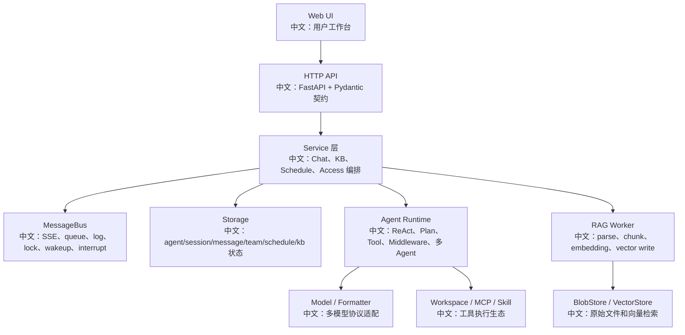

# 面试一小时速记版

> 适合面试表达的关键词：临场复习、主线记忆、白板题、追问、源码证据、项目表达、系统设计。

---

## 1. 这一小时怎么分配

```text
0-10 分钟：背项目总介绍和架构主图。
10-25 分钟：背 Chat / Interrupt / SSE 主链路。
25-40 分钟：背 RAG / 多 Agent / Plan / HITL 主链路。
40-50 分钟：背企业化、成本、测试、生产事故。
50-60 分钟：用 STAR 法把项目讲成简历经历。
```

核心目标：

```text
面试时不要散讲“我看过很多文件”，而要始终围绕一个企业 Agent 工作台项目来讲。
```

---

## 2. 一句话项目介绍

```text
我基于 AgentScope 源码系统拆解并设计了一个企业级多 Agent 知识工作台：前端支持流式 Chat、Plan 面板、权限确认、知识库上传和 leader/worker 切换；后端通过 FastAPI、ChatService、MessageBus、Storage、RAG Worker 和 Agent Runtime 串起可中断、可恢复、可扩展、可审计的 Agent 运行链路。
```

如果面试官问“你做了什么”：

```text
我重点做的是源码驱动的架构分析和二次开发方案设计，把 Chat、RAG、多 Agent、HITL、权限、成本治理、测试和生产化链路拆成可落地的项目方案。
```

---

## 3. 总架构速记图



口头讲法：

```text
这套系统不是单纯聊天框，而是一个 Agent 运行平台。Web UI 把后端异步事件投影成工作台，Service 层编排业务流程，MessageBus 解决跨进程事件和锁，Agent Runtime 负责 reasoning-acting，RAG Worker 负责离线索引。
```

---

## 4. 必背 8 条主链路

### 4.1 Stop / Interrupt

```text
用户点击 Stop
-> TextInput phase=streaming 调 interrupt
-> POST /sessions/{sid}/interrupt 返回 202
-> running 走 cancel dispatcher，parked 走 resume interrupt
-> Agent 捕获取消并执行 finally 清理
-> SSE 发布 reply_end，前端回 idle
```

一句话：

```text
Stop 是异步控制命令，不保证 HTTP 返回时任务已经停止，所以用 202；真正停止靠协作式取消、resume trigger、finally 清理和 SSE 收尾。
```

### 4.2 Chat + SSE

```text
POST /chat 只触发 run
GET /sessions/{sid}/stream 接收事件
事件从 reply_start、text_delta、tool_call、state_updated 到 reply_end
前端 useMessages 合成消息和 phase
```

一句话：

```text
触发和订阅分离，让 HTTP 控制面和实时事件面解耦，也方便断线重连和事件回放。
```

### 4.3 RAG 上传

```text
上传文件
-> BlobStore.write_stream 保存原始 bytes
-> document record=pending
-> enqueue index task
-> IndexWorker acquire lease
-> parse -> chunk -> embedding -> vector insert
-> ready/error
```

一句话：

```text
上传不等于可检索，上传只完成 bytes 和元数据持久化，真正索引由 worker 异步完成。
```

### 4.4 Plan

```text
复杂任务
-> Agent 通过 TaskCreate/TaskUpdate 工具维护任务图
-> tasks_context 被 StateChangeMiddleware 捕获
-> state_updated 事件回前端
-> Plan 面板实时显示任务状态
```

一句话：

```text
Plan 不是前端 TODO，而是 Agent 运行态的一部分，通过工具调用显式维护任务图。
```

### 4.5 多 Agent

```text
leader 决定创建 worker
-> AgentCreate 使用 SubAgentTemplate
-> worker 有独立 agent/session/state
-> TeamSay / MessageBus 回报
-> 前端 TeamSidebar 切换 leader/worker
```

一句话：

```text
多 Agent 不是内存函数调用，而是多个 session 的协作拓扑，有独立状态、权限和消息路由。
```

### 4.6 HITL 权限确认

```text
工具调用需要确认
-> RequireUserConfirmEvent
-> 前端 ConfirmCard
-> 用户 approve/reject
-> resume trigger 入队
-> WakeupDispatcher 恢复 parked session
```

一句话：

```text
HITL 的难点不是弹窗，而是 parked session 如何可靠恢复，resume trigger 不能像普通 wake 一样丢弃。
```

### 4.7 Formatter 多模型适配

```text
内部 Msg/Block
-> Formatter
-> OpenAI / Gemini / Anthropic / DashScope 等 provider 格式
-> Model response
-> 统一回 AgentEvent
```

一句话：

```text
Formatter 把内部统一消息结构和厂商协议隔离开，所以模型切换不会污染 Agent 主循环。
```

### 4.8 企业权限

```text
X-User-ID 得到 viewer
-> owner-scoped storage 读取自有资源
-> ResourceAccessPolicy 返回共享 ResourceRef
-> View Model 带 editable
-> credential view 脱敏
```

一句话：

```text
默认 DenyAll 保证安全底线，企业共享通过 ResourceAccessPolicy 显式接入，READ/EDIT 和脱敏视图分离。
```

---

## 5. 高频追问快答

| 问题 | 快答 |
|---|---|
| 为什么 interrupt 返回 202？ | 取消是异步协作过程，HTTP 只表示命令已接受。 |
| idle 时 interrupt 怎么办？ | 对存在 session 做 no-op，保持幂等。 |
| 为什么上传后不能立刻搜？ | parse、chunk、embedding、vector write 在后台 worker。 |
| worker 崩了怎么办？ | document lease 过期后 sweeper 重入队，其他 worker 接管。 |
| 为什么 BlobStore 独立于 Storage？ | Storage 存元数据和状态，BlobStore 存原始 bytes，生命周期和后端不同。 |
| Plan 什么时候开启？ | 复杂、多步骤、有依赖、需要持续跟踪的任务。 |
| 多 Agent 怎么通信？ | 通过 TeamSay、MessageBus、session 事件，不是直接共享内存。 |
| HITL 怎么恢复？ | 用户确认结果作为 resume trigger 入队，WakeupDispatcher 恢复 parked run。 |
| 怎么控制模型成本？ | token budget、tool_result_limit、RAG top_k、fallback/retry 限制、多 Agent worker 预算。 |
| 怎么测这套系统？ | 异步 race、SSE mock、lease、重复投递、HITL resume、前端 E2E。 |

---

## 6. 结束时的加分表达

```text
我学习这个项目不是只看“API 怎么调”，而是按真实产品动作倒推源码设计：用户发送、停止、上传、确认、创建计划、邀请 worker，每个动作都能从 Web UI、HTTP API、Service、MessageBus、Agent Runtime、Storage 和事件回流讲完整链路。
```

